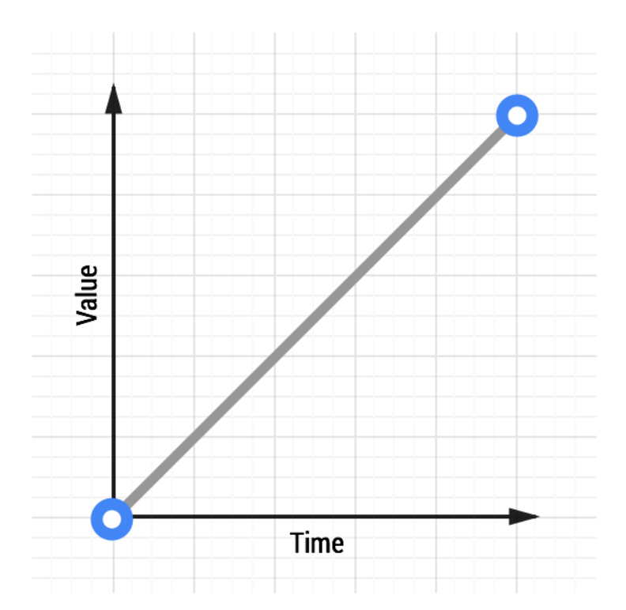

### animation-direction

#### normal

每个循环内动画向前循环，换言之，每个动画循环结束，动画重置到起点重新开始，这是默认属性。

#### alternate

`动画交替反向运行，反向运行时，动画按步后退，同时，`带时间功能的函数也反向，比如，ease-in 在反向时成为ease-out。计数取决于开始时是奇数迭代还是偶数迭代

#### reverse

反向运行动画，每周期结束动画由尾到头运行。

#### alternate-reverse

反向交替， 反向开始交替

### animation-iteration-count

#### infiite

无限循环播放动画

#### `<number>`

动画播放的次数 不可为负值. 可以用小数定义循环(0.5 将播放动画到关键帧的一半（from 0 ~ 50%).

### animation-fill-mode

指定在动画执行之前和之后如何给动画的目标应用样式。

#### none

动画执行前后不改变任何样式

#### forwards

目标保持动画最后一帧的样式，最后一帧是哪个取决于[`animation-direction`](https://developer.mozilla.org/zh-CN/docs/Web/CSS/animation-direction)和 [`animation-iteration-count`](https://developer.mozilla.org/zh-CN/docs/Web/CSS/animation-iteration-count)

| `animation-direction` | `animation-iteration-count` | last keyframe encountered |
| :-------------------- | :-------------------------- | :------------------------ |
| `normal`              | even or odd                 | `100%` or `to`            |
| `reverse`             | even or odd                 | `0%` or `from`            |
| `alternate`           | even                        | `0%` or `from`            |
| `alternate`           | odd                         | `100%` or `to`            |
| `alternate-reverse`   | even                        | `100%` or `to`            |
| `alternate-reverse`   | odd                         | `0%` or `from`            |

#### backwords

动画采用相应第一帧的样式，保持 [`animation-delay`](https://developer.mozilla.org/zh-CN/docs/Web/CSS/animation-delay)，第一帧取法如下

| `animation-direction`            | first relevant keyframe |
| :------------------------------- | :---------------------- |
| `normal` or `alternate`          | `0%` or `from`          |
| `reverse` or `alternate-reverse` | `100%` or `to`          |

#### both

动画将会执行 forwards 和 backwards 执行的动作。

### animation-play-state

定义一个动画是否运行或者暂停。可以通过查询它来确定动画是否正在运行。另外，它的值可以被设置为暂停和恢复的动画的重放。

#### running

当前动画正在运行

#### paused

当前动画以被停止

### animation-timing-function

#### linear

随着时间推移，其值以等量增加

#### ease-out

缓出使动画在开头处比线性动画更快，还会在结尾处减速。

#### ease-in

缓入动画开头慢结尾快，与缓出动画正好相反。

#### ease-in-out

