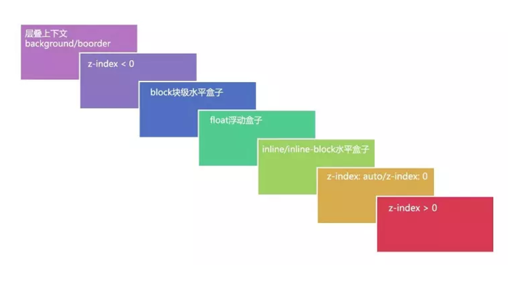

### 层叠上下文

层叠上下文是HTML元素的三维概念，这些HTML元素在一条假想的相对于面向（电脑屏幕的）视窗或者网页的用户的z轴上延伸，HTML元素依据其自身属性按照优先级顺序占用层叠上下文的空间

### 层叠等级

- 在同一个层叠上下文中，它描述定义的是该层叠上下文中的层叠上下文元素在`Z轴`上的上下顺序。
- 在其他普通元素中，它描述定义的是这些普通元素在`Z轴`上的上下顺序。

### 层叠顺序

表示元素发生层叠时按照特定的顺序规则在`Z轴`上垂直显示。

### 生成条件

- 根元素
- `z-index`不为`auto`的绝对/相对定位
- `z-index`不为`auto`，并且父元素为`display: flex|inline-flex`
- `opacity`值小于1
- `transform`属性值不为`normal`的元素
- `filter`值不为`none`
- `mix-blend-mode`属性值不为`normal`的元素
- `perspective`值不为`none`
- `isolation`属性为`isolate`
- `position`值为`fixed`
- `will-change`中制定了任意CSS属性
- `-webkit-overflow-scrolling`值为`touch`

在层叠上下文中，其子元素同样也按照上面解释的规则进行层叠。 特别值得一提的是，其子元素的 z-index 值只在父级层叠上下文中有意义。子级层叠上下文被自动视为父级层叠上下文的一个独立单元。

### 总结

- 给一个 HTML 元素定位和 z-index 赋值创建一个层叠上下文，（opacity 值不为 1 的也是相同）。
- 层叠上下文可以包含在其他层叠上下文中，并且一起创建一个有层级的层叠上下文。
- 每个层叠上下文完全独立于它的兄弟元素：当处理层叠时只考虑子元素。
- 每个层叠上下文是自包含的：当元素的内容发生层叠后，整个该元素将会 在父层叠上下文中 按顺序进行层叠。

### 参考

[深入理解CSS中的层叠上下文和层叠顺序 «  张鑫旭-鑫空间-鑫生活](https://www.zhangxinxu.com/wordpress/2016/01/understand-css-stacking-context-order-z-index/)

[MDN](https://developer.mozilla.org/zh-CN/docs/Web/Guide/CSS/Understanding_z_index/The_stacking_context)