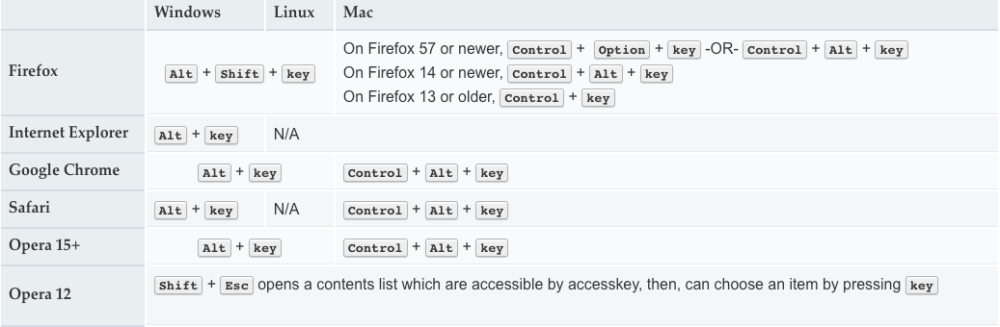

**全局属性是所有HTML元素共有的属性; 它们可以用于所有元素，即使属性可能对某些元素不起作用。**

### dir

枚举属性指示元素文本的方向性。

可以通过`HTMLElement.dir`来获取/设置元素的方向

- `ltr`，这意味着*从左到右，用于从左到右*书写的语言（如英语）;

- `rtl`，这意味着*从右到左*，用于*从右到左*书写的语言（如阿拉伯语）;

- `auto`，让用户代理决定。它使用基本算法，因为它解析元素内的字符，直到找到具有强方向性的字符，然后将该方向性应用于整个元素。

#### todo

1. IE/Edge不支持`auto`关键字

### accesskey

提供了为当前元素生成快捷键的方式。属性值必须包含一个可打印字符。

可以通过`HTMLElement.accessKey`来获取/设置元素访问的快捷键

`HTMLElement.accessKeyLabel`返回一个包含元素访问的快捷键的字符串

#### 各平台激活accesskey的操作

图片来自[MDN](https://developer.mozilla.org/zh-CN/docs/Web/HTML/Global_attributes/accesskey)

#### todo

1. IE触发的是`focus`事件，其他浏览器是`click`事件

2. IE在元素被隐藏的情况下是触发不了`accesskey`的，因为隐藏的元素是不能被`focus`聚焦的
3. 多个元素使用同一个`accesskey`
   1. Chrome浏览器后面的会抵消前面的
   2. Firefox浏览器都不会触发`click`事件，而会变成`focus`事件
   3. IE依然是按次序触发`focus`事件
4. `accesskey` 值可能与系统或浏览器键盘快捷键或辅助技术功能相冲突。对于一个操作系统来说，辅助技术和浏览器组合可能无法与其他操作系统协同工作。
5. 某些 `accesskey` 值可能不会出现在某些键盘上，特别是在国际化是一个问题的时候。
6. 依赖于数字的 `accesskey` 值可能会让那些经历认知问题的人感到困惑，因为他们的数字与它触发的功能没有逻辑关联。
7. 通知用户`accesskey`存在，这样他们就能意识到该功能。如果没有公开这些信息的方法，`accesskey`可能会被意外激活。

### autocapitalize

控制用户输入/编辑文本输入时文本输入是否自动大写，以及如何自动大写

-  `none`: 没有应用自动大写（所有字母都默认为小写字母）。
- `sentences`: 每个**句子**的第一个字母默认为大写字母；所有其他字母都默认为小写字母。
- `words`: 每个**单词**的第一个字母默认为大写字母；所有其他字母都默认为小写字母。
- `characters`: 所有的**字母**都默认为大写。

#### todo

1. `autocapitalize` 属性可以覆盖每个元素的行为，比如关闭iOS中用户开启的首字母大写。
2. 当`input`元素的`type`属性为`email`，`password`，`url`时，`autocapitalize`不会生效

### class

为元素定义类名

### contenteditable

定义元素是否可以被编辑，比如`div`使用此属性来模拟`textarea`元素

可以通过`HTMLElement.contentEditable`来获取/设置元素访问的可编辑状态

`HTMLElement.isContentEditable`返回元素的内容是否可以被编辑

- `true`或者空字符串元素可被编辑
- `false`元素不可被编辑

#### todo

1. 如果未设置此属性，默认值将从其父元素继承。
2. 属性的值是枚举属性，且不允许简写
3. 可以通过`caret-color`属性改变插入符的颜色

### data-*

可以让用户在HTML元素上嵌入自定义数据属性的能力，并且可以通过js来进行操作

可以通过`HTMLElement.dataset`获取元素的自定义属性，是一个对象（key-value，只读）

#### *的限制

- 不能以`xml`开头，无论这些字母是大写还是小写；
- 不能包含任何分号 (`U+003A`)；
- 不能包含A至Z的大写字母。

#### todo

1. 任何破折号(`U+002D`) 都会被下个字母的大写替代(驼峰拼写)。
2. `HTMLElement.dataset`属性是一个`DOMStringMap`
3. 可以通过 `HTMLElement.dataset.testValue` ( 或者是`HTMLElement.dataset["testValue"] `)  来访问

### draggable

枚举类型的属性，标识元素是否允许使用拖放操作API拖动

- `true`可以被拖动
- `false`不可以被拖动
- 如果该属性没有设值，则默认值 为 auto ，表示使用浏览器定义的默认行为

#### todo

1. 枚举属性
2. 不允许简写

### dropzone

枚举属性，指示可以使用Drag and Drop API在元素上删除哪些类型的内容

- `copy`，表示drop将创建被拖动元素的副本。
- `move`，表示拖动的元素将移动到此新位置。
- `link`，这将创建拖动数据的链接。

### hidden

布尔属性，表示一个元素尚未或者不再相关。例如，它可以被用来隐藏一个页面元素直到登录完毕。如果一个元素设置了这个属性，它就不会被显示。

#### todo

1. 如果某些内容被标记为隐藏，它将从所有版块中隐藏,包括例如屏幕阅读器.
2. `hidden`属性不能用于隐藏那些可以在其它板块中合理显示的内容
3. 隐藏元素不应与非隐藏元素链接，作为隐藏元素的后代的元素仍然是活动的，这意味着脚本元素仍然可以执行，表单元素仍然可以提交。
4. 比如说，用 `href `标签链接到一个带有 `hidden `标签的区块是不对的。 如果这个区块和这个页面不相干，或者这个区块不适用于这个页面，那没有任何理由需要链接到它。

### id

定义唯一标识符（ID），该标识符在整个文档中必须是唯一的。 其目的是在链接（使用片段标识符），脚本或样式（使用CSS）时标识元素。

### title

表示与元素相关的一些提示性文本，在鼠标放在元素上时呈现出来。

如果省略了这个属性，就意味着这个元素的最近祖先的标题仍然是相关的（并且可以用作元素的提示信息）。如果这个属性设为空字符串，它就明确意味着，它的最近祖先的标题是不相关的（并且不应用于这个元素的提示信息）。

#### 应用

- 链接：被链接文档的标题或描述
- 媒体元素，例如图像：描述或关联信息
- 段落：脚注或者相关的评论
- 引用：作者信息，以及其他

### translate

对应元素的属性值及其子文本节点内容，是否跟随系统语言作出对应的翻译变化。

- `yes`或者不设置,网页在进行本地化的时候，对应内容要被翻译。
- `no`对应的内容无需做任何翻译。

### tabindex

元素是否可以聚焦，以及在何处参与聚焦

- `tabindex`=负值 (通常是`tabindex="-1"`)，表示元素是可聚焦的，但是不能通过键盘导航来访问到该元素，用JS做页面小组件内部键盘导航的时候非常有用。
- `tabindex="0"` ，表示元素是可聚焦的，并且可以通过键盘导航来聚焦到该元素，它的相对顺序是当前处于的DOM结构来决定的。
- `tabindex`=正值，表示元素是可聚焦的，并且可以通过键盘导航来访问到该元素；它的相对顺序按照**tabindex** 的数值递增而滞后获焦。如果多个元素拥有相同的 **tabindex**，它们的相对顺序按照他们在当前DOM中的先后顺序决定。

#### todo

1. 在`div`上设置了`tabindex`属性，子元素的内容将不能使用箭头键来滚动，除非在子元素上也设置`tabindex`

### style

内联的css样式

### spellcheck

枚举属性，标识是否可以检查元素内容的拼写错误

- `true`会检查
- `false`不会检查

如果没有设置这个属性，默认值由元素自身类型和浏览器设置决定。默认值也可以被继承，当有祖先元素的 *spellcheck* 设置为 `true` 的情况下，子元素的默认值也是 `true`。

#### todo

1. 这个属性仅仅是浏览器上的提示: 浏览器并不会强制去检查拼写错误，通常不可编辑的元素是不会去检查拼写错误的，就算它的spellcheck 属性被设置为true而且浏览器支持拼写检查。

各浏览器的默认设置和元素依赖: 来自[MDN](https://developer.mozilla.org/zh-CN/docs/Web/HTML/Global_attributes/spellcheck)

| 浏览器            | `html`   | `textarea`    | `input`       | 其他                                                   | 附注                                   |
| :---------------- | :------- | :------------ | :------------ | :----------------------------------------------------- | :------------------------------------- |
| Firefox           | `false`  | `false`       | `false`       | *inherited*                                            | 当 `layout.spellcheckDefault` 值为 `0` |
| **false**         | **true** | **inherited** | **inherited** | **当 layout.spellcheckDefault 值为 1 (default value)** |                                        |
| `false`           | `true`   | `true`        | *inherited*   | 当 `layout.spellcheckDefault` 值为 `2`                 |                                        |
| Seamonkey         | `false`  | `false`       | `false`       | *inherited*                                            | 当 `layout.spellcheckDefault` 值为 `0` |
| **false**         | **true** | **inherited** | **inherited** | **当 layout.spellcheckDefault 值为 1（默认如此）**     |                                        |
| `false`           | `true`   | `true`        | *inherited*   | 当 `layout.spellcheckDefault` 值为 `2`                 |                                        |
| Camino            | `false`  | `false`       | `false`       | *inherited*                                            | 当 `layout.spellcheckDefault` 值为 `0` |
| `false`           | `true`   | *inherited*   | *inherited*   | 当 `layout.spellcheckDefault` 值为 `1`                 |                                        |
| **false**         | **true** | **true**      | **inherited** | **当 layout.spellcheckDefault 值为 2（默认如此）**     |                                        |
| Chrome            | `false`  | `true`        | ?             | *inherited*                                            |                                        |
| Internet Explorer | `false`  | `true`        | ?             | *inherited*                                            |                                        |
| Opera             | `false`  | `true`        | ?             | *inherited*                                            |                                        |
| Safari            | `false`  | `true`        | ?             | *inherited*                                            |                                        |

### slot

行为参考VUE的slot

### lang

帮助定义元素的语言：不可编辑元素所在的语言，或者用户应该编写可编辑元素的语言。该属性包含一个“语言标记”（由连字符分隔的“语言子标记”组成），其格式[*为标识语言标记（BCP47）中*](https://www.ietf.org/rfc/bcp/bcp47.txt)定义的格式。`xml：lang`优先与它

`:lang()`基于元素语言来匹配元素

#### 为什么要使用lang

[W3C](https://www.w3.org/International/questions/qa-lang-why.en)

### microdata

具体信息可以查看[前端的基础修养](https://lepture.com/zh/2015/fe-microdata)

#### itemid

元素的唯一的全局标识符

##### todo

1. `itemid` 属性只能为同时拥有 **itemscope** 和 **itemtype** 的元素指定。
2. `itemid` 只能为拥有 `itemscope` 的元素指定，它的相应 `itemtype` 引用或定义了支持全局标识符的词汇

#### itemprop

向元素中添加属性。每一个HTML元素都可以指定一个itemprop属性，一个`itemprop`属性由name-value对组成。每一个键值对称为一个属性，一个元素可以有一个或者多个属性。属性值可以是一个string或者一个URL，并且可以和大部分元素进行组合。

#### itemref

在特殊情况，元素不能写在`itemscope`中时，可以用`itemref`来标识，`itemref`使用元素的id来进行关联

##### todo

1. `itemref` 属性只能在指定了 `itemscope` 的元素上指定。

#### itemscope

值为布尔值。定义了一个与元数据关联的数据项。就是说一个元素的 `itemscope` 属性会创建一个项，包含了一组与元素相关的键值对

##### todo

1. 每个 HTML 元素都可以有指定的 `itemscope` 属性。一个具有 `itemscope` 属性的元素可以没有关联的 `itemtype` ，但必须有相关的 `itemref`。

#### itemtype

用于定义数据结构中的 `itemprop`（条目属性）

##### todo

1. 值必须是唯一标识的无序集合（大小写敏感），并且每个标识都是有效的绝对 URL，并且所有都使用相同词汇定义。属性的值必须至少拥有一个标识。
2. 条目的类型必须全部为定义在适用规范（例如 [schema.org](http://schema.org/)）中的类型，并且必须使用相同词汇定义。
3. 只能在指定了 `itemscope` 属性的元素上指定。

### 参考

[全局属性](https://developer.mozilla.org/zh-CN/docs/Web/HTML/Global_attributes)