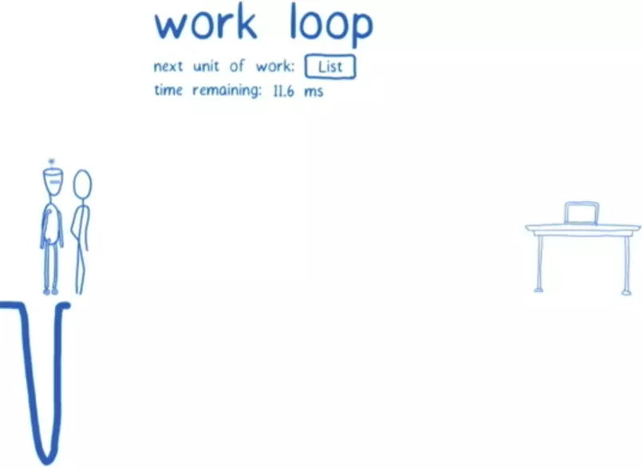

[原文地址1](https://juejin.im/post/5ab7b3a2f265da2378403e57)

[原文地址2](https://juejin.im/post/5b5acae36fb9a04fb4016fc9)

[涉及到生命周期](https://juejin.im/post/5b7016606fb9a0099406f8de)

**基本组成**

- React基础模块（这个模块定义了React的基础API及组件相关内容。对应我们开发页面时引入的 'react' 模块）
- 渲染模块（这个模块对于不同类型的应用，采用不同的渲染方式。对应我们开发页面时引入的 'react-dom' 模块）
- Reconciliation 模块（又叫 协调模块，这个模块是上面两个模块的基础，也是本文分享的重点，主要负责任务协调、生命周期函数管理等）

#### fiber

React 16版本之前使用的 Stack Reconciler 调度算法，它通过递归的形式遍历 Virtual DOM，存在难以中断和恢复的问题，如果react更新任务运行时间过长，就会阻塞布局、动画等的运行，可能导致掉帧。

为了解决这个问题，react团队经过两年的工作，重写了react中核心算法——[reconciliation](https://link.juejin.im?target=https%3A%2F%2Freactjs.org%2Fdocs%2Freconciliation.html)。并在v16版本中发布了这个新的特性。为了区别之前和之后的reconciler，通常将之前的reconciler称为stack reconciler，重写后的称为fiber reconciler，简称为Fiber。


#### 卡顿原因

> Stack reconciler的工作流程很像函数的调用过程。父组件里调子组件，可以类比为函数的递归（这也是为什么被称为stack reconciler的原因）。在setState后，react会立即开始reconciliation过程，从父节点（Virtual DOM）开始遍历，以找出不同。将所有的Virtual DOM遍历完成后，reconciler才能给出当前需要修改真实DOM的信息，并传递给renderer，进行渲染，然后屏幕上才会显示此次更新内容。对于特别庞大的vDOM树来说，reconciliation过程会很长(x00ms)，在这期间，主线程是被js占用的，因此任何交互、布局、渲染都会停止，给用户的感觉就是页面被卡住了。


**Fiber Reconciler**

允许渲染过程分段完成，而不必须一次性完成，中间可以返回至主进程控制执行其他任务，它有如下新特性：

- 可拆分，可中断任务
- 可重用各分阶段任务，且可以设置优先级
- 可以在父子组件任务间前进后退切换任务
- render方法可以返回多元素（即可以返回数组）
- 支持异常边界处理异常

```js
function FiberNode(tag, pendingProps, key, mode) {
  // Instance
  //ag identifying the type of fiber.标签识别纤维的类型。
  this.tag = tag;
  //key、type 这两个属性都是用来表示组件的，更新组件的时候先检查key是否有改变，如果改	变的话则直接摧毁重建；不变的话则继续检查type是否改变，改变则直接摧毁重建；否则重用原	来的组件，只是改变组件的属性。type可能是用户定义的函数型或者类型的组合型组件，或者是	代表平台元素的字符串(如'div')。
  //Unique identifier of this child. 这个孩子的唯一标识符。
  this.key = key;
  //The function/class/module associated with this fiber. 与这相关的函数/类/模块纤维。
  this.type = null;
  //The local state associated with this fiber. 与这相关的本地状态纤维。
  this.stateNode = null;

  // Fiber
  //Remaining fields belong to Fiber 剩下的领域属于纤维
  this['return'] = null;
  //Singly Linked List Tree Structure. 单向链表树结构。
  this.child = null;
  this.sibling = null;
  this.index = 0;
	//The ref last used to attach this node. 裁判最后用于连接该节点。
  this.ref = null;

  //Input is the data coming into process this fiber. Arguments. Props.
  //输入数据进入过程这纤维。参数。道具。
  
  //pendingProps、memoizedProps概念上来说，props就是一个函数的参数数组。pendingProps是Fiber开始执行的时候被设定的，memoizedProps在执行完之后。每次更新的时候先比较pendingProps和memoizedProps，如果它们相同，则表示先前的输出可以重用，而不必进行多余的工作。
  
  //This type will be more specific once we overload the tag.
  //这种将更具体的我们一旦过载标签。
  this.pendingProps = pendingProps;
  //The props used to create the output.道具用来创建的输出。
  this.memoizedProps = null;
  //A queue of state updates and callbacks.一个队列的状态更新和回调。
  this.updateQueue = null;
  //The state used to create the output 用于创建输出状态
  this.memoizedState = null;

  this.mode = mode;

  // Effects 效果
  this.effectTag = NoEffect;
	//Singly linked list fast path to the next fiber with side-effects.
  //单链表快速路径下纤维与副作用。
  this.nextEffect = null;
  this.firstEffect = null;
  this.lastEffect = null;

  this.expirationTime = NoWork;

  this.alternate = null;

  //调试
  {
    this._debugID = debugCounter++;
    this._debugSource = null;
    this._debugOwner = null;
    this._debugIsCurrentlyTiming = false;
    if (!hasBadMapPolyfill && typeof Object.preventExtensions === 'function') {
      Object.preventExtensions(this);
    }
  }
}
```


#### Scheduler

scheduling(调度)是fiber reconciliation（协调）的一个过程，主要决定应该在何时做什么。在stack reconciler中，reconciliation是“一气呵成”，对于函数来说，这没什么问题，因为我们只想要函数的运行结果，但对于UI来说还需要考虑以下问题：

- 并不是所有的state更新都需要立即显示出来，比如屏幕之外的部分的更新
- 并不是所有的更新优先级都是一样的，比如用户输入的响应优先级要比通过请求填充内容的响应优先级更高
- 理想情况下，对于某些高优先级的操作，应该是可以打断低优先级的操作执行的，比如用户输入时，页面的某个评论还在reconciliation，应该优先响应用户输入

所以理想状况下reconciliation的过程应该是像下图所示一样，每次只做一个很小的任务，做完后能够“喘口气儿”，回到主线程看下有没有什么更高优先级的任务需要处理，如果又则先处理更高优先级的任务，没有则继续执行([cooperative scheduling 合作式调度](https://link.juejin.im?target=https%3A%2F%2Fwww.w3.org%2FTR%2Frequestidlecallback%2F))。


#### fiber-tree & fiber

先看一下stack-reconciler下的react是怎么工作的。代码中创建（或更新）一些元素，react会根据这些元素创建（或更新）Virtual DOM，然后react根据更新前后virtual DOM的区别，去修改真正的DOM。注意，**在stack reconciler下，DOM的更新是同步的，也就是说，在virtual DOM的比对过程中，发现一个instance(实例)有更新，会立即执行DOM操作**


而fiber-reconciler下，操作是可以分成很多小部分，并且可以被中断的，所以同步操作DOM可能会导致fiber-tree与实际DOM的不同步。对于每个节点来说，其不光存储了对应元素的基本信息，还要保存一些用于任务调度的信息。因此，fiber仅仅是一个对象，表征reconciliation阶段所能拆分的最小工作单元，和上图中的react instance一一对应。通过`stateNode`属性管理Instance自身的特性。通过child和sibling表征当前工作单元的下一个工作单元，return表示处理完成后返回结果所要合并的目标，通常指向父节点。整个结构是一个链表树。每个工作单元（fiber）执行完成后，都会查看是否还继续拥有主线程时间片，如果有继续下一个，如果没有则先处理其他高优先级事务，等主线程空闲下来继续执行。


React组件渲染分为两个阶段：reconciler、render。从图上可以看到：

- reconciler阶段是对Virtual DOM操作阶段，对应到新的调度算法中，就是找到需要更新的工作
- render阶段是渲染阶段，拿到更新工作，在不同应用中，使用不同的渲染方式进行渲染


#### 工作内容

在上面的基础概念介绍中有提到，react-dom模块负责react web应用的渲染工作，那么Reconciliation模块（协调模块）具体做了什么工作呢？

Reconciliation模块的工作可以分为两部分：

1. reconciliation
   1. 简单来说就是找到需要更新的工作，通过 Diff Fiber Tree 找出要做的更新工作，这是一个js计算过程，计算结果可以被缓存，计算过程可以被打断，也可以恢复执行
   2. 所以，上面介绍 Fiber Reconciler 调度算法时，有提到新算法具有可拆分、可中断任务的新特性，就是因为这部分的工作是一个纯js计算过程，所以是可以被缓存、被打断和恢复的
2. commit
   1. 提交更新并调用对应渲染模块（react-dom）进行渲染，为了防止页面抖动，该过程是同步且不能被打断

**reconciliation**

我们以 ReactDOM.render() 方法为入口，来看看reconciliation阶段的函数调用流程：


从图中可以看到，我把此阶段分为三部分，分别以红线划分。简单的概括下三部分的工作：

1. 第一部分从`React.render`方法开始，把接受的React Element转为Fiber节点，并为其设置优先级，记录update等，这部分主要是一些数据方面的准备工作。
2. 第二部分主要是三个函数：scheduleWork、requestWork、performWork，即安排工作、申请工作、正式工作三部曲。React 16 新增的异步调用的功能则在这部分实现。
3. 第三部分是一个大循环，遍历所有的Fiber节点，通过Diff算法计算所有更新工作，产出 **EffectList** 给到commit阶段使用。这部分的核心是 beginWork 函数。


**任务协调**

> scheduleWork、requestWork、performWork（安排工作、申请工作、正式工作）


在三部曲中的 requestWork函数中，会判断当前任务是同步还是异步（暂时React的异步调用功能还在开发中，未开放使用，本文后续内容是以同步任务为例），然后通过不同的方式调用任务。同步任务直接调用performWork函数立即执行，而异步任务则会在后面的某一时刻被执行，那么异步任务是怎么被调度的呢？

异步任务调度有两种方式，主要是通过该任务的优先级进行判断，主要有两种：

1. animation（动画）：则会调用 requestAnimationFrame API 告诉浏览器，在下一次重绘之前调用该任务来更新动画
2. 其他异步任务：则会调用 requestIdleCallback API 告诉浏览器，在浏览器空闲时期依次调用任务，这就可以让开发者在主事件循环中执行后台或低优先级的任务，而且不会对像动画和用户交互等关键的事件产生影响

**beginWork**

[源码地址](https://github.com/facebook/react/blob/master/packages/react-reconciler/src/ReactFiberBeginWork.js)


**例子**

当前页面包含一个列表，通过该列表渲染出一个button和一组Item，Item中包含一个div，其中的内容为数字。通过点击button，可以使列表中的所有数字进行平方。另外有一个按钮，点击可以调节字体大小。

页面渲染完成后，就会初始化生成一个fiber-tree。初始化fiber-tree和初始化Virtual DOM tree没什么区别。


于此同时，react还会维护一个workInProgressTree，它们之间是通过每个Fiber节点上的alternate属性联系在一起。workInProgressTree用于计算更新，完成reconciliation过程。

```js
// This is used to create an alternate fiber to do work on.
//这是用于创建另一种纤维。
export function createWorkInProgress(
  current: Fiber,
  pendingProps: any,
  expirationTime: ExpirationTime,
): Fiber {
  let workInProgress = current.alternate;
  if (workInProgress === null) {
    // We use a double buffering pooling technique because we know that we'll
    // only ever need at most two versions of a tree. We pool the "other" unused
    // node that we're free to reuse. This is lazily created to avoid allocating
    // extra objects for things that are never updated. It also allow us to
    // reclaim the extra memory if needed.
    //我们使用双缓冲池技术，因为我们知道我们最多只需要一个树的两个版本。我们共享我们可以自由重用的“其他”未使用节点。这是惰性创建的，以避免为从未更新的对象分配额外的对象。它还允许我们在需要时回收额外的内存。
    workInProgress = createFiber(
      current.tag,
      pendingProps,
      current.key,
      current.mode,
    );
    workInProgress.elementType = current.elementType;
    workInProgress.type = current.type;
    workInProgress.stateNode = current.stateNode;

    if (__DEV__) {
      // DEV-only fields
      //DEV-only字段
      workInProgress._debugID = current._debugID;
      workInProgress._debugSource = current._debugSource;
      workInProgress._debugOwner = current._debugOwner;
    }

    workInProgress.alternate = current;
    current.alternate = workInProgress;
  } else {
    workInProgress.pendingProps = pendingProps;

    // We already have an alternate.
    // Reset the effect tag.
    //我们已经有了一个备用的。重置效果标签。
    workInProgress.effectTag = NoEffect;

    // The effect list is no longer valid.
    //效果列表不再有效。
    workInProgress.nextEffect = null;
    workInProgress.firstEffect = null;
    workInProgress.lastEffect = null;

    if (enableProfilerTimer) {
      // We intentionally reset, rather than copy, actualDuration & actualStartTime.
      // This prevents time from endlessly accumulating in new commits.
      // This has the downside of resetting values for different priority renders,
      // But works for yielding (the common case) and should support resuming.
      // 我们故意重置，而不是复制，实际持续时间和实际开始时间。这可以防止时间在新的提交中无休止地积累。这有为不同的优先级呈现值重新设置值的缺点，但是对让步(常见情况)有效，并且应该支持恢复。
      workInProgress.actualDuration = 0;
      workInProgress.actualStartTime = -1;
    }
  }

  workInProgress.childExpirationTime = current.childExpirationTime;
  workInProgress.expirationTime = current.expirationTime;

  workInProgress.child = current.child;
  workInProgress.memoizedProps = current.memoizedProps;
  workInProgress.memoizedState = current.memoizedState;
  workInProgress.updateQueue = current.updateQueue;
  workInProgress.firstContextDependency = current.firstContextDependency;

  // These will be overridden during the parent's reconciliation
  // 这些将在父母调解期间被重写
  workInProgress.sibling = current.sibling;
  workInProgress.index = current.index;
  workInProgress.ref = current.ref;

  if (enableProfilerTimer) {
    workInProgress.selfBaseDuration = current.selfBaseDuration;
    workInProgress.treeBaseDuration = current.treeBaseDuration;
  }

  return workInProgress;
}
```

以上代码可以发现，current和workinprogress互相持有引用，而从上图可以发现，所有更新都是在workInProgress上进行操作，等更新完毕之后，再把current指针指向workInProgress，从而丢弃旧的Fiber Tree

从beginWork源码来看，主要分为两部分，一部分是对Context的处理，一部分是根据fiber对象的tag类型，调用对应的update方法。在这里我们重点关注第二部分。而在第二部分中，我们以 ClassComponent类型 为例，讲讲 updateClassComponent函数 中做了什么呢？

主要有两部分：生命周期函数的调用及Diff算法

生命周期函数调用


current为null，意味着当前的update是组件第一次渲染

1、调用 constructClassInstance 构造组件实例，主要是调用 `constructor` 构造函数，并注入classComponentUpdater（这块就是文章一开始介绍React Component时提到的updater注入）

2、mountClassInstance 则是调用 `getDerivedStateFromProps` 生命周期函数（v16） 及 `UNSAFE_componentWillMount` 生命周期函数

current不为null，调用 updateClassInstance 方法

1、如果新老props不一致，则会调用 `UNSAFE_componentWillReceiveProps` 生命周期函数

2、然后调用 `shouldComponentUpdate` 生命周期函数，获得shouldUpdate值，若未定义此生命周期函数，默认为true（是否重新渲染），如果shouldUpdate为true，则会调用 `UNSAFE_componentWillUpdate` 生命周期函数

最后调用 finishClassComponent 方法，那么 finishClassComponent函数 中做了什么呢？流程图如下：


如果 shouldUpdate 为false，表示不需要更新，直接返回

如果 shouldUpdate 为true，调用实例的 `render` 方法，返回新子节点

如果是首次渲染，调用 mountChildFibers 创建子节点的Fiber实例

否则，调用 reconcileChildFibers 对新老子节点进行Diff

执行到了这，updateClassComponent函数主要是执行了组件的生命周期函数，下面讲讲需要对新老子节点进行Diff时使用的Diff算法


用户点击平方按钮后，利用各个元素平方后的list调用setState，react会把当前的更新送入list组件对应的update queue中。但是react并不会立即执行对比并修改DOM的操作。而是交给scheduler（调度程序）去处理。

scheduler会根据当前主线程的使用情况去处理这次update。为了实现这种特性，使用了`requestIdelCallback`API。对于不支持这个API的浏览器，react会加上pollyfill。

总的来讲，通常，客户端线程执行任务时会以帧的形式划分，大部分设备控制在30-60帧是不会影响用户体验；在两个执行帧之间，主线程通常会有一小段空闲时间，`requestIdleCallback`可以在这个**空闲期（Idle Period）调用空闲期回调（Idle Callback）**，执行一些任务


1. 低优先级任务由`requestIdleCallback`处理；
2. 高优先级任务，如动画相关的由`requestAnimationFrame`处理；
3. `requestIdleCallback`可以在多个空闲期调用空闲期回调，执行任务；
4. `requestIdleCallback`方法提供deadline，即任务执行限制时间，以切分任务，避免长时间执行，阻塞UI渲染而导致掉帧；

一旦reconciliation过程得到时间片，就开始进入work loop。work loop机制可以让react在计算状态和等待状态之间进行切换。为了达到这个目的，对于每个loop而言，需要追踪两个东西：下一个工作单元（下一个待处理的fiber）;当前还能占用主线程的时间。第一个loop，下一个待处理单元为根节点。


因为根节点上的更新队列为空，所以直接从fiber-tree上将根节点复制到workInProgressTree中去。根节点中包含指向子节点（List）的指针。


根节点没有什么更新操作，根据其child指针，接下来把List节点及其对应的update queue也复制到workinprogress中。List插入后，向其父节点返回，标志根节点的处理完成。


根节点处理完成后，react此时检查时间片是否用完。如果没有用完，根据其保存的下个工作单元的信息开始处理下一个节点List。



接下来进入处理List的work loop，List中包含更新，因此此时react会调用setState时传入的**updater funciton**获取最新的state值，此时应该是[1,4,9]。通常我们现在在调用setState传入的是一个对象，但在使用fiber conciler时，必须传入一个函数，函数的返回值是要更新的state。react从很早的版本就开始支持这种写法了，不过通常没有人用。在之后的react版本中，可能会废弃直接传入对象的写法。

```js
setState({}, callback); // stack conciler
setState(() => { return {} }, callback); // fiber conciler
```

在获取到最新的state值后，react会更新List的state和props值，然后调用render，然后得到一组通过更新后的list值生成的**elements**。react会根据生成elements的类型，来决定fiber是否可重用。对于当前情况来说，新生成的elments类型并没有变（依然是Button和Item），所以react会直接从fiber-tree中复制这些elements对应的fiber到workInProgress 中。并给List打上标签，因为这是一个需要更新的节点。


List节点处理完成，react仍然会检查当前时间片是否够用。如果够用则处理下一个，也就是button。加入这个时候，用户点击了放大字体的按钮。这个放大字体的操作，纯粹由js实现，跟react无关。但是操作并不能立即生效，因为react的时间片还未用完，因此接下来仍然要继续处理button。


button没有任何子节点，所以此时可以返回，并标志button处理完成。如果button有改变，需要打上tag，但是当前情况没有，只需要标记完成即可。


老规矩，处理完一个节点先看时间够不够用。注意这里放大字体的操作已经在等候释放主线程了。

接下来处理第一个item。通过shouldComponentUpdate钩子可以根据传入的props判断其是否需要改变。对于第一个Item而言，更改前后都是1,所以不会改变，shouldComponentUpdate返回false，复制div，处理完成，检查时间，如果还有时间进入第二个Item。

第二个Item shouldComponentUpdate返回true，所以需要打上tag，标志需要更新，复制div，调用render，讲div中的内容从2更新为4，因为div有更新，所以标记div。当前节点处理完成。


对于上面这种情况，div已经是叶子节点，且没有任何兄弟节点，且其值已经更新，这时候，需要将此节点改变产生的effect合并到父节点中。此时react会维护一个列表，其中记录所有产生effect的元素。


合并后，回到父节点Item，父节点标记完成。


下一个工作单元是Item，在进入Item之前，检查时间。但这个时候时间用完了。此时react必须交换主线程，并告诉主线程以后要为其分配时间以完成剩下的操作。


完成后，Item向List返回并merge effect，effect List现在如下所示：


此时List向根节点返回并merge effect，所有节点都可以标记完成了。此时react将workInProgress标记为pendingCommit。意思是可以进入commit阶段了。


此时，要做的是还是检查时间够不够用，如果没有时间，会等到时间再去提交修改到DOM。进入到阶段2后，reacDOM会根据阶段1计算出来的effect-list来更新DOM。

更新完DOM之后，workInProgress就完全和DOM保持一致了，为了让当前的fiber-tree和DOM保持一直，react交换了current和workinProgress两个指针。


事实上，react大部分时间都在维持两个树（Double-buffering）。这可以缩减下次更新时，分配内存、垃圾清理的时间。commit完成后，执行componentDidMount函数。

通过将reconciliation过程，分解成小的工作单元的方式，可以让页面对于浏览器事件的响应更加及时。但是另外一个问题还是没有解决，就是如果当前在处理的react渲染耗时较长，仍然会阻塞后面的react渲染。这就是为什么fiber reconciler增加了优先级策略。

**优先级**

```js
module.exports = {
  NoWork: 0, // No work is pending.
  SynchronousPriority: 1, // For controlled text inputs. Synchronous side-effects.控制文本输入。同步的副作用。
  AnimationPriority: 2, // Needs to complete before the next frame.之前需要完成下一帧。
  HighPriority: 3, // Interaction that needs to complete pretty soon to feel responsive.交互需要完成很快响应。
  LowPriority: 4, // Data fetching, or result from updating stores.从更新存储数据抓取或结果。
  OffscreenPriority: 5, // Won't be visible but do the work in case it becomes visible.不可见但做这项工作变得可见。
};
```


优先级策略的核心是，在reconciliation阶段，低优先级的操作可以被高优先级的操作打断，并让主线程执行高优先级的更新，以时用户可感知的响应更快。值得注意的一点是，当主线程重新分配给低优先级的操作时，并不会从上次工作的状态开始，而是从新开始。

这就可能会产生两个问题：

- 饿死：正在实验中的方案是重用，也就是说高优先级的操作如果没有修改低优先级操作已经完成的节点，那么这部分工作是可以重用的。
- 一次渲染可能会调用多次声明周期函数

**生命周期**


对于某些情况来说，phase1阶段的生命周期函数可能会不止执行一次。比如说，当一个低优先级的componentWillUpdate执行之后，被高优先级的打断，高优先级执行完之后，再回到低优先级的操作中来，componentWillUpdate可能会再执行一次。对于某些只期望执行一次，或者需要在两个生命周期函数的操作中执行对称操作的情况而言，要考虑这种case，确保不会让整个App crash掉。


react之前使用的是stack reconciler调度算法。它主要通过递归的形式来进行遍历，如果一个任务运行时间过长就会造成很明显的卡顿，也不可中断和恢复，在16版本中react开始使用fiber reconciler，他和之前的比较好处就是他是可拆分和可中断的，并且可以重用各分阶段的任务，且可以设置优先级。也即是说屏幕之外的内容可以不用立即显示出来，以及高优先级的可以先执行，他的工作流程就是我每次只完成一小部分，在完成后看一下主线程有没有更高优先级的任务，有的话就先处理高优先级的，