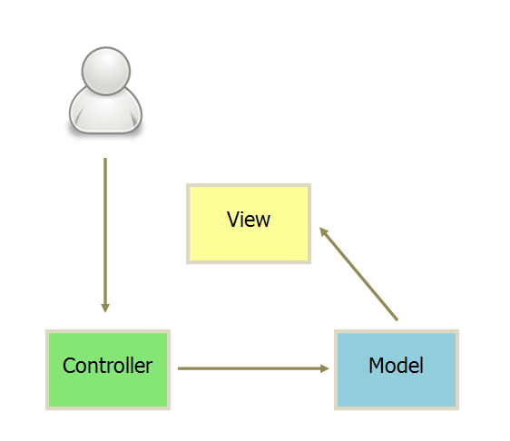
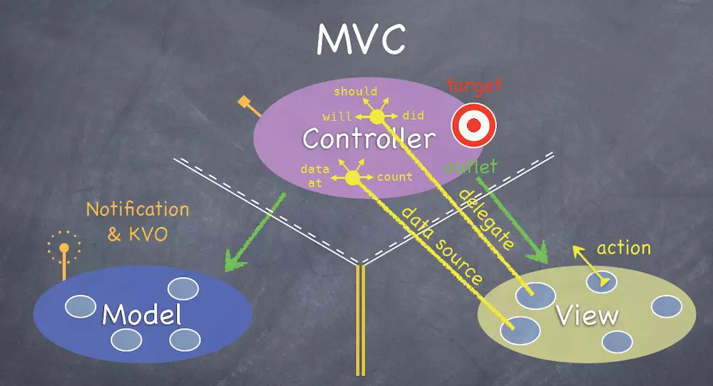

[原文地址1](http://www.ruanyifeng.com/blog/2015/02/mvcmvp_mvvm.html)

[原文地址2](https://www.jianshu.com/p/b0aab1ffad93)

#### MVC

- 视图（View）：用户界面。
- 控制器（Controller）：业务逻辑
- 模型（Model）：数据保存

1. View 传送指令到 Controller
2. Controller 完成业务逻辑后，要求 Model 改变状态
3. Model 将新的数据发送到 View，用户得到反馈

**MVC优点：**

- 耦合性低，视图层和业务层分离，这样就允许更改视图层代码而不用重新编译模型和控制器代码。
- 重用性高
- 生命周期成本低
- MVC使开发和维护用户接口的技术含量降低
- 可维护性高，分离视图层和业务逻辑层也使得WEB应用更易于维护和修改
- 部署快

**MVC缺点：**

- 不适合小型，中等规模的应用程序，花费大量时间将MVC应用到规模并不是很大的应用程序通常会得不偿失。
- 视图与控制器间过于紧密连接，视图与控制器是相互分离，但却是联系紧密的部件，视图没有控制器的存在，其应用是很有限的，反之亦然，这样就妨碍了他们的独立重用。
- 视图对模型数据的低效率访问，依据模型操作接口的不同，视图可能需要多次调用才能获得足够的显示数据。对未变化数据的不必要的频繁访问，也将损害操作性能。

#### 互动模式

接受用户指令时，MVC 可以分成两种方式。一种是通过 View 接受指令，传递给 Controller。

另一种是直接通过controller接受指令。

#### 实例

1. 用户可以向 View 发送指令（DOM 事件），再由 View 直接要求 Model 改变状态。

2. 用户也可以直接向 Controller 发送指令（改变 URL 触发 hashChange 事件），再由 Controller 发送给 View。

3. Controller 非常薄，只起到路由的作用，而 View 非常厚，业务逻辑都部署在 View。所以，Backbone 索性取消了 Controller，只保留一个 Router（路由器） 。

#### MVP

MVP 模式将 Controller 改名为 Presenter，同时改变了通信方向。

1. 各部分之间的通信，都是双向的。

2. View 与 Model 不发生联系，都通过 Presenter 传递。

3. View 非常薄，不部署任何业务逻辑，称为"被动视图"（Passive View），即没有任何主动性，而 Presenter非常厚，所有逻辑都部署在那里。

**MVP**（Model-View-Presenter）是**MVC的改良模式**，

**MVP特点：**

- M、V、P之间双向通信。
- View 与 Model 不通信，都通过 Presenter 传递。Presenter完全把Model和View进行了分离，主要的程序逻辑在Presenter里实现。
- View 非常薄，不部署任何业务逻辑，称为”被动视图”（Passive View），即没有任何主动性，而 Presenter非常厚，所有逻辑都部署在那里。
- Presenter与具体的View是没有直接关联的，而是通过定义好的接口进行交互，从而使得在变更View时候可以保持Presenter的不变，这样就可以重用。不仅如此，还可以编写测试用的View，模拟用户的各种操作，从而实现对Presenter的测试–从而不需要使用自动化的测试工具。

#### MVVM

MVVM是Model-View-ViewModel的简写。微软的WPF(Windows Presentation Foundation–微软推出的基于Windows 的用户界面框架)带来了新的技术体验, 使得软件UI层更加细节化、可定制化。与此同时，在技术层面，WPF也带来了 诸如Binding（绑定）、Dependency Property（依赖属性）、Routed Events（路由事件）、Command（命令）、DataTemplate（数据模板）、ControlTemplate（控制模板）等新特性。MVVM模式其实是MV模式与WPF结合的应用方式时发展演变过来的一种新型架构模式。它立足于原有MVP框架并且把WPF的新特性糅合进去，以应对客户日益复杂的需求变化。

MVVM 模式将 Presenter 改名为 ViewModel，基本上与 MVP 模式完全一致。

唯一的区别是，它采用双向绑定（data-binding）：View的变动，自动反映在 ViewModel，反之亦然。

**MVVM优点：**

MVVM模式和MVC模式类似，主要目的是分离视图（View）和模型（Model），有几大优点：

- 低耦合，视图（View）可以独立于Model变化和修改，一个ViewModel可以绑定到不同的”View”上，当View变化的时候Model可以不变，当Model变化的时候View也可以不变。
- 可重用性，可以把一些视图逻辑放在一个ViewModel里面，让很多view重用这段视图逻辑。
- 独立开发，开发人员可以专注于业务逻辑和数据的开发（ViewModel），设计人员可以专注于页面设计，使用Expression Blend可以很容易设计界面并生成xml代码。
- 可测试，界面向来是比较难于测试的，而现在测试可以针对ViewModel来写。

**下面可以略过**

##### MVC的思想

controller负责将model的数据用view显示出来，

**Model（模型）**

应用程序中用于处理应用程序数据逻辑的部分，通常模型负责在数据库中存取数据。

> 比如我们人类有一双手，一双眼睛，一个脑袋，没有尾巴，这就是模型，Model定义了这个模块的数据模型。 在代码中体现为数据管理者，Model负责对数据进行获取及存放。 数据不可能凭空生成的，要么是从服务器上面获取到的数据，要么是本地数据库中的数据， 也有可能是用户在UI上填写的表单即将上传到服务器上面存放，所以需要有数据来源。 既然Model是数据管理者，则自然由它来负责获取数据。 Controller不需要关心Model是如何拿到数据的，只管调用就行了。 数据存放的地方是在Model，而使用数据的地方是在Controller， 所以Model应该提供接口供controller访问其存放的数据（通常通过.h里面的只读属性）

**View（视图）**

应用程序中处理数据显示的部分；通常视图是依据模型数据创建的。

> View，视图，简单来说，就是我们在界面上看见的一切。 它们有一部分是我们UI定死的，也就是不会根据数据来更新显示的， 比如一些Logo图片啊，这里有个按钮啊，那里有个输入框啊，一些显示特定内容的label啊等等； 有一部分是会根据数据来显示内容的，比如tableView来显示好友列表啊， 这个tableView的显示内容肯定是根据数据来显示的。 我们使用MVC解决问题的时候，通常是解决这些根据数据来显示内容的视图。

**Controller（控制器）**

是应用程序中处理用户交互的部分；通常控制器负责从视图读取数据，控制用户输入，并向模型发送数据。

> Controller是MVC中的数据和视图的协调者，也就是在Controller里面把Model的数据赋值给View来显示
> （或者是View接收用户输入的数据然后由Controller把这些数据传给Model来保存到本地或者上传到
> 服务器）。

**总结**

所有的APP都是基于界面和数据的交互，所有需要类来进行界面的绘制，出现了view，同样需要类来管理数据（model），而view不应该局限于某个model特定的内容，应该是给什么数据我展示什么，但是这样的逻辑有不应该在view里面做，而model只是一个提供数据，不会关心这些数据拿去干啥，这样中间就少了一层东西。controller自然而然就出来了，他负责将model的数据处理后传给view。

最后看图了解

C可以直接引用V和M，而V和M不能直接引用C，至少你不能显式的在V和M的代码中去写和C相关的任何代码，而V和M之间则是双黄线，没错，它们俩谁也不能引用谁，你既不能在M里面写V，也不能在V里面写M。哦，上面的描述有点小小的问题，你不是“不能”这样写，而是“不应该”这样写，没人能阻止你在写代码的时候在一个M里面去写V，但是一旦你这样做了，那么你就违背了MVC的规范，你就不是在使用MVC了，所以这算是MVC的一个必要条件：使用MVC –> M里面没有V的代码。所以M里面没有V的代码就是使用MVC的必要条件；

**View和Controller的交互**

按钮点击事件，是View来接收的，但是处理这个事件的应该是Controller，所以View把这个事件传递给了Controller，如何传递的呢，见图，看到View上面的action没有，这就是事件，看到Controller上面的target没有，这就是靶子，View究竟要把事件传递给谁，它被规定了传递给靶子，Controller实际上就是靶子。只是View只负责传递事件，不负责关心靶子是谁。就像你是一个负责运货的少年，你唯一知道的是你要把货（action）交给上头（开发者）告诉你的那个收货的人（target），至于那个收货的人是警察还是怪兽，你都不需要关心。这是V和C的一种交互方式，叫做target-action。所以你看，这张图简直就是神来之笔，旁边还栩栩如生的画出了V对C的另一种传值：协议-委托。委托有两种：代理和数据源。什么是代理，就是专门处理should、will、did事件的委托，什么是数据源，就是专门处理data、count等等的委托；

**Model和Controller的交互**

M是干嘛的？上面说了，M就是数据管理者，你可以理解为它直接和数据库打交道。这里的数据库可能是本地的，也可能是服务器上的，M会从数据库获取数据，也可能把数据上传给数据库。M也将提供属性或者接口来供C访问其持有的数据。我们就拿一个简单的需求作为例子，假如我想在一个模块中显示一段文字，这段文字是从网上获取下来的。

那么使用MVC的话，在C中肯定需要一个UILabel（V）作为属性来显示这段文字，而这段文字由谁来获取呢，肯定是由M来获取了。而获取的地方在哪里呢？通常在C的生命周期里面，所以往往是在C的一个生命周期方法比如viewDidLoad里面调用M获取数据的方法来获取数据。现在问题来了，M获取数据的方法是异步的网络请求，网络请求结束后，C才应该用请求下来的数据重新赋值给V，现在的问题是，C如何知道网络请求结束了？

这里我们一定要换一种角度去思考，我们进一步考虑M和V之间的关系：它们应该是一种同步的关系，也就是，不管任何时刻，只要M的值发生改变，V的显示就应该发生改变（显示最新的M的内容）。所以我们可以关注M的值改变，而不用关心M的网络请求是否结束了。实际上C根本不知道M从哪去拿的数据，C的责任是负责把M最新的数据赋值给V。所以C应该关注的事件是：M的值是否发生了变化。

#### MVVM

**诞生**

就像我们之前分析MVC是如何合理分配工作的一样，我们需要数据所以有了M，我们需要界面所以有了V，而我们需要找一个地方把M赋值给V来显示，所以有了C，然而我们忽略了一个很重要的操作：数据解析。在MVC出生的年代，手机APP的数据往往都比较简单，没有现在那么复杂，所以那时的数据解析很可能一步就解决了，所以既然有这样一个问题要处理，而面向对象的思想就是用类和对象来解决问题，显然V和M早就被定义死了，它们都不应该处理“解析数据”的问题，理所应当的，“解析数据”这个问题就交给C来完成了。而现在的手机App功能越来越复杂，数据结构也越来越复杂，所以数据解析也就没那么简单了。如果我们继续按照MVC的设计思路，将数据解析的部分放到了Controller里面，那么Controller就将变得相当臃肿。还有相当重要的一点：Controller被设计出来并不是处理数据解析的。1、管理自己的生命周期；2、处理Controller之间的跳转；3、实现Controller容器。这里面根本没有“数据解析”这一项，所以显然，数据解析也不应该由Controller来完成。那么我们的MVC中，M、V、C都不应该处理数据解析，那么由谁来呢？这个问题实际上在面向对象的时候相当好回答：既然目前没有类能够处理这个问题，那么就创建一个新的类出来解决不就好了？所以我们聪明的开发者们就专门为数据解析创建出了一个新的类：ViewModel。这就是MVVM的诞生。

**如何实现MVVM**

搞清楚了MVVM为什么会出现，将对于你理解如何实现MVVM有极大的帮助。在我们开始着手实现MVVM之前，我先简单提一下之前遗留的一个问题：为什么MVVM这个名字里面，没有Controller的出现（为什么不叫MVCVM，C去哪了）。本来这个问题应该在实现后再来解释，但是我们这里是教学，为了让大家更好的明白我们接下来的思想，所以这里要提前解释一下这个结论：Controller的存在感被完全的降低了。我们在待会实现MVVM的时候你就能体会到了，这里请先把这个结论印在脑海当中：Controller的存在感被完全的降低了、Controller的存在感被完全的降低了、Controller的存在感被完全的降低了。

好的，我们终于要开始着手实现MVVM了。如果你已经搞懂了MVC，那么用MVVM实现一个相同的功能将会变得非常简单。你只需要记住两点：1、Controller的存在感被完全的降低了；2、VM的出现就是Controller存在感降低的原因。

**Controller存在感降低的原因**

在MVVM中，Controller不再像MVC那样直接持有Model了。想象Controller是一个Boss，数据是一堆文件（Model），如果现在是MVC，那么数据解析（比如整理文件）需要由Boss亲自完成，然而实际上Boss需要的仅仅是整理好的文件而不是那一堆乱七八糟的整理前的文件。所以Boss招聘了一个秘书，现在Boss就不再需要管理原始数据（整理之前的文件）了，他只需要去找秘书：你帮我把文件整理好后给我。那么这个秘书就首先去拿到文件（原始数据），然后进行整理（数据解析），接下来把整理的结果给Boss。所以秘书就是VM了，并且Controller（Boss）现在只需要直接持有VM而不需要再持有M了。如果再进一步理解C、VM、M之间的关系：因为Controller只需要数据解析的结果而不关心过程，所以就相当于VM把“如何解析Model”给封装起来了，C甚至根本就不需要知道M的存在就能把工作做好，前提它需要持有一个VM。那么我们MVVM中的持有关系就是：C持有VM，VM持有M。这里有一个比较争议的地方：C该不该持有M。我的答案是不该。为什么呢，因为C持有M没有任何意义。就算C直接拿到了M的数据，它还是要去让VM进行数据解析，而数据解析就需要M，那么直接让VM持有M而C直接持有VM就足够了。最后再分享一个我在实现MVVM中的一个技巧，也谈不上是技巧吧，算是一种必要的思想：一旦在实现Controller的过程中遇到任何跟Model（或者数据）相关的问题，就找VM要答案。

