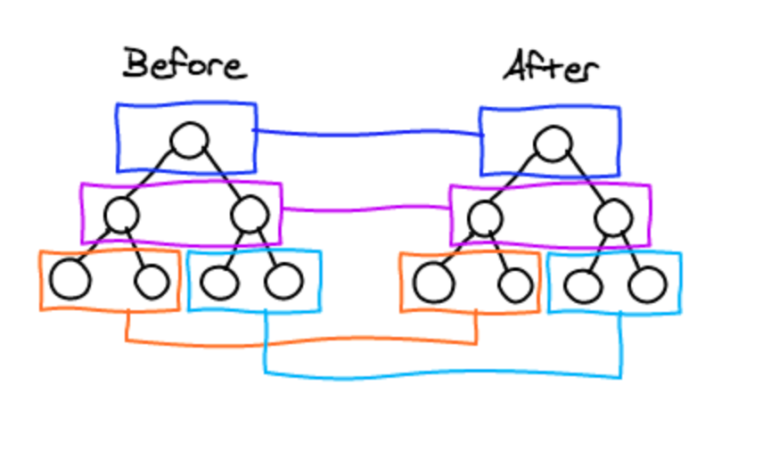

React在对比的时候会遵循两个原则

1. 尽量少的创建/删除节点，尽可能的采用移动节点
2. 比较次数尽量少，时间复杂度够小

React基于的假设

- 如果两个组件类型不同，则这两个组件下的节点一般会完全不同
- 对于多次render中结构保持不变的节点，标识一个key以便为了重用

### 同层对比

React将比较两个树从原先的复杂度O(n^3)优化至O(n)

对于两棵随机树，React只会逐层对比两棵树，并且很少会将组件移动到不同的层级。

### 列表

在一个组件的同层的几个子组件中，如果插入一个新组件且不知道新组件的位置的情况下很难通过对比两棵树来确定新旧树之间的对应关系，因此React采用给每个子组件都设置对应的key来标识组件。

### 组件

React在对比组件的时候采取直接删除重建的方式，比如当两个组件类型不同的时候，React不会去在比较两个组件内是否有相同的节点可供重复利用。