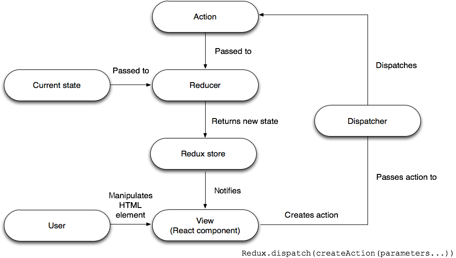
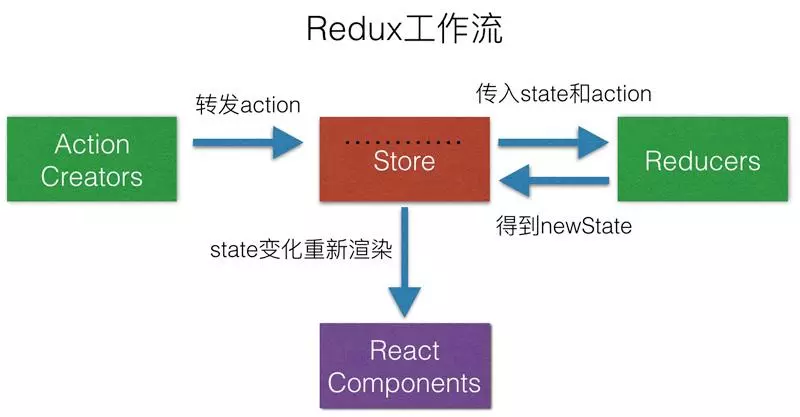

[原文地址1](https://www.ibm.com/developerworks/cn/web/wa-manage-state-with-redux-p1-david-geary/index.html)

[原文地址2](https://www.jianshu.com/p/e984206553c2)

**Redux**

> Redux 是 Facebook 的 [Flux](https://facebook.github.io/flux/) 架构的一种简化实现。（*Redux* 既是一个表示 “已返回” 的英文单词，也是 *reducer* + *flux* 的混合词。）Flux 在本质上采用了模型-视图-控制器 (MVC) 的结构，但引入了很高的复杂性。Redux 从 [Elm](http://elm-lang.org/) 借用了*缩减程序 (reducer)* 的概念来降低了这一复杂性，Elm 是一个基于不可变数据结构和纯函数的强大的反应式函数编程语言。纯函数是没有副作用的函数，Redux 缩减程序是计算应用程序状态的纯函数。

**设计理念**

Redux是将整个应用状态存储到一个地方上称为**store**,里面保存着一个状态树**store tree**,组件可以派发(dispatch)行为(action)给store,而不是直接通知其他组件，组件内部通过订阅**store**中的状态**state**来刷新自己的视图。

**原则**

- 应用程序状态存储在单个对象中。（唯一数据源）
- 应用程序状态不可变，只能通过描述状态更改的*操作* 彻底替换。
- 缩减程序根据当前状态和某个操作来创建下一个状态。

1. 唯一数据源
   1. 整个应用的state都被存储到一个状态树里面，并且这个状态树，只存在于唯一的store中
   2. Redux 通过一个 JavaScript 对象管理状态，该对象称为*数据存储*，包含应用程序的所有状态。将状态集中保存在一个对象中，这使得在阅读代码时推断应用程序数据变得更容易。另外，当所有数据都在一个位置时，应用程序更容易调试和测试。将应用程序状态存储在一个对象中，还使持久保存应用程序的整体状态变得更容易。
2. 只读
   1. state是只读的，唯一改变的方法就是dispatch分发action，action是一个用于描述已发生事件的普通对象。
3. 缩减程序
   1. 根据当前状态和某个操作来创建一个新状态
   2. 集中化数据变化
   3. 可处理所有或部分状态
   4. 可组合和重用
   5. 使用纯函数来执行修改，为了描述action如何改变state的，你需要编写reducers

**概念**

- Store
  - store就是保存数据的地方，你可以把它看成一个数据，整个应用只能有一个store
  - Redux提供createStore生成store
- State
  - state就是store里面存储的数据，store里面可以拥有多个state，Redux规定一个state对应一个View,只要state相同，view就是一样的，反过来也是一样的，可以通过`store.getState( )`获取

- Action
  - state的改变会导致view的变化，但是在redux中不能直接操作state也就是说不能使用`this.setState`来操作，用户只能接触到View。在Redux中提供了一个对象来告诉Store需要改变state。Action是一个对象其中type属性是必须的，表示Action的名称，其他的可以根据需求自由设置。
  - `store.dispatch()`是view发出Action的唯一办法

- Reducer
  - Store收到Action以后，必须给出一个新的state，这样view才会发生变化。这种**state的计算过程**就叫做Reducer。
    Reducer是一个纯函数，他接收Action和当前state作为参数，返回一个新的state

>Redux的话我认为它主要使用是数据特别多，不好管理，或者说组件间毫无联系，或者嵌套层级过深又涉及到状态管理，redux的实现的话，它是在store中存储一个或者多个state，即将数据放在一起统一管理。并且认为这个数据是只读的，也就是说想更改的话，就需要客户端dispatch一个action，在action里面定义需要更改的类型，再将这个类型传给reducer，在reducer里面进行操作，并且reducer是一个纯函数，也就是期望传入一个值，传出的这个值是期望的值，在reducer更改状态之后，将这个值在传给store更新state，最后组件拿到这个新的state值，并进行更新。

