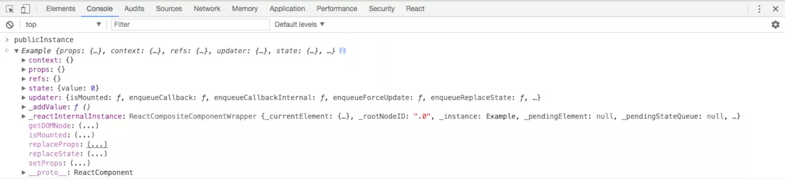

[原文地址1](https://juejin.im/post/599b8f066fb9a0247637d61b)

[原文地址2](https://segmentfault.com/a/1190000014442208)


#### Batch Update（批量更新）


将一段时间内的更新放到一起更新，而不是来一个就更新一次

#### React的transaction


> Transaction对一个函数进行包装，让React有机会在一个函数执行前和执行后运行特定的逻辑，从而完成对整个Batch Update流程的控制。
>
> 简单的说就是在要执行的函数中用事务包裹起来，在函数执行前加入initialize阶段，函数执行，最后执行close阶段。那么Batch Update中
>
> 在事件initialize阶段，一个update queue被创建。在事件中调用setState方法时，状态不会被立即调用，而是被push进Update queue中。
>
> 函数执行结束调用事件的close阶段，Update queue会被flush，这事新的状态才会被应用到组件上并开始后续的Virtual DOM更新，biff算法来对model更新。

#### Vue 实现Batch Update

> 默认情况下， Vue 的 DOM 更新是异步执行的。理解这一点非常重要。当侦测到数据变化时， Vue 会打开一个队列，然后把在同一个事件循环 (event loop) 当中观察到数据变化的 watcher 推送进这个队列。假如一个 watcher 在一个事件循环中被触发了多次，它只会被推送到队列中一次。然后，在进入下一次的事件循环时， Vue 会清空队列并进行必要的 DOM 更新。在内部，Vue 会使用 `MutationObserver` 来实现队列的异步处理，如果不支持则会回退到 `setTimeout(fn, 0)`。

借助JS的Event Loop

```js
/**
 * Push a watcher into the watcher queue.
 * Jobs with duplicate IDs will be skipped unless it's
 * pushed when the queue is being flushed.
 */
//将观察者推到观察者队列中。
//重复的IDS作业将被跳过，除非它是当队列被刷新时被按下。
export function queueWatcher (watcher: Watcher) {
  const id = watcher.id
  if (has[id] == null) {
    has[id] = true
    if (!flushing) {
      queue.push(watcher)
    } else {
      // if already flushing, splice the watcher based on its id
      // if already past its id, it will be run next immediately.
      //如果已经冲洗，根据其ID拼接观察者。
			//如果已经过了它的ID，它将立即运行。
      let i = queue.length - 1
      while (i > index && queue[i].id > watcher.id) {
        i--
      }
      queue.splice(i + 1, 0, watcher)
    }
    // queue the flush
    if (!waiting) {
      waiting = true
      nextTick(flushSchedulerQueue)
    }
  }
}

```


#### setState干了什么

**官方介绍**

> Sets a subset of the state. Always use this to mutate
> state. You should treat this.state as immutable.
>
> There is no guarantee that this.state will be immediately updated, so
> accessing this.state after calling this method may return the old value.
>
> There is no guarantee that calls to setState will run synchronously,
> as they may eventually be batched together. You can provide an optional
> callback that will be executed when the call to setState is actually
> completed.
>
> setState用来设置`state`的子集，永远都只使用setState更改`state`。你应该将`this.state`视为不可变数据。
>
> 并不能保证this.state会被立即更新，因此在调用这个方法之后访问`this.state`可能会得到的是之前的值。
>
> 不能保证调用setState之后会同步运行，因为它们可能被批量更新，你可以提供可选的回调函数，在setState真正地完成了之后，回调函数将会被执行。

React继承自`React.Component`，而setState是`React.Component`的方法，因此对于组件来讲，setState是其原型上的方法。下面是setstate的定义：

```js
function ReactComponent(props, context, updater) {
  this.props = props;
  this.context = context;
  this.refs = emptyObject;
  this.updater = updater || ReactNoopUpdateQueue;
}

ReactComponent.prototype.setState = function (partialState, callback) {
  this.updater.enqueueSetState(this, partialState);
  if (callback) {
    this.updater.enqueueCallback(this, callback);
  }
};
```

在setState中，首先调用`this.updater.enqueueSetState`,先明确`this.updater`是什么，在React中每个组件有拥有一个`this.updater`，是用来驱动`state`更新的工具对象。当我们在组件中的构造函数中调用`super`时实质调用的就是函数`ReactComponent`。其中有: 

```js
this.updater = updater || ReactNoopUpdateQueue;
```

没有传入参数`updater`参数时，`this.updater`的值就是`ReactNoopUpdateQueue`。　而`ReactNoopUpdateQueue`实际是没有什么意义的，只相当于一个初始化的过程。而`ReactNoopUpdateQueue.enqueueSetState`主要起到一个在非生产版本中警告(warning)的作用。真正的`updater`是在`renderer`中注入(inject)的。因此如果你在`constructor`中尝试调用`this.helper.isMounted`会返回`false`，表明组件并没有安装(`mount`),如果你调用setState,也会给出相应的警告。 

```js
  constructor(props) {
    super(props);
    //这是指个演示，this.isMounted函数已经被废弃
    console.log(this.updater.isMounted())
    this.setState({
        value: 1
    })
}
```

上面的警告就是`ReactNoopUpdateQueue`中负责打印的。告诉我们在非安装或已卸载的组件上是不能使用setState函数的。在`ReactCompositeComponentMixin`中的函数`mountComponent`中有下面的语句:

```js
inst.updater = ReactUpdateQueue;
```

那我们来看看`ReactUpdateQueue`中的`enqueueSetState`:

```js
var ReactUpdatedQueue = {
  enqueueSetState: function (publicInstance, partialState) {
    //根据this.setstate中的this拿到内部实例，也就是组件实例。
    var internalInstance = getInternalInstanceReadyForUpdate(publicInstance, 'setState');

    if (!internalInstance) {
      return;
    }
		//取得组件的待更新队列
    var queue = internalInstance._pendingStateQueue 
                || (internalInstance._pendingStateQueue = []);
    //将部分state存到待更新队列
    queue.push(partialState);
		//执行
    enqueueUpdate(internalInstance);
  },
}
```

我们通过`this.updater.enqueueSetState(this, partialState);`这里的`this`是组件的实例，例如在最开始的例子中，`this`指的就是函数`Example`的实例(`class`实质就是函数`function`的语法糖)。如下图:



通过执行函数

```js
var internalInstance = getInternalInstanceReadyForUpdate(publicInstance, 'setState');
```

我们得到的`internalInstance`实质就是组件实例的React内部表达，包含了组件实例的内部的一些属性,例如:


`internalInstance`的属性很多，但我们需要关注的只有两个:`_pendingStateQueue`(待更新队列)与`_pendingCallbacks`(更新回调队列)。根据代码

```js
 var queue = internalInstance._pendingStateQueue 
                || (internalInstance._pendingStateQueue = []);
 queue.push(partialState);
```

如果`_pendingStateQueue`的值为`null`，将其赋值为空数组`[]`，并将`partialState`放入待更新state队列`_pendingStateQueue`。最后执行`enqueueUpdate(internalInstance);`。因此下一步我们需要研究一下`enqueueUpdate`。

```js
function enqueueUpdate(internalInstance) {
  ReactUpdates.enqueueUpdate(internalInstance);
}
var ReactUpdates = {
    enqueueUpdate: function enqueueUpdate(component) {
        //提供默认策略，给出相应的警告
        ensureInjected();
      	//如果没有开启批量或者当前批量已结束，就在开启一次， 这通常发生在异步回调中调用 setState的情况
        if (!batchingStrategy.isBatchingUpdates) {
            batchingStrategy.batchedUpdates(enqueueUpdate, component);
            return;
        }
				//如果开启就存储更新
        dirtyComponents.push(component);
    }
}
```

首先执行的`ensureInjected()`其实也是一个保证`ReactUpdates.ReactReconcileTransaction`与`batchingStrategy`是否存在，否则给出相应的警告，当然上面两个的作用之后会给出。接下来会根据batchingStrategy.isBatchingUpdates的值做出不同的行为,如果是`true`的话，直接将`internalInstance`放入`dirtyComponents`，否则将执行`batchingStrategy.batchedUpdates(enqueueUpdate, component)`。那么我们要了解一下`batchingStrategy`是干什么的。首先看`batchingStrategy`的定义: 　　

```js
//批处理策略
var ReactDefaultBatchingStrategy = {
  isBatchingUpdates: false,
  batchedUpdates: function(callback, a, b, c, d, e) {
    var alreadyBatchingUpdates = ReactDefaultBatchingStrategy.isBatchingUpdates;
    ReactDefaultBatchingStrategy.isBatchingUpdates = true;//开启一次batch
    if (alreadyBatchingUpdates) {
      callback(a, b, c, d, e);
    } else {
      //启动事务，讲callback放进事务中执行
      transaction.perform(callback, null, a, b, c, d, e);
    }
  },
};
```

`batchingStrategy`实质上就是一种批量更新策略，其属性`isBatchingUpdates`表示的是否处于批量更新的过程中，开始默认值为false。`batchedUpdates`就是执行批量更新的方法。当`isBatchingUpdates`为`false`时，执行`transaction.perform(callback, null, a, b, c, d, e)`。否则当`isBatchingUpdates`为`true`时，直接执行`callback`。但在我们这里，其实不会执行到这儿，因为当`isBatchingUpdates`为`true`时，直接就将`component`中放入`dirtyComponents`中。关于代码中的`transaction`我们需要了解下React中的事务Transaction。

### Transaction

React Transaction会给方法包装一个个wrapper，其中每个`wrapper`都有两个方法:`initialize`与`close`。当执行方法时，需要执行事务的`perform`方法。`perform`方法会首先一次执行`wrapper`的`initialize`，然后执行函数本身，最后执行`wrapper`的`close`方法。
　　定义Transaction需要给构造函数混入Transaction.Mixin，并需要提供一个原型方法`getTransactionWrappers`用于返回wrapper数组。下面我们看下`ReactDefaultBatchingStrategy`中的`transaction`是如何定义的:

```js
var RESET_BATCHED_UPDATES = {
  initialize: emptyFunction,
  close: function() {
    ReactDefaultBatchingStrategy.isBatchingUpdates = false;//结束本次batch
  },
};

var FLUSH_BATCHED_UPDATES = {
  initialize: emptyFunction,
  close: ReactUpdates.flushBatchedUpdates.bind(ReactUpdates),//批量更新
};

var TRANSACTION_WRAPPERS = [FLUSH_BATCHED_UPDATES, RESET_BATCHED_UPDATES];

function ReactDefaultBatchingStrategyTransaction() {
  this.reinitializeTransaction();
}

Object.assign(
  ReactDefaultBatchingStrategyTransaction.prototype,
  Transaction.Mixin,
  {
    getTransactionWrappers: function() {
      return TRANSACTION_WRAPPERS;
    },
  }
);

var transaction = new ReactDefaultBatchingStrategyTransaction();
```

　　其中wrapper`RESET_BATCHED_UPDATES`负责在`close`阶段重置`ReactDefaultBatchingStrategy`的`isBatchingUpdates`为`false`。而wrapper`FLUSH_BATCHED_UPDATES`负责在`close`执行`flushBatchedUpdates`。 

### setState更新过程

我们再次回顾一下更新的过程，如果处于批量更新的过程中(即isBatchingUpdates为`true`)，则直接将组件传入`dirtyComponents`。如果不是的话，开启批量更新，用事务`transaction.perform`执行`enqueueUpdate`,这时候`isBatchingUpdates`经过上次执行，已经是`true`，将被直接传入`dirtyComponents`。那么传入更新的组件传入`dirtyComponents`之后会发生什么？
　　
　　我们知道，`batchedUpdates`是处于一个事务中的，该事务在`close`阶段做了两件事，首先是将`ReactDefaultBatchingStrategy.isBatchingUpdates`置为`false`,即关闭批量更新的标志位，第二个就是调用了方法`ReactUpdates.flushBatchedUpdates`。`flushBatchedUpdates`中会涉及到Virtual DOM到真实DOM的映射，这不是我们这篇文章的重点(最重要的是我自己也没有参透这边的逻辑)，这部分我们只会简要的介绍流程。

```js
//代码有省略
var flushBatchedUpdates = function() {
  //启动批量更新事务
  while (dirtyComponents.length) {
    if (dirtyComponents.length) {
      var transaction = ReactUpdatesFlushTransaction.getPooled();
      transaction.perform(runBatchedUpdates, null, transaction);
      ReactUpdatesFlushTransaction.release(transaction);
    }
    // 批量处理callback
    if (asapEnqueued) {
      asapEnqueued = false;
      var queue = asapCallbackQueue;
      asapCallbackQueue = CallbackQueue.getPooled();
      queue.notifyAll();
      CallbackQueue.release(queue);
    }
  }
};
```

我们发现在函数`flushBatchedUpdates`中是以事务`ReactUpdatesFlushTransaction`的方式执行了函数`runBatchedUpdates`，追根溯源我们来看看`runBatchedUpdates`干了什么。

```js
function runBatchedUpdates(transaction) {
  var len = transaction.dirtyComponentsLength;
  //排序保证父组件先于子组件更新
  dirtyComponents.sort(mountOrderComparator);
// 代表批量更新的次数, 保证每个组件只更新一次
  updateBatchNumber++;
  // 遍历 dirtyComponents
  for (var i = 0; i < len; i++) {
    var component = dirtyComponents[i];
    var callbacks = component._pendingCallbacks;
    component._pendingCallbacks = null;
    //.....
    // 执行更新
    ReactReconciler.performUpdateIfNecessary(component, transaction.reconcileTransaction);
    //.......
    // 存储 callback以便后续按顺序调用
    if (callbacks) {
      for (var j = 0; j < callbacks.length; j++) {
        transaction.callbackQueue.enqueue(
          callbacks[j],
          component.getPublicInstance()
        );
      }
    }
  }
}
```

首先函数将`dirtyComponents`以组件中的`_mountOrder`进行了递增排序，其目的就是保证更新顺序，即父组件保证其子组件之前更新。然后在组件中获得`setState`完成之后的回调函数，开始执行`ReactReconciler.performUpdateIfNecessary`。`ReactReconciler`会调用组件实例的`performUpdateIfNecessary`. 如果接收了props, 就会调用此组件的`receiveComponent`, 再在里面调用`updateComponent`更新组件; 如果没有接受props, 但是有新的要更新的状态(_pendingStateQueue不为空)就会直接调用`updateComponent`来更新:

又得看看这个函数:

```js
performUpdateIfNecessary: function (internalInstance, transaction) {
    internalInstance.performUpdateIfNecessary(transaction);
}
```

　　`performUpdateIfNecessary`执行组件实例的原型方法`performUpdateIfNecessary`，我们再去看看组件实例是如何定义的这个方法:

```js
var ReactCompositeComponentMixin = {
  performUpdateIfNecessary: function(transaction) {
    //......
    if (this._pendingStateQueue !== null || this._pendingForceUpdate) {
      this.updateComponent(
        transaction,
        this._currentElement,
        this._currentElement,
        this._context,
        this._context
      );
    }
  }
}
```

上面代码是`perfromUpdateIfNecessary`的省略版本，主要调用的其中的`this.updateComponent`方法: 　　

```js
updateComponent: function(
    transaction,
    prevParentElement,
    nextParentElement,
    prevUnmaskedContext,
    nextUnmaskedContext
  ) {
    var inst = this._instance;
    var willReceive = false;
    var nextContext;
    var nextProps;

    // 验证组件context是否改变
    // ......

    // 验证是否是props更新还是组件state更新
    if (prevParentElement === nextParentElement) {
      nextProps = nextParentElement.props;
    } else {
      //存在props的更新  
      nextProps = this._processProps(nextParentElement.props);
      willReceive = true;
    }
    //根据条件判断是否调用钩子函数componentWillReceiveProps
    if (willReceive && inst.componentWillReceiveProps) {
      inst.componentWillReceiveProps(nextProps, nextContext);
    }
    //计算新的state
    var nextState = this._processPendingState(nextProps, nextContext);

    var shouldUpdate =
      this._pendingForceUpdate ||
      !inst.shouldComponentUpdate ||
      inst.shouldComponentUpdate(nextProps, nextState, nextContext);

    if (shouldUpdate) {
      this._pendingForceUpdate = false;
      this._performComponentUpdate(
        nextParentElement,
        nextProps,
        nextState,
        nextContext,
        transaction,
        nextUnmaskedContext
      );
    } else {
      this._currentElement = nextParentElement;
      this._context = nextUnmaskedContext;
      inst.props = nextProps;
      inst.state = nextState;
      inst.context = nextContext;
    }
  }
```

`updateComponent`方法已经做了相关的注释，其实里面不仅涉及到state的改变导致的重新渲染，还有props的更新导致的重新渲染。在计算新的`state`时调用了`_processPendingState`: 　　

```js
{
  _processPendingState: function(props, context) {
    var inst = this._instance;
    var queue = this._pendingStateQueue;
    var replace = this._pendingReplaceState;
    this._pendingReplaceState = false;
    this._pendingStateQueue = null;

    if (!queue) {
      return inst.state;
    }

    if (replace && queue.length === 1) {
      return queue[0];
    }

    var nextState = Object.assign({}, replace ? queue[0] : inst.state);
    for (var i = replace ? 1 : 0; i < queue.length; i++) {
      var partial = queue[i];
      Object.assign(
        nextState,
        typeof partial === 'function' ?
          partial.call(inst, nextState, props, context) :
          partial
      );
    }

    return nextState;
  }
}
```

　　这一部分代码相对来说不算是很难，`replace`是存在是由于之前被废弃的API`this.replaceState`，我们现在不需要关心这一部分，现在我们可以回答刚开始的问题，为什么给setState传入的参数是函数时，就可以解决刚开始的例子。 

```js
Object.assign(
    nextState,
    typeof partial === 'function' ?
        partial.call(inst, nextState, props, context) :
        partial
);
```

如果我们传入的是对象

```js
this.setState({value: this.state.value + 1 });
this.setState({value: this.state.value + 1})
```

　　我们现在已经知道，调用`setState`是批量更新，那么第一次调用之后，`this.state.value`的值并没有改变。两次更新的`value`值其实是一样的，所以达不到我们的目的。但是如果我们传递的是回调函数的形式，那么情况就不一样了，`partial.call(inst, nextState, props, context)`接受的state都是上一轮更新之后的新值，因此可以达到我们预期的目的。

`_processPendingState`在计算完新的state之后，会执行`_performComponentUpdate`:

```js
function _performComponentUpdate(
    nextElement,
    nextProps,
    nextState,
    nextContext,
    transaction,
    unmaskedContext
  ) {
    var inst = this._instance;

    var hasComponentDidUpdate = Boolean(inst.componentDidUpdate);
    var prevProps;
    var prevState;
    var prevContext;
    if (hasComponentDidUpdate) {
      prevProps = inst.props;
      prevState = inst.state;
      prevContext = inst.context;
    }

    if (inst.componentWillUpdate) {
      inst.componentWillUpdate(nextProps, nextState, nextContext);
    }

    this._currentElement = nextElement;
    this._context = unmaskedContext;
    inst.props = nextProps;
    inst.state = nextState;
    inst.context = nextContext;

    this._updateRenderedComponent(transaction, unmaskedContext);

    if (hasComponentDidUpdate) {
      transaction.getReactMountReady().enqueue(
        inst.componentDidUpdate.bind(inst, prevProps, prevState, prevContext),
        inst
      );
    }
}
```

我们可以看到，这部分内容涉及到了几方面内容，首先在更新前调用了钩子函数`componentWillUpdate`，然后更新了组件的属性(props、state、context)，执行函数`_updateRenderedComponent`(这部分涉及到`render`函数的调用和相应的DOM更新，我们不做分析)，最后再次执行钩子函数`componentDidUpdate`。

到目前为止，我们已经基本介绍完了setState的更新过程，只剩一个部分没有介绍，那就是setState执行结束之后的回调函数。我们知道，setState函数中如果存在callback，则会有: 　　

```js
  if (callback) {
    this.updater.enqueueCallback(this, callback);
  }
```

call函数会被传递给`this.updater`的函数`enqueueCallback`，然后非常类似于setState，`callback`会存储在组件内部实例中的`_pendingCallbacks`属性之中。我们知道，回调函数必须要setState真正完成之后才会调用，那么在代码中是怎么实现的。大家还记得在函数`flushBatchedUpdates`中有一个事务`ReactUpdatesFlushTransaction`: 　

```js
//代码有省略
var flushBatchedUpdates = function() {
  while (dirtyComponents.length) {
    if (dirtyComponents.length) {
      //从事务pool中获得事务实例
      var transaction = ReactUpdatesFlushTransaction.getPooled();
      transaction.perform(runBatchedUpdates, null, transaction);
      //释放实例
      ReactUpdatesFlushTransaction.release(transaction);
    }
    //......
  }
};
```

我们现在看看`ReactUpdatesFlushTransaction`的wrapper是怎么定义的:

```js
var UPDATE_QUEUEING = {
  initialize: function() {
    this.callbackQueue.reset();
  },
  close: function() {
    this.callbackQueue.notifyAll();
  },
};
```

　　我们看到在事务的`close`阶段定义了`this.callbackQueue.notifyAll()`,即执行了回调函数，通过这种方法就能保证回调函数一定是在setState真正完成之后才执行的。到此为止我们基本已经解释了setState大致的流程是怎样的，但是我们还是没有回答之前的一个问题，为什么下面的两种代码会产生不同的情况: 　　

```js
//未按预期执行
_addValue() {
    this.setState({
        value: this.state.value + 1
    })
    this.setState({
        value: this.state.value + 1
    })
}
//按预期执行
_addValue() {
    setTimeout(()=>{
        this.setState({
            value: this.state.value + 1
        });
        this.setState({
            value: this.state.value + 1
        });
    },0)
}
```

这个问题，其实真的要追本溯源地去讲，是比较复杂的，我们简要介绍一下。在第一种情况下，如果打断点追踪你会发现，在第一次执行setState前，已经触发了一个 batchedUpdates，等到执行setState时已经处于一个较大的事务，因此两个setState都是会被批量更新的(相当于异步更新的过程，thi.state.value值并没有立即改变)，执行setState只不过是将两者的`partialState`传入`dirtyComponents`，最后再通过事务的`close`阶段的`flushBatchedUpdates`方法去执行重新渲染。但是通过`setTimeout`函数的包装，两次setState都会在click触发的批量更新`batchedUpdates`结束之后执行，这两次setState会触发**两次**批量更新batchedUpdates，当然也会执行两个事务以及函数`flushBatchedUpdates`,这就相当于一个同步更新的过程，自然可以达到我们的目的，这也就解释了为什么React文档中既没有说setState是同步更新或者是异步更新，只是模糊地说到，setState并不保证同步更新。


- 依靠事务进行批量更新;
- 一次batch(批量)的生命周期就是从`ReactDefaultBatchingStrategy`事务perform之前(调用ReactUpdates.batchUpdates)到这个事务的最后一个close方法调用后结束;
- 事务启动后, 遇到 setState 则将 partial state 存到组件实例的_pendingStateQueue上, 然后将这个组件存到dirtyComponents 数组中, 等到 `ReactDefaultBatchingStrategy`事务结束时调用`runBatchedUpdates`批量更新所有组件;
- 组件的更新是递归的, 三种不同类型的组件都有自己的`updateComponent`方法来决定自己的组件如何更新, 其中 ReactDOMComponent 会采用diff算法对比子元素中最小的变化, 再批量处理.