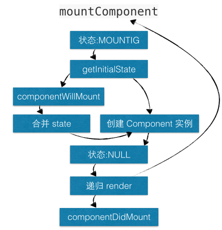
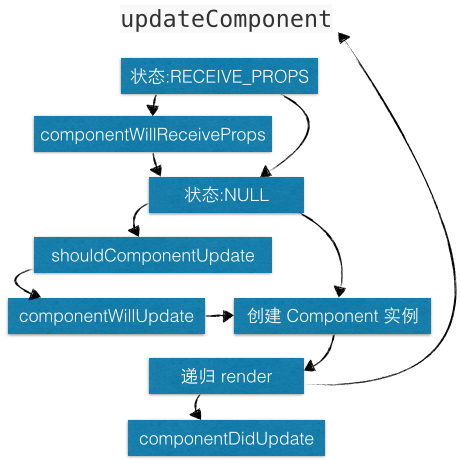
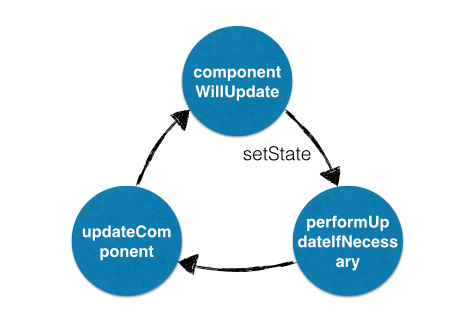

[参考一](https://juejin.im/post/5a062fb551882535cd4a4ce3)

[参考二](https://juejin.im/post/5aca20c96fb9a028d700e1ce)

[参考三](https://zhuanlan.zhihu.com/p/20312691)


**组建的生命周期在不同状态下的执行顺序**

- 当首次装载组件时，按顺序执行 getDefaultProps、getInitialState、componentWillMount、render 和 componentDidMount；
- 当卸载组件时，执行 componentWillUnmount；
- 当重新装载组件时，此时按顺序执行 getInitialState、componentWillMount、render 和 componentDidMount，但并不执行 getDefaultProps；
- 当再次渲染组件时，组件接受到更新状态，此时按顺序执行 componentWillReceiveProps、shouldComponentUpdate、componentWillUpdate、render 和 componentDidUpda

> 自定义组件的状态主要通过三种状态进行管理。mounting，receive_props, unmounting。它们负责通知组件当前所处的状态，应该执行生命周期中的哪个步骤，是否可以更新 state。三个状态对应三种方法，分别为：*mountComponent*、*updateComponent*、*unmountComponent*，每个方法都提供了两种处理方法，will 方法在进入状态之前调用，did 方法在进入状态之后调用，三种状态三种方法五种处理方法，此外还提供两种特殊状态的处理方法。

#### create创建自定义组件

> creatClass创建自定义组件的入口方法，负责管理生命周期中的getDefaultProps，getDefalutprops方法只执行一次，所有实例初始化的props都会共享，通过creatClass创建自定义组件，利用原型继承ReactCompositeComponentBase父类，按顺序合并mixins，设置初始化defaultProps,创建元素ReactElement。

```js
// ReactCompositeComponent 的基类
var ReactCompositeComponentBase = function() {};

// 将 Mixin 合并到 ReactCompositeComponentBase 的原型上
assign(
  ReactCompositeComponentBase.prototype,
  ReactComponent.Mixin,
  ReactOwner.Mixin,
  ReactPropTransferer.Mixin,
  ReactCompositeComponentMixin
);

var ReactCompositeComponent = {
  LifeCycle: CompositeLifeCycle,
  Base: ReactCompositeComponentBase,

  // 创建组件
  createClass: function(spec) {
    // 构造函数
    var Constructor = function(props, context) {
      this.props = props;
      this.context = context;
      this.state = null;
      var initialState = this.getInitialState ? this.getInitialState() : null;
      this.state = initialState;
    };

    // 原型继承父类
    Constructor.prototype = new ReactCompositeComponentBase();
    Constructor.prototype.constructor = Constructor;

    // 合并 mixins
    injectedMixins.forEach(
      mixSpecIntoComponent.bind(null, Constructor)
    );
    mixSpecIntoComponent(Constructor, spec);

    // mixins 合并后装载 defaultProps (React整个生命周期中 getDefaultProps 只执行一次)
    if (Constructor.getDefaultProps) {
      Constructor.defaultProps = Constructor.getDefaultProps();
    }

    for (var methodName in ReactCompositeComponentInterface) {
      if (!Constructor.prototype[methodName]) {
        Constructor.prototype[methodName] = null;
      }
    }

    return ReactElement.createFactory(Constructor);
  }
}
```
#### MOUNTING

> mountComponent负责管理生命周期的getInitialState,componentWillMount,render,componentWillDidMount.

> 由于getDefaultProps是通过Constructor进行管理，因此也是整个生命周期最早执行的，而mountComponent不包含这个过程，因此也就无法调用，所以只执行一次getDefaultProps

> 由于ReactCompositeComponentBase返回的是一个虚拟节点，还需要instantiateReactComponent来得到实例，在使用mountComponent拿到结果作为当前自定义元素的结果

> 首先通过mountComponent装载组件，此时，将状态设置为MOUNTING，利用getInitialState获取初始化state，初始化更新队列。

> 若存在componentWillMount,则执行；如果此时调用setState,不会进行render，而是进行合并（react异步渲染后应该会造成重新渲染）

> 到此时，已经完成MOUNTING工作，将状态更改为null，同时state将进行更新操作，此时在render中可以获取到state

> mountComponent 本质上是通过 **递归渲染** 内容的，由于递归的特性，父组件的 componentWillMount 一定在其子组件的 componentWillMount 之前调用，而父组件的 componentDidMount 肯定在其子组件的 componentDidMount 之后调用。



> instantiateReactComponent 通过判断元素类型（类型包括：object、string、function）创建元素实例，

总结一下，在刚开始，ReactCompositeComponentBase返回的是一个虚拟节点，需要instantiateReactComponent去得到实例，在这之后mountComponent装载组件的时候将状态设置为mounting，利用getinitialState获取初始化state，初始化更新队列，随后调用componentWillMount和componentDidMount;在这个更新过程中实际上是一个递归，这就保证了父子组件先是父的willMount和最后是父的DidMount;

```js
// 装载组件
mountComponent: function(rootID, transaction, mountDepth) {
  // 当前状态为 MOUNTING
  this._compositeLifeCycleState = CompositeLifeCycle.MOUNTING;

  // 当前元素对应的上下文
  this.context = this._processContext(this._currentElement._context);

  // 当前元素对应的 props
  this.props = this._processProps(this.props);

  // 获取初始化 state
  this.state = this.getInitialState();

  // 初始化更新队列
  this._pendingState = null;
  this._pendingForceUpdate = false;

  // componentWillMount 调用setstate，不会触发rerender而是自动提前合并
  if (this.componentWillMount) {
    this.componentWillMount();
    if (this._pendingState) {
      this.state = this._pendingState;
      this._pendingState = null;
    }
  }

  // 得到 _currentElement 对应的 component 类实例
  this._renderedComponent = instantiateReactComponent(
    this._renderValidatedComponent(),
    this._currentElement.type
  );

  // 完成 MOUNTING，更新 state
  this._compositeLifeCycleState = null;

  // render 递归渲染
  var markup = this._renderedComponent.mountComponent(
    rootID,
    transaction,
    mountDepth + 1
  );

  // 如果存在 this.componentDidMount，则渲染完成后触发
  if (this.componentDidMount) {
    transaction.getReactMountReady().enqueue(this.componentDidMount, this);
  }

  return markup;
}
```


#### RECEIVE__PROPS

> updateComponent负责管理生命周期中的`componentWillReceiveProps`,`shouldComponentUpdate`,`componentWillUpdate`,`render`,`componentDidUpdate`

- 首先通过updateComponent更新组件，如果前后元素不一致需要进行组件更新，将状态设置为RECEIVING__PROPS，
- 若存在componentWillReceiveProps则执行，如果此时存在setstate不进行更新，而是进行合并（同样在新版本的React中会存在问题）
- 此时，已经完成了RECEIVING__PROPS，更新状态为null，同时也将进行state的更新操作，此时已经可以拿到新的state

> 注意：此时 this.state 虽然获取到更新数据，但只能在内部源码中使用，我们在开发时，若在 componentWillReceiveProps 中调用 setState，那么在 componentWillReceiveProps、shouldComponentUpdate 和 componentWillUpdate 中还是无法获取到更新后的 this.state，即此时访问的this.state 仍然是未更新的数据，只有在 render 和 componentDidUpdate 中才能获取到更新后的this.state。

- 调用`shouldComponentUpdate`判断是否进行组件更新，
- 如果存在`componentWillUpdate`，则执行
- `updateComponent`和`mountComponent`同理，也是递归调用，同样可以做到父组件的 componentWillUpdate 一定在其子组件的 componentWillUpdate 之前调用，而父组件的 componentDidUpdate 肯定在其子组件 componentDidUpdate 之后调用。
- 最后存在`componentDidUpdate`则执行



> 注意：禁止在 **shouldComponentUpdate** 和 **componentWillUpdate** 中调用 setState，会造成循环调用，直至耗光浏览器内存后崩溃

```js
// 更新组件
updateComponent: function(transaction, prevParentElement, nextParentElement) {
  var prevContext = this.context;
  var prevProps = this.props;
  var nextContext = prevContext;
  var nextProps = prevProps;

  if (prevParentElement !== nextParentElement) {
    nextContext = this._processContext(nextParentElement._context);
    nextProps = this._processProps(nextParentElement.props);
    // 当前状态为 RECEIVING_PROPS
    this._compositeLifeCycleState = CompositeLifeCycle.RECEIVING_PROPS;

    // 如果存在 componentWillReceiveProps，则执行
    if (this.componentWillReceiveProps) {
      this.componentWillReceiveProps(nextProps, nextContext);
    }
  }

  // 设置状态为 null，更新 state
  this._compositeLifeCycleState = null;
  var nextState = this._pendingState || this.state;
  this._pendingState = null;
  var shouldUpdate =
    this._pendingForceUpdate ||
    !this.shouldComponentUpdate ||
    this.shouldComponentUpdate(nextProps, nextState, nextContext);
  if (!shouldUpdate) {
    // 如果确定组件不更新，仍然要设置 props 和 state
    this._currentElement = nextParentElement;
    this.props = nextProps;
    this.state = nextState;
    this.context = nextContext;
    this._owner = nextParentElement._owner;
    return;
  }
  this._pendingForceUpdate = false;

  ......

  // 如果存在 componentWillUpdate，则触发
  if (this.componentWillUpdate) {
    this.componentWillUpdate(nextProps, nextState, nextContext);
  }

  // render 递归渲染
  var nextMarkup = this._renderedComponent.mountComponent(
    thisID,
    transaction,
    this._mountDepth + 1
  );

  // 如果存在 componentDidUpdate，则触发
  if (this.componentDidUpdate) {
    transaction.getReactMountReady().enqueue(
      this.componentDidUpdate.bind(this, prevProps, prevState, prevContext),
      this
    );
  }
}
```


#### UNMOUNTING

> `unmountComponent`负责管理生命周期中的componentWillUnmount

- 首先将状态设置为`unmounting`，
- 若存在`componentWillUnmount`则执行，如果此时存在`setstate`，不会触发`render`，
- 完成之后更新状态为NULL。完成组件卸载工作。

```js
// 卸载组件
unmountComponent: function() {
  // 设置状态为 UNMOUNTING
  this._compositeLifeCycleState = CompositeLifeCycle.UNMOUNTING;

  // 如果存在 componentWillUnmount，则触发
  if (this.componentWillUnmount) {
    this.componentWillUnmount();
  }

  // 更新状态为 null
  this._compositeLifeCycleState = null;
  this._renderedComponent.unmountComponent();
  this._renderedComponent = null;

  ReactComponent.Mixin.unmountComponent.call(this);
}
```


#### setState更新机制

当调用 setState 时，会对 state 以及 _pendingState 更新队列进行合并操作，但其实真正更新 state 的幕后黑手是*replaceState*。

replaceState 会先判断当前状态是否为 **MOUNTING**，如果不是即会调用 ReactUpdates.enqueueUpdate 执行更新。

当状态不为MOUNTING或者RECEIVE__PROPS，performUpdateIfNecessary 会获取 _pendingElement、_pendingState、_pendingForceUpdate，并调用 updateComponent 进行组件更新。

如果在 shouldComponentUpdate 或 componentWillUpdate 中调用 setState，此时的状态已经从 **RECEIVING_PROPS -> NULL**，则 performUpdateIfNecessary 就会调用 updateComponent 进行组件更新，但 updateComponent 又会调用 shouldComponentUpdate 和 componentWillUpdate，因此造成循环调用，使得浏览器内存占满后崩溃。



```js
// 更新 state
setState: function(partialState, callback) {
  // 合并 _pendingState
  this.replaceState(
    assign({}, this._pendingState || this.state, partialState),
    callback
  );
},

// 更新 state
replaceState: function(completeState, callback) {
  validateLifeCycleOnReplaceState(this);

  // 更新队列
  this._pendingState = completeState;

  // 判断状态是否为 MOUNTING，如果不是，即可执行更新
  if (this._compositeLifeCycleState !== CompositeLifeCycle.MOUNTING) {
    ReactUpdates.enqueueUpdate(this, callback);
  }
},

// 如果存在 _pendingElement、_pendingState、_pendingForceUpdate，则更新组件
performUpdateIfNecessary: function(transaction) {
  var compositeLifeCycleState = this._compositeLifeCycleState;

  // 当状态为 MOUNTING 或 RECEIVING_PROPS时，则不更新
  if (compositeLifeCycleState === CompositeLifeCycle.MOUNTING ||
      compositeLifeCycleState === CompositeLifeCycle.RECEIVING_PROPS) {
    return;
  }

  var prevElement = this._currentElement;
  var nextElement = prevElement;
  if (this._pendingElement != null) {
    nextElement = this._pendingElement;
    this._pendingElement = null;
  }

  // 调用 updateComponent
  this.updateComponent(
    transaction,
    prevElement,
    nextElement
  );
}
```


### 总结

- React通过三种状态**MOUNTING**，**RECEIVE__PROPS**, **UNMOUNTING**来管理生命周期；
- **setstate**更新的时候会先进行合并，不会直接render，因此是异步操作，真正更新的操作是`replaceState`,并且需要根据所处的状态来控制render的时机。
- 不建议在 *getDefaultProps、getInitialState、shouldComponentUpdate、componentWillUpdate、render 和 componentWillUnmount* 中调用 setState，特别注意：不能在 *shouldComponentUpdate 和 componentWillUpdate*中调用 setState，会导致循环调用。


#### 反模式

在 getInitialState 方法中，尝试通过 this.props 来创建 state 的做法是一种反模式。

```js
//反模式
getDefaultProps: function(){
    return {
        data: new Date()
    }
},
getInitialState: function(){
    return {
        day: this.props.date - new Date()
    }
},
render: function(){
    return <div>Day:{this.state.day}</div>
}
```

经过计算后的值不应该赋给 state，正确的模式应该是在渲染时计算这些值。这样保证了计算后的值永远不会与派生出它的 props 值不同步。

```js
//正确模式
getDefaultProps: function(){
    return {
        data: new Date()
    }
},
render: function(){
    var day = this.props.date - new Date();
    return <div>Day:{day}</div>
}
```

如果只是简单的初始化 state，那么应用反模式是没有问题的。


#### 新增生命周期

去掉了

- componentWillMount
- componentWillReceiveProps
- componentWillUpdate

新增

- static getDerivedStateFromProps
- getSnapshotBeforeUpdate

##### 原因

react打算在17版本推出新的Async Rendering，提出一种可被打断的生命周期，而可以被打断的阶段正是实际dom挂载之前的虚拟dom构建阶段，也就是要被去掉的三个生命周期。

生命周期一旦被打断，下次恢复的时候又会再跑一次之前的生命周期，因此componentWillMount，componentWillReceiveProps， componentWillUpdate都不能保证只在挂载/拿到props/状态变化的时候刷新一次了，所以这三个方法被标记为不安全。

`static getDerivedStateFromProps`

触发时间： 

- 当组件每次render时，包括在组件挂载之后（虚拟dom之后，挂载实际dom之前），每次获取新的props和state之后。

- 每次接收一个新的props之后都会返回一个新的state，返回null则说明不需要更新state。

- 配合componentDidUpdate，可以覆盖componentWillReceiveProps的所有用法

`getSnapshotBeforeUpdate`

触发时间

- update发生的时候，在render之后，在组件dom渲染之前。
- 返回一个值，作为`componentDidUpdate`的第三个参数。
- 配合componentDidUpdate, 可以覆盖componentWillUpdate的所有用法。

#### 建议用法总结

1. 初始化state — Initializing state

   - 在constructor初始化state就可以了

2. 请求数据 — Fetching external data

   - 在componentDidMount请求异步加载的数据
   - 有一种错觉，在componentWillMount请求的数据在render就能拿到，但其实render在willMount之后几乎是马上就被调用，根本等不到数据回来，同样需要render一次“加载中”的空数据状态，所以在didMount去取数据几乎不会产生影响。

3. 添加事件监听 — Adding event listeners (or subscriptions)

   - 在componentDidMount中添加加事件监听
   - react只能保证componentDidMount-componentWillUnmount成对出现，componentWillMount可以被打断或调用多次，因此无法保证事件监听能在unmount的时候被成功卸载，可能会引起内存泄露

4. 根据props更新state — Updating state based on props

   - 用getDerivedStateFromProps(nextProps, prevState), 将传入的props更新到state上
   - 用来代替componentWillReceiveProps(nextProps, nextState)，willReceiveProps经常被误用，导致了一些问题，因此该方法将不被推荐使用。
   - getDerivedStateFromProps是一个static方法，意味着拿不到实例的this，所以想要在setState之前比对一下props有没有更新，下面方法是不能用了

   ```js
    if (this.props.currentRow !== nextProps.currentRow) {
    	...
    }
   ```

   取而代之的是，额外写一个state来记录上一个props (` ^ ‘)

   ```js
   if (nextProps.currentRow !== prevState.lastRow) {
     return {
       ...
       lastRow: nextProps.currentRow,
     };
     // 不更新state
     return null
   }
   ```

   - 为什么我们不给一个prevProps参数呢，官方解释是，一来prevProps第一次被调用的时候是null，每次更新都要判断耗性能，二来如果大家都习惯了，以后react不记录prevProps的话（啥），可以省下不少内存

5. 触发请求 — Invoking external callbacks

   - 在生命周期中由于state的变化触发请求，在componentDidUpdate中进行
   - 为什么不在componentWillUpdate中的理由同上2

6. props更新引起的副作用 — Side effects on props change

   - props更改引发的可视变化（副作用,比如log,ga），在componentDidUpdate中处理

   ```js
   // 在didUpdate中根据props更新的确很不适应
   // props变了也是可以触发update的
   componentDidUpdate(prevProps, prevState) {
   	if (this.props.isVisible !== prevProps.isVisible) {
   	  logVisibleChange(this.props.isVisible);
   	}
   }
   ```

   - componentWillUpdate, componentWillReceiveProps在一次更新中可能会被触发多次，因此这种只希望触发一次的副作用应该放在保证只触发一次的componentDidUpdate中。

7. props更新时重新请求 — Fetching external data when props change

   - 传入新的props时重新异步取数据，getDerivedStateFromProps+ componentDidUpdate 替代 componentWillReceiveProps

   ```js
   // old
     componentWillReceiveProps(nextProps) {
       if (nextProps.id !== this.props.id) {
       	this.setState({externalData: null});
         this._loadAsyncData(nextProps.id);
       }
     }
   ```

   ```js
   // new
     static getDerivedStateFromProps(nextProps, prevState) {
       // Store prevId in state so we can compare when props change.
       if (nextProps.id !== prevState.prevId) {
         return {
           externalData: null,
           prevId: nextProps.id,
         };
       }
       // No state update necessary
       return null;
     }
     componentDidUpdate(prevProps, prevState) {
       if (this.state.externalData === null) {
         this._loadAsyncData(this.props.id);
       }
     }
   复制代码
   ```

8. 在更新前记录原来的dom节点属性 — Reading DOM properties before an update

   - 在upate之前获取dom节点，getSnapshotBeforeUpdate(prevProps, prevState)代替componentWillUpdate(nextProps, nextState)
   - getSnapshotBeforeUpdate在render之后，但在节点挂载前
   - componentDidUpdate(prevProps, prevState, snapshot)直接获得getSnapshotBeforeUpdate返回的dom属性值

