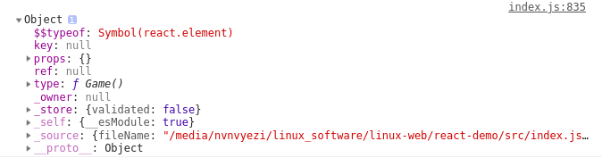
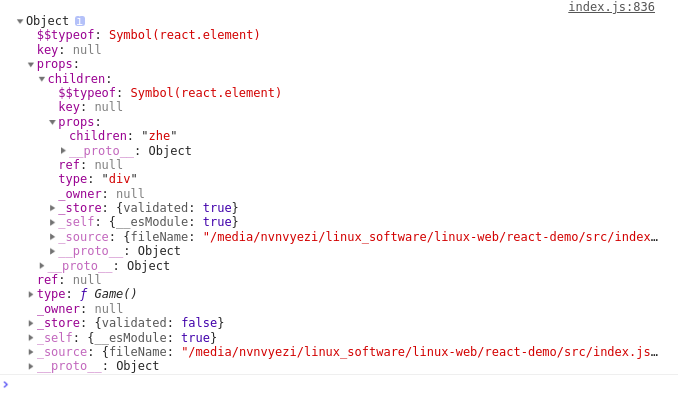
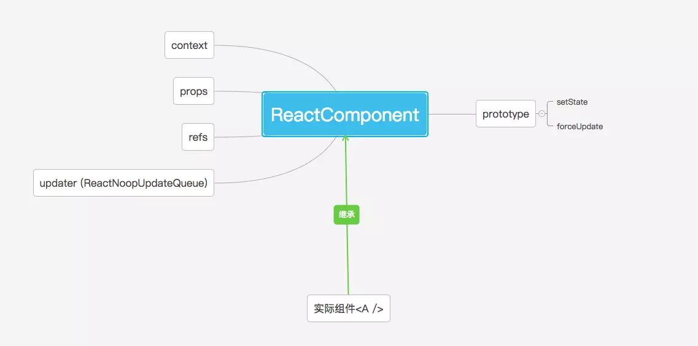
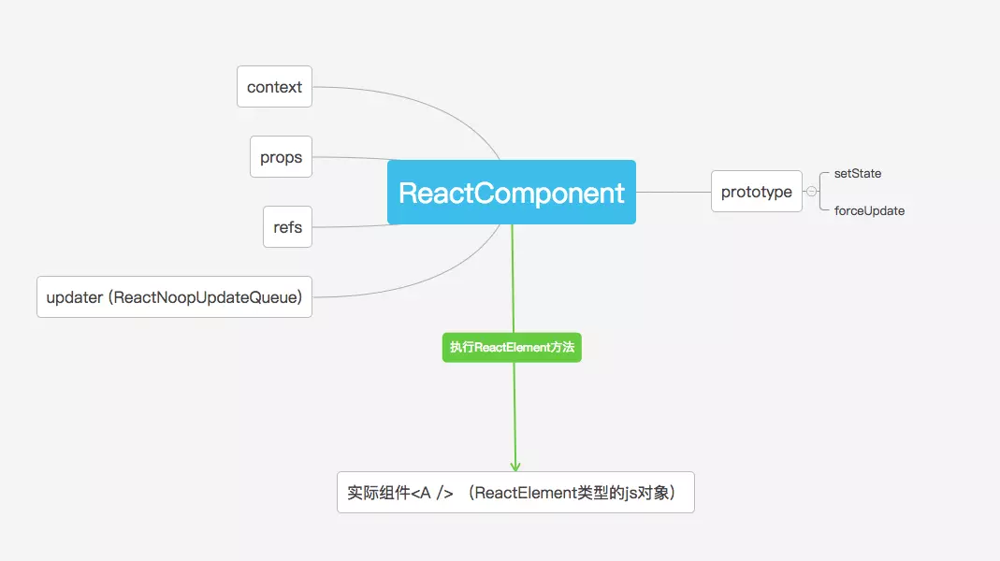
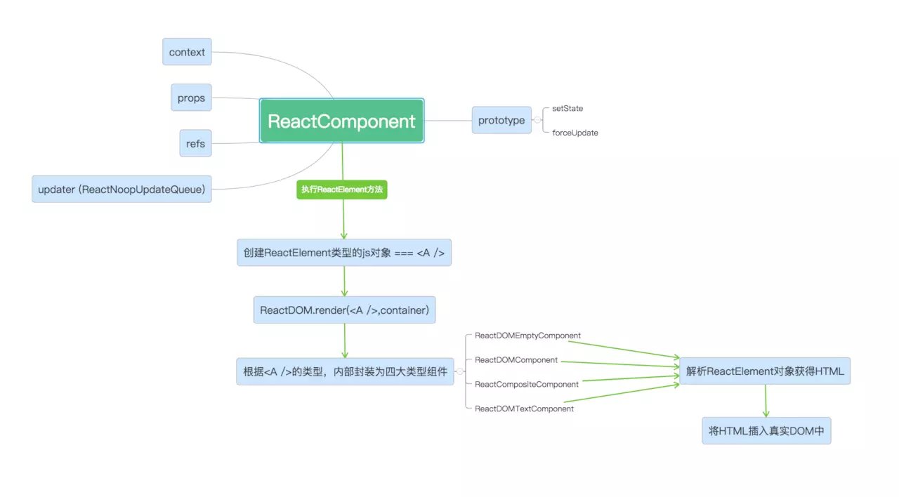

[原文地址1](https://juejin.im/post/5983dfbcf265da3e2f7f32de)

[render](https://juejin.im/post/5b4afa526fb9a04fd34387b0)

先了解组件在react中以什么形式出现

```jsx
class Game extends React.Component {
  constructor(props) {
    super(props);
    this.state = {};
  }
  componentDidMount = () => {}
  render () {
    return (
      <div>这是A</div>
    )
  }
}
console.log(<Game></Game>);
```



此时props为空

```jsx
console.log(<Game><div>zhe</div></Game>)
```



首先我们查看React.js

```js
import {Component, PureComponent} from './ReactBaseClasses';
const React = {
  //提供处理this.props.children的方法
  Children: {
    map: mapChildren,
    forEach: forEachChildren,
    count: countChildren,
    toArray: toArray,
    only: onlyChild
  },
  //...
 	//不同的类型组件
  Component: Component,
  PureComponent: PureComponent,
	//...
  //生成组件
  createElement: createElementWithValidation,
  cloneElement: cloneElementWithValidation,
  createFactory: createFactoryWithValidation,
  //判断组件
  isValidElement: isValidElement,
  //function isValidElement(object) {
  	//return typeof object === 'object' && object !== null && object.$$typeof === REACT_ELEMENT_TYPE;
	//}
}
```

我们会发现在实际`import React from 'react'`时实际上引用的是这个React对象。

引一下一个文章的

> 源码中明明使用的`module.exports`而不是`export default`，为什么还能够成功引入呢？其实这是babel解析器的功劳。它令`(ES6)import === (CommonJS)require`。而在typescript中，需要严格的`export default`声明，故在typescript下就不能使用`import React from 'react'`了，有兴趣的读者可以尝试一下。

在16.6.1已经改为了

```js
export default React
```

- 我们可以写`extends Component`也可以写`extends React.Component`，这两者是否存在区别呢？答案是否定的。因为`Component`是`React.Component`的引用。也就是说`Component === React.Component`，在实际项目中写哪个都可以。

接着继续看Componet

```js
//Component
function Component(props, context, updater) {
  this.props = props;
  this.context = context;
  // If a component has string refs, we will assign a different object later.
  //如果一个组件参字符串,稍后我们将分配一个不同的对象。
  this.refs = emptyObject;
  // We initialize the default updater but the real one gets injected by the renderer.我们初始化默认更新但真正被渲染器注入。
  this.updater = updater || ReactNoopUpdateQueue;
}
//PureCOmponent
function PureComponent(props, context, updater) {
  this.props = props;
  this.context = context;
  // If a component has string refs, we will assign a different object later.
  this.refs = emptyObject;
  this.updater = updater || ReactNoopUpdateQueue;
}
```

在这里我们发现Component的原型上有setstate和forceUpdate方法，可以移步setstate文章详细看。

```js
Component.prototype.setState = function(partialState, callback) {
  invariant(
    typeof partialState === 'object' ||
      typeof partialState === 'function' ||
      partialState == null,
    'setState(...): takes an object of state variables to update or a ' +
      'function which returns an object of state variables.',
  );
  this.updater.enqueueSetState(this, partialState, callback, 'setState');
};
```

```js
/**
 * Forces an update. This should only be invoked when it is known with
 * certainty that we are **not** in a DOM transaction.
 *  部署一个更新。只有当明确知道我们不在DOM事务中时，才应该调用它。
 * You may want to call this when you know that some deeper aspect of the
 * component's state has changed but `setState` was not called.
 *  当您知道组件状态的某些更深层的方面发生了更改，但是没有调用setState时，您可能想要调用它。
 * This will not invoke `shouldComponentUpdate`, but it will invoke
 * `componentWillUpdate` and `componentDidUpdate`.
 *  这不会调用' shouldComponentUpdate '，但它会调用 ‘componentWillUpdate’和‘componentDidUpdate’。
 * @param {?function} callback Called after update is complete.
 * @final
 * @protected
 */
Component.prototype.forceUpdate = function(callback) {
  this.updater.enqueueForceUpdate(this, callback, 'forceUpdate');
};
//应该是在没有setstate但是组件需要更新的情况下使用,传递一个回调在更新后执行
```

在上面我们会发现Component和PureComponent是一样的代码，那怎么区分呢，

```js
//定义了一个辅助组件，让辅助组件的原型指向Component的原型
function ComponentDummy() {}
ComponentDummy.prototype = Component.prototype;
//辅助组件构造器ComponentDummy实例化出来一个对象pureComponentPrototype，然后把这个对象的constructor属性又指向了PureComponent，因此PureComponent也成为了一个构造器，也就是上面的第二种组件基类
var pureComponentPrototype = PureComponent.prototype = new ComponentDummy();
pureComponentPrototype.constructor = PureComponent;
// Avoid an extra prototype jump for these methods.
// 避免对这些方法进行额外的原型跳转。原型和自身上都有这个属性
_assign(pureComponentPrototype, Component.prototype);
pureComponentPrototype.isPureReactComponent = true;
```




我们会发现声明的组件其实是集成Component实例，在这上面有四个属性，`props`,`context`,`refs`,`updater`，以及原型上的两个方法`setstate`, `forceUpdate`

#### 组件的初始化

声明A后，我们可以在其内部自定义方法，也可以使用生命周期的方法，如`ComponentDidMount`等等，这些和我们在写"类"的时候是完全一样的。唯一不同的是组件类必须拥有`render`方法输出类似`<div>这是A组件</div>`的结构并挂载到真实DOM上，才能触发组件的生命周期并成为DOM树的一部分。首先我们观察ES6的"类"是如何初始化一个react组件的。

将最初的示例代码放入babel中：

```js
var Game = function (_React$Component) {
  _inherits(Game, _React$Component);

  function Game(props) {
    _classCallCheck(this, Game);

    var _this = _possibleConstructorReturn(this, (Game.__proto__ || Object.getPrototypeOf(Game)).call(this, props));

    _this.componentDidMount = function () {};

    _this.state = {};
    return _this;
  }

  _createClass(Game, [{
    key: "render",
    value: function render() {
      return React.createElement(
        "div",
        null,
        "\u8FD9\u662FA"
      );
    }
  }]);

  return Game;
}(React.Component);
```

参数`_React$Component`就是对象`Component`，我的理解是通过`_inherits`给Game来组件继承Component，我们发现在`_creatClass`中`render`的时候实际调用了`React.creatElement`。

在`createElement`中会发现调用了`ReactElement`

```js
  return ReactElement(
    type,
    key,
    ref,
    self,
    source,
    ReactCurrentOwner.current,
    props,
  );
```

```js
/**
 * Factory method to create a new React element. This no longer adheres to
 * the class pattern, so do not use new to call it. Also, no instanceof check
 * will work. Instead test $$typeof field against Symbol.for('react.element') to check
 * if something is a React Element.
 *  工厂方法来创建一个新的React元素。这不再符合类模式，所以不要使用new来调用它。此外，没有实例检查将工作。相反，要针对符号.for('反应物. Element ')测试字段的类型，以检查某个元素是否是反应元素。
 * @param {*} type
 * @param {*} key
 * @param {string|object} ref
 * @param {*} self A *temporary* helper to detect places where `this` is
 * different from the `owner` when React.createElement is called, so that we
 * can warn. We want to get rid of owner and replace string `ref`s with arrow
 * functions, and as long as `this` and owner are the same, there will be no
 * change in behavior.一个“临时”助手，用来检测“this”在哪里不同于“主人”的反应。调用createElement，以便我们可以发出警告。我们想去掉owner，用箭头函数替换string ' ref '，只要' this '和owner一样，行为就不会改变。
 * @param {*} source An annotation object (added by a transpiler or otherwise)
 * indicating filename, line number, and/or other information.指示文件名、行号和/或其他信息的注释对象(由编译器或其他方法添加)。
 * @param {*} owner
 * @param {*} props
 * @internal
 */
const ReactElement = function(type, key, ref, self, source, owner, props) {
  const element = {
    // This tag allows us to uniquely identify this as a React Element
    // 这个标记允许我们唯一地将其标识为React元素
    $$typeof: REACT_ELEMENT_TYPE,

    // Built-in properties that belong on the element
    // 属于元素的内置属性
    type: type,
    key: key,
    ref: ref,
    props: props,

    // Record the component responsible for creating this element.
    // 记录负责创建此元素的组件。
    _owner: owner,
  };

  if (__DEV__) {
    // The validation flag is currently mutative. We put it on
    // an external backing store so that we can freeze the whole object.
    // This can be replaced with a WeakMap once they are implemented in
    // commonly used development environments.
    // 验证标志目前是可变的。我们把它放在一个外部备份存储上，这样我们就可以冻结整个对象。一旦在常用的开发环境中实现了这些功能，就可以用WeakMap替换它们。
    element._store = {};

    // To make comparing ReactElements easier for testing purposes, we make
    // the validation flag non-enumerable (where possible, which should
    // include every environment we run tests in), so the test framework
    // ignores it.
    // 为了使比较反应物元素更容易用于测试目的，我们使验证标志不可枚举(如果可能的话，应该包括我们运行测试的每个环境)，因此测试框架忽略了它。
    Object.defineProperty(element._store, 'validated', {
      configurable: false,
      enumerable: false,
      writable: true,
      value: false,
    });
    // self and source are DEV only properties.
    // self和source仅是DEV属性。
    Object.defineProperty(element, '_self', {
      configurable: false,
      enumerable: false,
      writable: false,
      value: self,
    });
    // Two elements created in two different places should be considered
    // equal for testing purposes and therefore we hide it from enumeration.
    // 在两个不同的位置创建的两个元素在测试目的上应该被认为是相等的，因此我们对枚举隐藏它。
    Object.defineProperty(element, '_source', {
      configurable: false,
      enumerable: false,
      writable: false,
      value: source,
    });
    if (Object.freeze) {
      Object.freeze(element.props);
      Object.freeze(element);
    }
  }

  return element;
};
```

看到这里我们发现，其实每一个组件对象都是通过`React.createElement`方法创建出来的`ReactElement`类型的对象。换句话说，`ReactElment`是一种内部记录组件特征并告诉React你想在屏幕上看到什么的对象。 在`ReactElement`中:

| 参数       | 功能                                                         |
| ---------- | ------------------------------------------------------------ |
| `$$typeof` | [组件的标识信息](https://link.juejin.im?target=https%3A%2F%2Fgithub.com%2Ffacebook%2Freact%2Fpull%2F4832) |
| `type`     | 类型                                                         |
| `key`      | DOM结构标识，提升update性能                                  |
| `props`    | 子结构相关信息(有则增加`children`字段/没有为空)和组件属性(如`style`) |
| `ref`      | 真实DOM的引用                                                |
| `_owner`   | `_owner` === `ReactCurrentOwner.current`(ReactCurrentOwner.js),值为创建当前组件的对象，默认值为null。 |

总结一下，在创建组件的时候，`createElement`传递三个参数，要创建的元素类型，配置对象（比如ref等），元素的children，在`createElement`中处理完以后，返回给`ReactElement`， `type`，`key`， `ref`，`self`，`source`，`ReactCurrentOwner.current`,`props`，`Reactelement`执行完后返回的js对象`element`就是React组件（虚拟dom），也就是上面控制台输出的东西。即我们通过`class`关键字声明React组件,那么他们在解析成真实DOM之前一直是`ReactElement`类型的js对象。



总结一下就是，我们在创建组件的时候实际上是先继承了React.Component的属性和方法，在随后通过`createElement` ，`ReactElement` 创建出虚拟dom，我们会发现创建出来的是一个不可修改的对象，在源码会发现就是因为`Object.freeze`将创建的对象冻结了。

### 组件的挂载

**总结**



心累

#### render

render实际调用了

```js
render(
    element: React$Element<any>,
    container: DOMContainer,
    callback: ?Function,
  ) {
    return legacyRenderSubtreeIntoContainer(
      null,  /* 父组件 */
      element,  /* React元素 */
      container,  /* DOM容器 */
      false,
      callback,
    );
  }
```

在`legacyRenderSubtreeIntoContainer`函数中

```js
function legacyRenderSubtreeIntoContainer(parentComponent, children, container, forceHydrate, callback) {
	...
	// Initial mount 获取到React根容器
  root = container._reactRootContainer = legacyCreateRootFromDOMContainer(container, forceHydrate);
}
```

通过legacyCreateRootFromDOMContainer最终得到的React根容器对象：

```js
const NoWork = 0;

{
    _internalRoot: {
      current: uninitializedFiber,  // null
      containerInfo: containerInfo,  //  DOM容器
      pendingChildren: null,

      earliestPendingTime: NoWork,
      latestPendingTime: NoWork,
      earliestSuspendedTime: NoWork,
      latestSuspendedTime: NoWork,
      latestPingedTime: NoWork,

      didError: false,

      pendingCommitExpirationTime: NoWork,
      finishedWork: null,
      context: null,
      pendingContext: null,
      hydrate,
      nextExpirationTimeToWorkOn: NoWork,
      expirationTime: NoWork,
      firstBatch: null,
      nextScheduledRoot: null,
    },
    render: (children: ReactNodeList, callback: ?() => mixed) => Work,
    legacy_renderSubtreeIntoContainer: (
      parentComponent: ?React$Component<any, any>,
      children: ReactNodeList,
      callback: ?() => mixed
    ) => Work,
    createBatch: () => Batch
}
```

在初始化React根容器对象root后，调用root.render开始虚拟DOM的渲染过程。

```js
// Initial mount should not be batched.
    // 初始安装不应分批处理。
//root是new ReactRooot的值
    DOMRenderer.unbatchedUpdates(function () {
      if (parentComponent != null) {
        root.legacy_renderSubtreeIntoContainer(parentComponent, children, callback);
      } else {
        root.render(children, callback);
      }
    });
// TODO: Batching should be implemented at the renderer level, not inside
  // the reconciler.
  // 批处理应该在呈现程序级别实现，而不是在协调程序内部。
  function unbatchedUpdates(fn, a) {
    if (isBatchingUpdates && !isUnbatchingUpdates) {
      isUnbatchingUpdates = true;
      try {
        return fn(a);
      } finally {
        isUnbatchingUpdates = false;
      }
    }
    return fn(a);
  }
```

在root.render中调用`DOMRenderer.updateContainer`

```js
ReactRoot.prototype.render = function (children, callback) {
  var root = this._internalRoot;
  var work = new ReactWork();
  callback = callback === undefined ? null : callback;
  {
    warnOnInvalidCallback(callback, 'render');
  }
  if (callback !== null) {
    work.then(callback);
  }
  DOMRenderer.updateContainer(children, root, null, work._onCommit);
  return work;
};
```

```js
updateContainer: function (element, container, parentComponent, callback) {
	var current = container.current;
  //重新计算当前时间
	var currentTime = recalculateCurrentTime();
  //计算纤维的过期时间
	var expirationTime = computeExpirationForFiber(current);
  //在过期时更新容器
	return updateContainerAtExpirationTime(element, container, parentComponent, currentTime, expirationTime, callback);
},
updateContainerAtExpirationTime: function (element, container, parentComponent, expirationTime, callback) {
      var currentTime = recalculateCurrentTime();
      return updateContainerAtExpirationTime(element, container, parentComponent, currentTime, expirationTime, callback);
},
//随后依次调用
scheduleRootUpdate(current, element, currentTime, expirationTime, callback)
//进行调度
scheduleWork(current, expirationTime);
requestWork(root, expirationTime);
//在这个里面判断是同步还是异步，异步的话会判断fiber是否还有时间
performWorkOnRoot(root, Sync, false);
// 先判断是从以前的工作恢复的还是新的，新的话重置栈，并创建WorkInprogress,在之后进入work loop，在完成工作的时候，回到主线程，如果没有执行完，记住这个状态，回到主线程，等待下次执行。
renderRoot(root, expirationTime, isAsync)
//会判断是否在批处理中，如果在并且被阻塞，则应该等到下一次更新的时候
completeRoot(root, finishedWork, expirationTime)
//在这里会涉及生命周期的调用
commitRoot(finishedWork) 
```

总结一下：在render开始调用的时候，先获取到根容器并初始化之后，开始进行虚拟dom的渲染过程，判断是否在一次批处理过程中，不是的话新开一个批处理，之后开始处理传进来的回调，处理之后开始进入虚拟dom建立阶段。首先获取当前时间和fiber的预留时间。在这之后进入调度，执行调度的过程，完了之后会判断是否更新以及生命周期的调用。