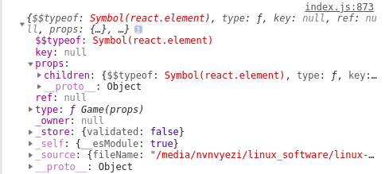

先来看虚拟dom是个什么东西


我们发现上面用对象的方式表现了我们的dom结构

下来看这个是怎么生成的

我们知道react将组件分成了4种

- ReactEmptyComponent
- ReactTextComponent
- ReactDOMComponent
- ReactCompositeComponent

而我们通过class创建的也就是最经常用的就是`ReactCompositeComponent`。在我们手动使用class的时候，实际上我们继承的是`Component`或者`PureComponent`，

我们先看`Component`

```js
//Base class helpers for the updating state of a component.
//用于组件更新状态的基类助手。
function Component(props, context, updater) {
  this.props = props;
  this.context = context;
  // If a component has string refs, we will assign a different object later.
  // 如果组件具有字符串refs，我们稍后将分配一个不同的对象。
  this.refs = emptyObject;
  // We initialize the default updater but the real one gets injected by the
  // renderer.
  // 我们初始化了默认的更新器，但是真正的更新器是由渲染器注入的。
  this.updater = updater || ReactNoopUpdateQueue;
}
```

在Component的原型上有

```js
Component.prototype.isReactComponent = {};

/**
 * Sets a subset of the state. Always use this to mutate
 * state. You should treat `this.state` as immutable.
 *
 * There is no guarantee that `this.state` will be immediately updated, so
 * accessing `this.state` after calling this method may return the old value.
 *
 * There is no guarantee that calls to `setState` will run synchronously,
 * as they may eventually be batched together.  You can provide an optional
 * callback that will be executed when the call to setState is actually
 * completed.
 *
 * When a function is provided to setState, it will be called at some point in
 * the future (not synchronously). It will be called with the up to date
 * component arguments (state, props, context). These values can be different
 * from this.* because your function may be called after receiveProps but before
 * shouldComponentUpdate, and this new state, props, and context will not yet be
 * assigned to this.
 *上面的意思就是说设置state的状态应该使用setstate方法，并且这个方法不保证同步，
 
 * @param {object|function} partialState Next partial state or function to produce next partial state to be merged with current state.
 	下一个部分状态或函数，以生成下一个部分状态并与当前状态合并。
 * @param {?function} callback Called after state is updated.
 * @final
 * @protected
 */
Component.prototype.setState = function (partialState, callback) {
  //setState(…):获取要更新的状态变量对象或返回状态变量对象的函数。
  !(typeof partialState === 'object' || typeof partialState === 'function' || partialState == null) ? invariant(false, 'setState(...): takes an object of state variables to update or a function which returns an object of state variables.') : void 0;
  this.updater.enqueueSetState(this, partialState, callback, 'setState');
};

/**
 * Forces an update. This should only be invoked when it is known with
 * certainty that we are **not** in a DOM transaction.
 *
 * You may want to call this when you know that some deeper aspect of the
 * component's state has changed but `setState` was not called.
 *
 * This will not invoke `shouldComponentUpdate`, but it will invoke
 * `componentWillUpdate` and `componentDidUpdate`.
 *	部署一个更新。只有当明确知道我们不在DOM事务中时，才应该调用它。当您知道组件状态的某些更深层的方面发生了更改，但是没有调用setState时，您可能想要调用它。这不会调用' shouldComponentUpdate '，但它会调用' componentWillUpdate '和' componentDidUpdate '。
 * @param {?function} callback Called after update is complete.
 * @final
 * @protected
 */
Component.prototype.forceUpdate = function (callback) {
  this.updater.enqueueForceUpdate(this, callback, 'forceUpdate');
};
```

`PureComponent`

```js
function ComponentDummy() {}
ComponentDummy.prototype = Component.prototype;

/**
 * Convenience component with default shallow equality check for sCU.
 */
function PureComponent(props, context, updater) {
  this.props = props;
  this.context = context;
  // If a component has string refs, we will assign a different object later.
  this.refs = emptyObject;
  this.updater = updater || ReactNoopUpdateQueue;
}

var pureComponentPrototype = PureComponent.prototype = new ComponentDummy();
pureComponentPrototype.constructor = PureComponent;
// Avoid an extra prototype jump for these methods.避免对这些方法进行额外的原型跳转。
_assign(pureComponentPrototype, Component.prototype);
pureComponentPrototype.isPureReactComponent = true;
```

从上面我们发现setstate这些方法都是继承自`Component`，并且`PureComponent`的构造函数和`Component`是一模一样的，在原型上面共享了`Component`的，并且加了判断是哪种类型

在创建组件的时候会发现实际调用的是`createElement`，但是在react源码中还做了一层

```js
// 创建带有验证的元素
function createElementWithValidation(type, props, children) {
  // 检测type是否是有效的元素类型
  var validType = isValidElementType(type);

  // We warn in this case but don't throw. We expect the element creation to
  // succeed and there will likely be errors in render.
  // 在这种情况下我们警告，但不要投掷。我们希望元素创建成功，渲染中可能会出现错误。即判断组件是否有效
  if (!validType) {
    var info = '';
    if (type === undefined || typeof type === 'object' && type !== null && Object.keys(type).length === 0) {
      // 您可能忘记从文件' + '中导出组件，或者您可能混淆了默认导入和命名导入
      info += ' You likely forgot to export your component from the file ' + "it's defined in, or you might have mixed up default and named imports.";
    }
		// 获取源信息错误附录,获取错误的地方，例子Check your code at index.js:873."
    var sourceInfo = getSourceInfoErrorAddendum(props);
    if (sourceInfo) {
      info += sourceInfo;
    } else {
      info += getDeclarationErrorAddendum();
    }

    var typeString = void 0;
    if (type === null) {
      typeString = 'null';
    } else if (Array.isArray(type)) {
      typeString = 'array';
    } else if (type !== undefined && type.$$typeof === REACT_ELEMENT_TYPE) {
      typeString = '<' + (getComponentName(type.type) || 'Unknown') + ' />';
      info = ' Did you accidentally export a JSX literal instead of a component?';
    } else {
      typeString = typeof type;
    }

    warning$1(false, 'React.createElement: type is invalid -- expected a string (for ' + 'built-in components) or a class/function (for composite ' + 'components) but got: %s.%s', typeString, info);
  }

  var element = createElement.apply(this, arguments);

  // The result can be nullish if a mock or a custom function is used.
  // TODO: Drop this when these are no longer allowed as the type argument.
  // 如果使用了mock或自定义函数，则结果可能为空。TODO:当不再允许这些参数作为类型参数时删除它。
  if (element == null) {
    return element;
  }

  // Skip key warning if the type isn't valid since our key validation logic
  // doesn't expect a non-string/function type and can throw confusing errors.
  // We don't want exception behavior to differ between dev and prod.
  // (Rendering will throw with a helpful message and as soon as the type is
  // fixed, the key warnings will appear.)
  // 如果类型无效，则跳过键警告，因为我们的键验证逻辑不期望非字符串/函数类型，并可能抛出令人困惑的错误。我们不希望在dev和prod之间出现异常行为(呈现会抛出有用的消息，一旦类型被修复，就会出现关键警告)。
  if (validType) {
    for (var i = 2; i < arguments.length; i++) {
      validateChildKeys(arguments[i], type);
    }
  }

  if (type === REACT_FRAGMENT_TYPE) {
    validateFragmentProps(element);
  } else {
    validatePropTypes(element);
  }

  return element;
}
```

接下来看`ReactElement`

```js
/**
 * Create and return a new ReactElement of the given type.
 		创建并返回一个新的ReactElement给定的类型。
 * See https://reactjs.org/docs/react-api.html#createelement
 */
//参数分别是组件的类型，配置比如refs，class等，和组件的children
function createElement(type, config, children) {
  var propName = void 0;

  // Reserved names are extracted
 	// 提取保留名称
  
  var props = {};

  var key = null;
  var ref = null;
  var self = null;
  var source = null;

  if (config != null) {
    //判断config上面是否有ref，并且ref是有效的
    if (hasValidRef(config)) {
      ref = config.ref;
    }
    //判断config上面是否有key，并且key是有效的
    if (hasValidKey(config)) {
      key = '' + config.key;
    }

    self = config.__self === undefined ? null : config.__self;
    source = config.__source === undefined ? null : config.__source;
    // Remaining properties are added to a new props object
    // 剩余的属性被添加到一个新的道具对象中
    for (propName in config) {
      if (hasOwnProperty.call(config, propName) && !RESERVED_PROPS.hasOwnProperty(propName)) {
        props[propName] = config[propName];
      }
    }
  }

  // Children can be more than one argument, and those are transferred onto
  // the newly allocated props object.
  // 子参数可以是多个参数，这些参数被转移到新分配的props对象上。
  var childrenLength = arguments.length - 2;
  if (childrenLength === 1) {
    props.children = children;
  } else if (childrenLength > 1) {
    var childArray = Array(childrenLength);
    for (var i = 0; i < childrenLength; i++) {
      childArray[i] = arguments[i + 2];
    }
    {
      if (Object.freeze) {
        Object.freeze(childArray);
      }
    }
    props.children = childArray;
  }

  // Resolve default props
  // 分解defaultprops
  if (type && type.defaultProps) {
    var defaultProps = type.defaultProps;
    for (propName in defaultProps) {
      if (props[propName] === undefined) {
        props[propName] = defaultProps[propName];
      }
    }
  }
  {
    if (key || ref) {
      var displayName = typeof type === 'function' ? type.displayName || type.name || 'Unknown' : type;
      if (key) {
        // 定义key为只读，不能像其他的props一样可以传递给子组件,如果需要传递，则应该在设置另外一个值进行传递
        defineKeyPropWarningGetter(props, displayName);
      }
      if (ref) {
        //定义ref为只读，不能访问
        defineRefPropWarningGetter(props, displayName);
      }
    }
  }
  return ReactElement(type, key, ref, self, source, ReactCurrentOwner.current, props);
}
```

在最后将处理的值给`ReactElement`，

```js
var ReactElement = function (type, key, ref, self, source, owner, props) {
  //创建组件一些基本的属性
  var element = {
    // This tag allows us to uniquely identify this as a React Element
    // 这个标记允许我们唯一地将其标识为React元素
    $$typeof: REACT_ELEMENT_TYPE,

    // Built-in properties that belong on the element
    // 属于元素的内置属性
    type: type,
    key: key,
    ref: ref,
    props: props,

    // Record the component responsible for creating this element.
    // 记录负责创建此元素的组件。
    _owner: owner
  };

  {
    // The validation flag is currently mutative. We put it on
    // an external backing store so that we can freeze the whole object.
    // This can be replaced with a WeakMap once they are implemented in
    // commonly used development environments.
    // 验证标志目前是可变的。我们把它放在一个外部备份存储上，这样我们就可以冻结整个对象。一旦在常用的开发环境中实现了这些功能，就可以用WeakMap替换它们。
    element._store = {};

    // To make comparing ReactElements easier for testing purposes, we make
    // the validation flag non-enumerable (where possible, which should
    // include every environment we run tests in), so the test framework
    // ignores it.
    // 为了使比较反应物元素更容易用于测试目的，我们使验证标志不可枚举(如果可能的话，应该包括我们运行测试的每个环境)，因此测试框架忽略了它。
    Object.defineProperty(element._store, 'validated', {
      configurable: false,
      enumerable: false,
      writable: true,
      value: false
    });
    // self and source are DEV only properties.
    // self和source仅是DEV属性。
    
    Object.defineProperty(element, '_self', {
      configurable: false,
      enumerable: false,
      writable: false,
      value: self
    });
    // Two elements created in two different places should be considered
    // equal for testing purposes and therefore we hide it from enumeration.
    // 在两个不同的位置创建的两个元素在测试目的上应该被认为是相等的，因此我们对枚举隐藏它。
    Object.defineProperty(element, '_source', {
      configurable: false,
      enumerable: false,
      writable: false,
      value: source
    });
    if (Object.freeze) {
      Object.freeze(element.props);
      Object.freeze(element);
    }
  }

  return element;
};
```

再来一张图，可以结合着看，`$$typeof`,`key`, `props`,	`ref`,  `_owner_`也就是上面我们的element，

- key 代表元素唯一id值, 意味着只要id改变, 就算前后元素种类相同, 元素也肯定不一样了;
- type 代表元素种类,  有 function(空的wrapper)、class(自定义类)、string(具体的DOM元素名称)类型, 与key一样, 只要改变, 元素肯定不一样;
- props 是元素的属性, 任何写在标签上的属性(如className='container')都会被存在这里, 如果这个元素有子元素(包括文本内容), props就会有children属性, 存储子元素; children属性是递归插入、递归更新的依据;




> react虚拟dom的话实际就是用js对象来描述dom结构，在我们创建一个class组件的时候，实际上创建的是一个ReactcompositeComponent组件，我们每次写的时候都会写extends React。Component，实际就是继承React的component或者PureComponent，在Component里面就有我们的props，refs，context等，而PureComponent和COmponent的构造函数是一样的，不一样的是他借助了一个辅助函数继承了Component的原型，并且使自己也成为了一个构造函数，在实际创建组件的时候，实际上是使用了createElement，在这个之前辉县判断type是否有效，在他的内部，对我们在组件上写的key，refs等进行一个处理，比如判断key是否有效，以及设置key不可被当做props传给下面，随后将这这些属性传给ReactElement，在Reactelement中创建我们一开始看的那种对象，我们都知道props是不可变的，其实就是字Reactelement中使用了freeze，使对象无法修改，并且无法添加新的属性，也无法删除属性，并且无法修改属性的值。

