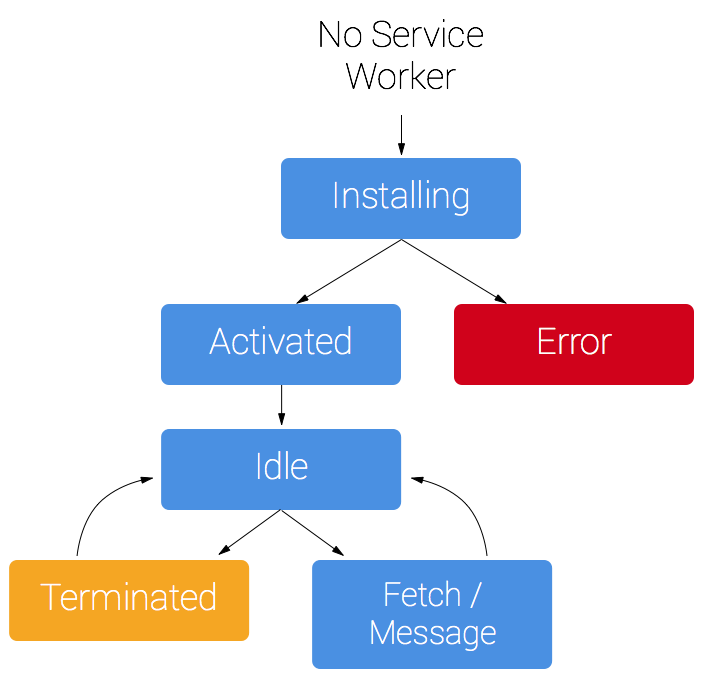

参考： https://developers.google.com/web/fundamentals/primers/service-workers/

### 介绍

浏览器一般有三个web Worker

Dedicated Worker: 专用的Worker, 只能被创建他的js访问,随着页面关闭而结束

Shared Worker: 共享的Worker, 可以被同一域名下的JS访问,关联的页面都关闭时结束

Service Worker: 事件驱动的Worker, 生命周期与页面无关,

专有线程和共享线程解决耗时的JS影响UI相应,Service Worker 则是为解决“Web App 的用户体验不如 Native App”的普遍问题而提供的一系列技术集合，必然部分处理逻辑会牵扯到 UI 线程，从而在启动 service worker 的时候，UI 线程的繁忙也会影响其启动性能。

Service workers 本质上充当Web应用程序与浏览器之间的代理服务器，也可以在网络可用时作为浏览器和网络间的代理。它们旨在（除其他之外）使得能够创建有效的离线体验，拦截网络请求并基于网络是否可用以及更新的资源是否驻留在服务器上来采取适当的动作。他们还允许访问推送通知和后台同步API。

### 功能

- 丰富的离线体验

- 消息推送通知

- 管理资源缓存

- 网络请求

### 注意事项

- 是一种javascript worker， 无法直接访问dom，通过postMessage接口发送的消息来与其控制的页面进行通信，页面可在必要时对Dom执行操作
- 是一种可编程网络代理，能够控制页面发送网络请求的处理方式
- 在不用时会被终止，并在下次有需要时重启，能依赖 Service Worker `onfetch` 和 `onmessage` 处理程序中的全局状态。 如果存在您需要持续保存并在重启后加以重用的信息，Service Worker 可以访问 [IndexedDB API](https://developer.mozilla.org/en-US/docs/Web/API/IndexedDB_API)。
- 广泛的利用了promise。

###启动流程

1. 触发启动流程---在访问含有Service Worker的HTML文档时,在发起文档请求之前,会先派发一个fetch事件,这个事件会触发service worker的启动流程

2. 分派进程(多进程模式)/ 线程(单进程模式)---过程中由于频繁的Ul与IO交换,存在一定性能开销

3. 加载service worker.js文件---分配线程之后,继续执行service worker的加载流程,分两次,先去加载空白影子文档,再去加载service worker.js

4. 启动service worker线程---文件加载完之后会触发service worker的启动流程,过程中主要包括创建ServiceWorkerGlobalScope,初始化上下文和执行js代码

5. 回调通知启动完成---通知ServiceWorkerVersion

   **启动流程复杂带来的性能消耗**

   - 分派线程或进程过程中,有频繁的不同类型线程转换,过程中如果UI线程繁忙,将会非常耗时
   - 加载service worker.js文件,首次加载需要创建https连接并等待服务器响应,非常耗时,非首次可以读缓存
   - 手机锁屏开屏的场景下，浏览器大部分内存都会被清除，会极大的影响缓存读取以及对象创建的时间

   Google 官方文档《[Speed up Service Worker with Navigation Preloads](https://link.zhihu.com/?target=https%3A//developers.google.com/web/updates/2017/02/navigation-preload)》提到：Service worker 的启动时间与用户设备条件有关，在 PC 上一般为 50ms，手机上大概为 250ms。在极端的场景下，如低端手机且 CPU 压力较大时，可能会超出 500ms。Chromium 团队已尝试使用多种方式来减少 service worker 的启动时间， 比如：

   - 使用 V8 Code Cache（using code-caching in V8 [https://v8project.blogspot.hk/2015/07/code-caching.html](https://link.zhihu.com/?target=https%3A//v8project.blogspot.hk/2015/07/code-caching.html)）。
   - 在没有注册监听 Fetch 事件的页面允许先发网络请求（skipping service workers that don't have a fetch event [605844 - Optimization when no fetch handler is registered - chromium - Monorail](https://link.zhihu.com/?target=https%3A//bugs.chromium.org/p/chromium/issues/detail%3Fid%3D605844)）。
   - 在特定情境下（比如 mouse / touch 事件）， 预先启动 service worker（launching service workers speculatively [Issue 2045153003: Speculatively launch Service Workers on mouse/touch events. [4/5\]](https://link.zhihu.com/?target=https%3A//codereview.chromium.org/2045153003)）。
   - 使用 Navigation Preloads [https://www.chromestatus.com/feature/5734842339688448](https://link.zhihu.com/?target=https%3A//www.chromestatus.com/feature/5734842339688448) 技术， 允许 Fetch 请求在 service worker 还未启动完成时就可发出， 从而减少启动时间对总体性能的影响。
   - 从我们的测试数据来看，service worker 线程的启动耗时一般在 100-300ms，与 Chromium 官方的数据相近。所以我们能够得出一个大概的推论，service worker 线程的启动是有较大成本的，一般在 100-300ms。

###生命周期

> sw的生命周期完全独立于网页
>
> 为网站安装服务工作线程，需要先在页面的js中注册，注册服务工作线程将会导致浏览器在后台启动服务工作线程安装步骤。
>
> 在开发过程中，可以通过`localhost`使用sw，在线上部署需要`https`，
>
> 在安装过程中，您通常需要缓存某些静态资产。 如果所有文件均已成功缓存，那么 Service Worker 就安装完毕。 如果任何文件下载失败或缓存失败，那么安装步骤将会失败，Service Worker 就无法激活（也就是说， 不会安装）。 如果发生这种情况，不必担心，它下次会再试一次。 但这意味着，如果安装完成，您可以知道您已在缓存中获得那些静态资产。
>
> 安装之后，接下来就是激活步骤，这是管理旧缓存的绝佳机会。
>
> 激活之后，Service Worker 将会对其作用域内的所有页面实施控制，不过，首次注册该 Service Worker 的页面需要再次加载才会受其控制。 服务工作线程实施控制后，它将处于以下两种状态之一：服务工作线程终止以节省内存，或处理获取和消息事件，从页面发出网络请求或消息后将会出现后一种状态。

**注册sw**

延迟至页面加载完成后再进新注册。不争用首次访问所需要的加载资源。防止影响用户的首次访问，或者产生卡顿

注册成功后，每次页面加载无误时，即可调用 `register()`；浏览器将会判断服务工作线程是否已注册并做出相应的处理。

> register() 会根据工作线程文件所在的目录来定义自己的作用域，比如文件处于test文件夹下，则sw中只能看到网址以/test开头(/test/page1)的fetch事件

简化的生命周期

**目的**

- 实现离线优先

- 允许新的sw自行做好运行准备，无需中断当前的sw

- 确保整个页面中由一个sw在控制

  https://developers.google.com/web/fundamentals/primers/service-workers/lifecycle

#### 1. Parsed

我们通过`navigator.serviceWorker.register('/sw.js')`注册sw。

注意传入的路径（路径相对于html文件），当浏览器执行到这里的时候，就会到相应的路径下载该文件，然后对该脚本进行解析，如果下载或者解析失败，那么这个SW就会被舍弃。如果解析成功了，那就到了parsed状态。可以进行下面的工作了。

#### 2. Installing

在installing状态中，SW 脚本中的 **install** 事件被执行。在能够控制客户端之前，install 事件让我们有机会缓存我们需要的所有内容。

比如，我们可以先缓存一张图片，那么当SW控制客户端之后，客户点击该链接的图片，我们就可以用SW捕获请求，直接返回该图片的缓存。

若事件中有 event.waitUntil() 方法，则 installing 事件会一直等到该方法中的 Promise 完成之后才会成功；若 Promise 被拒，则安装失败，Service Worker 直接进入废弃（redundant）状态。

#### 3. Installed / Waiting

如果安装成功，Service Worker 进入installed（waiting）状态。在此状态中，它是一个有效的但尚未激活的 worker。它**尚未纳入 document 的控制**，确切来说是在等待着从当前 worker 接手。

处于 Waiting 状态的 SW，在以下之一的情况下，会被触发 Activating 状态。

- 当前已无激活状态的 worker
- SW 脚本中的 self.skipWaiting() 方法被调用
- 用户已关闭 SW作用域下的所有页面，从而释放了此前处于激活态的 worker
- 超出指定时间，从而释放此前处于激活态的 worker

#### 4. Activating

处于 activating 状态期间，SW 脚本中的 **activate** 事件被执行。我们通常在 activate 事件中，清理 cache 中的文件（清除旧Worker的缓存文件）。

SW激活失败，则直接进入废弃（redundant）状态。

#### 5. Activated

如果激活成功，SW 进入激活状态。在此状态中，SW开始接管控制客户端，并可以处理`fetch`（捕捉请求）、 `push`（消息推送）、 `sync`（同步事件）等功能性事件

#### 6. Redundant 废弃

Service Worker 可能以下之一的原因而被废弃（redundant）——

- installing 事件失败
- activating 事件失败
- 新的 Service Worker 替换其成为激活态 worker

**注意事项**：

1.service worker运行在它们自己的完全独立异步的全局上下文中，也就是说它们有自己的容器。

2.service worker没有直接操作DOM的权限，但是可以通过postMessage方法来与Web页面通信，让页面操作DOM。

3.service worker是一个可编程的网络代理，允许开发者控制页面上处理的网络请求。

4.浏览器可能随时回收service worker，在不被使用的时候，它会自己终止，而当它再次被用到的时候，会被重新激活。

5.service worker的生命周期是由事件驱动的而不是通过Client。