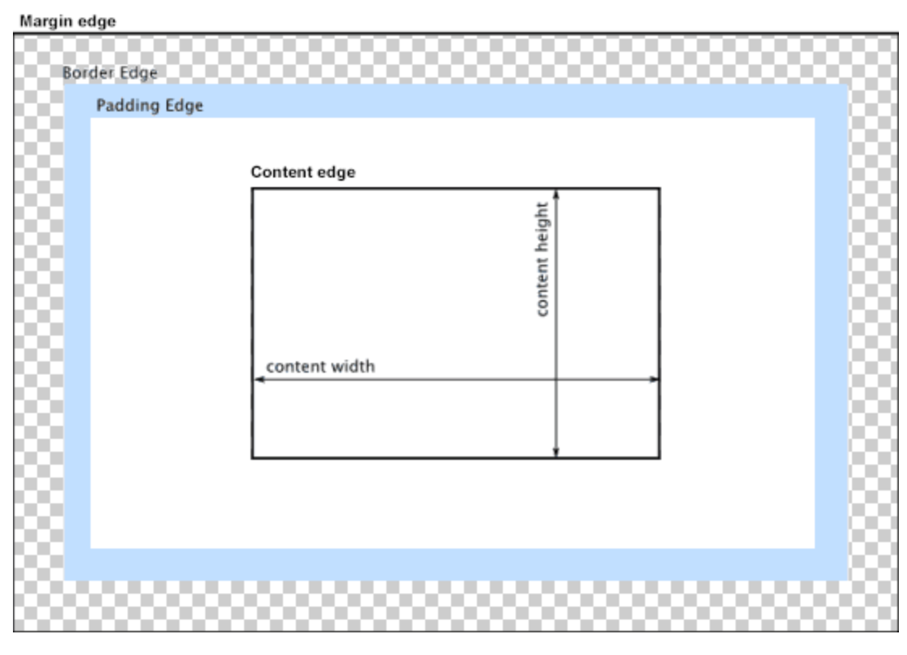

每个盒子由四个部分（或称*区域*）组成，其效用由它们各自的边界（Edge）所定义（原文：defined by their respective edges，可能意指容纳、包含、限制等）。如图，与盒子的四个组成区域相对应，每个盒子有四个边界：*内容边界* *Content edge*、*内边距边界* *Padding Edge*、*边框边界* *Border Edge*、*外边框边界* *Margin Edge*。

### 内容区域

由内容边界限制，容纳着元素的“真实”内容，例如文本、图像，或是一个视频播放器。它的尺寸为内容宽度（或称 *content-box 宽度*）和内容高度（或称 *content-box 高度*）。它通常含有一个背景颜色（默认颜色为透明）或背景图像。

### 内边距区域

由内边距边界限制，扩展自内容区域，负责延伸内容区域的背景，填充元素中内容与边框的间距。它的尺寸是 *padding-box 宽度* 和 *padding-box 高度*。

### 边框区域

由边框边界限制，扩展自内边距区域，是容纳边框的区域。其尺寸为 *border-box  宽度* 和 *border-box 高度*。

### 外边距区域

由外边距边界限制，用空白区域扩展边框区域，以分开相邻的元素。它的尺寸为 *margin-box 宽度* 和 *margin-box 高度*。

### TODO

除[可替换元素](https://developer.mozilla.org/zh-CN/docs/Web/CSS/Replaced_element)外，对于行内元素来说，尽管内容周围存在内边距与边框，但其占用空间（每一行文字的高度）则由 [`line-height`](https://developer.mozilla.org/zh-CN/docs/Web/CSS/line-height) 属性决定，即使边框和内边距仍会显示在内容周围。

### 标准盒模型(W3C)

`margin+border+padding+content,width=content`

### 怪异盒模型(IE)

`width=border+padding+content`

盒子所占的位置：content+左右padding+左右border+左右margin

盒子的实际高度：所占位置减去margin

### 切换

`box-sizing`

