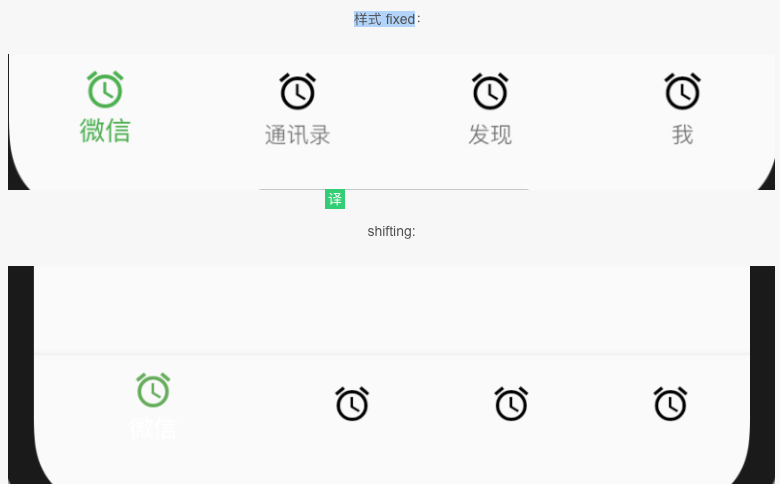

#### Text

一个单一样式的文本

“ [文本”](https://docs.flutter.io/flutter/widgets/Text-class.html)小组件显示单个样式的文本字符串。字符串可能会跨越多行，也可能全部显示在同一行上，具体取决于布局约束。

该[风格](https://docs.flutter.io/flutter/widgets/Text/style.html)参数可选。省略时，文本将使用最接近的[DefaultTextStyle中](https://docs.flutter.io/flutter/widgets/DefaultTextStyle-class.html)的样式。如果给定样式的[TextStyle.inherit](https://docs.flutter.io/flutter/painting/TextStyle/inherit.html)属性为true（默认值），则给定样式将与最接近的[DefaultTextStyle](https://docs.flutter.io/flutter/widgets/DefaultTextStyle-class.html)合并

####  TextSpan

不可变得文本范围（一行内多个Text）

一个[TextSpan](https://docs.flutter.io/flutter/painting/TextSpan-class.html)对象可以使用其设置样式[风格](https://docs.flutter.io/flutter/painting/TextSpan/style.html)特性。该样式将应用于[文本](https://docs.flutter.io/flutter/painting/TextSpan/text.html)和[子项](https://docs.flutter.io/flutter/painting/TextSpan/children.html)。

一个[TextSpan](https://docs.flutter.io/flutter/painting/TextSpan-class.html)对象可以只纯文本，也可以有孩子[TextSpan](https://docs.flutter.io/flutter/painting/TextSpan-class.html)对象与自己的风格，（可能只是部分）覆盖[风格](https://docs.flutter.io/flutter/painting/TextSpan/style.html)这个对象的。如果 [TextSpan](https://docs.flutter.io/flutter/painting/TextSpan-class.html)同时包含[文本](https://docs.flutter.io/flutter/painting/TextSpan/text.html)和[子项](https://docs.flutter.io/flutter/painting/TextSpan/children.html)，则会将[文本](https://docs.flutter.io/flutter/painting/TextSpan/text.html)视为[子项](https://docs.flutter.io/flutter/painting/TextSpan/children.html)列表开头的 无样式[TextSpan](https://docs.flutter.io/flutter/painting/TextSpan-class.html)。

要在[Canvas](https://docs.flutter.io/flutter/dart-ui/Canvas-class.html)上绘制[TextSpan](https://docs.flutter.io/flutter/painting/TextSpan-class.html)，请使用[TextPainter](https://docs.flutter.io/flutter/painting/TextPainter-class.html)。要在窗口小部件中显示文本范围，请使用[RichText](https://docs.flutter.io/flutter/widgets/RichText-class.html)。对于具有单一样式的[文本](https://docs.flutter.io/flutter/widgets/Text-class.html)，请考虑使用“ [文本”](https://docs.flutter.io/flutter/widgets/Text-class.html)小部件。

#### BottomNavigationBar

显示在应用程序底部的材料窗口小部件，用于在少量视图中进行选择，通常在三到五之间。

[文档](https://docs.flutter.io/flutter/material/BottomNavigationBar-class.html)

[例子](https://blog.csdn.net/yuzhiqiang_1993/article/details/88118902)

BottomNavigationBar 底部导航控件

|          属性           |                        说明                        |
| :---------------------: | :------------------------------------------------: |
| BottomNavigationBarItem |                    多个 item，                     |
|        iconSize         |                      icon大小                      |
|      currentIndex       |                   默认选中第几个                   |
|          onTap          |                    选中变化回调                    |
|       fixedColor        | type=BottomNavigationBarType.fixed时选中字体的颜色 |
|          type           |           |


### 记录

#### 改变顶部颜色

```dart
theme: new ThemeData(
  primaryColor: Color(ThemeColor)
),
```

### 路由

### 声命周期


大致可以看成三个阶段

- 初始化（插入渲染树）
- 状态改变（在渲染树中存在）
- 销毁（从渲染树种移除）

#### 构造函数

这个函数不属于生命周期，因为这个时候State的widget属性为空，如果要在构造函数中访问widget的属性是行不通的。但是构造函数必然是要第一个调用的。

#### initState

当插入渲染树的时候调用，这个函数在生命周期中只调用一次。这里可以做一些初始化工作，比如初始化State的变量。

### 文本输入

[文档](https://flutterchina.club/text-input/)