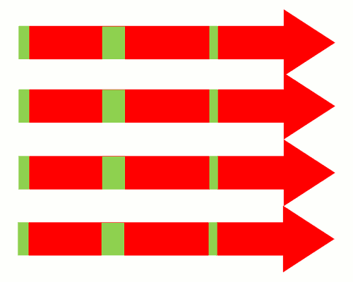

```js
setTimeout(function() {  
  console.log(1)  
}, 0);  
new Promise(function executor(resolve) {  
  console.log(2);  
  for( var i=0 ; i<10000 ; i++ ) {  
	i == 9999 && resolve();  
  }  
  console.log(3);  
}).then(function() {  
  console.log(4);  
});  
console.log(5);  

//2,3,5,4,1
```


> 运行以后的程序叫做"进程"（process），一般情况下，一个进程一次只能执行一个任务。

**执行很多任务**
**（１）排队：**　因为一个进程一次只能执行一个任务，只好等前面的任务执行完了，才能执行后面的任务．
**（２）新建进程：　**使用ｆｏｒｋ命令，　为每个任务新建一个进程
**（３）新建线程：　**因为进程太耗费资源，所以如今的程序往往允许一个进程包含多个线程，由线程去完成任务．

###**js(单线程)采用第一种方式．**

**如果某个任务很耗时，比如涉及很多I/O（输入/输出）操作，那么线程的运行大概是下面的样子。**


> 由于I/O操作很慢，所以这个线程的大部分运行时间都在空等I/O操作的返回结果。这种运行方式称为"同步模式"（synchronous I/O）或"堵塞模式"（blocking I/O）。
>

**如果采用多线程，同时运行多个任务，那很可能就是下面这样**



> 上图表明，多线程不仅占用多倍的系统资源，也闲置多倍的资源，这显然不合理。
>

###**引入ＥｖｅｎｔＬｏｏｐ**

**ＥｖｅｎｔＬｏｏｐ是一个程序结构，用于等待和发送消息和事件**

> 简单说，就是在程序中设置两个线程：一个负责程序本身的运行，称为"主线程"；另一个负责主线程与其他进程（主要是各种I/O操作）的通信，被称为"Event Loop线程"（可以译为"消息线程"）。


> 上图主线程的绿色部分，还是表示运行时间，而橙色部分表示空闲时间。每当遇到I/O的时候，主线程就让Event Loop线程去通知相应的I/O程序，然后接着往后运行，所以不存在红色的等待时间。等到I/O程序完成操作，Event Loop线程再把结果返回主线程。主线程就调用事先设定的回调函数，完成整个任务。

> 可以看到，由于多出了橙色的空闲时间，所以主线程得以运行更多的任务，这就提高了效率。这种运行方式称为"异步模式"（asynchronous I/O）或"非堵塞模式"（non-blocking mode）。

> 这正是JavaScript语言的运行方式。单线程模型虽然对JavaScript构成了很大的限制，但也因此使它具备了其他语言不具备的优势。如果部署得好，JavaScript程序是不会出现堵塞的，这就是为什么node.js平台可以用很少的资源，应付大流量访问的原因。

[阮一峰Event Loop](http://www.ruanyifeng.com/blog/2013/10/event_loop.html)

###**JavaAcript引擎**


>
> 由于JavaScript引擎同一时间只执行一段代码（这是由JavaScript单线程的性质决定的），所以每个JS代码块阻塞了其它异步事件的进行。这意味着当一个异步事件（像鼠标点击、计时器、Ajax）发生时，这些事件的回调函数将排在队列后面等待执行（如何排队完全取决于各浏览器，而我们可以忽视它们内部差异，作一个简化处理）。 
>

> 我们首先从第一个JS代码块开始，有两个计时器被初始化：一个10ms的setTimeout和一个10ms的setInterval.观察计时器初始化位置，（计时器初始化完毕后就会开始计时），发现setTimeout计时器的回调实际上会在第一个代码块执行完毕前被触发。但是这里注意的是，它不会立即执行（单线程不能这样做）。实际上，触发的回调将被排成一个队列，等待下一个可执行时间。

> 此外，在第一个JS代码块，我们发现一个鼠标点击事件被触发。这个鼠标点击JS回调被绑定在异步队列上（我们从来不知道用户什么时候执行这个操作，所以它被认为是异步的）且不能马上执行。像初始化的计时器一样,排队等待执行。

> 执行完初始化JS代码块后，浏览器就有个疑问：谁在等待执行？此时，鼠标点击回调和setTimeout计时器的回调都在等待。浏览器将选一个（鼠标点击事件）并立马执行。而计时器的回调将等待下一合适时机执行。

> 注意，鼠标点击事件执行过程中，interval的回调第一次被触发，与setTimeout的回调一样，排队等待执行。随着时间推移，等到setTimeout计时器的回调执行时候，setInterval的回调再次被触发，这次被触发的回调将被抛弃。如果一大段代码块正在执行，所有的setInterval的回调都将要排队，一旦大段代码块执行完毕，这些一连串的setInterval的回调相互间将被无延迟地执行。实际上，浏览器处理setInterval被触发的回调排队等待执行时，除非队列中setInterval回调为空，才允许新的setInterval的回调加入。

> 我们发现，setInterval的第一个被触发的回调执行时，setInterval的回调又被触发且排到队列。这向我们传达一个重要的消息：setInterval不关心目前JS正在执行的内容，setInterval的被触发的回调都将会无差别地排队。

> 最后，当setInterval的回调执行两次后，我们发现没有javascript引擎要执行东西。这意味着浏览器将等待着一个新的异步事件发生。我们知道，在50ms时候，setInterval的回调再次被触发，但这次并没有东西阻塞，所以回调就立马执行了。

> 在浏览器中，JavaScript引擎是基于事件驱动的，这里的事件可看作是浏览器派给它的各种任务，这些任务可能源自当前执行的代码块，如调用setTimeout()，也可能来自浏览器内核，如onload()、onclick()、onmouseover()、setTimeOut()、setInterval()、Ajax等。如果从代码的角度来看，所谓的任务实体就是各种回调函数，由于“单线程”的原因，这些任务会进行排队，一个接着一个等待着被引擎处理

**JavaScript引擎线程和其它侦听线程**

上图中，定时器和事件都按时触发了，这表明JavaScript引擎的线程和计时器触发线程、事件触发线程是三个单独的线程，即使JavaScript引擎的线程被阻塞，其它两个触发线程都在运行。

　　浏览器内核实现允许多个线程异步执行，这些线程在内核制控下相互配合以保持同步。假如某一浏览器内核的实现至少有三个常驻线程： JavaScript引擎线程,事件触发线程，Http请求线程，下面通过一个图来阐明单线程的JavaScript引擎与另外那些线程是怎样互动通信的。虽然每个浏览器内核实现细节不同,但这其中的调用原理都是大同小异。

	 线程间通信：JavaScript引擎执行当前的代码块,其它诸如setTimeout给JS引擎添加一个任务,也可来自浏览器内核的其它线程,如界面元素鼠标点击事件,定时触发器时间到达通知,异步请求状态变更通知等.从代码角度看来任务实体就是各种回调函数,JavaScript引擎一直等待着任务队列中任务的到来.由于单线程关系,这些任务得进行排队,一个接着一个被引擎处理.

**JS单线程**

JavaScript的单线程，与它的用途有关。作为浏览器脚本语言，JavaScript的主要用途是与用户互动，以及操作DOM。这决定了它只能是单线程，否则会带来很复杂的同步问题。

为了利用多核CPU的计算能力，HTML5提出Web Worker标准，允许JavaScript脚本创建多个线程，但是子线程完全受主线程控制，且不得操作DOM。所以，这个新标准并没有改变JavaScript单线程的本质。

**任务队列**

单线程就意味着，所有任务需要排队，前一个任务结束，才会执行后一个任务。如果前一个任务耗时很长，后一个任务就不得不一直等着。

如果排队是因为计算量大，CPU忙不过来，倒也算了，但是很多时候CPU是闲着的，因为IO设备（输入输出设备）很慢（比如Ajax操作从网络读取数据），不得不等着结果出来，再往下执行。

JavaScript语言的设计者意识到，这时主线程完全可以不管IO设备，挂起处于等待中的任务，先运行排在后面的任务。等到IO设备返回了结果，再回过头，把挂起的任务继续执行下去。

于是，所有任务可以分成两种，一种是同步任务（synchronous），另一种是异步任务（asynchronous）。同步任务指的是，在主线程上排队执行的任务，只有前一个任务执行完毕，才能执行后一个任务；异步任务指的是，不进入主线程、而进入"任务队列"（task queue）的任务，只有"任务队列"通知主线程，某个异步任务可以执行了，该任务才会进入主线程执行。

	**具体来说，异步执行的运行机制如下。（同步执行也是如此，因为它可以被视为没有异步任务的异步执行。）**
	（1）所有同步任务都在主线程上执行，形成一个执行栈（execution context stack）。
	
	（2）主线程之外，还存在一个"任务队列"（task queue）。只要异步任务有了运行结果，就在"任务队列"之中放置一个事件。
	
	（3）一旦"执行栈"中的所有同步任务执行完毕，系统就会读取"任务队列"，看看里面有哪些事件。那些对应的异步任务，于是结束等待状态，进入执行栈，开始执行。
	
	（4）主线程不断重复上面的第三步。

**事件和回调函数**

"任务队列"是一个事件的队列（也可以理解成消息的队列），IO设备完成一项任务，就在"任务队列"中添加一个事件，表示相关的异步任务可以进入"执行栈"了。主线程读取"任务队列"，就是读取里面有哪些事件。

"任务队列"中的事件，除了IO设备的事件以外，还包括一些用户产生的事件（比如鼠标点击、页面滚动等等）。只要指定过回调函数，这些事件发生时就会进入"任务队列"，等待主线程读取。

所谓"回调函数"（callback），就是那些会被主线程挂起来的代码。异步任务必须指定回调函数，当主线程开始执行异步任务，就是执行对应的回调函数。

"任务队列"是一个先进先出的数据结构，排在前面的事件，优先被主线程读取。主线程的读取过程基本上是自动的，只要执行栈一清空，"任务队列"上第一位的事件就自动进入主线程。但是，由于存在后文提到的"定时器"功能，主线程首先要检查一下执行时间，某些事件只有到了规定的时间，才能返回主线程。

**EventLoop**

主线程从"任务队列"中读取事件，这个过程是循环不断的，所以整个的这种运行机制又称为Event Loop（事件循环）。


上图中，主线程运行的时候，产生堆（heap）和栈（stack），栈中的代码调用各种外部API，它们在"任务队列"中加入各种事件（click，load，done）。只要栈中的代码执行完毕，主线程就会去读取"任务队列"，依次执行那些事件所对应的回调函数。

**定时器**

除了放置异步任务的事件，"任务队列"还可以放置定时事件，即指定某些代码在多少时间之后执行。这叫做"定时器"（timer）功能，也就是定时执行的代码。

如果将setTimeout()的第二个参数设为0，就表示当前代码执行完（执行栈清空）以后，立即执行（0毫秒间隔）指定的回调函数。


总之，setTimeout(fn,0)的含义是，指定某个任务在主线程最早可得的空闲时间执行，也就是说，尽可能早得执行。它在"任务队列"的尾部添加一个事件，因此要等到同步任务和"任务队列"现有的事件都处理完，才会得到执行。

HTML5标准规定了setTimeout()的第二个参数的最小值（最短间隔），不得低于4毫秒，如果低于这个值，就会自动增加。在此之前，老版本的浏览器都将最短间隔设为10毫秒。另外，对于那些DOM的变动（尤其是涉及页面重新渲染的部分），通常不会立即执行，而是每16毫秒执行一次。这时使用requestAnimationFrame()的效果要好于setTimeout()。
> window.requestAnimationFrame() 方法告诉浏览器您希望执行动画并请求浏览器在下一次重绘之前调用指定的函数来更新动画。该方法使用一个回调函数作为参数，这个回调函数会在浏览器重绘之前调用。

需要注意的是，setTimeout()只是将事件插入了"任务队列"，必须等到当前代码（执行栈）执行完，主线程才会去执行它指定的回调函数。要是当前代码耗时很长，有可能要等很久，所以并没有办法保证，回调函数一定会在setTimeout()指定的时间执行。

**node.js 的EventLoop**


由图知,Node.js的运行机制如下。

（1）V8引擎解析JavaScript脚本。

（2）解析后的代码，调用Node API。

（3）libuv库负责Node API的执行。它将不同的任务分配给不同的线程，形成一个Event Loop（事件循环），以异步的方式将任务的执行结果返回给V8引擎。

（4）V8引擎再将结果返回给用户。

除了setTimeout和setInterval这两个方法，Node.js还提供了另外两个与"任务队列"有关的方法：process.nextTick和setImmediate。

process.nextTick方法可以在当前"执行栈"的尾部----下一次Event Loop（主线程读取"任务队列"）之前----触发回调函数。也就是说，它指定的任务总是发生在所有异步任务之前。setImmediate方法则是在当前"任务队列"的尾部添加事件，也就是说，它指定的任务总是在下一次Event Loop时执行，这与setTimeout(fn, 0)很像

如果有多个process.nextTick语句（不管它们是否嵌套），将全部在当前"执行栈"执行。

setImmediate(function (){
  setImmediate(function A() {
​	console.log(1);
​	setImmediate(function B(){console.log(2);});
  });

  setTimeout(function timeout() {
​	console.log('TIMEOUT FIRED');
  }, 0);
});
// 1
// TIMEOUT FIRED
// 2

上面代码中，setImmediate和setTimeout被封装在一个setImmediate里面，它的运行结果总是1--TIMEOUT FIRED--2，这时函数A一定在timeout前面触发。至于2排在TIMEOUT FIRED的后面（即函数B在timeout后面触发），是因为setImmediate总是将事件注册到下一轮Event Loop，所以函数A和timeout是在同一轮Loop执行，而函数B在下一轮Loop执行。

**我们由此得到了process.nextTick和setImmediate的一个重要区别：多个process.nextTick语句总是在当前"执行栈"一次执行完，多个setImmediate可能则需要多次loop才能执行完。事实上，这正是Node.js 10.0版添加setImmediate方法的原因，否则像下面这样的递归调用process.nextTick，将会没完没了，主线程根本不会去读取"事件队列"！**

process.nextTick(function foo() {
  process.nextTick(foo);
});
递归,Node.js会抛出一个警告，要求你改成setImmediate。

另外，由于process.nextTick指定的回调函数是在本次"事件循环"触发，而setImmediate指定的是在下次"事件循环"触发，所以很显然，前者总是比后者发生得早，而且执行效率也高（因为不用检查"任务队列"）。
