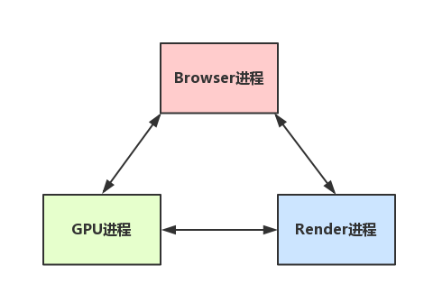

####进程和线程（进程是cpu资源分配的最小单位（系统会给它分配内存）） 

- 进程是一个工厂，工厂有它的独立资源
- 工厂之间相互独立
- 线程是工厂中的工人，多个工人协作完成任务
- 工厂内有一个或多个工人
- 工人之间共享空间

- 工厂的资源 -> 系统分配的内存（独立的一块内存）
- 工厂之间的相互独立 -> 进程之间相互独立
- 多个工人协作完成任务 -> 多个线程在进程中协作完成任务
- 工厂内有一个或多个工人 -> 一个进程由一个或多个线程组成
- 工人之间共享空间 -> 同一进程下的各个线程之间共享程序的内存空间（包括代码段、数据集、堆等）

* 进程是cpu资源分配的最小单位（是能拥有资源和独立运行的最小单位）
* 线程是cpu调度的最小单位（线程是建立在进程的基础上的一次程序运行单位，一个进程中可以有多个线程）
* 不同进程之间也可以通信，不过代价较大
* 现在，一般通用的叫法：单线程与多线程，都是指在一个进程内的单和多。（所以核心还是得属于一个进程才行）


___浏览器是多进程的___

* 浏览器是多进程的
* 浏览器之所以能够运行，是因为系统给它的进程分配了资源（cpu、内存）
* 简单点理解，每打开一个Tab页，就相当于创建了一个独立的浏览器进程。
* 注意：在这里浏览器应该也有自己的优化机制，有时候打开多个tab页后，可以在Chrome任务管理器中看到，有些进程被合并了（所以每一个Tab标签对应一个进程并不一定是绝对的）

**包含的进程**

1. Browser进程：浏览器的主进程（负责协调、主控），只有一个。作用有
	* 负责浏览器界面显示，与用户交互。如前进，后退等
	* 负责各个页面的管理，创建和销毁其他进程
	* 将Renderer进程得到的内存中的Bitmap(位图)，绘制到用户界面上
	* 网络资源的管理，下载等
2. 第三方插件进程：每种类型的插件对应一个进程，仅当使用该插件时才创建
3. Gpu进程： 最多一个，用于3d绘制
4. 浏览器渲染进程（浏览器内核）（render进程，内部多线程）：默认每个tab页面一个进程，互不影响，作用
	* 页面渲染，脚本执行，事件处理

**多进程优势**

* 避免单个page crash 影响整个浏览器
* 避免第三方插件crash影响整个浏览器
* 多进程充分利用多核优势
* 方便使用沙盒模型隔离插件等进程，提高浏览器稳定性

**如果浏览器是单进程，那么某个Tab页崩溃了，就影响了整个浏览器，体验有多差；同理如果是单进程，插件崩溃了也会影响整个浏览器；而且多进程还有其它的诸多优势**

**浏览器内核（渲染进程-多线程）**

> 页面的渲染，JS的执行，事件的循环，都在这个进程内进行

**包含的线程**

1. Gui渲染线程（图形用户界面）
	a. 负责渲染浏览器界面，解析HTML，CSS，构建DOM树和RenderObject树，布局和绘制等。
	b. 当界面需要重绘（Repaint）或由于某种操作引发回流(reflow)时，该线程就会执行
	c. 注意，GUI渲染线程与JS引擎线程是互斥的，当JS引擎执行时GUI线程会被挂起（相当于被冻结了），GUI更新会被保存在一个队列中等到JS引擎空闲时立即被执行。
2. js引擎线程
	a. 也称为JS内核，负责处理Javascript脚本程序。（例如V8引擎）
	b. JS引擎线程负责解析Javascript脚本，运行代码。
	c. JS引擎一直等待着任务队列中任务的到来，然后加以处理，一个Tab页（renderer进程）中无论什么时候都只有一个JS线程在运行JS程序
	d. 同样注意，GUI渲染线程与JS引擎线程是互斥的，所以如果JS执行的时间过长，这样就会造成页面的渲染不连贯，导致页面渲染加载阻塞。
3. 事件触发线程
	a. 归属于浏览器而不是JS引擎，用来控制事件循环（可以理解，JS引擎自己都忙不过来，需要浏览器另开线程协助）
	b. 当JS引擎执行代码块如setTimeOut时（也可来自浏览器内核的其他线程,如鼠标点击、AJAX异步请求等），会将对应任务添加到事件线程中
	c. 当对应的事件符合触发条件被触发时，该线程会把事件添加到待处理队列的队尾，等待JS引擎的处理
	d. 注意，由于JS的单线程关系，所以这些待处理队列中的事件都得排队等待JS引擎处理（当JS引擎空闲时才会去执行）
4. 定时触发器线程
	a. 传说中的setInterval与setTimeout所在线程
	b. 浏览器定时计数器并不是由JavaScript引擎计数的,（因为JavaScript引擎是单线程的, 如果处于阻塞线程状态就会影响记计时的准确）
	c. 因此通过单独线程来计时并触发定时（计时完毕后，添加到事件队列中，等待JS引擎空闲后执行）
	d. 注意，W3C在HTML标准中规定，规定要求setTimeout中低于4ms的时间间隔算为4ms。
5. 异步http请求线程
	a. 在XMLHttpRequest在连接后是通过浏览器新开一个线程请求
	b. 将检测到状态变更时，如果设置有回调函数，异步线程就产生状态变更事件，将这个回调再放入事件队列中。再由JavaScript引擎执行。


####**Browser进程和浏览器内核（Renderer进程）的通信过程**

**简化**

* Browser进程收到用户请求，首先需要获取页面内容（譬如通过网络下载资源），随后将该任务通过RendererHost接口传递给Render进程
* Renderer进程的Renderer接口收到消息，简单解释后，交给渲染线程，然后开始渲染
  * 渲染线程接收请求，加载网页并渲染网页，这其中可能需要Browser进程获取资源和需要GPU进程来帮助渲染
  * 当然可能会有JS线程操作DOM（这样可能会造成回流并重绘）
  * 最后Render进程将结果传递给Browser进程
* Browser进程接收到结果并将结果绘制出来

___梳理浏览器内核中线程之间的关系___

**GUI渲染线程与JS引擎线程互斥**
由于JavaScript是可操纵DOM的，如果在修改这些元素属性同时渲染界面（即JS线程和UI线程同时运行），那么渲染线程前后获得的元素数据就可能不一致了。

因此为了防止渲染出现不可预期的结果，浏览器设置GUI渲染线程与JS引擎为互斥的关系，当JS引擎执行时GUI线程会被挂起，
GUI更新则会被保存在一个队列中等到JS引擎线程空闲时立即被执行。

**JS阻塞页面加载**
从上述的互斥关系，可以推导出，JS如果执行时间过长就会阻塞页面。

譬如，假设JS引擎正在进行巨量的计算，此时就算GUI有更新，也会被保存到队列中，等待JS引擎空闲后执行。
然后，由于巨量计算，所以JS引擎很可能很久很久后才能空闲，自然会感觉到巨卡无比。

所以，要尽量避免JS执行时间过长，这样就会造成页面的渲染不连贯，导致页面渲染加载阻塞的感觉。

**WebWorker，JS的多线程？**

- Web Worker为Web内容在后台线程中运行脚本提供了一种简单的方法。线程可以执行任务而不干扰用户界面
- 一个worker是使用一个构造函数创建的一个对象(e.g. Worker()) 运行一个命名的JavaScript文件
- 这个文件包含将在工作线程中运行的代码; workers 运行在另一个全局上下文中,不同于当前的window,因此,使用 window快捷方式获取当前全局的范围 (而不是self) 在一个 Worker 内将返回错误

* 创建Worker时，JS引擎向浏览器申请开一个子线程（子线程是浏览器开的，完全受主线程控制，而且不能操作DOM）
* JS引擎线程与worker线程间通过特定的方式通信（postMessage API，需要通过序列化对象来与线程交互特定的数据）

**WebWorker与SharedWorker(下一篇)**

	WebWorker只属于某个页面，不会和其他页面的Render进程（浏览器内核进程）共享
	
	所以Chrome在Render进程中（每一个Tab页就是一个render进程）创建一个新的线程来运行Worker中的JavaScript程序。
	
	SharedWorker是浏览器所有页面共享的，不能采用与Worker同样的方式实现，因为它不隶属于某个Render进程，可以为多个Render进程共享使用
	
	所以Chrome浏览器为SharedWorker单独创建一个进程来运行JavaScript程序，在浏览器中每个相同的JavaScript只存在一个SharedWorker进程，不管它被创建多少次。


__浏览器渲染流程__

- 浏览器输入url，浏览器主进程接管，开一个下载线程，
然后进行 http请求（略去DNS查询，IP寻址等等操作），然后等待响应，获取内容，
随后将内容通过RendererHost接口转交给Renderer进程

- 浏览器渲染流程开始

**浏览器器内核拿到内容后，渲染大概可以划分成以下几个步骤：**


1. 解析html建立dom树
2. 解析css构建render树（将CSS代码解析成树形的数据结构，然后结合DOM合并成render树）
3. 布局render树（Layout/reflow），负责各元素尺寸、位置的计算
4. 绘制render树（paint），绘制页面像素信息
5. 浏览器会将各层的信息发送给GPU，GPU会将各层合成（composite），显示在屏幕上。

**load事件与DOMContentLoaded事件**

* 当 DOMContentLoaded 事件触发时，仅当DOM加载完成，不包括样式表，图片。
(譬如如果有async加载的脚本就不一定完成)

* 当 onload 事件触发时，页面上所有的DOM，样式表，脚本，图片都已经加载完成了。
（渲染完毕了）


c**ss加载是否会阻塞dom树渲染？(css是由单独的下载线程异步下载的。)**

* css加载不会阻塞DOM树解析（异步加载时DOM照常构建）
* 但会阻塞render树渲染（渲染时需等css加载完毕，因为render树需要css信息

___普通图层和复合图层___

> 浏览器渲染的图层一般包含两大类：普通图层以及复合图层

首先，普通文档流内可以理解为一个复合图层（这里称为默认复合层，里面不管添加多少元素，其实都是在同一个复合图层中）

其次，absolute布局（fixed也一样），虽然可以脱离普通文档流，但它仍然属于默认复合层。

然后，可以通过硬件加速的方式，声明一个新的复合图层，它会单独分配资源
（当然也会脱离普通文档流，这样一来，不管这个复合图层中怎么变化，也不会影响默认复合层里的回流重绘）

**GPU中，各个复合图层是单独绘制的，所以互不影响**

**如何变成复合图层（硬件加速）**

将该元素变成一个复合图层，就是传说中的硬件加速技术

最常用的方式：translate3d、translateZ
opacity属性/过渡动画（需要动画执行的过程中才会创建合成层，动画没有开始或结束后元素还会回到之前的状态）
will-chang属性（这个比较偏僻），一般配合opacity与translate使用（而且经测试，除了上述可以引发硬件加速的属性外，其它属性并不会变成复合层），
作用是提前告诉浏览器要变化，这样浏览器会开始做一些优化工作（这个最好用完后就释放）

[复合图层的坑](http://www.th7.cn/web/html-css/201509/121970.shtml)

```html
<video><iframe><canvas><webgl>等元素
其它，譬如以前的flash插件
```

**absolute和硬件加速的区别**

可以看到，absolute虽然可以脱离普通文档流，但是无法脱离默认复合层。
所以，就算absolute中信息改变时不会改变普通文档流中render树，
但是，浏览器最终绘制时，是整个复合层绘制的，所以absolute中信息的改变，仍然会影响整个复合层的绘制。
（浏览器会重绘它，如果复合层中内容多，absolute带来的绘制信息变化过大，资源消耗是非常严重的）

而硬件加速直接就是在另一个复合层了（另起炉灶），所以它的信息改变不会影响默认复合层
（当然了，内部肯定会影响属于自己的复合层），仅仅是引发最后的合成（输出视图）

**复合图层的作用？**

一般一个元素开启硬件加速后会变成复合图层，可以独立于普通文档流中，改动后可以避免整个页面重绘，提升性能

但是尽量不要大量使用复合图层，否则由于资源消耗过度，页面反而会变的更卡

**硬件加速时请使用index**

使用硬件加速时，尽可能的使用index，防止浏览器默认给后续的元素创建复合层渲染

具体的原理时这样的：
**webkit CSS3中，如果这个元素添加了硬件加速，并且index层级比较低，
那么在这个元素的后面其它元素（层级比这个元素高的，或者相同的，并且releative或absolute属性相同的），
会默认变为复合层渲染，如果处理不当会极大的影响性能**

简单点理解，其实可以认为是一个隐式合成的概念：**如果a是一个复合图层，而且b在a上面，那么b也会被隐式转为一个复合图层，这点需要特别注意**

**层创建标准**

**什么情况下能使元素获得自己的层？虽然 Chrome 的启发式方法(heuristic)随着时间在不断发展进步，但是从目前来说，满足以下任意情况便会创建层：**

* 3D 或透视变换(perspective transform) CSS 属性
* 使用加速视频解码的 元素
* 拥有 3D (WebGL) 上下文或加速的 2D 上下文的 元素
* 混合插件(如 Flash)
* 对自己的 opacity 做 CSS 动画或使用一个动画 webkit 变换的元素
* 拥有加速 CSS 过滤器的元素
* 元素有一个包含复合层的后代节点(换句话说，就是一个元素拥有一个子元素，该子元素在自己的层里)
* 元素有一个 z-index 较低且包含一个复合层的兄弟元素(换句话说就是该元素在复合层上面渲染)
* 如果有一个元素，它的兄弟元素在复合层中渲染，而这个兄弟元素的z-index比较小，那么这个元素（不管是不是应用了硬件加速样式）也会被放到复合层中。

