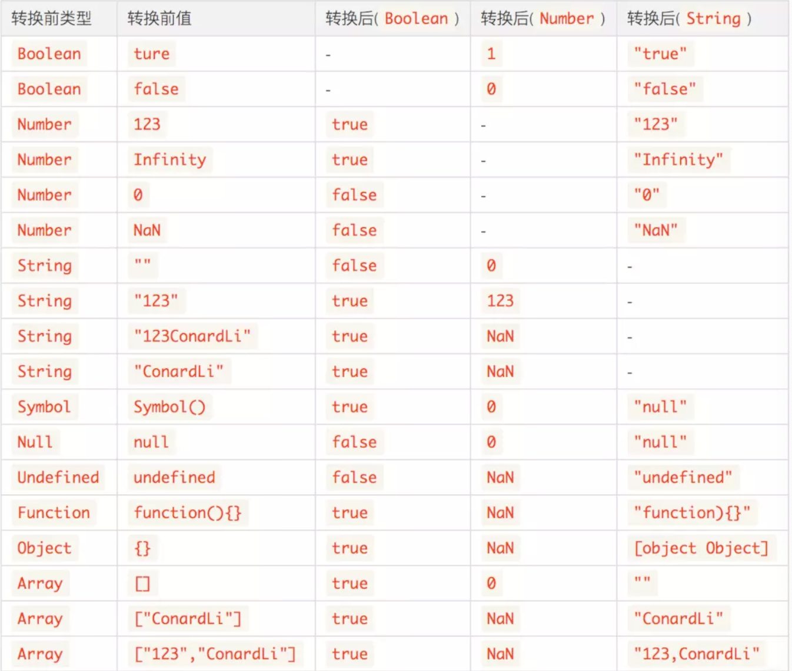
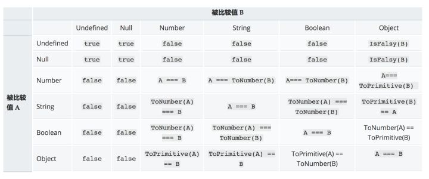

### 类型转换规则



#### if转换为false

- null
- undefined
- ''
- NaN
- 0
- false

### 数学运算符

对非Number类型进行运算符运算时，会先将非Number类型转换为Number类型

```js
[1, 2] + [3, 4]
//1,23,4 
```

#### 加法运算

- 当一侧为`String`类型，被识别为字符串拼接，并会优先将另一侧转换为字符串类型。
- 当一侧为`Number`类型，另一侧为原始类型，则将原始类型转换为`Number`类型。
- 当一侧为`Number`类型，另一侧为引用类型，将引用类型和`Number`类型转换成字符串后拼接。

#### todo

```js
[] + {} // [object Object]
{} + [] // 0
```

##### [] + {}

左侧转换为""，右侧转换为"[object Object]"

##### {} + []

涉及JavaScript的语法解析规则。

{}被解析为一个空的代码块

"+[]"被解析为对于空数组的一元操作“+”，也就是将数组强制转换为数字

### 显式类型转换

显式强制类型转换是通过显而易见的、目的明确的代码将数据进行强制类型转换，如Number()就是将变量显式的强制转换为数字类型的值。

隐式强制类型转换往往是一些操作的附带产物，如if(){}中会将括号内的部分转换为布尔类型。

而关于”显式“和”隐式“是很主观的，如果+”123“对你来说，你一眼就能看出这是将字符串”123“转换为数字的操作，那么这对于你来说就是显式的强制类型转换。

> **4.将一个变量强制转换为字符串，你能说几种方法？**

- 使用String() ——String(123)
- 直接调用toString()方法——var a = 123;a.toString();
- 使用JSON.stringify()方法——JSON.stringify()
- 利用字符串拼接——123+”“

其中第一种最为稳妥。

第二种的缺点是，如果对象修改了自身的toString()方法的话，会影响到最终结果

第三种的缺点是，缺点还是很多的……，如果传入的参数本身就是字符串的话，返回的结果是带双引号的，如下面：

```js
JSON.stringify("123");    //""123""
```

如果传入的是Object还要确保没有递归引用，否则会抛出异常，如下面

```js
var a = {},b = {};
a.param = b;
b.param = a;
JSON.string(a);
    //Uncaught TypeError: Converting circular structure to JSON
```

[MDN](https://link.zhihu.com/?target=https%3A//developer.mozilla.org/zh-CN/docs/Web/JavaScript/Reference/Global_Objects/JSON/stringify)还给出了下面的注意提醒：

关于序列化，有下面五点注意事项：

- 非数组对象的属性不能保证以特定的顺序出现在序列化后的字符串中。
- 布尔值、数字、字符串的包装对象在序列化过程中会自动转换成对应的原始值。
- `undefined、`任意的函数以及 symbol 值，在序列化过程中会被忽略（出现在非数组对象的属性值中时）或者被转换成 `null`（出现在数组中时）。
- 所有以 symbol 为属性键的属性都会被完全忽略掉，即便 `replacer` 参数中强制指定包含了它们。
- 不可枚举的属性会被忽略

第四种的缺点是，表面上看上去应该和第一种String()是一样的，但是其实还是有些差距的，下一题咱们再讨论。

> **5.通常的两种转字符串的方法： String(a) 和 a+""。他们之间是否存在差异？**

两者看上去都是将变量转换为字符串，但是还是有个细微差别的。

看下面的例子：

```js
var a = {
	valueOf: ()=>"123",
	toString: ()=>"456"
}
String(a);    //"456"
a + "";    //"123"
```

通过现象可以看得出来，String()是直接调用了a的toString()方法，而a+""则是先调用了valueOf()方法。原因是加运算是隐式强制类型转换，会对两端操作数进行ToPrimitive操作，前面已经说过，这里不再赘述。

这里有个经典的例子，就是在ES6下对于Symbol类型值进行字符串转换时。

```js
var a = Symbol('first');
String(a);    //"Symbol(first)"
a + "";    //Uncaught TypeError: Cannot convert a Symbol value to a string
```

> **6.有哪些值强制转换成布尔类型时结果为false？**

**此题必考！**

- undefined
- null
- -0
- +0
- NaN
- false
- ""

此外还有一种是假值对象，注意下面的代码（在Chrome中运行）

```js
document.all;    //输出当前文档下的所有标签
Object.prototype.toString.call(document.all);    //[object HTMLAllCollection]
Boolean(document.all);    //false,意外吧？！！！
```

> **7. 宽松相等——“==”和严格相等——“===”有什么区别？**

很多人会说——“==检查值是否相等，===检查值和类型是否相等”，

正解应该是——“==允许在相等比较中进行强制类型转换，而===不允许”。

> **8.下面的代码输出是什么？解释其原理。**

```js
var a = "666";
var b = true;

console.log(a == b);    //输出?
```

结果输出false

还是会有一部分人会犯这个错误的，因为下面的代码我们经常会使用：

```js
if("666"){
    console.log("代码会运行到这里");
}
```

大家觉得"666"转换为布尔类型应该是true啊，所以上面的a==b应该是true。但其实并不是这样，关于宽松相等==来说逻辑十分复杂且晦涩难懂，难以记忆。

这里我觉得答出是 false就可以了，因为有下面这个公式要记忆



> **9.什么样的处理可以使得下面的代码输出为true？**

```js
var s;
/****
 * 一些处理
****/
console.log(s == 5 && s == 6);    //true，上面代码对s做了什么处理？
```

实际上我的处理是这样的（此题是我在《你不知道的JavaScript中卷》中看到的）：

```js
var s;
var i = 5;
s = {
	valueOf: ()=>i++
};
console.log(s == 5 && s == 6);    //此时输出的结果就是true
```

此例重点是想提醒大家，每次的类型转换都会调用变量的valueOf()方法，应该尽量知道自己在做什么，才可以做类似这样的比较操作。

> **10.将一个变量强制转换为数字类型时，都进行了哪些操作？**

将变量强制转换为数字遵循的是ToNumber操作。

对于基本类型的话：

- true → 1
- false → 0
- undefined → NaN
- null → 0
- 对于字符串，遵循常量的相关规则语法，如果转化失败就返回NaN

对于对象来说：

会先进行去原始值操作ToPrimitive，即先检查该值是否有valueOf()方法，如果有并且返回的基本类型值，就使用该值进行转强制类型转换。如果不是就使用toString()的返回值进行强制类型转换。如果valueOf()和toString()均不返回基本类型值，会产生TypeError错误。