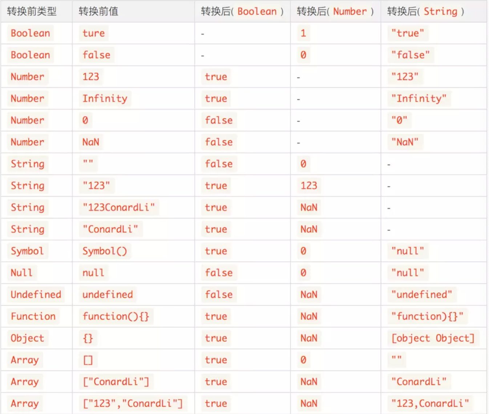

### 抽象值操作

####  Tostring

`toString()` 方法返回一个表示该对象的字符串。

每个对象都有一个`toString()`方法，当该对象被表示为一个文本值时，或者一个对象以预期的字符串方式引用时自动调用。默认情况下，`toString()`方法被每个`Object`对象继承。如果此方法在自定义对象中未被覆盖，`toString()` 返回 "[object *type*]"，其中`type`是对象的类型。

##### todo

1. 从JavaScript1.8.5开始`toString()`调用 [`null`](https://developer.mozilla.org/zh-CN/docs/Web/JavaScript/Reference/Global_Objects/null)返回`[object Null]`，[`undefined`](https://developer.mozilla.org/zh-CN/docs/Web/JavaScript/Reference/Global_Objects/undefined) 返回`[object Undefined]`
2. `Number`对象覆盖了`Object`对象上的`toString`方法，不是直接继承的`Object.prototype.toString`
   1. 转换的基数（2到36），未指定的情况下默认为10，不在范围之内将抛出一个`RangeError`
   2. 当要转换的值是负数的时候，结果会保留负号
3. 数组`toString()`方法返回表示指定数组及其元素的字符串。
   1. `toString`方法连接数组并返回一个字符串，其中包含用逗号分隔的每个数组元素。

#### ToNumber

将非数字值转换为数字值

在转换对象时，会先转换为对应的基本类型值，当返回非数字的基本类型值，在进行进一步的转换，转换规则如下

```js
Number('23') 			//23
Number('12f') 		//NaN
Number(true) 			//1
Number(false) 		//0
Number(undefined) //NaN
Number(null) 			//0
Number(['23'])		//23
Number({})				//NaN
```

#### ToPrimitive

`Symbol.toPrimitive` 指将被调用的指定函数值的属性转换为相对应的原始值。

 `Symbol.toPrimitive` 属性可以将一个对象转换为原始值。`该函数由字符串参数 hint 调用，`目的是指定原始值转换结果的首选类型。 hint 参数可以是`number`，`string`， 和 `default` 中的一种。

在没有`Symbol.toPrimitive`的时候，会首先检查对象是否有`valueOf`方法，如果存在并且返回值为基本类型则使用此方法，否则继续查看对象是否存在`toString`方法，如果存在并且返回值为基本类型则使用此方法，否则将抛出`TypeError`


```js
// MDN的示例
// 没有 Symbol.toPrimitive 属性的对象
var obj1 = {};
console.log(+obj1);     // NaN
console.log(`${obj1}`); // "[object Object]"
console.log(obj1 + ""); // "[object Object]"

// 拥有 Symbol.toPrimitive 属性的对象
var obj2 = {
  [Symbol.toPrimitive](hint) {
    if (hint == "number") {
      return 10;
    }
    if (hint == "string") {
      return "hello";
    }
    return true;
  }
};
console.log(+obj2);     // 10      -- hint is "number"
console.log(`${obj2}`); // "hello" -- hint is "string"
console.log(obj2 + ""); // "true"  -- hint is "default"
```

#### toBoolean

将JavaScript值转换为布尔值。

转换规则如下

````js
//以下情况为false
Boolean('') 				//false
Boolean(+0)					//false
Boolean(-0)					//false
Boolean(NaN)				//false
Boolean(undefined)	//false
Boolean(null) 			//false
Boolean(false) 			//false
````

### 显式类型转换

显式强制类型转换是通过显而易见的、目的明确的代码将数据进行强制类型转换。

字符串和数字之间是通过`String()`和`Number()`来进行呼吸那个转换的

`String()`按照`ToString`规则，将值转换为字符串基本类型。

`Number()`按照`ToNumber`规则，将值转换为数字基本类型。

`+`运算符可以显式的将字符串或者日期转换为数字

`!!`显式的将类型转换为布尔值

### 隐式类型转换

隐式强制类型转换往往是一些操作的附带产物，如if(){}中会将括号内的部分转换为布尔类型。

参考数学运算符

### 类型转换规则



### 数学运算符

对非Number类型进行运算符运算时，会先将非Number类型转换为Number类型

```js
[1, 2] + [3, 4]
//1,23,4 
```

#### 加法运算

- 当一侧为`String`类型，被识别为字符串拼接，并会优先将另一侧转换为字符串类型。
- 当一侧为`Number`类型，另一侧为原始类型，则将原始类型转换为`Number`类型。
- 当一侧为`Number`类型，另一侧为引用类型，将引用类型和`Number`类型转换成字符串后拼接。

##### todo

```js
[] + {} // [object Object]
{} + [] // 0
```

##### [] + {}

左侧转换为""，右侧转换为"[object Object]"

##### {} + []

涉及JavaScript的语法解析规则。

{}被解析为一个空的代码块

"+[]"被解析为对于空数组的一元操作“+”，也就是将数组强制转换为数字

#### ==

##### NaN

`NaN`和其他任何类型比较永远返回`false`

##### null/undefined

`null == undefined`比较结果是`true`，除此之外，`null、undefined`和其他任何结果的比较值都为`false`。

#####Boolean

`Boolean`和其他任何类型比较，`Boolean`首先被转换为`Number`类型。

#####string/number

`String`和`Number`比较，先将`String`转换为`Number`类型。

##### 基本类型/引用类型

当基本类型和引用类型做比较时，对象类型会依照`ToPrimitive`规则转换为原始类型:

````js
[] == ![] // true
````

`!`的优先级高于`==`，`![]`首先会被转换为`false`，然后`false`转换成`Number`类型`0`，左侧`[]`转换为`0`，两侧比较相等。

```js
[null] == false // true
[undefined] == false // true
```

根据数组的`ToPrimitive`规则，数组元素为`null`或`undefined`时，该元素被当做空字符串处理，所以`[null]、[undefined]`都会被转换为`0`。

###宽松相等/严格相等

`==`允许在相等比较中进行强制类型转换，而`===`不允许。

#### 比较时的转换规则


````js
比较运算x==y, 其中x和y是值，产生true或者false。这样的比较按如下方式进行：
1. 若Type(x)与Type(y)相同， 则
	a. 若Type(x)为Undefined， 返回true。
	b. 若Type(x)为Null， 返回true。
	c. 若Type(x)为Number， 则
		i. 若x为NaN， 返回false。
		ii. 若y为NaN， 返回false。
		iii. 若x与y为相等数值， 返回true。
		iv. 若x 为 +0 且 y为−0， 返回true。
		v. 若x 为 −0 且 y为+0， 返回true。
		vi. 返回false。
	d. 若Type(x)为String, 则当x和y为完全相同的字符序列（长度相等且相同字符在相同位置）时返回true。 否则， 返回false。
	e. 若Type(x)为Boolean, 当x和y为同为true或者同为false时返回true。 否则， 返回false。
	f. 当x和y为引用同一对象时返回true。否则，返回false。
2. 若x为null且y为undefined， 返回true。
3. 若x为undefined且y为null， 返回true。
4. 若Type(x) 为 Number 且 Type(y)为String， 返回comparison x == ToNumber(y)的结果。
5. 若Type(x) 为 String 且 Type(y)为Number，返回比较ToNumber(x) == y的结果。
6. 若Type(x)为Boolean， 返回比较ToNumber(x) == y的结果。
7. 若Type(y)为Boolean， 返回比较x == ToNumber(y)的结果。
8. 若Type(x)为String或Number，且Type(y)为Object，返回比较x == ToPrimitive(y)的结果。
9. 若Type(x)为Object且Type(y)为String或Number， 返回比较ToPrimitive(x) == y的结果。
10. 返回false。
````

### 参考

[Object.toString](https://developer.mozilla.org/zh-CN/docs/Web/JavaScript/Reference/Global_Objects/Object/toString)

https://developer.mozilla.org/zh-CN/docs/Web/JavaScript/Reference/Global_Objects/Symbol/toPrimitive

https://juejin.im/post/5b3b76de5188251afc25567f

https://juejin.im/post/5cec1bcff265da1b8f1aa08f

