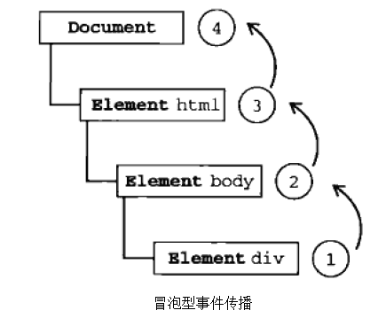
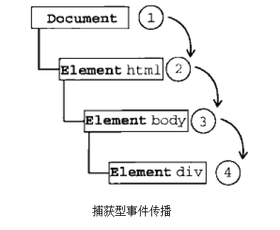
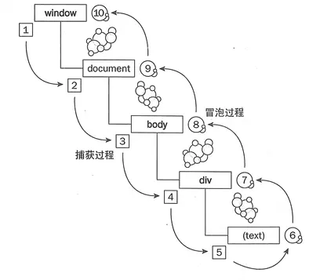

#### 事件冒泡

> IE的事件流称为事件冒泡。
> 即：事件由最具体的元素接收(div)，逐级向上传播到不具体的节点(document)。



如图所示，当我们点击div时，事件会进行从div-body-html-document的传播。

#### 事件捕获

> Netscape提出的事件流模型称为事件捕获。
> 即：事件从最不具体的节点开始接收（document），传递至最具体的节点<div>，和IE的冒泡刚好相反， 事件捕获的本意是当事件到达预定目标前捕获它。
>
> 当我们点击代码片段一中id为box的div块时，单击事件会按照如下顺序传播：
> document——> html ——> body ——> div



> 注意: 虽然事件捕获是Netscape唯一支持的事件流模型，但IE9、Firefox、Chrome、Safari目前也都支持这种事件模型，由于老版本的浏览器并不支持，所以我们应该尽量使用事件冒泡，有特殊需求的时候再考虑事件捕获。

#### DOM2级事件流

> 为了能够兼容上述两种事件模型，又提出了一个DOM2级事件模型，它规定了事件流包含三个阶段：

- 事件捕获阶段：为事件捕获提供机会；
- 处于目标阶段：事件的目标接收到事件（但并不会做出响应）；
- 事件冒泡阶段：事件响应阶段；



> 在DOM2级事件流中，但我们点击代码片段一中的div，在事件捕获阶段从document ->html ->body就停止了（div元素在这个阶段并不会接收到点击事件）。紧接着，事件在div上发生，并把事件真正的处理看成是冒泡阶段的一部分，然后，冒泡阶段发生，事件又回传到document。

#### 事件代理

> 传统的事件处理中，需要为每个元素添加事件处理器。js事件代理则是一种简单有效的技巧，通过它可以把事件处理器添加到一个父级元素上，从而避免把事件处理器添加到多个子级元素上。
>
> 事件代理的原理用到的就是事件冒泡和目标元素，把事件处理器添加到父元素，等待子元素事件冒泡，并且父元素能够通过target（IE为srcElement）判断是哪个子元素，从而做相应处理, 下面举例说明

##### 优点

- 将多个事件处理器减少到一个，因为事件处理器要驻留内存，这样就提高了性能。
  - table可以代理所有td的click事件
  - ul代理所有li的click事件

- 减少了dom节点更新的操作，处理逻辑只需在委托元素上进行，如：
  - 新添加的li不用绑定事件
  - 删除li时，不需要进行元素与处理函数的解绑

##### 缺点

- 事件委托基于冒泡，对于onfoucs和onblur等事件不支持
- 层级过多，冒泡过程中，可能会被某层阻止掉（建议就近委托）


**并非所有的事件都会进过冒泡阶段的**

> 所有的事件都要经过捕捉阶段和目标阶段，但是有些事件会跳过冒泡阶段。

**不会冒泡的事件**

`abort`，`load`，`unload`，`resize`，`focus`，`blur`， `mouseleave`， `mouseenter`， 

##### 事件句柄

> 事件句柄（又称事件处理函数，DOM称之为事件监听函数），用于响应某个事件而调用的函数称为事件处理函数。每一个事件均对应一个事件句柄，在程序执行时，将相应的函数或语句指定给事件句柄，则在该事件发生时，浏览器便执行指定的函数或语句，从而实现网页内容与用户操作的交互。当浏览器检测到某事件发生时，便查找该事件对应的事件句柄有没有被赋值，如果有，则执行该事件句柄。

在**JavaScript中**或者在**HTML中**。使用`onclick`这种

##### 事件监听器

> 除了前面已经介绍的简单事件句柄之外，现在大多数浏览器都内置了一些更高级的事件处理方式，即，事件监听器，这种处理方式就不受一个元素只能绑定一个事件句柄的限制。
>
> 我们已经知道了事件句柄与事件监听器的最大不同之处是使用事件句柄时一次只能插接一个事件句柄，但对于事件监听器，一次可以插接多个。

**IE下的事件监听器：**

`attachEvent`和 `detachEvent`

```js
element.attachEvent("onevent",eventListener);
```

> 有个经常会出错的地方，IE下利用attachEvent注册的处理函数调用时this指向不再是先前注册事件的元素，这时的this为window对象。还有一点是此方法的事件类型名称必须加上一个”on”的前缀（如onclick）。

**DOM标准下的事件监听器：**

`addEventListen` 和  `removeEventListen`

```js
element.addEventListener('event', eventListener,false);
element.removeEventListener('event', eventListener, useCapture);
```

##### 兼容

```js
varEventUtil={
  //注册
  addHandler:function(element, type, handler){
    if(element.addEventListener){
      element.addEventListener(type, handler,false);
    }elseif(element.attachEvent){
      element.attachEvent("on"+type, handler);
    }else{
      element["on"+type]=handler;
    }
  },
  //移除注册
  removeHandler:function(element, type, handler){
    if(element.removeEventListener){
      element.removeEventListener(type, handler,false);
    }else if(element.detachEvent){
      element.detachEvent("on"+type, handler);
    }else{
      element["on"+type]=null;
    }
  };
}
```

##### 阻止事件冒泡

```js
//IE
event.cancalBubble = true;
//DOM标准
event.stopPropagation()
```

##### 阻止事件默认行为

```js
//IE
event.returnValue = false;
//DOM标准
event.preventDefault();
```

