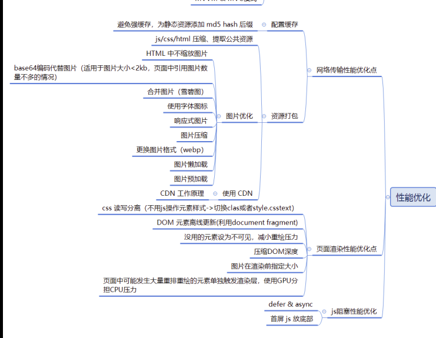

一些小的图片直接在网页中嵌入，而不使用链接的形式从外部导入。

使用

```css
// css
p {
    background: url(data:image/gif;base64,R0lGOD......jIQA7) //外部图片：url(fakepath/image.gif)
    no-repeat left center; 
    padding: 5px 0 5px 25px;
}
```

```html
// html
 <!-- 外部图片：src="fakepath/image.gif" -->
```

```js
// 语法总结
data:[<mime type>][;charset=<charset>][;base64],<encoded data>
  
* data的一些类型：
* data:,<文本数据> 
* data:text/plain,<文本数据> 
* data:text/html,<HTML代码> 
* data:text/html;base64,<base64编码的HTML代码> 
* data:text/css,<CSS代码> 
* data:text/css;base64,<base64编码的CSS代码> 
* data:text/javascript,<Javascript代码> 
* data:text/javascript;base64,<base64编码的Javascript代码> 
* data:image/gif;base64,base64编码的gif图片数据 
* data:image/png;base64,base64编码的png图片数据 
* data:image/jpeg;base64,base64编码的jpeg图片数据 
* data:image/x-icon;base64,base64编码的icon图片数据
```

