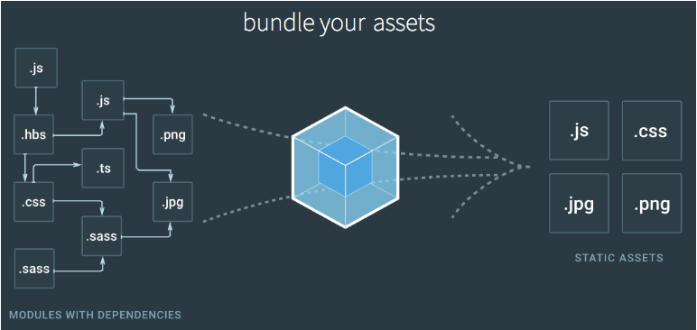

[原文地址1](https://www.jianshu.com/p/cc08f821d202)

*webpack* 是一个现代的 JavaScript 应用程序的*模块打包器(module bundler)*。当 webpack 处理应用程序时，它会递归地构建一个*依赖关系图表(dependency graph)*，其中包含应用程序需要的每个模块，然后将所有这些模块打包成少量的 *bundle* - 通常只有一个，由浏览器加载。

不像大多数的模块打包机，webpack是收把项目当作一个整体，通过一个给定的的主文件，webpack将从这个文件开始找到你的项目的所有依赖文件，使用loaders处理它们，最后打包成一个或多个浏览器可识别的js文件



#### 模块化(module)

在[模块化编程](https://link.jianshu.com?t=https://en.wikipedia.org/wiki/Modular_programming)中，开发者将程序分解相对独立的代码块，并称之为*模块*。

每个模块具有比完整程序更小的接触面，使得校验、调试、测试轻而易举。 精心编写的*模块*提供了可靠的抽象和封装界限，使得应用程序中每个模块都具有条理清楚的设计和明确的目的。

Node.js 从最一开始就支持模块化编程。然而，在 web，*模块化*的支持正缓慢到来。在 web 存在多种支持 JavaScript 模块化的工具，这些工具各有优势和限制。webpack 基于从这些系统获得的经验教训，并将*模块*的概念应用于项目中的任何文件。

#### 什么是 webpack 模块

对比 [Node.js 模块](https://link.jianshu.com?t=https://nodejs.org/api/modules.html)，webpack *模块*能够以各种方式表达它们的依赖关系，几个例子如下：

-  [ES2015 `import`](https://link.jianshu.com?t=https://developer.mozilla.org/en-US/docs/Web/JavaScript/Reference/Statements/import) 语句
-  [CommonJS](https://link.jianshu.com?t=http://www.commonjs.org/specs/modules/1.0/) `require()` 语句
-  [AMD](https://link.jianshu.com?t=https://github.com/amdjs/amdjs-api/blob/master/AMD.md) `define` 和 `require` 语句
- css/sass/less 文件中的 [`@import` 语句](https://link.jianshu.com?t=https://developer.mozilla.org/en-US/docs/Web/CSS/@import)。
- 样式(`url(...)`)或 HTML 文件(``)中的图片链接(image url)

> webpack 1 需要特定的 loader 来转换 ES 2015 `import`，然而 webpack 2 天然支持。

### 支持的模块类型

webpack 通过 *loader* 可以支持各种语言和预处理器编写模块。*loader* 描述了 webpack **如何**处理 非 JavaScript(non-JavaScript) *模块*，并且在*bundle*中引入这些*依赖*。 webpack 社区已经为各种流行语言和语言处理器构建了 *loader*，包括：

- [CoffeeScript](https://link.jianshu.com?t=http://coffeescript.org/)
- [TypeScript](https://link.jianshu.com?t=https://www.typescriptlang.org/)
- [ESNext (Babel)](https://link.jianshu.com?t=https://babeljs.io/)
- [Sass](https://link.jianshu.com?t=http://sass-lang.com/)
- [Less](https://link.jianshu.com?t=http://lesscss.org/)
- [Stylus](https://link.jianshu.com?t=http://stylus-lang.com/)

总的来说，webpack 提供了可定制的、强大和丰富的 API，允许**任何技术栈**使用 webpack，保持了在你的开发、测试和生成流程中**无侵入性(non-opinionated)**。

#### 依赖图表(Dependency Graph)

任何时候，一个文件依赖于另一个文件，webpack 就把此视为文件之间有*依赖关系*。这使得 webpack 可以接收非代码资源(non-code asset)（例如图像或 web 字体），并且可以把它们作为*依赖*提供给你的应用程序。

webpack 从命令行或配置文件中定义的一个模块列表开始，处理你的应用程序。 从这些*入口起点*开始，webpack 递归地构建一个*依赖图表*，这个依赖图表包含着应用程序所需的每个模块，然后将所有这些模块打包为少量的 *bundle*- 通常只有一个 - 可由浏览器加载。

> 对于 *HTTP/1.1* 客户端，由 webpack 打包你的应用程序会尤其强大，因为在浏览器发起一个新请求时，它能够减少应用程序必须等待的时间。对于 *HTTP/2*，你还可以使用代码拆分(Code Splitting)以及通过 webpack 打包来实现[最佳优化](https://link.jianshu.com?t=https://medium.com/webpack/webpack-http-2-7083ec3f3ce6#.7y5d3hz59)。

#### 入口(entry)

webpack 将创建所有应用程序的**依赖关系图表(dependency graph)**。图表的起点被称之为*入口起点(entry point)*。*入口起点*告诉 webpack *从哪里开始*，并遵循着依赖关系图表知道*要打包什么*。可以将您应用程序的*入口起点*认为是**根上下文(contextual root)**或 **app 第一个启动文件**。

在 webpack 中，我们使用 [webpack 配置对象(webpack configuration object)](https://link.jianshu.com?t=https://doc.webpack-china.org/configuration) 中的 `entry` 属性来定义*入口*。

entry 类型有三种：字符串、数组、对象。

- String ："./src/entry" 入口模块的文件路径，可以是相对路径
- array : ["./src/entry1", "./src/entry2"] 入口模块的文件路径，可以是相对路径。与字符串类型不同的是数组可将多个文件打包为一个文件
- object ： { a: './src/entry-a', b: ['./src/entry-b1', './app/entry-b2']} 配置多个入口，每个入口有一个 Chunk

例：

```js
module.exports = {
  entry: './path/to/my/entry/file.js'
};
```

#### 输出(output)

将所有的资源(assets)归拢在一起后，还需要告诉 webpack **在哪里**打包应用程序。webpack 的 `output` 属性描述了**如何处理归拢在一起的代码**(bundled code)。

- **filename** 用于输出文件的文件名。
- **path** 目标输出目录的绝对路径，必须是绝对路径。

例：

```js
const path = require('path');

module.exports = {
  entry: './path/to/my/entry/file.js',
  output: {
    path: path.resolve(__dirname, 'dist'),
    filename: 'my-first-webpack.bundle.js'
  }
};
```

#### 加载(loader)

Loader 可以看作具有文件转换功能的翻译员，配置里的 module.rules 数组配置了一组规则，告诉 Webpack 在遇到哪些文件时使用哪些 Loader 去加载和转换。

**webpack loader 会将这些文件转换为模块，而转换后的文件会被添加到依赖图表中。**

- *use* 属性的值需要是一个由 Loader 名称组成的数组，*Loader* 的执行顺序是由后到前的；
- 每一个 *Loader* 都可以通过 *URL querystring* 的方式传入参数，例如 *css-loader?minimize* 中的 *minimize* 告诉 *css-loader* 要开启 *CSS* 压缩。

例：

```js
const path = require('path');

const config = {
  entry: './path/to/my/entry/file.js',
  output: {
    path: path.resolve(__dirname, 'dist'),
    filename: 'my-first-webpack.bundle.js'
  },
  module: {
    rules: [
      {test: /\.(js|jsx)$/, use: 'babel-loader'}
    ]
  }
};

module.exports = config;
```

#### 插件(plugins)

由于 loader 仅在每个文件的基础上执行转换，而 `插件(plugins)` 最常用于（但不限于）在打包模块的“compilation”和“chunk”生命周期执行操作和自定义功能[（查看更多）](https://link.jianshu.com?t=https://doc.webpack-china.org/concepts/plugins)。webpack 的插件系统[极其强大和可定制化](https://link.jianshu.com?t=https://doc.webpack-china.org/api/plugins)。

想要使用一个插件，你只需要 `require()` 它，然后把它添加到 `plugins` 数组中。多数插件可以通过选项(option)自定义。你也可以在一个配置文件中因为不同目的而多次使用同一个插件，你需要使用 `new` 创建实例来调用它。当然使用 *Plugin* 的难点在于掌握 *Plugin* 本身提供的配置项，而不是如何在 *Webpack* 中接入 *Plugin*。

例：

```js
const HtmlWebpackPlugin = require('html-webpack-plugin'); //installed via npm
const webpack = require('webpack'); //to access built-in plugins
const path = require('path');

const config = {
  entry: './path/to/my/entry/file.js',
  output: {
    path: path.resolve(__dirname, 'dist'),
    filename: 'my-first-webpack.bundle.js'
  },
  module: {
    rules: [
      {test: /\.(js|jsx)$/, use: 'babel-loader'}
    ]
  },
  plugins: [
    new webpack.optimize.UglifyJsPlugin(),
    new HtmlWebpackPlugin({template: './src/index.html'})
  ]
};

module.exports = config;
```

#### Chunk

*Chunk*，代码块，即打包后输出的文件。

*Webpack* 会为每个 *Chunk* 取一个名称，可以根据 *Chunk*

```js
filename: '[name].js'
```

一个入口文件，默认 *chunkname* 为 *main*。 除了内置变量 *name*，与 *chunk* 相关的变量还有：

- **id** 	*Chunk* 的唯一标识，从0开始
- **name** *Chunk* 的名称
- **hash** *Chunk* 的唯一标识的 *Hash* 值
- **chunkhash** *Chunk* 内容的 *Hash* 值

