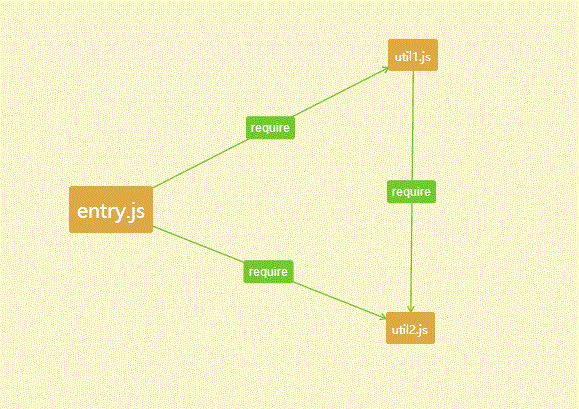
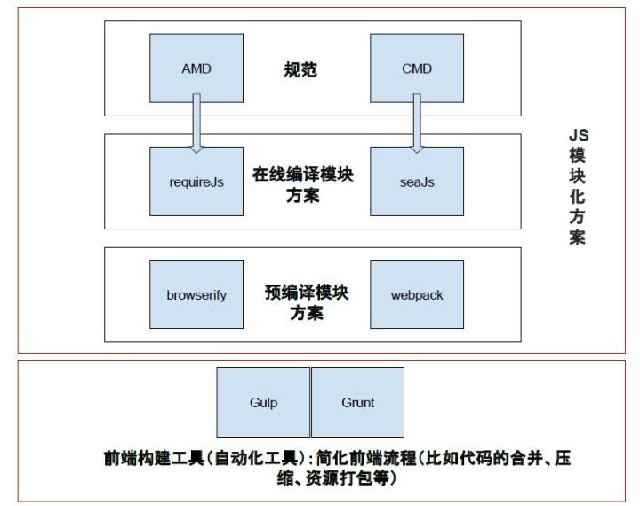
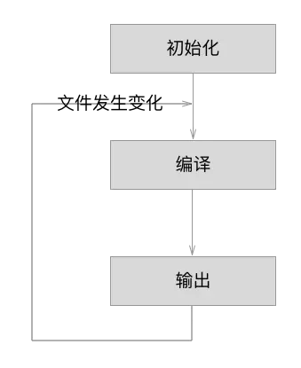

[原文地址1](https://blog.csdn.net/baozhiqiangjava/article/details/80603509)

#### 打包

**所有资源统一入口**

webpack不会直接去读路径记载css，而是在入口js文件中发现有引用这个css文件，再通过对应的loader去处理。

**核心思想**

- 一切皆模块，我们就可以将业务分割成更小的易于管理的片段，从而达到重复利用的目的。
- 按需加载，传统的模块打包工具（module bundlers）最终将所有的模块编译生成一个庞大的bundle.js文件。但是在真实的app里边，“bundle.js”文件可能有10M到15M之大可能会导致应用一直处于加载中状态。因此Webpack使用许多特性来分割代码然后生成多个“bundle”文件，而且异步加载部分代码以实现按需加载。

**文件管理**

- 每个文件都是一个资源，可以用require/import 导入
- 每个入口文件都会将自己所依赖的文件打包到一起，一个资源多次引用的话，只会打包一份。
- 对于多个入口文件，分别独立的执行每个入口文件，每个入口文件不相干，则可用`CommonsChunkPlugin`优化。

**js单文件入口**



```js
/******/ ([
/* 0 */     //模块id
/***/ function(module, exports, __webpack_require__) {

    __webpack_require__(1);     //require资源文件id
    __webpack_require__(2);

/***/ },
/* 1 */
/***/ function(module, exports, __webpack_require__) {
    //util1.js文件
    __webpack_require__(2);
    var util1=1;
    exports.util1=util1;

/***/ },
/* 2 */
/***/ function(module, exports) {
    //util2.js文件
    var util2=1;
    exports.util2=util2;

/***/ }
...
...
/******/ ]);
```

1. bundle.js是以模块 id 为记号，通过函数把各个文件依赖**封装**达到分割效果，如上代码 id 为 0 表示 entry 模块需要的依赖， 1 表示 util1模块需要的依赖
2. require资源文件 id 表示该文件需要加载的各个模块，如上代码`_webpack_require__(1)` 表示 util1.js 模块，`__webpack_require__(2)` 表示 util2.js 模块
3. `exports.util1=util1` 模块化的体现，输出该模块

从图我们会看到entry和util1引得是同一份。

**上面分析了js的情况，其实css也是一个道理。它同样也会为每个css资源分配一个id, 每个资源同样也只会导入一次。**


#### Loader

> ebpack的loaders是一块很重要的组成部分。我们都知道webpack是用于资源打包的，里面的所有资源都是“模块”，内部实现了对模块资源进行加载的机制。但是Webpack本身只能处理 js模块，如果要处理其他类型的文件，就需要使用 loader 进行转换。  Loader 可以理解为是模块和资源的转换器，它本身是一个函数，接受源文件作为参数，返回转换的结果，例如可以使用loader加载器可以快速编译预处理器(less,sass,coffeeScript)。 Loader 可以在require()引用模块的时候添加，也可以在 webpack 全局配置中进行绑定，还可以通过命令行的方式使用。

loaders可以串联，他们应用于管道资源，最后的loader将返回javascript，其它的可返回任意格式（传递给下一个loader）

loaders 可以同步也可以异步

loaders在nodejs下运行并且可以做一切可能的事 loader接受参数，可用于配置里 

loaders可以绑定到extension/RegExps 配置 

loaders可以通过npm发布和安装 正常的模块儿可以到处一个

loader除了 loaders可以访问配置 插件可以给loaders更多的特性

loaders可以释放任意额外的文件

#### gulp 、 webpack区别

https://segmentfault.com/q/1010000008058766



1. gulp是工具链、构建工具，可以配合各种插件做js压缩，css压缩，less编译 替代手工实现自动化工作
   1. 构建工具
   2. 自动化
   3. 提高效率用
2. webpack是文件打包工具，可以把项目的各种js文、css文件等打包合并成一个或多个文件，主要用于模块化方案，预编译模块的方案
   1. 打包工具
   2. 模块化识别
   3. 编译模块代码方案用

**优化方案**

https://juejin.im/post/5abbc2ca5188257ddb0fae9b

- 文件优化/压缩：压缩 JavaScript、CSS、HTML 代码，压缩合并图片等。

- 代码分割：提取多个页面的公共代码、提取首屏不需要执行部分的代码让其异步加载。

- 不打包node内置模块和node_modiules

  - ```js
    module.exports = {
        ...
        target: 'node', // in order to ignore built-in modules like path, fs, etc. 为了忽略内置模块路径、fs等。
        externals: [nodeExternals()], // in order to ignore all modules in node_modules folder 以忽略node_modules文件夹中所有的模块
        ...
    };
    ```

- 优化loader配置（缩小文件搜索范围）

  - include & exclude
    - include 表示哪些目录中的 .js 文件需要进行 babel-loader
    - exclude 表示哪些目录中的 .js 文件不要进行 babel-loader

  - resolve.alias（配置项通过别名来把原导入路径映射成一个新的导入路径 ，此优化方法会影响使用Tree-Shaking去除无效代码）

  - resolve.modules

  - resolve.extensions(扩展)

    - 当引入模块时不带文件后缀 webpack会根据此配置自动解析确定的文件后缀
    - 后缀列表尽可能小
    - 频率最高的往前放
    - 导出语句尽可能带上后缀

  - module.noParse（module.noParse 配置项可以让 Webpack 忽略对部分没采用模块化的文件的递归解析处理）

    - ```js
      module: {
       noParse: [/react\.min\.js/]
      }
      ```

- module.noParse
  - 用了noParse的模块将不会被loaders解析，所以当我们使用的库如果太大，并且其中不包含import require、define的调用，我们就可以使用这项配置来提升性能, 让 Webpack 忽略对部分没采用模块化的文件的递归解析处理。

- .dll 为后缀的文件称为动态链接库，在一个动态链接库中可以包含给其他模块调用的函数和数据。

  - 在一个动态链接库中可以包含其他模块调用的函数和数据，动态链接库只需被编译一次，在之后的构建过程中被动态链接库包含的模块将不会被重新编译,而是直接使用动态链接库中的代码。

  - 将web应用依赖的基础模块抽离出来，打包到单独的动态链接库中。一个链接库可以包含多个模块。

  - 当需要导入的模块存在于动态链接库，模块不会再次打包，而是去动态链接库中去获取。

  - 页面依赖的所有动态链接库都需要被加载。

  - DllPlugin插件： 用于打包出一个个动态链接库

    - ```js
      module.exports = {
        entry: {
            react: ['react'] //react模块打包到一个动态链接库
        },
        output: {
            path: path.resolve(__dirname, 'dist'),
            filename: '[name].dll.js', //输出动态链接库的文件名称
            library: '_dll_[name]' //全局变量名称
        },
        plugins: [
            new webpack.DllPlugin({
                name: '_dll_[name]', //和output.library中一致，值就是输出的manifest.json中的 name值
                path: path.join(__dirname, 'dist', '[name].manifest.json')
            })
        ]
      }
      
      ```

  - DllReferencePlugin: 在配置文件中引入DllPlugin插件打包好的动态链接库

    - ```js
       plugins: [
           new webpack.DllReferencePlugin({
           manifest: require(path.join(__dirname, 'dist', 'react.manifest.json')),
           })
        ]
      ```

- HappyPack针对loader解析过程，能让Webpack把任务分解给多个子进程去并发的执行，子进程处理完后再把结果发送给主进程。

- ParallelUglifyPlugin可以把对JS文件的串行压缩变为开启多个子进程并行执行

- 区分环境：通过环境变量区分，用 webpack-merge覆盖相应配置

- CDN：配置publicPath

  - 静态资源的URL变成指向CDN服务器的地址
  - 把不同的静态资源分配到不同的CDN服务器上

- Tree Shaking（ES6模块静态解析）

  - Tree Shaking 可以用来剔除JavaScript中用不上的死代码。它依赖静态的ES6模块化语法，例如通过import和export导入导出。

- 提取公共代码

- 代码分离

  - 入口起点：使用 entry 配置手动地分离代码。
  - 防止重复：使用 splitChunks 去重和分离 chunk。
  - 动态导入：通过模块的内联函数调用来分离代码。


**概念问题一：什么是webpack和grunt和gulp有什么不同**

> 答案：Webpack是一个模块打包器，他可以递归的打包项目中的所有模块，最终生成几个打包后的文件。他和其他的工具最大的不同在于他支持code-splitting、模块化(AMD，ESM，CommonJs)、全局分析。


**概念问题二：什么是bundle,什么是chunk，什么是module?**

> 答案：bundle是由webpack打包出来的文件，chunk是指webpack在进行模块的依赖分析的时候，代码分割出来的代码块。module是开发中的单个模块。


**概念问题三：什么是Loader?什么是Plugin?**

> 答案：
> 1）Loaders是用来告诉webpack如何转化处理某一类型的文件，并且引入到打包出的文件中
> 2）Plugin是用来自定义webpack打包过程的方式，一个插件是含有apply方法的一个对象，通过这个方法可以参与到整个webpack打包的各个流程(生命周期)。


**配置问题:如何可以自动生成webpack配置？**

> 答案： webpack-cli /vue-cli /etc ...脚手架工具


**开发问题一：webpack-dev-server和http服务器如nginx有什么区别?**

> 答案：webpack-dev-server使用内存来存储webpack开发环境下的打包文件，并且可以使用模块热更新，他比传统的http服务对开发更加简单高效。


**开发问题二:什么 是模块热更新？**

> 答案:模块热更新是webpack的一个功能，他可以使得代码修改过后不用刷新浏览器就可以更新，是高级版的自动刷新浏览器。


**优化问题一：什么是长缓存？在webpack中如何做到长缓存优化？**

> 答案：浏览器在用户访问页面的时候，为了加快加载速度，会对用户访问的静态资源进行存储，但是每一次代码升级或是更新，都需要浏览器去下载新的代码，最方便和简单的更新方式就是引入新的文件名称。在webpack中可以在output纵输出的文件指定chunkhash,并且分离经常更新的代码和框架代码。通过NameModulesPlugin或是HashedModuleIdsPlugin使再次打包文件名不变。


**优化问题二：什么是Tree-shaking?CSS可以Tree-shaking吗**

> 答案：Tree-shaking是指在打包中去除那些引入了，但是在代码中没有被用到的那些死代码。在webpack中Tree-shaking是通过uglifySPlugin来Tree-shaking
>
> JS。Css需要使用Purify-CSS。

#### 流程

1. 初始化参数
   1. 从配置文件和shell语句中读取并合并参数，得到最终的参数。
2. 开始编译
   1. 用上一步得到的参数初始化compiler 对象，加载所有配置的插件，执行对象的run方法开始执行编译
3. 确定入口
   1. 根据配置中的entry找出所有入口文件
4. 编译模块
   1. 从入口文件出发，调用所有的loader对模块进行编译，再找出该模块依赖的模块，递归进行直到所有入口依赖的文件都经过了处理
5. 完成模块编译
   1. 在经过上一步使用loader编译完所有模块后，得到了每个模块被编译后的最终内容以及他们之间的依赖关系。
6. 输出资源
   1. 根据入口和模块之间的依赖关系，组装成一个个包含多个模块的chunk，再把每个chunk转换成一个单独的文件加入到输出列表，这是可以最后更改输出资源的地方
7. 输出完成
   1. 在确定好输出内容后，根据配置确定输出的路径和文件名，把文件内容写入到文件系统。

#### 流程细节

https://juejin.im/entry/5b0e3eba5188251534379615

1. 初始化
   1. 启动构建，读取与合并配置参数，加载 Plugin，实例化 Compiler。
2. 编译
   1. 从 Entry 发出，针对每个 Module 串行调用对应的 Loader 去翻译文件内容，再找到该 Module 依赖的 Module，递归地进行编译处理
3. 输出
   1. 输出：对编译后的 Module 组合成 Chunk，把 Chunk 转换成文件，输出到文件系统。

如果只执行一次构建，以上阶段将会按照顺序各执行一次。但在开启监听模式下，流程将变为如下：



**初始化阶段**

| 事件名            | 解释                                                         |
| ----------------- | ------------------------------------------------------------ |
| 初始化参数        | 从配置文件和 Shell 语句中读取与合并参数，得出最终的参数。 这个过程中还会执行配置文件中的插件实例化语句 `new Plugin()`。 |
| 实例化 `Compiler` | 用上一步得到的参数初始化 `Compiler` 实例，`Compiler` 负责文件监听和启动编译。`Compiler` 实例中包含了完整的 `Webpack` 配置，全局只有一个 `Compiler` 实例。 |
| 加载插件          | 依次调用插件的 `apply` 方法，让插件可以监听后续的所有事件节点。同时给插件传入 `compiler` 实例的引用，以方便插件通过 `compiler` 调用 Webpack 提供的 API。 |
| `environment`     | 开始应用 Node.js 风格的文件系统到 compiler 对象，以方便后续的文件寻找和读取。 |
| `entry-option`    | 读取配置的 `Entrys`，为每个 `Entry` 实例化一个对应的 `EntryPlugin`，为后面该 `Entry` 的递归解析工作做准备。 |
| `after-plugins`   | 调用完所有内置的和配置的插件的 `apply` 方法。                |
| `after-resolvers` | 根据配置初始化完 `resolver`，`resolver` 负责在文件系统中寻找指定路径的文件。 |

**编译阶段**

| 事件名          | 解释                                                         |
| --------------- | ------------------------------------------------------------ |
| `run`           | 启动一次新的编译。                                           |
| `watch-run`     | 和 `run` 类似，区别在于它是在监听模式下启动的编译，在这个事件中可以获取到是哪些文件发生了变化导致重新启动一次新的编译。 |
| `compile`       | 该事件是为了告诉插件一次新的编译将要启动，同时会给插件带上 `compiler` 对象。 |
| `compilation`   | 当 `Webpack` 以开发模式运行时，每当检测到文件变化，一次新的 `Compilation` 将被创建。一个 `Compilation` 对象包含了当前的模块资源、编译生成资源、变化的文件等。`Compilation` 对象也提供了很多事件回调供插件做扩展。 |
| `make`          | 一个新的 `Compilation` 创建完毕，即将从 `Entry` 开始读取文件，根据文件类型和配置的 `Loader` 对文件进行编译，编译完后再找出该文件依赖的文件，递归的编译和解析。 |
| `after-compile` | 一次 `Compilation` 执行完成。                                |
| `invalid`       | 当遇到文件不存在、文件编译错误等异常时会触发该事件，该事件不会导致 Webpack 退出。 |

在编译阶段中，最重要的要数 `compilation` 事件了，因为在 `compilation` 阶段调用了 Loader 完成了每个模块的转换操作，在 `compilation` 阶段又包括很多小的事件，它们分别是：

| 事件名                 | 解释                                                         |
| ---------------------- | ------------------------------------------------------------ |
| `build-module`         | 使用对应的 Loader 去转换一个模块。                           |
| `normal-module-loader` | 在用 Loader 对一个模块转换完后，使用 `acorn` 解析转换后的内容，输出对应的抽象语法树（`AST`），以方便 Webpack 后面对代码的分析。 |
| `program`              | 从配置的入口模块开始，分析其 AST，当遇到 require 等导入其它模块语句时，便将其加入到依赖的模块列表，同时对新找出的依赖模块递归分析，最终搞清所有模块的依赖关系。 |
| `seal`                 | 所有模块及其依赖的模块都通过 Loader 转换完成后，根据依赖关系开始生成 Chunk。 |

#### 输出文件

| 事件名        | 解释                                                         |
| ------------- | ------------------------------------------------------------ |
| `should-emit` | 所有需要输出的文件已经生成好，询问插件哪些文件需要输出，哪些不需要。 |
| `emit`        | 确定好要输出哪些文件后，执行文件输出，可以在这里获取和修改输出内容。 |
| `after-emit`  | 文件输出完毕。                                               |
| `done`        | 成功完成一次完成的编译和输出流程。                           |
| `failed`      | 如果在编译和输出流程中遇到异常导致 Webpack 退出时，就会直接跳转到本步骤，插件可以在本事件中获取到具体的错误原因。 |

在输出阶段已经得到了各个模块经过转换后的结果和其依赖关系，并且把相关模块组合在一起形成一个个 Chunk。 在输出阶段会根据 Chunk 的类型，使用对应的模版生成最终要要输出的文件内容。

#### 输出文件分析

虽然在前面的章节中你学会了如何使用 Webpack ，也大致知道其工作原理，可是你想过 Webpack 输出的 `bundle.js` 是什么样子的吗？ 为什么原来一个个的模块文件被合并成了一个单独的文件？为什么 `bundle.js` 能直接运行在浏览器中？ 本节将解释清楚以上问题。

先来看看由 安装与使用 中最简单的项目构建出的 `bundle.js` 文件内容，代码如下：

```js
(function(modules) {

  // 模拟 require 语句
  function __webpack_require__() {
  }

  // 执行存放所有模块数组中的第0个模块
  __webpack_require__(0);

})([/*存放所有模块的数组*/])
```

`bundle.js` 能直接运行在浏览器中的原因在于输出的文件中通过 `__webpack_require__` 函数定义了一个可以在浏览器中执行的加载函数来模拟 Node.js 中的 `require` 语句。

原来一个个独立的模块文件被合并到了一个单独的 `bundle.js` 的原因在于浏览器不能像 Node.js 那样快速地去本地加载一个个模块文件，而必须通过网络请求去加载还未得到的文件。 如果模块数量很多，加载时间会很长，因此把所有模块都存放在了数组中，执行一次网络加载。

如果仔细分析 `__webpack_require__` 函数的实现，你还有发现 Webpack 做了缓存优化： 执行加载过的模块不会再执行第二次，执行结果会缓存在内存中，当某个模块第二次被访问时会直接去内存中读取被缓存的返回值。