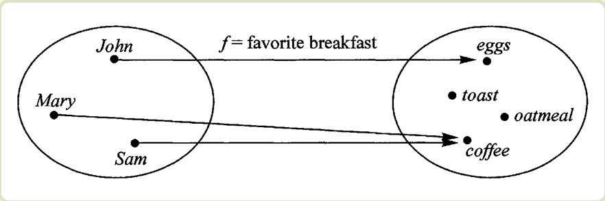
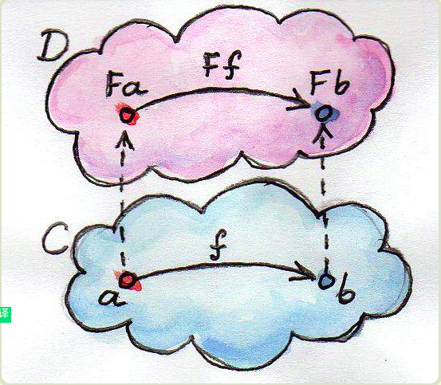

函数式编程和面向对象编程
https://blog.csdn.net/zhangxiaomaphp/article/details/79425721
阮一峰函数编程
http://www.ruanyifeng.com/blog/2017/02/fp-tutorial.html

函数式编程（英语：functional programming），又称泛函编程，是一种编程范式，它将电脑运算视为数学上的函数计算，并且避免使用程序状态以及易变对象。

####范畴

**"箭头表示范畴成员之间的关系，正式的名称叫做"态射"（morphism）。范畴论认为，同一个范畴的所有成员，就是不同状态的"变形"（transformation）。通过"态射"，一个成员可以变形成另一个成员。"开头就有问题了. 范畴论的基础是不关心成员, 只考虑整体.**

**@阮一峰：**
**你这个简化定义把基本的要素给丢了，就不能表达范畴论的意义了。既然引用了，最好还是给出完整的介绍比较好。**
**下面是wikipedia上范畴论的简要介绍：**
**Category theory formalizes mathematical structure and its concepts in terms of a collection of objects and of arrows (also called morphisms). A category has two basic properties: the ability to compose the arrows associatively and the existence of an identity arrow for each object.**

**另外，你这句话“通过"态射"，一个成员可以变形成另一个成员”是错误的，非常容易误导初学者。范畴中的态射恰恰是保持了范畴中对象的某些不变的性质，是保持某些性质不变的变换。**
**同样的，函子也具有类似的不变性，因此具有如下非常重要的定律，而这是你没有提到的。**
**F id = id**
**F (f . g) = F f . F g**

**你在文中提到函子是一种范畴，是一个容器，这是完全错误的。函子只是Cat范畴中的态射，即Cat范畴（其对象是范畴）中的范畴之间的态射。从C++来看，可以大致将Option的Option理解为函子。函子可以看成是类型构造子，但必须满足上面提到的函子的定律。**

**另外Either并不是一个函子，其有两个类型变量。**
**函数式编程的起源，是一门叫做范畴论（Category** Theory）的数学分支。

理解函数式编程的关键，就是理解范畴论。它是一门很复杂的数学，认为世界上所有的概念体系，都可以抽象成一个个的"范畴"（category）。

彼此之间存在某种关系的概念、事物、对象等等，都构成"范畴"。随便什么东西，只要能找出它们之间的关系，就能定义一个"范畴"。

既然"范畴"是满足某种变形关系的所有对象，就可以总结出它的数学模型。

所有成员是一个集合
变形关系是函数
也就是说，范畴论是集合论更上层的抽象，简单的理解就是"集合 + 函数"。

理论上通过函数，就可以从范畴的一个成员，算出其他所有成员。


我们可以把"范畴"想象成是一个容器，里面包含两样东西。

值（value）
值的变形关系，也就是函数。
下面我们使用代码，定义一个简单的范畴。

```js
class Category {
  constructor(val) { 
	this.val = val; 
  }

  addOne(x) {
	return x + 1;
  }
}
```

上面代码中，Category是一个类，也是一个容器，里面包含一个值（this.val）和一种变形关系（addOne）。你可能已经看出来了，这里的范畴，就是所有彼此之间相差1的数字。

范畴论使用函数，表达范畴之间的关系。

伴随着范畴论的发展，就发展出一整套函数的运算方法。这套方法起初只用于数学运算，后来有人将它在计算机上实现了，就变成了今天的"函数式编程"。

**本质上，函数式编程只是范畴论的运算方法，跟数理逻辑、微积分、行列式是同一类东西，都是数学方法，只是碰巧它能用来写程序。**

所以，你明白了吗，为什么函数式编程要求函数必须是纯的，不能有副作用？因为它是一种数学运算，原始目的就是求值，不做其他事情，否则就无法满足函数运算法则了。

总之，在函数式编程中，函数就是一个管道（pipe）。这头进去一个值，那头就会出来一个新的值，没有其他作用。

####函数的合成与柯里化

函数式编程有两个最基本的运算：合成和柯里化。

####函数的合成

如果一个值要经过多个函数，才能变成另外一个值，就可以把所有中间步骤合并成一个函数，这叫做"函数的合成"（compose）。
{{./pasted_image.png}}

上图中，X和Y之间的变形关系是函数f，Y和Z之间的变形关系是函数g，那么X和Z之间的关系，就是g和f的合成函数g·f。

```js
__const compose = function (f, g) {__
__  return function (x) {__
__    return f(g(x));__
__  };__
__}__
```

函数的合成还必须满足结合律


```js
__compose(f, compose(g, h))__
__// 等同于__
__compose(compose(f, g), h)__
__// 等同于__
__compose(f, g, h)__
```

合成也是函数必须是纯的一个原因。因为一个不纯的函数，怎么跟其他函数合成？怎么保证各种合成以后，它会达到预期的行为？

前面说过，函数就像数据的管道（pipe）。那么，函数合成就是将这些管道连了起来，让数据一口气从多个管道中穿过。

####柯里化

f(x)和g(x)合成为f(g(x))，有一个隐藏的前提，就是f和g都只能接受一个参数。如果可以接受多个参数，比如f(x, y)和g(a, b, c)，函数合成就非常麻烦。

这时就需要函数柯里化了。所谓"柯里化"，就是把一个多参数的函数，转化为单参数函数。

```js
__// 柯里化之前__
__function add(x, y) {__
__  return x + y;__
__}__

__add(1, 2) // 3__

__// 柯里化之后__
__function addX(y) {__
__  return function (x) {__
__    return x + y;__
__  };__
__}__

__addX(2)(1) // 3__
```

####函子

函数不仅可以用于同一个范畴之中值的转换，还可以用于将一个范畴转成另一个范畴。这就涉及到了函子（Functor）。

####概念
函子是函数式编程里面最重要的数据类型，也是基本的运算单位和功能单位。

它首先是一种范畴，也就是说，是一个容器，包含了值和变形关系。比较特殊的是，它的变形关系可以依次作用于每一个值，将当前容器变形成另一个容器。




上图中，左侧的圆圈就是一个函子，表示人名的范畴。外部传入函数f，会转成右边表示早餐的范畴。

下面是一张更一般的图。




上图中，函数f完成值的转换（a到b），将它传入函子，就可以实现范畴的转换（Fa到Fb）。

####函子的实现

任何具有map方法的数据结构，都可以当作函子的实现。

```js
__class Functor {__
__  constructor(val) { __
__    this.val = val; __
__  }__

__  map(f) {__
__    return new Functor(f(this.val));__
__  }__
__}__
```

上面代码中，Functor是一个函子，它的map方法接受函数f作为参数，然后返回一个新的函子，里面包含的值是被f处理过的（f(this.val)）。

**一般约定，函子的标志就是容器具有map方法。该方法将容器里面的每一个值，映射到另一个容器。**

```js
__(new Functor(2)).map(function (two) {__
__  return two + 2;__
__});__
__// Functor(4)__

__(new Functor('flamethrowers')).map(function(s) {__
__  return s.toUpperCase();__
__});__
__// Functor('FLAMETHROWERS')__

__(new Functor('bombs')).map(_.concat(' away')).map(_.prop('length'));__
__// Functor(10)__
```

上面的例子说明，函数式编程里面的运算，都是通过函子完成，即运算不直接针对值，而是针对这个值的容器----函子。函子本身具有对外接口（map方法），各种函数就是运算符，通过接口接入容器，引发容器里面的值的变形。

因此，学习函数式编程，实际上就是学习函子的各种运算。由于可以把运算方法封装在函子里面，所以又衍生出各种不同类型的函子，有多少种运算，就有多少种函子。函数式编程就变成了运用不同的函子，解决实际问题。

####of方法 


你可能注意到了，上面生成新的函子的时候，用了new命令。这实在太不像函数式编程了，因为new命令是面向对象编程的标志。

函数式编程一般约定，函子有一个of方法，用来生成新的容器。

下面就用of方法替换掉new。

```js
__Functor.of = function(val) {__
__  return new Functor(val);__
__};__
```


然后，前面的例子就可以改成下面这样。

```js
__Functor.of(2).map(function (two) {__
__  return two + 2;__
__});__
__// Functor(4)__
```


这就更像函数式编程了。

####maybe函子

函子接受各种函数，处理容器内部的值。这里就有一个问题，容器内部的值可能是一个空值（比如null），而外部函数未必有处理空值的机制，如果传入空值，很可能就会出错。

```js
__Functor.of(null).map(function (s) {__
__  return s.toUpperCase();__
__});__
__// TypeError__
```


上面代码中，函子里面的值是null，结果小写变成大写的时候就出错了。

Maybe 函子就是为了解决这一类问题而设计的。简单说，它的map方法里面设置了空值检查。

```js
__class Maybe extends Functor {__
__  map(f) {__
__    return this.val ? Maybe.of(f(this.val)) : Maybe.of(null);__
__  }__
__}__
```


有了 Maybe 函子，处理空值就不会出错了。

```js
__Maybe.of(null).map(function (s) {__
__  return s.toUpperCase();__
__});__
__// Maybe(null)__
```

####纯函数

定义：一个函数如果输入参数确定，输出结果是唯一确定的，那么他就是纯函数。
特点：无状态，无副作用，无关时序，幂等（无论调用多少次，结果相同）

```js
__let arr = [1,2,3];                                            __
__arr.slice(0,3);                                               //是纯函数__
__arr.splice(0,3);                                              //不是纯函数，对外有影响__

__function add(x,y){                                           // 是纯函数   __
__   return x + y                                              // 无状态，无副作用，无关时序，幂等__
__}                                                            // 输入参数确定，输出结果是唯一确定__

__let count = 0;                                               //不是纯函数 __
__function addCount(){                                         //输出不确定__
__    count++                                                  // 有副作用__
__}__

__function random(min,max){                                    // 不是纯函数     __
__    return Math.floor(Math.radom() * ( max - min)) + min     // 输出不确定__
__}                                                            // 但注意它没有副作用__

__function setColor(el,color){                                  //不是纯函数 __
__    el.style.color =  color ;                                 //直接操作了DOM，对外有副作用__
__}__  
```


