先来看一个十分有意思的问题：先有鸡还是先有蛋？

思考过后再想一下这个问题

```
Function.__proto__ === Function.prototype
//true
```

好的，先保留这个问题，继续看

```
function P(){};
const p = new P();

p.__proto__ === P.prototype
//这个我相信很多人都知道，因为我们见到的就是这样的
p.prototype
//undefined,所以自然而然p.prototype !== p.__proto__
```


看完上面都懵的，强力建议看下面的东西

`__proto__`

每个JS对象一定对应一个原型对象，并从原型对象继承属性和方法。而`__proto__`的值就是该对象的原型对象。

`prototype`

**__proto__是每个对象都有的一个属性，而prototype是函数才会有的属性!!!** 

几乎所有的函数都有这个属性，当创建函数时，ｊｓ就会自动为其添加`prototype`属性，值是有`constructor`属性的对象。而一旦你把这个函数当作构造函数（`constructor`）调用（即通过`new`关键字调用），那么JS就会帮你创建该构造函数的实例，实例继承构造函数`prototype`的所有属性和方法（实例通过设置自己的`__proto__`指向承构造函数的`prototype`来实现这种继承）。

`constructor`

每个原型都有一个`constructor`属性指向关联额构造函数

我们来看一张ｇｉｔ上的图片来加深记忆


首先我们声明了一个Foo构造函数，f1,f2为其实例，f1,f2继承`Foo.prototype`的所有属性和方法。

Foo和object则继承`Function`的原型，（Object作为一个函数对象，当然是这样继承了）

`Foo.prototype.__proto__`和`Function.prototype.__proto__`则继承自`Object.prototype`

`Object.prototype.__proto__`则等于null,

而一连串的`__proto__`和`prototype`则就是我们口中所说的原型链，所有对象均从`Object.prototype`继承属性，其也是原型链的尽头。

我们知道当读取实例的某个属性时，如果在自身属性中找不到，就会从其关联的原型中查找，没找到，就继续向原型的原型找，直到找到或者到其尽头。

````
Object instanceof Function // true
Function instanceof Object // true
````

到这里我们会发现又一个鸡生蛋的问题，生活真叫人惊喜。好吧，不能拖了，我们先看看这个问题

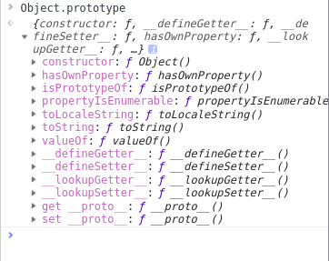

我们先看看`object.prototype`会发现好多我们熟悉的属性啊。

再来看看`Function`

看了上面我们知道`Function.prototype`和`Function.__proto__`为**同一对象**。

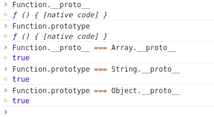

从图得，**Object/Array/String等等构造函数本质上和Function一样，均继承于Function.prototype。**

而`Function.prototype`直接继承（`Object.prototype`）。

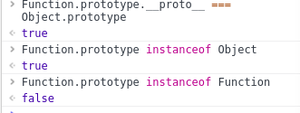

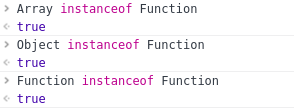

我们会发现`Object.prototype->Function.prototype->Function|Array|Object`

看完我们再看看规范是怎么说的

1. `Function.prototype`是个不同于一般函数（对象）的函数（对象）。

   > The Function prototype object is itself a Function object (its [[Class]] is "Function") that, when invoked, accepts any arguments and returns undefined.
   >
   > The value of the [[Prototype]] internal property of the Function prototype object is the standard built-in Object prototype object (15.2.4). The initial value of the [[Extensible]] internal property of the Function prototype object is true.
   >
   > The Function prototype object does not have a valueOf property of its own; however, it inherits the valueOf property from the Object prototype Object.

   1. `Function.prototype`像普通函数一样可以调用，但总是返回`undefined`。
   2. 普通函数实际上是`Function`的实例，即普通函数继承于`Function.prototype`。`func.__proto__ === Function.prototype`。
   3. `Function.prototype`继承于`Object.prototype`，并且没有`prototype`这个属性。`func.prototype`是普通对象，`Function.prototype.prototype`是`null`。
   4. 所以，`Function.prototype`其实是个另类的函数，可以独立于/先于`Function`产生。

2. `Object`本身是个（构造）函数，是`Function`的实例，即`Object.__proto__`就是`Function.prototype`。

   > The value of the [[Prototype]] internal property of the Object constructor is the standard built-in Function prototype object.
   >
   > The value of the [[Prototype]] internal property of the Object prototype object is null, the value of the [[Class]] internal property is "Object", and the initial value of the [[Extensible]] internal property is true.

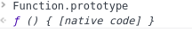

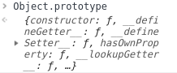

从打印结果我们也可以看出来，`Function.prototype`没有`prototypr`属性，并且可以像普通函数一样调用。

**总结：先有Object.prototype（原型链顶端），Function.prototype继承Object.prototype而产生，最后，Function和Object和其它构造函数继承Function.prototype而产生。**

再看第一个问题之前，我们先来看看偶然之间得到的一个学姐的提示

先说下问题，可能有人觉得既然functon和object 有这么多相通的，那怎么确定他的`__proto__`的指向

**`__proto__`的指向取决于对象创建时的实现方式**，我们看几个例子

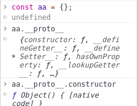

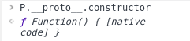

相信大家已经看懂了，没懂得看结论

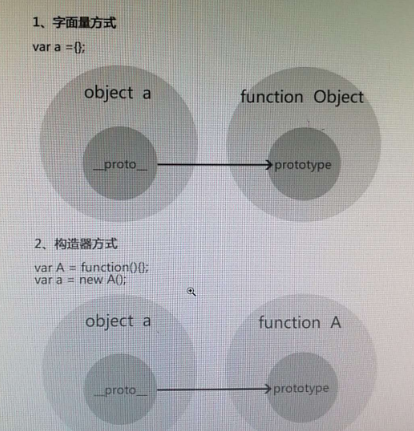

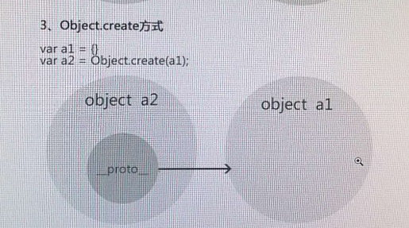


好的，言归正传，让我们趁热打铁，再来看看第一个鸡生蛋的问题。

我们先想一下**Object.prototype 是对象吗？**

1. 当然是。`An object is a collection of properties and has a single prototype object. The prototype may be the null value.` 这是object的定义，`Object.prototype`显然是符合这个定义的。
2. 但是，**Object.prototype并不是Object的实例。** 这也很好理解`Object.prototype.__proto__`是`null`

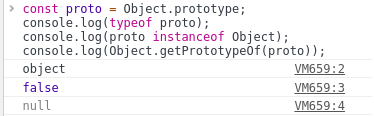

从图中我们就可以看到**Object.prototype是对象，但它不是通过Object函数创建的。**

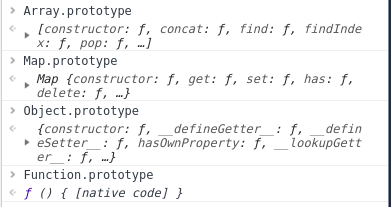

好的，我们发现了什么。他们各自的`prototype`都和他们的类型相匹配。真有趣。

我们现在疑惑的其实就是为什么 **Function.prototype 和 Function.__proto__是同一个对象**？

 

1. `Function`本身也是function。
2. `Function.prototype`是所有function的原型（包括`Function`自己）。
3. 但反过来，`Function.prototype`和`Function`并没有反向的什么关系（除了正向的`Function`继承`Function.prototype`）。

`Function.prototype` 和 `Function.__proto__`相同不代表`Function`这个函数是由自身创建的。先有了`Function.prototype`这个对象（其实也是函数，下面说明），然后才有了其它函数而已。

那么问题来了，**Function.prototype/Function.__proto__是 function 吗（对比开头的问题）？**

1. 当然是。从上面的规范中我们就可以看出来，并且注意第四点。
2. 然而 `Function.prototype` 不是 `Function` 的实例。

好的　，问题解决。

```
var F = function(){};
Object.prototype.a = function(){};
Function.prototype.b = function(){};
var f = new F();
```

再来看这个题，想一下f可以调用哪个方法？


分析：

`f.__proto__`继承自`F.prototype`,而`F.prototype`又继承自`Object.prototype`，所以f可以调用a方法。而`F.__proto__`继承`Function.prototype`所以通过`f.constructor.b`可以调用b方法

。好了，还不明白的建议在看看上面！！！

