### 浏览器渲染

[参考一](https://developers.google.com/web/fundamentals/performance/critical-rendering-path/)

一天突然有人提起，白屏是什么原因，js会影响首屏吗，git为什么会出现html裸奔的情况，这一切一切是为什么呢？

好的，我们先来了解一下几个关键名词：

> **关键渲染路径**是指与当前用户操作有关的内容。例如用户刚刚打开一个页面，首屏的显示就是当前用户操作相关的内容，具体就是浏览器收到 HTML、CSS 和 JavaScript 等资源并对其进行处理从而渲染出 Web 页面。

> **优化关键渲染路径**（优先显示与当前用户操作内容有关的内容）
>
> **reflow**: 当页面上有一些信息变化时，如大小、位置变化；浏览器可能会需要重新计算元素的展示样式，这个过程称为reflow；
>
> **repaint**: 当元素的位置、大小等属性确定好后，浏览器会把这些元素重新绘制一遍，这个过程称为repaint；

**浏览器如何渲染页面**

相信很多人都知道浏览器是如何渲染的

**浏览器解析**  
 1、浏览器通过请求的 URL 进行域名解析，向服务器发起请求，接收文件（HTML、CSS、JS、Images等等）。
 2、HTML 文件加载后，开始构建 DOM Tree
 3、CSS 样式文件加载后，开始解析和构建 CSS Rule Tree
 4、Javascript 脚本文件加载后， 通过 DOM API 和 CSSOM API 来操作 DOM Tree 和 CSS Rule Tree

**浏览器渲染**  
 1、浏览器引擎通过 DOM Tree 和 CSS Rule Tree 构建 Rendering Tree
 2、Rendering Tree 并不与 DOM Tree 对应，比如像 <head> 标签内容或带有 display: none; 的元素节点并不包括在 Rendering Tree 中 。
 3、通过 CSS Rule Tree 匹配 DOM Tree 进行定位坐标和大小，是否换行，以及 position、overflow、z-index 等等属性，这个过程称为 Flow 或 Layout 。
 4、最终通过调用Native GUI 的 API 绘制网页画面的过程称为 Paint 。

 

 

 

 ｏｋ，这就是浏览器的渲染过程，那如何生成dom树，有人就在想，不好意思，你触碰到我的盲区了

先放一张performance分析的图，下面会以这张图为主

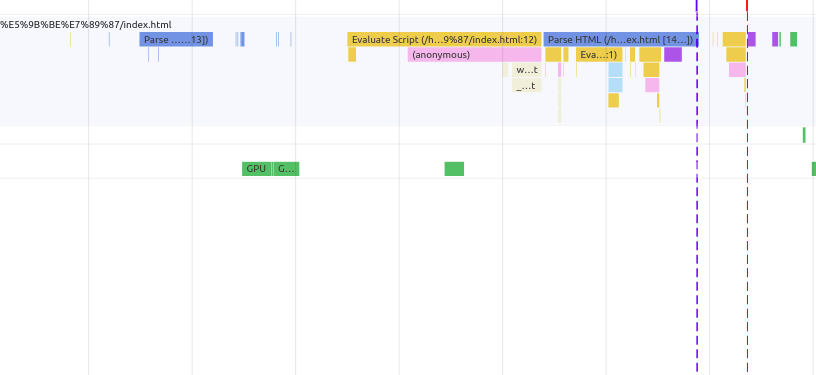

 dom**树**

1. **转换：** 浏览器从磁盘或网络读取 HTML 的原始字节，并根据文件的指定编码（例如 UTF-8）将它们转换成各个字符。
2. **令牌化：** 浏览器将字符串转换成 [W3C HTML5 标准](http://www.w3.org/TR/html5/)规定的各种令牌，例如，“<html>”、“<body>”，以及其他尖括号内的字符串。每个令牌都具有特殊含义和一组规则。
3. **词法分析：** 发出的令牌转换成定义其属性和规则的“对象”。
4. **DOM 构建：** 最后，由于 HTML 标记定义不同标记之间的关系（一些标记包含在其他标记内），创建的对象链接在一个树数据结构内，此结构也会捕获原始标记中定义的父项-子项关系：*HTML* 对象是 *body* 对象的父项，*body* 是 *paragraph* 对象的父项，依此类推。

通俗一点就是，我先从计算机拿到一组原始数据，然后转换成字符，转换成字符以后在根据标准找出其中的标签，即令牌化，在之后相当于给每一个标签一个object,记录他的相关信息，最后根据这个ｏｂｊｅｃｔ，构建ｄｏｍ树。

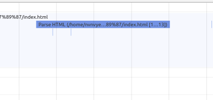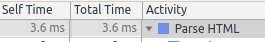

我们会发现花费了3.6ms，如果html很大，那时间肯定就长了

**ＣＳＳＯＭ**

和html类似

CSS 字节转换成字符，接着转换成令牌和节点，最后链接到一个称为“CSS 对象模型”(CSSOM) 的树结构内：

CSSOM 为何具有树结构？为页面上的任何对象计算最后一组样式时，浏览器都会先从适用于该节点的最通用规则开始（例如，如果该节点是 body 元素的子项，则应用所有 body 样式），然后通过应用更具体的规则（即规则“向下级联”）以递归方式优化计算的样式。

以上面的 CSSOM 树为例进行更具体的阐述。*span* 标记内包含的任何置于 body 元素内的文本都将具有 16 像素字号，并且颜色为红色 — font-size 指令从 body 向下级联至 span。不过，如果某个 span 标记是某个段落 (p) 标记的子项，则其内容将不会显示。

还请注意，以上树并非完整的 CSSOM 树，它只显示了我们决定在样式表中替换的样式。每个浏览器都提供一组默认样式（也称为“User Agent 样式”），即我们不提供任何自定义样式时所看到的样式，我们的样式只是替换这些默认样式

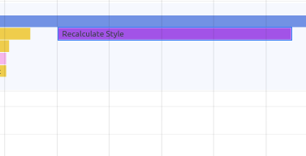

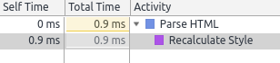

ok,dom和cssom都有了，接下来就开始构建render tree

- DOM 树与 CSSOM 树合并后形成渲染树。
- 渲染树只包含渲染网页所需的节点。
- 布局计算每个对象的精确位置和大小。
- 最后一步是绘制，使用最终渲染树将像素渲染到屏幕上。

通俗一点，从dom树根节点开始遍历每个可见节点，（不可见的会被忽略，包括因为css属性隐藏的）,每个节点都有自己的对应样式，在cssom中找到并应用，最后的结果就是输出的渲染同时包含了屏幕上的所有可见内容及其样式信息

上面的步骤只是计算了节点是否可见和计算样式，但是没有他们的具体位置，接下来就到了布局阶段，即计算出每个节点的位置，类似我们上课排位置

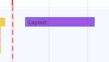

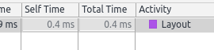

- 布局完成后，浏览器会立即发出“Paint Setup”和“Paint”事件，将渲染树转换成屏幕上的像素。

到此，我们的页面上就会显示你写的东西了

ｏｋ，在记一遍

1. 处理 HTML 标记并构建 DOM 树。
2. 处理 CSS 标记并构建 CSSOM 树。
3. 将 DOM 与 CSSOM 合并成一个渲染树。
4. 根据渲染树来布局，以计算每个节点的几何信息。
5. 将各个节点绘制到屏幕上。

**_优化关键渲染路径_就是指最大限度缩短执行上述第 1 步至第 5 步耗费的总时间。**

了解了相关流程，我们可以看看上面的问题了

请注意这句话

**如果 DOM 或 CSSOM 被修改，您只能再执行一遍以上所有步骤，以确定哪些像素需要在屏幕上进行重新渲染。**

在考虑一个问题，我们都知道，在解析html的时候，浏览器会发起文档中所有的请求，如果不阻塞，我们举个极端例子，如果因为一些特殊原因，css的请求刚好在布局以后回来，而巧的是，我们每个节点都分了一个css文件,那这就导致了我们的浏览器快要累死了，一直在重复同一个操作。所以css阻塞渲染是有必要的。

当然，如果页面对css不是那么急需，我们可以将其标记为不阻塞资源。

请注意，**浏览器会下载所有 CSS 资源，无论阻塞还是不阻塞**。

结论：**CSS 是阻塞渲染的资源。需要将它尽早、尽快地下载到客户端，以便缩短首次渲染的时间。**　我认为白屏就是在等待css资源或者js，ｃｓｓ一些操作阻塞了渲染。而git 裸奔的情况就是因为css加载失败（一直没注意过，在看到这个问题去看了一下，果然是加载失败了），

忘了一句话，　他们阻塞的都是渲染，不会阻塞html的解析

既然看到了ｊｓ，就继续看一下

- JavaScript 可以查询和修改 DOM 与 CSSOM。
- JavaScript 执行会阻止 CSSOM。
- 除非将 JavaScript 显式声明为异步，否则它会阻止构建 DOM。

 不过，JavaScript 也会阻止 DOM 构建和延缓网页渲染。 为了实现最佳性能，可以让您的 JavaScript 异步执行，并去除关键渲染路径中任何不必要的 JavaScript。

**执行我们的内联脚本会阻止 DOM 构建，也就延缓了首次渲染。**

**浏览器将延迟脚本执行和 DOM 构建，直至其完成 CSSOM 的下载和构建。**

- 脚本在文档中的位置很重要。
- 当浏览器遇到一个 script 标记时，DOM 构建将暂停，直至脚本完成执行。
- JavaScript 可以查询和修改 DOM 与 CSSOM。
- JavaScript 执行将暂停，直至 CSSOM 就绪。

ｏｋ，说一下我自己的理解，ｊｓ操作可能会涉及到dom,css的操作，所以dom的构建遇见ｊｓ会暂停，再举个列子，如果不阻塞，ｄｏｍ构建完毕，在执行ｊｓ的发现，ｊｓ操作将这些节点都删除了。我们的浏览器可能就不是高兴了，你在玩呢。ｃｓｓ同样的道理，所以，如果我们去测试，会发现如果css在pending状态，那ｊｓ也会在一直等待

好的，现在我们分析那张图

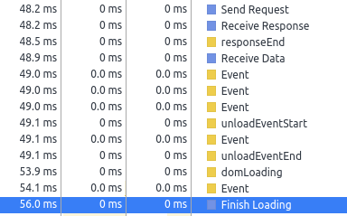

在48.2ms我们发起了html请求，48.2ms返回状态，48.9接收数据,在56ms之前检测一些页面的事件，包括准备工作，

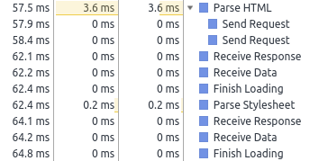

在57.5～64.8发起了对ｃｓｓ和ｊｓ的请求，我们会发现ｊｓ接收在ｃｓｓ后面

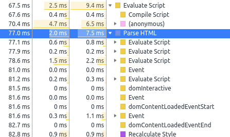

计算script,重新解析html,并结合ｊｓ构建ｄｏｍ树，我觉得上面那个parse html 只是对ｈｔｍｌ做了一个表面的检查，相当于一次偷窥，，回到正题82.8ms构建cssom.

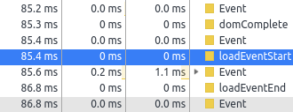

dom完成之后的一些事件

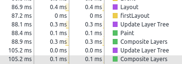

最后就是布局，绘制。

