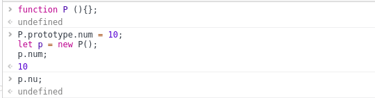
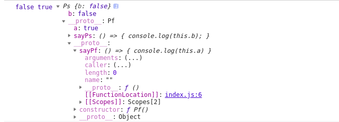
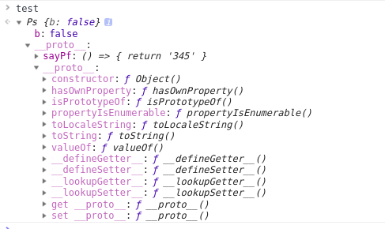
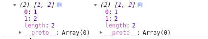
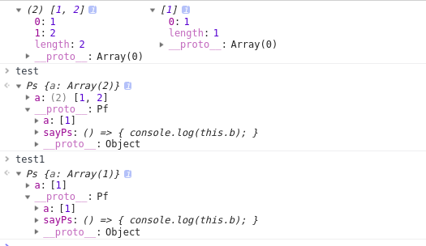
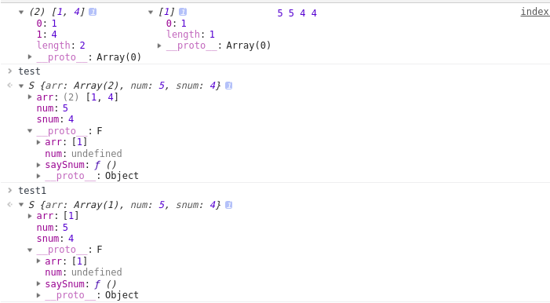
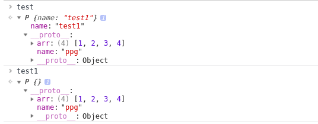
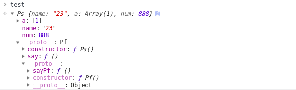

在[原型](https://blog.csdn.net/nvnv_yezi/article/details/81953015)篇中我们知道。由于js里皆对象，所以`__proto__`属性也就人人都有.而这就形成了类似`null--->object.prototype.__proto__--->function.prorotypr.__proto__`的链条。

好的，来个列子



我们会发现p上面并没有num属性，但是他还是拿到了num的值。在分析一下这个过程。在寻找num属性的时候，在p中没有找到,所以他就向p的父级即Ｐ里面找。这个查找的过程就是原型链。

继续，当了解了什么是原型链。我们再来看看继承。（以高程书为主）

### **原型链继承**

> 利用原型让一个引用类型继承另一个引用类型的属性和方法

**构造函数，原型，实例**

> 每个构造函数都有一个原型对象，原型对象都包含一个指向构造函数的指针，而实例都包含一个指向原型对象的内部指针。

````js
function Pf () {
  this.a = true;
}
Pf.prototype.sayPf = () => {
  console.log(this.a)
}

function Ps () {
  this.b = false;
}

Ps.prototype = new Pf();

Ps.prototype.sayPs = () => {
  console.log(this.b);
}

let test = new Ps();

console.log(test.b, test.a, test);
````



从打印的结果可以看到，test继承了Ｐｓ。Ｐｓ继承了Ｐｆ，通过重写原型对象的方法（即令Ｐｓ的原型对象等于Ｐｆ的实例），通俗点来说，Ｐｆ的原型有sayPf方法，Ｐｓ的原型有ａ和sayPs方法，这是因为Ｐｓ的原型作为Ｐｆ的实例，实例属性a当然就在Ps的原型上。当我们打印`test.constructor`的时候，会发现是Ｐｆ，是因为`ps.prototype`中的`constructor`被重写了。

**在提两个关于原型的方法**

`instanceof`和`isPrototypeOf`只要是原型链中出现过的原型，都可以说是该原型链所派生的实例的原型。

**注意问题**

1. **添加或者重写方法一定要在替换原型的语句后面。**

````js
function Pf () {
  this.a = true;
}
Pf.prototype.sayPf = () => {
  console.log(this.a)
}

function Ps () {
  this.b = false;
}
Ps.prototype.sayPf = () => {
  console.log('23');
}

Ps.prototype = new Pf();

Ps.prototype.sayPs = () => {
  console.log(this.b);
}

let test = new Ps();

console.log(test.b, test.a, test.sayPf());
````


当放在后面

````js
Ps.prototype = new Pf();

Ps.prototype.sayPs = () => {
  console.log(this.b);
}
Ps.prototype.sayPf = () => {
  console.log('23');
}
````


​		

2. **在通过原型链实现继承后，不能使用对象字面量方法创建原型方法。**

````js
Ps.prototype = new Pf();

Ps.prototype.sayPs = () => {
  console.log(this.b);
}
Ps.prototype = {
  sayPf: () => {
    return '345'
  }
}
````




从图看出，Ps和Pf之间已经没有联系了，Ps直接继承`Object.prototype`

3. **包含引用类型值的原型属性会被所有实例共享，**

````js
let test = new Ps();
let test1 = new Ps();
test1.a.puah(2);
console.log(test.a, test1.a);
````



4. **在创建子类型实例时，不能向超类型的构造函数中传递参数，因为没有办法保证可以不影响所有对象实例。**

总结：鉴于以上种种缺点，实践中很少会单独使用原型链。

### **借用构造函数**

> 在子类型构造函数的内部调用超类型构造函数，又叫（伪对象继承或经典继承）

````js
function Pf () {
  this.a = [1];
}
Pf.prototype.sayPf = function (num) {
  console.log(this, this.a, num)
}

function Ps () {
  Pf.call(this);//继承了Ｐｆ
}

let test = new Ps();
let test1 = new Ps();
test.a.push(2);

console.log(test.a, test1.a);
````



通过`call`方法，在未来将要新建的ＰＳ实例的环境下调用了Ｐｆ构造函数、这样就会在新Ｐｓ对象上执行Ｐｆ函数中定义的所有对象初始化代码。从结果我们可以看到，每个实例都有自己的ａ属性的副本。

上面提到过传递参数的问题

````js
function Pf (a) {
  this.a = a;
}

function Ps () {
  Pf.call(this, 2);
  this.b = 3;
}

let test = new Ps();

console.log(test.a, test.b);//2 3
````

注意，**在调用超类型构造函数后，在添加子类型中需要的属性，避免构造函数重写子类型的属性**

问题：**为避免引用类型共用问题，方法都将定义在构造函数里面，也就没有复用了。还有一点，原型中定义的方法在子类型都是不可见的，即所有类型都将使用构造函数模式**

### **组合继承**

> 结合原型链和构造函数，发挥二者之长，（又叫伪经典继承）即使用原型链实现原型上属性和方法的继承，用构造函数来弥补原型上的问题，实现对实例属性的继承，保证每个实例都它自己的属性。

````js
function F(num) {
  this.arr = [1];
  this.num = num;
}
F.prototype.sayArr = function () {
  return this.arr;
}
F.prototype.sayNum = function (params) {
  return this.num;
}

function S(params) {
  F.call(this, 5);
  this.snum = 4;
}
S.prototype = new F();
S.prototype.saySnum = function () {
  return this.snum;
}

let test = new S();
let test1 = new S();
test.arr.push(4);
console.log(test.sayArr(), test1.sayArr(), test.sayNum(), test1.sayNum(), test.saySnum(), test1.saySnum());
````



从上图得知，我们通过构造函数继承了Ｆ的arr和num属性，让后面的实例都有自己的属性，通过原型链的方式，又使所有的实例共享原型上的方法sayArr,sayNum等方法。

正因为组合继承避免了原型和借用构造函数的缺陷，成为`javascript`最常用的继承模式，而且`instanceof`和`isPrototypeOf`也能够用于识别基于组合继承创建对象的对象。

### **原型式继承**

> 借助原型可以基于已有的对象创建新对象，同时还不必因此创建自定义类型。

````js
function object (o) {
  function P() {};
  P.prototype = o;
  return new P();
}
````

在`object`内部，先创建一个临时构造函数，然后将传入的对象作为这个构造函数的原型，最后返回这个临时类型的一个新实例。

````js
function object (o) {
  function P() {};
  P.prototype = o;
  return new P();
}

let obj = {
  name: 'ppg',
  arr: [1,2]
}

let test = object(obj);
let test1 = object(obj);

test.name = 'test';
test.name = 'test1';

test.arr.push(3);
test1.arr.push(4);
````



在例子中，我们将obj传入object, 新对象将obj作为原型，最后返回一个新对象，我们会发现，这个和原型链继承有一样的缺点，引用类型值的属性始终都会共享相应的值。

提一个类似的方法，`object.create`，

使用现有对象创建一个新对象，以提供新创建的对象的`__proto__`。

```js
Object.create（proto [，propertiesObject ]）
```

### 参数

- `proto`

  该对象应该是新创建的对象的原型。

- `propertiesObject`

  可选的。如果指定而不是[`undefined`](https://developer.mozilla.org/en-US/docs/Web/JavaScript/Reference/Global_Objects/undefined)，则具有可枚举的自身属性（即，在其自身上定义的那些属性而*不是*沿其原型链的可枚举属性）的对象指定要添加到新创建的对象的属性描述符，以及相应的属性名称。这些属性对应于第二个参数[`Object.defineProperties()`](https://developer.mozilla.org/en-US/docs/Web/JavaScript/Reference/Global_Objects/Object/defineProperties)。

### 返回值

具有指定原型对象和属性的新对象。


### **寄生式继承**

> 创建一个仅用于封装继承过程的函数，该函数在内部以某种方式来增强对象，最后再像真地是它做了所有工作一样返回对象。

````js
function createAnother (obj) {
  let o = Object.create(obj);
  o.say = function (params) {
    return '1123';
  }
}

let obj = {
  name: 'ppg',
  arr: [1,2]
}

let o = createAnother(obj);
````

createAnother 接收一个参数，即将要作为新对象基础的对象，在函数内部创建一个新对象，在给新对象添加一个say方法。最后返回新对象。

注意：**在主要考虑对象而不是自定义类型和构造函数的情况下，可以考虑。会由于不能复用而降低效率**

### **寄生组合式继承**

> 组合继承作为最常用的继承模式，也不是完全完美的，他的问题就是无论什么情况下都会调用两次超类型构造函数，一次是在创建子类型原型的时候，另一次是在子类型构造函数内部。

```js
function F(num) {
  this.arr = [1];
  this.num = num;
}
F.prototype.sayArr = function () {
  return this.arr;
}
F.prototype.sayNum = function (params) {
  return this.num;
}

function S(params) {
  F.call(this, 5);		//第二次调用
  this.snum = 4;
}
S.prototype = new F();  //第一次调用
S.prototype.saySnum = function () {
  return this.snum;
}

let test = new S();
let test1 = new S();
test.arr.push(4);
console.log(test.sayArr(), test1.sayArr(), test.sayNum(), test1.sayNum(), test.saySnum(), test1.saySnum());
```

第一次调用时，Ｓ的原型上会有arr和num两个属性，第二次调用时，在新对象上创建了实例属性arr和num。这两个属性会屏蔽原型中的两个同名属性。

为了解决这个问题，我们引入寄生组合式继承

> 通过借用构造函数来继承属性，通过原型链的混成形式来继承方法。基本思路：不必为了指定子类型的原型而调用超类型的构造函数，本质上，使用寄生式继承来继承超类型的原型，然后再将结果指定给子类型的原型。

````js

function inferitproto (s, f) {
  let o = Object.create(f.prototype);
  o.constructor = s;
  s.prototype = o;
}

function Pf () {
  this.name = '23';
  this.a = [1];
}
Pf.prototype.sayPf = function () {
  console.log(this.name, this.a)
}

function Ps () {
  Pf.call(this);
  this.num = 888;
}
inferitproto(Ps, Pf);

Ps.prototype.say = function () {
  return this.num;
}

let test = new Ps();
````



看`infetitproto`函数，接收两个参数，子类型构造函数和超类型构造函数。在函数内部，第一步是创建超类型原型的一个副本，第二部重写`constructor`属性，弥补重写原型失去的`constructor`属性。最后将创建的对象赋值给子类型的原型。

注意：我们会发现相对于组合继承，子类型构造函数原型上面没有多余的属性，好处就是只调用了一次超类型构造函数，这是普遍认为最理想的继承范式。

**注意**

最后在总结一下各个继承的特点：

__原型链继承__

特点：　

- 实例是子类的实例，也是父类的实例
- 父类新增的原型方法，子类都可以访问

缺点：

- 为子类添加新的原型方法只能在原型继承之后
- 无法实现多继承
- 引用类型对象都是共享的
- 子类实例创建时，无法向父类构造函数传参

**构造继承**

特点：

- 解决了引用类型共享的问题
- 创建子类实例时，可以向父类传递参数
- 可以实现多继承

缺点：

- 实例是子类的实例
- 只能继承实例属性和方法，不能继承原型
- 无法实现函数复用，影响效率性能

**组合继承**

特点：

- 弥补上面两种的问题，可以继承实例和原型的属性和方法，也解决引用类型共享问题
- 既是子类实例，也是父类实例
- 可传参
- 函数可复用

缺点：

- 调用两次超类型构造函数，生成两份实例，实例和原型上各有一份

**原型式继承**

特点：

- `object,create`的模拟实现，将传入的对象作为创建对象的原型

缺点：

- 包含引用类型的属性值都会共享相应的值

**寄生式继承**

缺点：

- 每次创建对象都会创建一遍方法

**寄生组合继承**

特点：

- 解决了调用两次构造函数的问题

缺点：

- 实现较为复杂

