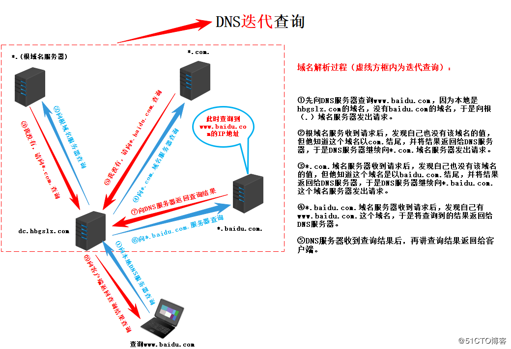

#### DNS

**域名系统**（英语：**D**omain **N**ame **S**ystem，缩写：**DNS**）是互联网的一项服务。它作为将[域名](https://zh.wikipedia.org/wiki/域名)和[IP地址](https://zh.wikipedia.org/wiki/IP地址)相互映射的一个[分布式数据库](https://zh.wikipedia.org/wiki/分布式数据库)，能够使人更方便地访问[互联网](https://zh.wikipedia.org/wiki/互联网)。DNS使用[TCP](https://zh.wikipedia.org/wiki/传输控制协议)和[UDP](https://zh.wikipedia.org/wiki/用户数据报协议)[端口](https://zh.wikipedia.org/wiki/TCP/UDP端口列表)53。当前，对于每一级域名长度的限制是63个字符，域名总长度则不能超过253个字符。

### 解析过程

#### 1. 浏览器缓存

浏览器缓存有时间和空间的限制

#### 2. 系统缓存

在浏览器缓存未命中的情况下，继续向下查找，系统缓存通常是在一个文件中，我们可以通过修改映射关系来改变解析的结果，所以存在一定的安全隐患，不过这个文件一般是只读的。

#### 3. 路由器缓存

#### 4. ISP DNS缓存

通常是提供接入互联网的应用提供商，一般会缓存大量的域名解析的结果，负责大部分的解析工作

#### 5. Root Server

向根域名发起解析请求，根域名服务器返回给本地服务器一个所查询域的主域名服务器地址（gTLD Server）。gTLD是国际顶级域名服务器，如.com、.cn、.org等

#### 6. gTLD服务器接受请求并返回Name Server服务器

服务器根据需要的域名找到该域名对应的域名服务器，这个Name Server通常就是你注册的域名服务器的域名服务商

#### 7. Name Server返回IP地址给本地服务器

Name Server域名服务器会查询存储的域名和IP的映射关系表，正常情况下都根据域名得到目标IP表，连同一个TTL值返回给DNS Server域名服务器。

#### 8. 本地域名服务器缓存解析结果并返回给用户

### 递归查询+迭代查询

真正使用应该是两个相结合，主机向本地域名服务器使用递归查询，本地域名服务器随后采用迭代查询

