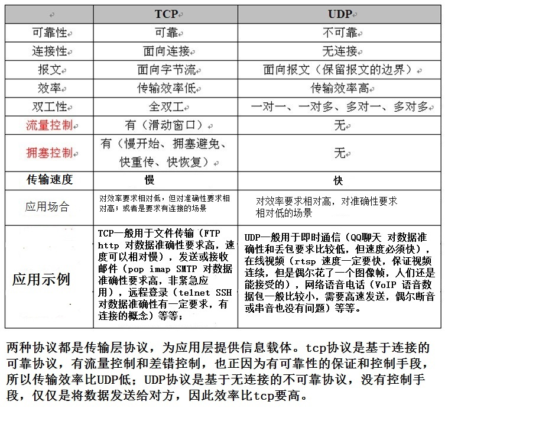
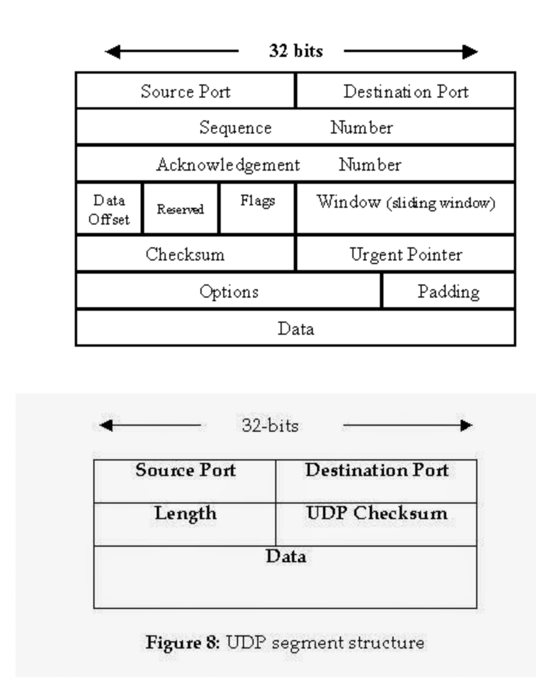
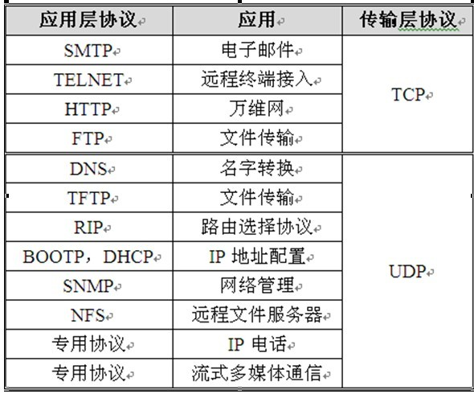

### TCP（传输控制协议）

面向连接，可靠的，基于字节流的传输层通信协议

应用层向TCP层发送用于网间传输的，用8位字节表示的数据流，TCP层把数据流分割成适当长度的报文段（通常受该计算机连接的网络的数据链路层的[最大传输单元](https://zh.wikipedia.org/wiki/最大传输单元)（MTU）的限制）。之后TCP把结果包传给IP层，由它来通过网络将包传送给接收端实体的TCP层。

TCP为了保证不发生丢包，就给每个包一个序号，同时序号也保证了传送到接收端实体的包的按序接收。然后接收端实体对已成功收到的包发回一个相应的[确认信息](https://zh.wikipedia.org/wiki/確認訊息)（ACK）；如果发送端实体在合理的[往返时延](https://zh.wikipedia.org/wiki/來回通訊延遲)（RTT）内未收到确认，那么对应的数据包就被假设为[已丢失](https://zh.wikipedia.org/wiki/丢包)并进行重传。TCP用一个[校验和](https://zh.wikipedia.org/wiki/校验和)函数来检验数据是否有错误，在发送和接收时都要计算校验和。

#### 数据传输

在TCP的数据传送状态，保证TCP的可靠性和强壮性的机制

- 使用序号，对收到的TCP报文段进行排序以及检测重复的数据；
- 使用检验和检测报文段的错误 ，即无错传输
- 使用确认和计时器来检测和纠正丢包或延时
- 流量控制
- 拥塞控制
- 丢失包的重传

#### 可靠传输

通常每个TCP报文段都会有序号（发送方）和确认号（接收方），TCP报文的接收者为了确保可靠性，在接收一定数量的字节流后才发送确认，这是对TCP的一种拓展，称为选择确认。选择确认使得接收方可以将乱序到达的数据块进行排序，以此将报文段中的字节按照正确的顺序传送给应用层。

在每接收一个字节后，ISN号都会递增一。序号是32位的无符号数，并且在增长到232-1时会置0，使用ISN可以确保强壮性和安全性

在发送第一个包（SYN包）时，选择一个随机数作为序号的初值，以克制TCP序号预测攻击

可靠性通过发送方检测到丢失的传输数据并重传这些数据。包括超时重传（Retransmission timeout，RTO）与重复累计确认（duplicate cumulative acknowledgements，DupAcks）。

#### 重复累计确认

假设序号在100的时候丢失，接收方将不能确认100以后的包，一般会采取直接废弃后面的包或者将后面的包放入缓存区，待缺失的包到达后在取出来对比。 

接收方在收到后面的包时，同时会发出对丢失包的确认，发送方如果收到3次对同一个包的确认则重新发送该包（阈值设为3被证实可以减少乱序包导致的无作用的重传（spurious retransmission）现象）。

选择确认的使用能明确反馈那个包收到了，极大改善了TCP重传必要包的能力

#### 超时重传

发送方使用一个合理的时间作为收到数据包的确认的超时上限，如果时间到了但是没有收到确认包，发送方将重传这个数据包。每当发送方接收到确认包时重置这个时间

如果重传定时器被触发，仍然没有收到确认包，定时器的值将被设为前次值的二倍（直到特定阈值）。这可对抗 [中间人攻击](https://zh.wikipedia.org/wiki/中间人攻击)方式的[拒绝服务攻击](https://zh.wikipedia.org/wiki/拒绝服务攻击)，这种攻击愚弄发送者重传很多次导致接受者被压垮。

#### 流量控制

发送方发送的字节数量不能超过接收方所允许的接受数量，避免发送方发送过快，接收方来不及接受，一般由接收方通知发送方进行监控

TCP使用[滑动窗口协议](https://zh.wikipedia.org/w/index.php?title=滑动窗口协议&action=edit&redlink=1)实现流量控制。接收方在“接收窗口”域指出还可接收的字节数量。发送方在没有新的确认包的情况下至多发送“接收窗口”允许的字节数量。接收方可修改“接收窗口”的值。

#### 拥塞控制

发送方根据网络的承载情况控制分组的发送量，以获取高性能又能避免拥塞崩溃

发送方与接收方根据确认包或者包丢失的情况，以及定时器，估计网络拥塞情况，从而修改数据流的行为，这称为拥塞控制或网络拥塞避免。

TCP的现代实现包含四种相互影响的拥塞控制算法：[慢开始](https://zh.wikipedia.org/wiki/慢开始)、拥塞避免、[快速重传](https://zh.wikipedia.org/w/index.php?title=快速重传&action=edit&redlink=1)、[快速恢复](https://zh.wikipedia.org/w/index.php?title=快速恢复&action=edit&redlink=1)。

### UDP（用户数据报协议）

简单的面向数据报的协议，只提供数据的不可靠传递，一旦把数据传送出去就不保留备份。

UDP适用于不需要或在[程序](https://zh.wikipedia.org/wiki/计算机程序)中执行[错误检查和纠正](https://zh.wikipedia.org/wiki/错误检测与纠正)的[应用](https://zh.wikipedia.org/wiki/应用程序)。因为它避免了[协议栈](https://zh.wikipedia.org/wiki/协议栈)中此类处理的[开销](https://zh.wikipedia.org/w/index.php?title=开销&action=edit&redlink=1)。对时间有较高要求的应用程序通常使用UDP，因为丢弃数据包比等待或重传导致延迟更可取。

#### 可靠性

UDP缺乏[可靠性](https://zh.wikipedia.org/wiki/可靠性_(计算机网络))且属于[无连接](https://zh.wikipedia.org/wiki/無連接式通訊)协议，所以应用程序通常必须容许一些[丢失](https://zh.wikipedia.org/wiki/丢包)、错误或重复的[数据包](https://zh.wikipedia.org/wiki/数据包)。某些应用程序（如[TFTP](https://zh.wikipedia.org/wiki/TFTP)）可能会根据需要在应用程序层中添加基本的可靠性机制

UDP缺乏[拥塞控制](https://zh.wikipedia.org/wiki/拥塞控制)，所以需要基于网络的机制来减少因失控和高速UDP流量负荷而导致的拥塞崩溃效应。换句话说，因为UDP发送端无法检测拥塞，所以像使用包队列和丢弃技术的路由器之类的网络基础设备会被用于降低UDP过大流量。[数据拥塞控制协议](https://zh.wikipedia.org/wiki/数据拥塞控制协议)（DCCP）设计成通过在诸如流媒体类型的高速率UDP流中增加主机拥塞控制，来减小这个潜在的问题。

### 区别

- TCP会将过大的数据块分成小块进行传输或者将很多小的合并成一个大的数据块传输（粘包）。UDP一个报文段发送一次
- TCP没有保护边界，因为是以流的方式。UDP每一个消息都是独立的，有保护边界
- TCP具有比UDP更大的头。一个TCP数据包报头的大小是20字节，UDP数据报报头是8个字节。TCP报头中包含序列号，ACK号，数据偏移量，保留，控制位，窗口，紧急指针，可选项，填充项，校验位，源端口和目的端口。而UDP报头只包含长度，源端口号，目的端口，和校验和。

### 优缺点

**TCP优点**

- 可靠，稳定
- TCP的可靠体现在TCP在传递数据之前，会有三次握手来建立连接，而且在数据传递时，有确认、窗口、重传、拥塞控制机制，在数据传完后，还会断开连接用来节约系统资源

**TCP缺点**

- 慢，效率低，占用系统资源高，易被攻击 
- TCP在传递数据之前，要先建连接，这会消耗时间，而且在数据传递时，确认机制、重传机制、拥塞控制机制等都会消耗大量的时间，而且要在每台设备上维护所有的传输连接，事实上，每个连接都会占用系统的CPU、内存等硬件资源。 
- 因为TCP有确认机制、三次握手机制，这些也导致TCP容易被人利用，实现DOS、DDOS、CC等攻击。

**UDP优点**

- 快速
- UDP没有TCP的握手、确认、窗口、重传、拥塞控制等机制，UDP是一个无状态的传输协议，所以它在传递数据时非常快。没有TCP的这些机制，UDP较TCP被攻击者利用的漏洞就要少一些。但UDP也是无法避免攻击的，比如：UDP Flood攻击……

**UDP缺点**

- 不可靠，不稳定
- 因为UDP没有TCP那些可靠的机制，在数据传递时，如果网络质量不好，就会很容易丢包。

#### 应用场景

**什么时候应该使用TCP：**

当对网络通讯质量有要求的时候，比如：整个数据要准确无误的传递给对方，这往往用于一些要求可靠的应用，比如HTTP、HTTPS、FTP等传输文件的协议，POP、SMTP等邮件传输的协议。 
在日常生活中，常见使用TCP协议的应用如下：

- 浏览器，用的HTTP
- FlashFXP，用的FTP
- Outlook，用的POP、SMTP
- Putty，用的Telnet、SSH
- QQ文件传输

**什么时候应该使用UDP：**

当对网络通讯质量要求不高的时候，要求网络通讯速度能尽量的快，这时就可以使用UDP。 
比如，日常生活中，常见使用UDP协议的应用如下：

- QQ语音
- QQ视频
- TFTP
