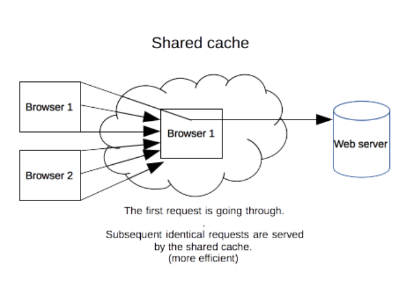
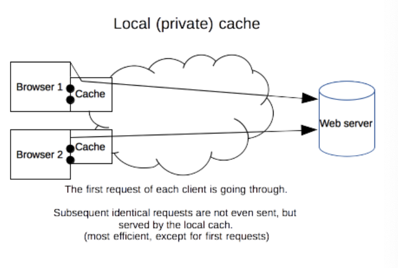
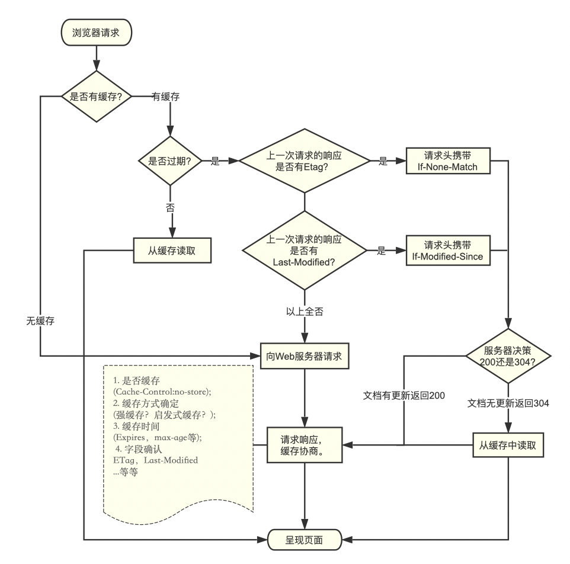

#### 缓存

#### 概念

缓存是一种保存资源副本并在下次请求时直接使用该副本的技术，当web缓存发现请求的资源已经被存储，就会拦截当前请求，返回该资源的副本，而不会去源服务器重新下载

**TODO**

对于网站来说，缓存时达到高性能的重要组成部分，缓存需要合理配置，因为不是所有的资源都是永久不变的，重要的是对一个资源的缓存应截止到其下一次发生改变（不能缓存过期的资源）

#### 好处

重用已获取的资源能够有效的提升网站与应用的性能，web缓存能够减少延迟与网络阻塞，进而减少显示某个资源所用的时间。借助HTTP缓存，Web站点变得更具有响应性。

- 缓解服务器端压力
- 提升性能(获取资源的耗时更短了)

#### 分类

私有缓存与共享缓存

##### 共享缓存

共享缓存存储的响应能够被多个用户使用，例如，ISP(*Internet Service Provider*)或你所在的公司可能会架设一个 web 代理来作为本地网络基础的一部分提供给用户。这样热门的资源就会被重复使用，减少网络拥堵与延迟。

```http
Cache-Control: public
```



##### 私有缓存

只能用于单独用户，

```http
Cache-control: private
```



##### 网关缓存（部署在服务器）

*网关*（英语：Gateway）是转发其他服务器通信数据的服务器，接收从客户端发送来的请求时，它就像自己拥有资源的源服务器一样对请求进行处理。

也被称为**代理缓存或反向代理缓存**，网关也是一个中间服务器，网关缓存一般是网站管理员自己部署，从让网站拥有更好的性能。

CDNS(网络内容分发商)分布网关缓存到整个（或部分）互联网上，并出售缓存服务给需要的网站，比如国内的七牛云、又拍云都有这种服务。

##### CDN（详见网络相关，部署在服务器）

CDN（Content delivery networks）缓存，也叫网关缓存、反向代理缓存。CDN缓存一般是由网站管理员自己部署，为了让他们的网站更容易扩展并获得更好的性能。浏览器先向CDN网关发起Web请求，网关服务器后面对应着一台或多台负载均衡源服务器，会根据它们的负载请求，动态将请求转发到合适的源服务器上。虽然这种架构负载均衡源服务器之间的缓存没法共享，但却拥有更好的处扩展性。从浏览器角度来看，整个CDN就是一个源服务器。

##### 反向代理缓存（部署在服务器）

代理服务器是浏览器和源服务器之间的中间服务器，浏览器在请求时，实际会先通过这个中间服务器的处理（权限验证，缓存匹配等），再将请求转发到源服务器。

缓存原理和浏览器端类似，但规模要大得多，可以将其理解为一个共享缓存，，一般是为成千上万的用户提供缓存机制，因此在减少相应时间和带宽使用方面很有效，大公司和大型的ISP提供商通常会将它们设立在防火墙上或是作为一个独立的设备来运营。（Squid Cache）

由于缓存服务器不是客户端或是源服务器的一部分，它们存在于网络中，请求路由必须经过它们才会生效，所以实际上你可以去手动设置浏览器的代理，或是通过一个中间服务器来进行转发，这样用户自然就察觉不到代理服务器的存在了。

##### 负载均衡器（部署在服务器）

##### 浏览器缓存

###### memory cache

将资源缓存到内存中，下次访问时不需要重新下载资源，直接从内存中获取。
Webkit将资源分成两类

- 一类是主资源，比如HTML页面，或者下载项
- 一类是派生资源，比如HTML页面中内嵌的图片或者脚本链接

内存缓存持续性很短，会随着进程的释放而释放，关闭页面的时候，内存中的缓存就释放了

**内存缓存在缓存资源时并不关心返回资源的HTTP缓存头Cache-Control是什么值，同时资源的匹配也并非仅仅是对URL做匹配，还可能会对Content-Type，CORS等其他特征做校验**。

######	DiskCache

将资源缓存到磁盘中，下次访问时不需要重新下载资源，而直接从磁盘中获取

读取速度比内存缓存慢，但是容量大，并且时效性强
两个的相似之处就是只能存储一些派生类资源文件。

其存储形式为一个index.dat文件，记录存储数据的url，然后再分别存储该url的response信息和content内容。Response信息最大作用就是用于判断服务器上该url的content内容是否被修改。

##### 数据库缓存

当我们的应用极其复杂，表自然也很繁杂，我们必须进行频繁的进行数据库查询，这样可能导致数据库不堪重负，一个好的办法就是将查询后的数据放到内存中，下一次查询直接从内存中取就好了。

#### 缓存操作的目标

常见的HTTP缓存只能存储GET响应，对于其他的类型的响应则无能为力，缓存的关键主要包括request method和目标URI（一般只有GET请求才会被缓存）

普遍的缓存案例

- 一个检索请求的成功响应: 对于 [`GET`](https://developer.mozilla.org/zh-CN/docs/Web/HTTP/Methods/GET)请求，响应状态码为：[`200`](https://developer.mozilla.org/zh-CN/docs/Web/HTTP/Status/200)，则表示为成功。一个包含例如HTML文档，图片，或者文件的响应。
- 永久重定向: 响应状态码：[`301`](https://developer.mozilla.org/zh-CN/docs/Web/HTTP/Status/301)。
- 错误响应: 响应状态码：[`404`](https://developer.mozilla.org/zh-CN/docs/Web/HTTP/Status/404) 的一个页面。
- 不完全的响应: 响应状态码 [`206`](https://developer.mozilla.org/zh-CN/docs/Web/HTTP/Status/206)，只返回局部的信息。
- 除了 [`GET`](https://developer.mozilla.org/zh-CN/docs/Web/HTTP/Methods/GET) 请求外，如果匹配到作为一个已被定义的cache键名的响应。

### 缓存相关 header

#### Pragma

是HTTP/1.0标准中定义的一个header属性，效果依赖于不同的实现，所以在请求-响应链中会有不同的效果，它用来向后兼容只支持HTTP/1.0协议的缓存服务器。

`pragma: no-cache`

与`Cache-control：no-cache `一致，强制要求缓存服务器在使用缓存时先将请求提交到源服务器进行验证

#### Expries

响应头包含日期/时间， 即在此时候之后，响应过期。

无效的日期，比如 0, 代表着过去的日期，即该资源已经过期。

如果在[`Cache-Control`](https://developer.mozilla.org/zh-CN/docs/Web/HTTP/Headers/Cache-Control)响应头设置了 "max-age" 或者 "s-max-age" 指令，那么 `Expires` 头会被忽略。

```css
//也可以在html头部
<meta http-equiv="expires" content="Thu, 30 Nov 2017 11:17:26 GMT">
```

#### Cache-control

##### 请求指令

- max-age=<seconds>： 设置缓存存储的最大周期，超过这个时间缓存被认为过期（秒），与Expires相反，时间是相对于请求的时间。

  某些浏览器（比如Firefox）中如果设定为永不缓存，那么其发出的请求中，请求头会包含`max-age=0`。

- max-stale[=<seconds>： 客户端愿意接受一个过期的资源，可选的设置一个时间（单位秒），表示响应不能超过的过时时间。

- min-fresh=<seconds>： 客户端在指定的时间内获取最新的响应

- no-cache

- no-store

- no-transform

- Only-if-cahced：客户端只接受已缓存的响应，并且不要向原始服务器检查是否有更新的拷贝，cache应该要么用缓存的内容给出响应，要么给出一个504（GateWay Timeou）响应码。如果一组cache被作为一个内部相连的系统，那么其中的某个成员可以向这个缓存组里请求响应。

##### 响应指令

- must-revalidate： 缓存必须在使用前验证旧资源的状态，并且不可使用过期资源
- no-cache： 在释放缓存副本之前，强制高速缓存将请求提交给原始服务器进行验证
- no-store：缓存不应存储有关客户端请求或服务器响应的任何内容。
- no-transform：不得对资源进行转换或转变。Content-Encoding, Content-Range, Content-Type等HTTP头不能由代理修改。例如，非透明代理可以对图像格式进行转换，以便节省缓存空间或者减少缓慢链路上的流量。 no-transform指令不允许这样做。
- Public: 响应可以被任何对象（发送请求的客户端，代理服务器等）缓存
- private：响应只能被单个用户缓存，不能作为共享缓存（代理服务器不能缓存它），可以缓存响应内容
- max-age=<seconds>： 设置缓存存储的最大周期，超过这个时间缓存被认为过期（秒），与Expires相反，时间是相对于请求的时间。
- proxy-revalidate： 与must-revalidate作用相同，但它仅适用于共享缓存（例如代理），并被私有缓存忽略。
- s-maxage=<seconds>：覆盖max-age或者Expries头。但是仅用于共享缓存（比如各个代理），私有缓存会被忽略

##### 拓展指令

- immutable：表示响应正文不会随时间而改变。资源（如果未过期）在服务器上不发生改变，因此客户端不应发送重新验证请求头（例如If-None-Match或If-Modified-Since）来检查更新，即使用户显式地刷新页面。在Firefox中，immutable只能被用在 `https://` transactions.
- stale-while-revalidate=<seconds>：客户端愿意接受陈旧的响应，同时在后台异步检查新的响应，秒值表示客户端愿意接受陈旧响应的时间
- stale-if-error=<seconds>；表示如果新的检查失败，则客户愿意接受陈旧的响应。秒数值表示客户在初始到期后愿意接受陈旧响应的时间。

#### If-Modified-Since(http1.0) / Last-Modified(http1.0) /If-Unmodified-Since

##### Last-Modified

响应首部，其中包含源头服务器认定的资源做出修改的日期及时间。 它通常被用作一个验证器来判断接收到的或者存储的资源是否彼此一致。由于精确度比  [`ETag`](https://developer.mozilla.org/zh-CN/docs/Web/HTTP/Headers/ETag) 要低，所以这是一个备用机制。包含有  [`If-Modified-Since`](https://developer.mozilla.org/zh-CN/docs/Web/HTTP/Headers/If-Modified-Since) 或 [`If-Unmodified-Since`](https://developer.mozilla.org/zh-CN/docs/Web/HTTP/Headers/If-Unmodified-Since) 首部的条件请求会使用这个字段。

##### If-Modified-Since

条件式请求首部，服务器只在所请求的资源在给定的日期时间之后对内容进行过修改的情况下才会将资源返回，状态码为 [`200`](https://developer.mozilla.org/zh-CN/docs/Web/HTTP/Status/200)  。如果请求的资源从那时起未经修改，那么返回一个不带有消息主体的  [`304`](https://developer.mozilla.org/zh-CN/docs/Web/HTTP/Status/304)  响应，而在 [`Last-Modified`](https://developer.mozilla.org/zh-CN/docs/Web/HTTP/Headers/Last-Modified) 首部中会带有上次修改时间。 不同于  [`If-Unmodified-Since`](https://developer.mozilla.org/zh-CN/docs/Web/HTTP/Headers/If-Unmodified-Since), `If-Modified-Since` 只可以用在 [`GET`](https://developer.mozilla.org/zh-CN/docs/Web/HTTP/Methods/GET) 或 [`HEAD`](https://developer.mozilla.org/zh-CN/docs/Web/HTTP/Methods/HEAD) 请求中。

当与 [`If-None-Match`](https://developer.mozilla.org/zh-CN/docs/Web/HTTP/Headers/If-None-Match) 一同出现时，它（**If-Modified-Since**）会被忽略掉，除非服务器不支持 `If-None-Match`。

最常见的应用场景是来更新没有特定 [`ETag`](https://developer.mozilla.org/zh-CN/docs/Web/HTTP/Headers/ETag) 标签的缓存实体。

##### If-Unmodified-since

请求首部，使得当前请求成为条件式请求：只有当资源在指定的时间之后没有进行过修改的情况下，服务器才会返回请求的资源，或是接受 [`POST`](https://developer.mozilla.org/zh-CN/docs/Web/HTTP/Methods/POST) 或其他 non-[safe](https://developer.mozilla.org/en-US/docs/Glossary/safe) 方法的请求。如果所请求的资源在指定的时间之后发生了修改，那么会返回 [`412`](https://developer.mozilla.org/zh-CN/docs/Web/HTTP/Status/412) (Precondition Failed/先决条件失败）错误。

常见的应用场景有两种：

- 与 non-[safe](https://developer.mozilla.org/en-US/docs/Glossary/safe) 方法如 [`POST`](https://developer.mozilla.org/zh-CN/docs/Web/HTTP/Methods/POST) 搭配使用，可以用来[优化并发控制](https://en.wikipedia.org/wiki/Optimistic_concurrency_control)，例如在某些wiki应用中的做法：假如在原始副本获取之后，服务器上所存储的文档已经被修改，那么对其作出的编辑会被拒绝提交。
- 与含有 [`If-Range`](https://developer.mozilla.org/zh-CN/docs/Web/HTTP/Headers/If-Range) 消息头的范围请求搭配使用，用来确保新的请求片段来自于未经修改的文档。

#### If-Match/If-None-Match/ETag

##### If-Match

请求首部。在请求方法为 [`GET`](https://developer.mozilla.org/zh-CN/docs/Web/HTTP/Methods/GET) 和 [`HEAD`](https://developer.mozilla.org/zh-CN/docs/Web/HTTP/Methods/HEAD) 的情况下，服务器仅在请求的资源满足此首部列出的 `ETag `之一时才会返回资源。而对于 [`PUT`](https://developer.mozilla.org/zh-CN/docs/Web/HTTP/Methods/PUT) 或其他非安全方法来说，只有在满足条件的情况下才可以将资源上传。

The comparison with the stored [`ETag`](https://developer.mozilla.org/zh-CN/docs/Web/HTTP/Headers/ETag) 之间的比较使用的是**强比较算法**，即只有在每一个比特都相同的情况下，才可以认为两个文件是相同的。在 ETag 前面添加    `W/` 前缀表示可以采用相对宽松的算法。

以下是两个常见的应用场景：

- 对于 [`GET`](https://developer.mozilla.org/zh-CN/docs/Web/HTTP/Methods/GET)  和 [`HEAD`](https://developer.mozilla.org/zh-CN/docs/Web/HTTP/Methods/HEAD) 方法，搭配  [`Range`](https://developer.mozilla.org/zh-CN/docs/Web/HTTP/Headers/Range)首部使用，可以用来保证新请求的范围与之前请求的范围是对同一份资源的请求。如果  ETag 无法匹配，那么需要返回 [`416`](https://developer.mozilla.org/zh-CN/docs/Web/HTTP/Status/416)` `(Range Not Satisfiable，范围请求无法满足) 响应。
- 对于其他方法来说，尤其是 [`PUT`](https://developer.mozilla.org/zh-CN/docs/Web/HTTP/Methods/PUT), `If-Match` 首部可以用来避免[更新丢失问题](https://www.w3.org/1999/04/Editing/#3.1)。它可以用来检测用户想要上传的不会覆盖获取原始资源之后做出的更新。如果请求的条件不满足，那么需要返回  [`412`](https://developer.mozilla.org/zh-CN/docs/Web/HTTP/Status/412) (Precondition Failed，先决条件失败) 响应。

##### If-None-Match / Etag(http1.1)

请求首部。对于 GET[`GET`](https://developer.mozilla.org/zh-CN/docs/Web/HTTP/Methods/GET) 和 [`HEAD`](https://developer.mozilla.org/zh-CN/docs/Web/HTTP/Methods/HEAD) 请求方法来说，当且仅当服务器上没有任何资源的 [`ETag`](https://developer.mozilla.org/zh-CN/docs/Web/HTTP/Headers/ETag) 属性值与这个首部中列出的相匹配的时候，服务器端会才返回所请求的资源，响应码为  [`200`](https://developer.mozilla.org/zh-CN/docs/Web/HTTP/Status/200)  。对于其他方法来说，当且仅当最终确认没有已存在的资源的  [`ETag`](https://developer.mozilla.org/zh-CN/docs/Web/HTTP/Headers/ETag) 属性值与这个首部中所列出的相匹配的时候，才会对请求进行相应的处理。

对于  [`GET`](https://developer.mozilla.org/zh-CN/docs/Web/HTTP/Methods/GET) 和 [`HEAD`](https://developer.mozilla.org/zh-CN/docs/Web/HTTP/Methods/HEAD) 方法来说，当验证失败的时候，服务器端必须返回响应码 304 （Not Modified，未改变）。对于能够引发服务器状态改变的方法，则返回 412 （Precondition Failed，前置条件失败）。需要注意的是，服务器端在生成状态码为 304 的响应的时候，必须同时生成以下会存在于对应的 200 响应中的首部：Cache-Control、Content-Location、Date、ETag、Expires 和 Vary 。

[`ETag`](https://developer.mozilla.org/zh-CN/docs/Web/HTTP/Headers/ETag) 属性之间的比较采用的是**弱比较算法**，即两个文件除了每个比特都相同外，内容一致也可以认为是相同的。例如，如果两个页面仅仅在页脚的生成时间有所不同，就可以认为二者是相同的。

当与  [`If-Modified-Since`](https://developer.mozilla.org/zh-CN/docs/Web/HTTP/Headers/If-Modified-Since)  一同使用的时候，If-None-Match 优先级更高（假如服务器支持的话）。

以下是两个常见的应用场景：

- 采用 [`GET`](https://developer.mozilla.org/zh-CN/docs/Web/HTTP/Methods/GET) 或 [`HEAD`](https://developer.mozilla.org/zh-CN/docs/Web/HTTP/Methods/HEAD)  方法，来更新拥有特定的[`ETag`](https://developer.mozilla.org/zh-CN/docs/Web/HTTP/Headers/ETag) 属性值的缓存。
- 采用其他方法，尤其是  [`PUT`](https://developer.mozilla.org/zh-CN/docs/Web/HTTP/Methods/PUT)，将 `If-None-Match` used 的值设置为 * ，用来生成事先并不知道是否存在的文件，可以确保先前并没有进行过类似的上传操作，防止之前操作数据的丢失。这个问题属于[更新丢失问题](https://www.w3.org/1999/04/Editing/#3.1)的一种。

##### ETag

HTTP响应头是资源的特定版本的标识符。这可以让缓存更高效，并节省带宽，因为如果内容没有改变，Web服务器不需要发送完整的响应。而如果内容发生了变化，使用ETag有助于防止资源的同时更新相互覆盖（“空中碰撞”）。

**语法**

```httph t
ETag: W/"<etag_value>"
ETag: "<etag_value>"
```

**指令**

- `W/` 可选

  `'W/'`(大小写敏感) 表示使用[弱验证器](https://developer.mozilla.org/en-US/docs/Web/HTTP/Conditional_requests#Weak_validation)。 弱验证器很容易生成，但不利于比较。 强验证器是比较的理想选择，但很难有效地生成。 相同资源的两个弱`Etag`值可能语义等同，但不是每个字节都相同。

- "<etag_value>"

  实体标签唯一地表示所请求的资源。 它们是位于双引号之间的ASCII字符串（如“675af34563dc-tr34”）。 没有明确指定生成ETag值的方法。 通常，使用内容的散列，最后修改时间戳的哈希值，或简单地使用版本号。 例如，MDN使用wiki内容的十六进制数字的哈希值。

###缓存机制

#### 新鲜度

理论上来讲，当一个资源被缓存存储后，该资源应该可以被永久存储在缓存中。由于缓存只有有限的空间用于存储资源副本，所以缓存会定期地将一些副本删除，这个过程叫做缓存驱逐。另一方面，当服务器上面的资源进行了更新，那么缓存中的对应资源也应该被更新，由于HTTP是C/S模式的协议，服务器更新一个资源时，不可能直接通知客户端及其缓存，所以双方必须为该资源约定一个过期时间，在该过期时间之前，该资源（缓存副本）就是新鲜的，当过了过期时间后，该资源（缓存副本）则变为陈旧的*。*驱逐算法用于将陈旧的资源（缓存副本）替换为新鲜的，注意，一个陈旧的资源（缓存副本）是不会直接被清除或忽略的，当客户端发起一个请求时，缓存检索到已有一个对应的陈旧资源（缓存副本），则缓存会先将此请求附加一个`If-None-Match`头，然后发给目标服务器，以此来检查该资源副本是否是依然还是算新鲜的，若服务器返回了 [`304`](https://developer.mozilla.org/en-US/docs/Web/HTTP/Status/304) (Not Modified)（该响应不会有带有实体信息），则表示此资源副本是新鲜的，这样一来，可以节省一些带宽。若服务器通过 If-None-Match 或 If-Modified-Since判断后发现已过期，那么会带有该资源的实体内容返回。

**图示**


对于含有特定头信息的请求，会去计算缓存寿命。比如`Cache-control: max-age=N`的头，相应的缓存的寿命就是`N`。通常情况下，对于不含这个属性的请求则会去查看是否包含[Expires](https://developer.mozilla.org/zh-CN/docs/Web/HTTP/Headers/Expires)属性，通过比较Expires的值和头里面[Date](https://developer.mozilla.org/zh-CN/docs/Web/HTTP/Headers/Date)属性的值来判断是否缓存还有效。如果max-age和expires属性都没有，找找头里的[Last-Modified](https://developer.mozilla.org/zh-CN/docs/Web/HTTP/Headers/Last-Modified)信息。如果有，缓存的寿命就等于头里面Date的值减去Last-Modified的值除以10（注：根据rfc2626其实也就是乘以10%）

缓存失效时间计算公式如下：

```http
expirationTime = responseTime + freshnessLifetime - currentAge
```

上式中，`responseTime` 表示浏览器接收到此响应的那个时间点

#### 强制缓存

对于强制缓存，服务器响应的header中会用两个字段来表明——Expires和Cache-Control。

当缓存数据库有要请求的数据时，直接使用缓存数据库中的东西，当没有时，才从服务端拉取数据

#### 协商缓存

又称对比缓存，客户端在请求时头部携带If-Modified-Sincea/If-None-Match，在后端检验后，文件没有发生改变，服务端会返回304，此时客户端直接从缓存中获取所请求的数据，如果标识失效，服务端会返回更新后的数据。

[`Last-Modified`](https://developer.mozilla.org/zh-CN/docs/Web/HTTP/Headers/Last-Modified) 响应头可以作为一种弱校验器。说它弱是因为它只能精确到一秒。如果响应头里含有这个信息，客户端可以在后续的请求中带上 [`If-Modified-Since`](https://developer.mozilla.org/zh-CN/docs/Web/HTTP/Headers/If-Modified-Since) 来验证缓存。

last-modified区分不开文件内容是否改变，以及一秒内的多次改动，因此if-None-Match优先级高。因为她采用ETag，

**两类缓存机制可以同时存在，强制缓存的优先级高于协商缓存，当执行强制缓存时，如若缓存命中，则直接使用缓存数据库数据，不在进行缓存协商。**

#### 启发式缓存阶段

```http
Age:23146
Cache-Control: public
Date:Tue, 28 Nov 2017 12:26:41 GMT
Last-Modified:Tue, 28 Nov 2017 05:14:02 GMT
Vary:Accept-Encoding
```

触发：当响应字段没有标注过期时间

**根据响应头中2个时间字段 Date 和 Last-Modified 之间的时间差值，取其值的10%作为缓存时间周期。**



#### 加速资源

更多地利用缓存资源，可以提高网站的性能和响应速度。为了优化缓存，过期时间设置得尽量长是一种很好的策略。对于定期或者频繁更新的资源，这么做是比较稳妥的，但是对于那些长期不更新的资源会有点问题。这些固定的资源在一定时间内受益于这种长期保持的缓存策略，但一旦要更新就会很困难。特指网页上引入的一些js/css文件，当它们变动时需要尽快更新线上资源

web开发者发明了一种被 Steve Souders 称之为 `revving` 的技术[[1\]](https://www.stevesouders.com/blog/2008/08/23/revving-filenames-dont-use-querystring/) 。不频繁更新的文件会使用特定的命名方式：在URL后面（通常是文件名后面）会加上版本号。加上版本号后的资源就被视作一个完全新的独立的资源，同时拥有一年甚至更长的缓存过期时长。但是这么做也存在一个弊端，所有引用这个资源的地方都需要更新链接。web开发者们通常会采用自动化构建工具在实际工作中完成这些琐碎的工作。当低频更新的资源（js/css）变动了，只用在高频变动的资源文件（html）里做入口的改动。

这种方法还有一个好处：同时更新两个缓存资源不会造成部分缓存先更新而引起新旧文件内容不一致。对于互相有依赖关系的css和js文件，避免这种不一致性是非常重要的。

### Vary

响应头部信息，它决定了对于未来的一个请求头，应该用一个缓存的回复(response)还是向源服务器请求一个新的回复。它被服务器用来表明在 [content negotiation](https://developer.mozilla.org/en-US/docs/Web/HTTP/Content_negotiation)algorithm（内容协商算法）中选择一个资源代表的时候应该使用哪些头部信息（headers）.

在响应状态码为 [`304`](https://developer.mozilla.org/zh-CN/docs/Web/HTTP/Status/304) `Not Modified`  的响应中，也要设置 Vary 首部，而且要与相应的 [`200`](https://developer.mozilla.org/zh-CN/docs/Web/HTTP/Status/200)`OK` 响应设置得一模一样。

当服务器收到一个请求，只有当前的请求和原始（缓存）的请求头跟缓存的响应头里的Vary都匹配，才能使用缓存的响应。

```http
Vary: User-Agent
```

哪种情况下使用` Vary: 对于User-Agent` 头部信息，例如你提供给移动端的内容是不同的，可用防止你客户端误使用了用于桌面端的缓存。 并可帮助Google和其他搜索引擎来发现你的移动端版本的页面，同时告知他们不需要[Cloaking](https://en.wikipedia.org/wiki/Cloaking)。

再比如，源服务器启用了gzip压缩，但用户使用了比较旧的浏览器，不支持压缩，缓存服务器如何返回？就可以这么设定：

```http
Vary: Accept-Encoding
```

当然，也可以这么用：

```
Vary: User-Agent, Accept-Encoding
```

这意味着缓存服务器会以`User-Agent`和 `Accept-Encoding`两个请求首部字段来区分缓存版本。根据请求头里的这两个字段来决定返回给客户端什么内容。


###  Age

资源在缓存服务器存在的时长，`Cache-Control: max-age=[秒]`就是Age的最大值。

可以结合date字段来判断请求的资源来自源服务器还是缓存服务器

### Date

报文创建的时间

如果按F5频繁刷新发现响应里的Date没有改变，就说明命中了缓存服务器的缓存。例子：

```http
//response
accept-ranges: bytes
access-control-allow-origin: https://www.baidu.com
age: 44
content-length: 43036
content-type: application/octet-stream
date: Mon, 22 Apr 2019 14:06:57 GMT
etag: "5c77988f-a81c"
last-modified: Thu, 28 Feb 2019 08:15:11 GMT
ohc-response-time: 1 0 0 0 0 0
server: JSP3/2.0.14
status: 200
```

上图Age=44，说明这个资源已经在缓存服务器存在了44秒。如果文件被修改或替换，Age会重新由0开始累计。

> Age消息头的值通常接近于0。表示此消息对象刚刚从原始服务器获取不久；其他的值则是表示代理服务器当前的系统时间与此应答消息中的通用消息头 Date的值之差。

###  用户操作行为对缓存的影响

以谷歌为准

| 操作           | 说明                                                         |
| -------------- | ------------------------------------------------------------ |
| 打开新窗口     | 如果值为private或must-revalidate，则只有第一次访问时会访问服务器,以后就不再访问。如果值为no-cache,那么每次都会访问。如果值为max-age,则在过期之前不会重复访问。 |
| 在地址栏回车   | 如果指定cache-control的值为private、no-cache、must-revalidate，max-age=0。那么打开新窗口访问时都会重新访问服务器。而当max-age不为0,那么在此值内的时间里就不会重新访问服务器,例如：Cache-control: max-age=5 表示当访问此网页后的5秒内不会去再次访问服务器. |
| 按后退按扭     | 如果值为private、must-revalidate、max-age,则不会重访问,而如果为no-cache,则每次都重复访问. |
| 按刷新按扭     | 无论为何值,去查一下缓存是否过期.（可能返回状态码：200、304，这个不同浏览器处理是不一样的，FireFox正常，Chrome则会启用缓存(200 from cache)） |
| 按强制刷新按钮 | 当做首次进入重新请求(返回状态码200)                          |

###  关于缓存的一些问答

**1. 问题：请求被缓存，导致新代码未生效**

- 服务端响应添加`Cache-Control:no-cache,must-revalidate`指令；
- 修改请求头`If-modified-since:0`或`If-none-match`；
- 修改请求URL，请求URL后加随机数，随机数可以是时间戳，哈希值，比如：http://damonare.cn?a=1234

**2. 问题：服务端缓存导致本地代码未更新**

- 合理设置Cache-Control:s-maxage指令；
- 设置Cache-Control:private指令，防止代理服务器缓存资源；
- CDN缓存可以使用管理员设置的缓存刷新接口进行刷新；

**3. 问题： Cache-Control: max-age=0 和 no-cache有什么不同**

`max-age=0`和`no-cache`应该是从语气上不同。`max-age=0`是告诉客户端资源的缓存到期**应该**向服务器验证缓存的有效性。而`no-cache`则告诉客户端使用缓存前**必须**向服务器验证缓存的有效性。

### 参考

[http缓存 mdn](https://developer.mozilla.org/zh-CN/docs/Web/HTTP/Caching_FAQ)