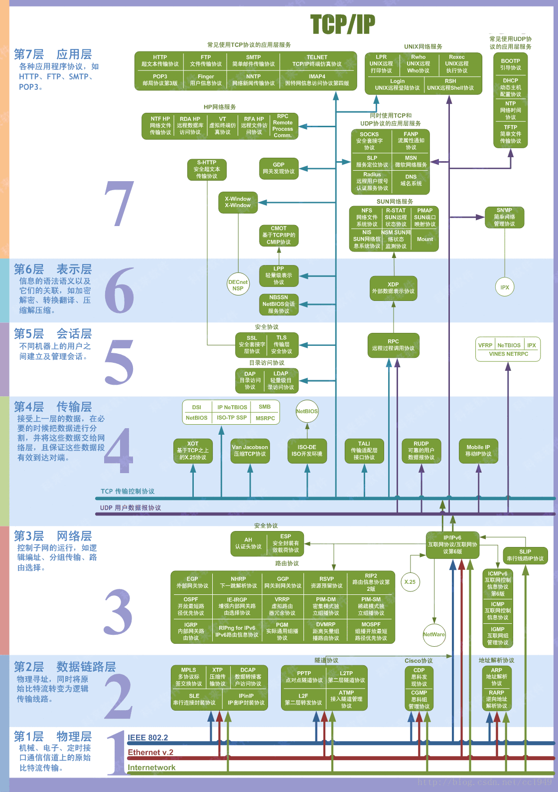
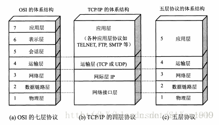
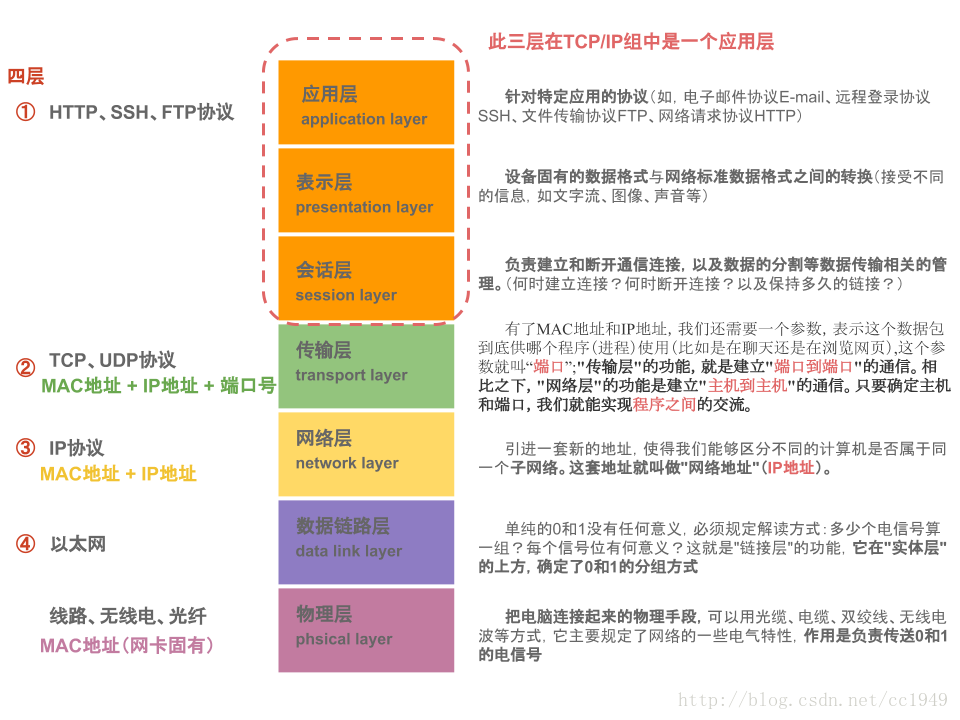

### 发展历史

网络模型不是一开始就有的，在网络刚发展时，网络协议是由各互联网公司自己定义的，比如那时的巨头网络公司 IBM、微软、苹果、思科等等，他们每家公司都有自己的网络协议，各家的协议也是不能互通的，那时候大家觉得这是可以的，但对消费者来说这实际上是技术垄断，因为你买了苹果的设备就不能用微软的设备，因为他们的协议不是一样的，没有统一的标准来规范网络协议，都是这些公司的私有协议。

这样大大的阻碍了互联网的发展，为了解决这个问题，国际标准化组织 1984 提出的模型标准，简称 OSI（Open Systems Interconnection Model），这是一个标准，并非实现。

TCP/IP 协议就是基于此模型设计。

TCP/IP 模型将 OSI 模型由七层简化为四层，传输层和网络层被完整保留，网络中最核心的技术就是传输层和网络层技术。

### OSI七层

#### 应用层

提供为应用软件而设的接口，以设定与另一应用之间的通信。例如：HTTP，FTP，SMTP，TELNET，POP3，NNTP，IMAP4

#### 表示层

用于应用层数据的编码和转换，确保接收方可以识别。

 把数据转换为能与接收者的系统格式兼容并适合传输的格式（比如linux和windows）。

数据语法转换/语法表示/连接管理/数据加密/解密/压缩/解压/编码/解码

#### 会话层

负责数据传输中设定和维护电脑网络中的两台电脑之间的通讯连接（SSL/TLS一般作为会话层。也可以是传输层上～应用层之间）[TLS在哪一层](https://www.jianshu.com/p/5ee027c51af0)

提出建立通信连接，如不同软件数据分发给不同软件。

选择使用全双工通信还是半双工通信

#### 传输层

接收上层的数据，必要的时候对数据进行分割，且保证这些数据段有效到达对端

向高层提供可靠的端到端的连接（例如TCP传输控制协议/UDP用户数据报协议/SCTP流传输控制协议）

#### 网络层

提供[路由](https://zh.wikipedia.org/wiki/路由)和寻址的功能，使两终端系统能够互连且决定最佳路径，并具有一定的拥塞控制和流量控制的能力。相当于发送邮件时需要地址一般重要。由于TCP/IP协议体系中的网络层功能由IP协议规定和实现，故又称IP层。

- 在网络层中这些服务（无论是有链接还是无连接）都是提供主机到主机的服务，在传输层中提供的则是提供应用层进程之间的服务。

#### 数据链路层

定义数据的基本格式，如何传输，如何标识；如网卡MAC地址。可以简单的理解为：规定了0和1的分包形式，确定了网络数据包的形式。

在两个网络实体之间提供数据链路连接的创建、维持和释放管理。构成数据链路数据单元（frame：[数据帧](https://zh.wikipedia.org/wiki/數據幀)或[帧](https://zh.wikipedia.org/wiki/訊框)），并对帧定界、同步、收发顺序的控制。传输过程中的[网络流量控制](https://zh.wikipedia.org/wiki/網路流量控制)、差错检测和差错控制等方面。

只提供导线的一端到另一端的数据传输。

数据链路层会在 frame 尾端置放检查码（parity，sum，CRC）以检查实质内容，将物理层提供的可能出错的物理连接改造成逻辑上无差错的数据链路，并对物理层的原始数据进行数据封装。

数据链路层中的数据封装是指：封装的数据信息中，包含了地址段和数据段等。地址段含有[点对点](https://zh.wikipedia.org/wiki/點對點協議)发送节点和接收节点的地址（如MAC），控制段用来表示数格连接帧的类型，数据段包含实际要传输的数据。

#### 物理层

底层数据传输（例如网卡。网线）

为传输数据所需要的物理链路创建、维持、拆除，而提供具有机械的，电子的，功能的和规范的特性。简单的说，物理层确保原始的[数据](https://zh.wikipedia.org/wiki/数据)可在各种物理媒体上传输。

- 为数据端设备提供传送数据通路
- 传输数据

### 五层

5层只是OSI和TCP/IP的综合，是业界产生出来的非官方协议模型，但是很多具体的应用。实际应用还是TCP/IP的四层结构。为了方便可以把下两层称为网络接口层。五层体系结构包括：应用层、运输层、网络层、数据链路层和物理层。

### TCP/IP四层模型

主要包括：应用层、运输层、网际层和网络接口层

4层协议和对应的标准7层协议的关系

### 数据包

在分组交换网络中传输的格式化数据单位

分成两个部分，包含控制信息/头，和数据本身/负载

细分数据包：

- 应用程序数据包: 标头部分规定应用程序的数据格式.数据部分传输具体的数据内容.
- TCP/UDP数据包:标头部分包含双方的发出端口和接收端口.  UDP数据包:'标头'长度:8个字节,"数据包"总长度最大为65535字节,正好放进一个IP数据包.  TCP数据包:理论上没有长度限制,但是,为了保证网络传输效率,通常不会超过IP数据长度,确保单个包不会被分割. 
- IP数据包: 标头部分包含通信双方的IP地址,协议版本,长度等信息.  '标头'长度:20~60字节,"数据包"总长度最大为65535字节.   
- 以太网数据包: 最基础的数据包.标头部分包含了通信双方的MAC地址,数据类型等. '标头'长度:18字节,'数据'部分长度:46~1500字节.

从上往下，每经过一层，协议就会在包头上面做点手脚，加点东西，传送到接收端，再层层解套出来

