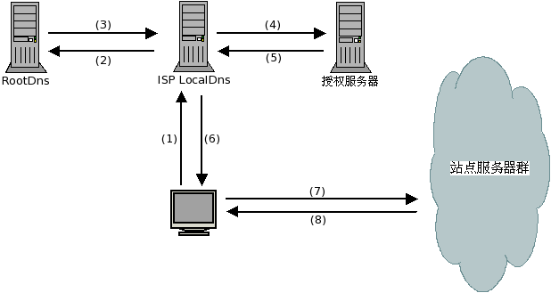
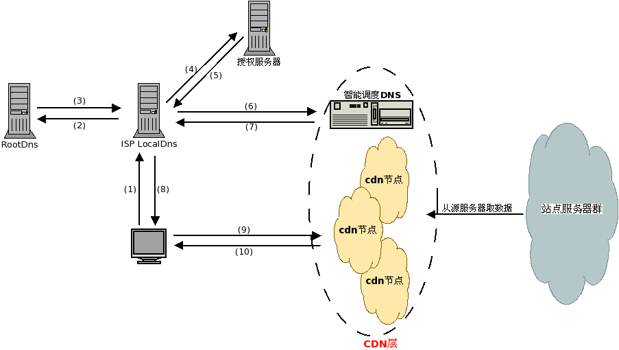

[原文地址１](http://www.51know.info/system_performance/cdn/cdn.html)

### CDN概述

> CDN的全称是Content Delivery Network，即内容分发网络。其目的是通过在现有的Internet中增加一层新的**CACHE(缓存)层**，将网站的内容发布到最接近用户的网络”**边缘**“的节点，使用户可以就近取得所需的内容，提高用户访问网站的响应速度。从技术上全面解决由于网络带宽小、用户访问量大、网点分布不均等原因，提高用户访问网站的响应速度。

​	简单的说CDN就是让原本上海的浏览器要访问北京主站内容的请求转而由部署在上海或南京的缓存来受理，这样请求的数据只需经过一跳或有限的几跳就能到达请求端，有效利用带宽并且降低主站压力，对于电子商务网站和搜索引擎网站以及门户网站，CDN的合理应用显得尤为重要。

**背景**

> ​	当下的互联网应用都包含大量的静态内容，但静态内容以及一些准动态内容又是最耗费带宽的，特别是针对全国甚至全世界的大型网站，如果这些请求都指向主站的服务器的话，不仅是主站服务器受不了，单端口500M左右的带宽也扛不住，所以大多数网站都需要CDN服务。

Cache层的技术，消除数据峰值访问造成的结点设备阻塞。Cache服务器具有缓存功能，所以大部分网页对象（Web page object）,如html, htm, php等页面文件，gif,tif,png,bmp等图片文件，以及其他格式的文件，在有效期（TTL）内，对于重复的访问，不必从原始网站重新传送文件实体, 只需通过简单的认证（Freshness Validation）- 传送几十字节的Header，即可将本地的副本直接传送给访问者。由于缓存服务器通常部署在靠近用户端，所以能获得近似局域网的响应速度，并有效减少广域带宽的消耗。不仅能提高响应速度，节约带宽，对于加速Web服务器，有效减轻源服务器的负载是非常有效的。

**特点**

1. 分布式存储
2. 智能DNS解析和http重定向实现内容分发的负载均衡
3. 全局负载均衡管理和内容管理

**网络结构**

> CDN网络一般分为中心与边缘节点两部分，中心负责全局负载均衡管理与内容管理；

中心节点功能：

1. 随时监控边缘节点的健康状况（可用性，拥塞程度）； 
2. 根据边缘节点到请求端的距离，以及边缘节点的健康状况，按一定的策略重定向请求； 
3. 与客户主站进行数据同步。

#### 类型

- **客户端加速 :** Cache部署在网络出口处，把常访问的内容缓存在本地，提高响应速度和节约带宽；
- **服务器加速 :** Cache部署在服务器前端，作为Web服务器的代理缓存机，提高Web服务器的性能，加速访问速度。 如果多台Cache加速服务器且分布在不同地域，需要通过有效地机制管理Cache网络，引导用户就近访问(比如通过DNS引导用户)，全局负载均衡流量，这是CDN内容传输网络的基本思想。

CDN对网络的优化作用主要体现在如下几个方面 　

- 解决服务器端的“第一公里”问题 　
- 缓解甚至消除了不同运营商之间互联的瓶颈造成的影响 　
- 减轻了各省的出口带宽压力 　
- 缓解了骨干网的压力 　
- 优化了网上热点内容的分布

#### CDN工作原理

**传统访问过程(未加速)缓存服务**

由上图可见，用户访问未使用CDN缓存网站的过程为:

1. 用户输入访问的域名,操作系统向 LocalDns 查询域名的ip地址.
2. LocalDns向 ROOT DNS 查询域名的授权服务器(这里假设LocalDns缓存过期)
3. ROOT DNS将域名授权dns记录回应给 LocalDns
4. LocalDns得到域名的授权dns记录后,继续向域名授权dns查询域名的ip地址
5. 域名授权dns 查询域名记录后，回应给 LocalDns
6. LocalDns 将得到的域名ip地址，回应给 用户端
7. 用户得到域名ip地址后，访问站点服务器
8. 站点服务器应答请求，将内容返回给客户端.

**CDN访问过程(使用缓存)**

CDN网络是在用户和服务器之间增加Cache层，主要是通过接管DNS实现,将用户的请求引导到Cache上获得源服务器的数据。

通过上图，我们可以了解到，使用了CDN缓存后的网站的访问过程变为：

1. 用户输入访问的域名,操作系统向 LocalDns 查询域名的ip地址.
2. LocalDns向 ROOT DNS 查询域名的授权服务器(这里假设LocalDns缓存过期)
3. ROOT DNS将域名授权dns记录回应给 LocalDns
4. LocalDns得到域名的授权dns记录后,继续向域名授权dns查询域名的ip地址
5. 域名授权dns 查询域名记录后(一般是CNAME)，回应给 LocalDns
6. LocalDns 得到域名记录后,向智能调度DNS查询域名的ip地址
7. 智能调度DNS 根据一定的算法和策略(比如静态拓扑，容量等),将最适合的CDN节点ip地址回应给 LocalDns
8. LocalDns 将得到的域名ip地址，回应给 用户端
9. 用户得到域名ip地址后，访问站点服务器
10. CDN节点服务器应答请求，将内容返回给客户端.(缓存服务器一方面在本地进行保存，以备以后使用，二方面把获取的数据返回给客户端，完成数据服务过程)

通过以上的分析我们可以得到，为了实现对普通用户透明(使用缓存后用户客户端无需进行任何设置)访问，需要使用DNS(域名解析)来引导用户来访问Cache服务器，以实现透明的加速服务. 由于用户访问网站的第一步就是**域名解析**,所以通过修改dns来引导用户访问是最简单有效的方式.

#### CDN网络组成要素

对于普通的Internet用户，每个CDN节点就相当于一个放置在它周围的网站服务器. 通过对dns的接管，用户的请求被透明地指向离他最近的节点，节点中CDN服务器会像网站的原始服务器一样，响应用户的请求. 由于它离用户更近，因而响应时间必然更快.

从上面图中 虚线圈起来的那块，就是**CDN层**,这层是位于 用户端 和 站点服务器 之间.

- 智能调度DNS(比如f5的3DNS) 
  **智能调度DNS**是CDN服务中的**关键系统**.当用户访问加入CDN服务的网站时，域名解析请求将最终由 “智能调度DNS”负责处理。它通过一组预先定义好的策略，将当时最接近用户的节点地址提供给用户，使用户可以得到快速的服务。同时它需要与分布在各地的CDN节点保持通信，跟踪各节点的健康状态、容量等信息，确保将用户的请求分配到就近可用的节点上.
- 缓存功能服务 
  负载均衡设备(如lvs,F5的BIG/IP) 
  内容Cache服务器(如squid） 
  共享存储(根据缓存数据量多少决定是否需要)

> CDN，内容分发网络。举个例子，在上海要访问北京主站的内容，本来是需要跳转好多次才能拿到东西。但是使用CDN的话，只需要跳转一次或者跳转有限的次数就可以拿到这些东西，因为CDN就是类似做了一个缓存服务器的东西，也就是在DNS解析后又多了一步智能DNS调度，也就是在用户访问，并且因为缓存服务器一般部署在靠近用户端的地方，所以可以获得类似局域网的响应速度，提高网站的响应速度，并且减少了带宽和主站的压力。在使用的时候我们就可以将一些不经常变的文件和图片，使用CDN，这样在需要使用的时候，只需要发送简单的身份认证和几十字节的header，就可以拿到这些东西。CDN的特点的话就是分布式存储，智能DNS解析和http重定向实现负载均衡，还有就是负载均衡管理和内容管理，DNS又分为中间节点与边缘节点，中方节点主要做一些检测边缘节点是否可用和是否健壮，以及在数据多的时候对边缘节点做一个调整，还有就是与主站进行数据同步，
>

