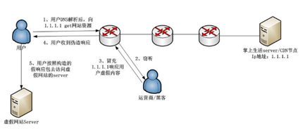

[原文地址1](https://www.jianshu.com/p/1171fa84bed2)

**DNS劫持**

DNS劫持又称域名劫持，是通过劫持技术修改域名注册信息，修改DNS解析，劫持修改域名解析结果。使访问域名的用户不能够准确达到目标站点，而进入指定站点。比如访问百度出来的却是hao123。

**出现的情况**

1. 用户计算机感染病毒，该病毒在操作系统中HOSTS文件中添加了虚假的DNS解析记录，因为系统本地的DNS解析记录高于DNS服务器，操作系统在访问域名的时候都会先行检测本地DNS解析记录，然后在访问DNS服务器。
2. 用户试图访问的网站被攻击这击破，并在网站中植入路由DNS劫持代码，当用户访问网站，浏览器就是自动执行路由DNS劫持代码，用户路由器如果存在漏洞就会中招，导致用户上网流量被假DNS服务器劫持，出现广告，各种奇怪现象。
3. 当用户打开浏览器主页的时候，却出现ISP提供的定向页面，广告页面等内容页面，
4. 用户在浏览器中输入了错误的域名，导致DNS查询不存在的记录。以前遇到这种情况，浏览器通常会返回一个错误提示。而最近，这种情况下用户会看到ISP设置的域名纠错系统提示。，广告页面等内容页面。
5. 用户想通过该网址访问A网站结果却指向了B网站。

**防范**

1. 使用安全稳定可靠的DNS服务器，并且及时升级，更新补丁，加固服务器。
2. 保护好域名注册的账号信息。增加域名账号密码的复杂性。
3. 注意本地计算机系统的安全性，使用杀毒软件安全防范。
4. 各大网站站长需要加强网站的安全性防范，以免被挂马，导致访客信息泄露。
5. 互联网公司准备两个以上的域名，一旦黑客进行DNS攻击，用户还可以访问另一个域名。
6. 互联网应该对应急预案进行进一步修正，强化对域名服务商的协调流程。
7. 域名注册商和代理机构特定时期可能成为集中攻击目标，需要加以防范。
8. 国内有关机构之间应该快速建立与境外有关机构的协调和沟通，协助国内企业实现对此事件的快速及时的处理。

**HTTP劫持**

> HTTP劫持是在使用者与其目的网络服务所建立的专用数据通道中，监视特定数据信息，提示当满足设定的条件时，就会在正常的数据流中插入精心设计的网络数据报文，目的是让用户端程序解释“错误”的数据，并以弹出新窗口的形式在使用者界面展示宣传性广告或者直接显示某网站的内容。

**区分**

**DNS劫持**

- DNS劫持：倾向于持续性，访问被劫持的网站时，会不停的出现其恶意广告。DNS劫持多倾向展示广告（网页出现错误后跳转某些网页，如带有运营商名号的114，189等网页），恶意插入产品的推广，如针对特定设备的推广，apple设备的app推广。

**HTTP劫持**

- HTTP的劫持：出现的频率多变，针对不同的ip也会不同(断网之后再连接，也许劫持就暂时消失），一定程度会造成错误的假象，用户可能会忽视该问题，由于其劫持过程非常快，只是经过某个IP后就快速的跳转，用户如果不注意地址栏的变化，根本不会注意到该问题的出现。其常见的现象为针对大流量网站的加小尾巴行为。

