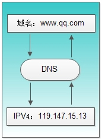
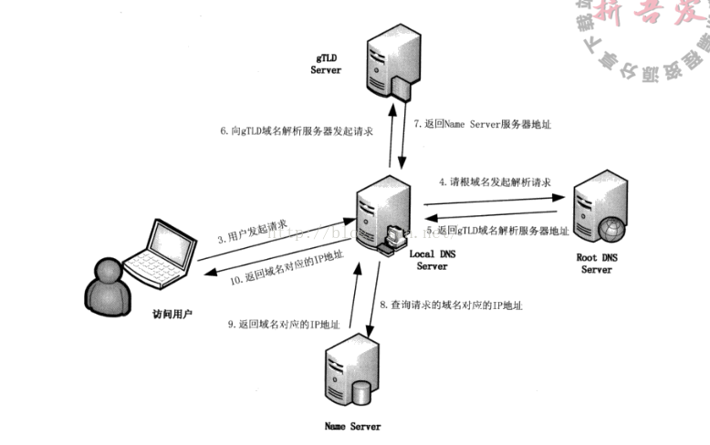

[原文地址1](https://blog.csdn.net/qq_36326947/article/details/72864528)

#### DNS

DNS( Domain Name System)是“域名系统”的英文缩写，是一种组织成域层次结构的计算机和网络服务命名系统，它用于TCP/IP网络，它所提供的服务是用来将主机名和域名转换为IP地址的工作。DNS就是这样的一位“翻译官”，它的基本工作原理可用下图来表示。

##### 步骤

1. 浏览器检查自身DNS缓存，如果有，则结束。
   1. 浏览器缓存域名限制，大小
   2. 时间，域名被缓存的时间限制可通过TTL属性来设置

2. 如果用户的浏览器缓存没有，如果在操作系统缓存中查找，比如windows下的host文件夹，
   1. 有问题，在win7中修改文件为只读

3. 在LDNS中也就是本地区的域名服务器，这个DNS通常提供给你本地互联网接入的一个DNS解析服务器，举个例子，假如在学校接的网，DNS服务器就在学校，如果你是在一个小区接入互联网的，那这个DNS就是提供给你接入互联网的应用提供商，即电信或者联通，也就是通常所说的SPA，那么这个DNS通常也会在你所在城市的某个角落，通常不会很远。在Windows下可以通过ipconfig查询这个地址
   1. 这个专门的域名解析服务器性能都会很好，它们一般都会缓存域名解析结果，当然缓存时间是受域名的失效时间控制的，一般缓存空间不是影响域名失效的主要因素。大约80%的域名解析都到这里就已经完成了，所以LDNS主要承担了域名的解析工作。
4. 如果LDNS仍然没有命中，则直接到Root Server域名服务器请求解析。
5. 根域名服务器返回给本地域名服务器一个所查询的主域名服务器（gTLD Server）地址。gTLD是[国际顶级域名](https://www.baidu.com/s?wd=%E5%9B%BD%E9%99%85%E9%A1%B6%E7%BA%A7%E5%9F%9F%E5%90%8D&tn=44039180_cpr&fenlei=mv6quAkxTZn0IZRqIHckPjm4nH00T1Y3Ph7WuHP9uWuBuynzPhmk0ZwV5Hcvrjm3rH6sPfKWUMw85HfYnjn4nH6sgvPsT6KdThsqpZwYTjCEQLGCpyw9Uz4Bmy-bIi4WUvYETgN-TLwGUv3EPjnLPHD1nH6L)服务器，如.com、.cn、.org等，全球只有13台左右。
   1. 13台应该是不准确的说法，应该是13个IP，因为可以一个IP可以有多个站点
6. 本地域名服务器（Local DNS Server）再向上一步返回的gTLD服务器发送请求。
7. 接受请求的gTLD服务器查找并返回此域名对应的Name Server域名服务器的地址，这个Name Server通常就是你注册的域名服务器，例如你在某个域名服务提供商申请的域名，那么这个域名解析任务就由这个域名提供商的服务器来完成。
8. Name Server域名服务器会查询存储的域名和IP的映射关系表，正常情况下都根据域名得到目标IP记录，连同一个[TTL值](https://www.baidu.com/s?wd=TTL%E5%80%BC&tn=44039180_cpr&fenlei=mv6quAkxTZn0IZRqIHckPjm4nH00T1Y3Ph7WuHP9uWuBuynzPhmk0ZwV5Hcvrjm3rH6sPfKWUMw85HfYnjn4nH6sgvPsT6KdThsqpZwYTjCEQLGCpyw9Uz4Bmy-bIi4WUvYETgN-TLwGUv3EPjnLPHD1nH6L)返回给DNS Server域名服务器。
9. 返回该域名对应的IP和[TTL值](https://www.baidu.com/s?wd=TTL%E5%80%BC&tn=44039180_cpr&fenlei=mv6quAkxTZn0IZRqIHckPjm4nH00T1Y3Ph7WuHP9uWuBuynzPhmk0ZwV5Hcvrjm3rH6sPfKWUMw85HfYnjn4nH6sgvPsT6KdThsqpZwYTjCEQLGCpyw9Uz4Bmy-bIi4WUvYETgN-TLwGUv3EPjnLPHD1nH6L)，Local DNS Server会缓存这个域名和IP的对应关系，缓存的时间由[TTL值](https://www.baidu.com/s?wd=TTL%E5%80%BC&tn=44039180_cpr&fenlei=mv6quAkxTZn0IZRqIHckPjm4nH00T1Y3Ph7WuHP9uWuBuynzPhmk0ZwV5Hcvrjm3rH6sPfKWUMw85HfYnjn4nH6sgvPsT6KdThsqpZwYTjCEQLGCpyw9Uz4Bmy-bIi4WUvYETgN-TLwGUv3EPjnLPHD1nH6L)控制。
10. 把解析的结果返回给用户，用户根据TTL值缓存在本地系统缓存中，域名解析过程结束。

#### 递归查询+迭代查询

我认为的是通过上面两张图理解他们的工作方式，但真正使用应该是两个相结合，主机向本地域名服务器使用递归查询，本地域名服务器随后采用迭代查询

> 在用户输入url之后，首先会根据这个URL在浏览器缓存中查找是否有对应的IP，因为浏览器缓存是有大小以及时间的限制，并且缓存时间不会很长，除非手动设置TTL（Time To Live）属性，如果没有的话就会继续在操作系统缓存中查找，比如win下的host文件，而host文件有可能遭受更改，引起DNS劫持，因此在win7的时候将其改为只读属性，如果还没有找到的话就会在local DNS查找，local dns就是一个本地区的服务器，也就是本地互联网接入的一个DNS解析服务器，比如，学校接的网的话一般就是在学校，而如果是小区的话一般就是各大互联网运营商，像电信这种的，其一般分布在城市的某个角落，但肯定不会很远，并且其性能一般都会很好，一般都会缓存域名解析的结果，并且受缓存时间的控制，在查找到这里的时候，大约80%的域名就可以找到对应的IP了，因此他主要承担了域名的解析工作，如果在Local DNS还没有找到的时候，就会向root server域名服务器也就是根服务器进行查询，根服务器返回给本地域名服务器一个所查询的主域名服务器，例如.com这种的，主域名ip只有13个，但是服务器的话因为虚拟站点的技术，会有很多台，本地域名服务器拿到返回的主域名服务器的地址后，再继续向其发起请求查询，主域名服务器在查找后返回给本地域名服务器对应的name server，比如`www.baidu.com`，这个ns就是百度的一个域名服务器，随后再向这个服务器发起请求，在返回一个ns，在这个ns中会查询一个域名和ip的映射关系表中存在其对应的ip，就将对应的ip和一个ttl值返回给本地域名服务器，ldns会对其进行一个缓存，并将结果返回给用户，用户在拿到也会进行一个相应的缓存，在这个过程中又涉及到了两种查询方式，迭代查询和递归查询，迭代查询就是上面说的这种，在拿到结果之后返回回去，接着又进行一次新的请求。而递归查询就是在查询到结果之后，不返回，而是根据结果由自己在进行一次查找，一直这样直到查找到结果，在一次次返回去。在真正使用的时候，其实是两种两结合，比如用户到ldns就是递归查询，而ldns在向root server 这些查找的时候就是迭代查询。