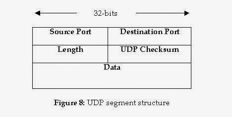
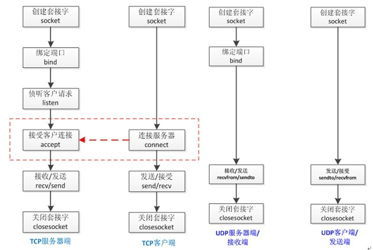

[原文地址1](https://blog.csdn.net/u013777351/article/details/49226101)

[原文地址2](https://blog.csdn.net/gao1440156051/article/details/52207032)

**面向报文**

面向报文的传输方式是应用层交给UDP多长的报文，UDP就照样发送，即一次发送一个报文。因此，应用程序必须选择合适大小的报文。若报文太长，则IP层需要分片，降低效率。若太短，会是IP太小。UDP对应用层交下来的报文，既不合并，也不拆分，而是保留这些报文的边界。这也就是说，应用层交给UDP多长的报文，UDP就照样发送，即一次发送一个报文。

**面向字节流**

面向字节流的话，虽然应用程序和TCP的交互是一次一个数据块（大小不等），但TCP把应用程序看成是一连串的无结构的字节流。TCP有一个缓冲，当应用程序传送的数据块太长，TCP就可以把它划分短一些再传送。如果应用程序一次只发送一个字节，TCP也可以等待积累有足够多的字节后再构成报文段发送出去。

**应用**

**区别**

**数据边界**： TCP不保存数据的边界，数据以字节流的形式传送，并没有明显的标志表明传输信号消息（段）的边界。在UDP中，数据包单独发送的，只有当他们到达时，才会再次集成。包有明确的界限来哪些包已经收到，这意味着在消息发送后，在接收器接口将会有一个读操作，来生成一个完整的消息。虽然TCP也将在收集所有字节之后生成一个完整的消息，但是这些信息在传给传输给接受端之前将储存在TCP缓冲区，以确保更好的使用网络带宽

**有序性**：TCP保证消息的有序性，该消息将以从服务器端发出的同样的顺序发送到客户端，尽管这些消息到网络的另一端时可能是无序的。TCP协议将会为你排好序。UDP不提供任何有序性或序列性的保证。数据包将以任何可能的顺序到达。这就是为什么TCP是适合需要顺序交付方式的应用，尽管有基于UDP的协议通过使用序列号和重传来提供有序和可靠性的应用，如[TIBCO Rendezvous](http://javarevisited.blogspot.sg/2010/10/tibco-rv-messagging.html)，他实际上就是一个基于UDP的应用。

**头大小**： TCP具有比UDP更大的头。一个TCP数据包报头的大小是20字节，UDP数据报报头是8个字节。TCP报头中包含序列号，ACK号，数据偏移量，保留，控制位，窗口，紧急指针，可选项，填充项，校验位，源端口和目的端口。而UDP报头只包含长度，源端口号，目的端口，和校验和。下图是TCP和UDP头：

**编程模型**

TCP需要侦听客户请求，等待和客户端进行连接以后才能进行数据传送，而UDP则服务器和客户端的概念不明显，服务器端即接收端需要绑定端口，等待客户端的数据的到来。后续便可以进行数据的收发（recvfrom/sendto）工作。

在前面讲解UDP时，提到了UDP保留了报文的边界，下面我们来谈谈TCP和UDP中报文的边界问题。在默认的阻塞模式下，TCP无边界，UDP有边界。 
对于TCP协议，客户端连续发送数据，只要服务端的这个函数的缓冲区足够大，会一次性接收过来，即客户端是分好几次发过来，是有边界的，而服务端却一次性接收过来，所以证明是无边界的； 
而对于UDP协议，客户端连续发送数据，即使服务端的这个函数的缓冲区足够大，也只会一次一次的接收，发送多少次接收多少次，即客户端分几次发送过来，服务端就必须按几次接收，从而证明，这种UDP的通讯模式是有边界的。

**TCP优点**

- 可靠，稳定
- TCP的可靠体现在TCP在传递数据之前，会有三次握手来建立连接，而且在数据传递时，有确认、窗口、重传、拥塞控制机制，在数据传完后，还会断开连接用来节约系统资源

**TCP缺点**

- 慢，效率低，占用系统资源高，易被攻击 
- 慢，效率低，占用系统资源高，易被攻击 
  TCP在传递数据之前，要先建连接，这会消耗时间，而且在数据传递时，确认机制、重传机制、拥塞控制机制等都会消耗大量的时间，而且要在每台设备上维护所有的传输连接，事实上，每个连接都会占用系统的CPU、内存等硬件资源。 
- 而且，因为TCP有确认机制、三次握手机制，这些也导致TCP容易被人利用，实现DOS、DDOS、CC等攻击。

**UDP优点**

- 快速
- UDP没有TCP的握手、确认、窗口、重传、拥塞控制等机制，UDP是一个无状态的传输协议，所以它在传递数据时非常快。没有TCP的这些机制，UDP较TCP被攻击者利用的漏洞就要少一些。但UDP也是无法避免攻击的，比如：UDP Flood攻击……

**UDP缺点**

- 不可靠，不稳定
- 因为UDP没有TCP那些可靠的机制，在数据传递时，如果网络质量不好，就会很容易丢包。

#### 应用场景

**什么时候应该使用TCP：**

当对网络通讯质量有要求的时候，比如：整个数据要准确无误的传递给对方，这往往用于一些要求可靠的应用，比如HTTP、HTTPS、FTP等传输文件的协议，POP、SMTP等邮件传输的协议。 
在日常生活中，常见使用TCP协议的应用如下：

- 浏览器，用的HTTP
- FlashFXP，用的FTP
- Outlook，用的POP、SMTP
- Putty，用的Telnet、SSH
- QQ文件传输

**什么时候应该使用UDP：**

当对网络通讯质量要求不高的时候，要求网络通讯速度能尽量的快，这时就可以使用UDP。 
比如，日常生活中，常见使用UDP协议的应用如下：

- QQ语音
- QQ视频
- TFTP

> TCP和UDP的区别的话，TCP是一个面向连接和面向字节流的，UDP是一个无连接的状态以及面向报文，面向字节流就是说应用层交给我的数据如果很多，我就会分成很多的小部分，进行发送，如果不够的话也可以等待到足够多的字节后在进行发送，面向报文则是一次给我多少数据我就直接发出去。TCP也是一个可靠地连接，他会确认接收方确实收到了这个数据，而UDP只管发送，不会管是否收到，TCP是一个全双工的通信，UDP则是一个一对一，多对多，一对多，多对一的连接，还有就是TCP有流量控制和拥塞控制，TCP传输慢，这也就约束了TCP一般适合于对数据准确性要求高，但是速度可以相对慢的，比如文件传输，远程登录之类的，邮件之类的，UDP一般用于即时通信，语音视频聊天之类的。