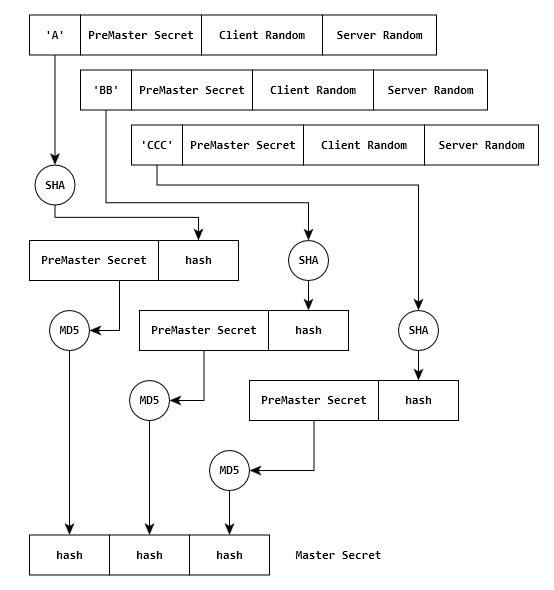

参考链接

https://www.cnblogs.com/zhangshitong/p/6478721.html

https://www.cnblogs.com/digdeep/p/4832885.html

**HASH算法**：也称为消息摘要算法。将任意长度的二进制值映射为较短的固定长度的二进制值，该二进制值称为哈希值。常用于检验数据的完整性，检验数据没有被篡改过。常见的又 MD5(MD系列)，SHA-1(SHA系列)

1. client发起请求

   1. 首先，客户端（通常是浏览器）先向服务器发出加密通信的请求，这被叫做ClientHello请求。

   2. 浏览器支持的SSL/TLS协议版本

   3. 一个浏览器生成的随机数

   4. 浏览器支持的各种加密算法，对称，非对称，HASH算法

   5. 浏览器支持的压缩方法

   6. 这里需要注意的是，客户端发送的信息之中不包括服务器的域名。也就是说，理论上服务器只能包含一个网站，否则会分不清应该向客户端提供哪一个网站的数字证书。这就是为什么通常一台服务器只能有一张数字证书的原因。

      对于虚拟主机的用户来说，这当然很不方便。2006年，TLS协议加入了一个[Server Name Indication扩展](http://tools.ietf.org/html/rfc4366)，允许客户端向服务器提供它所请求的域名。

2. server回应

   1. 服务器收到客户端请求后，向客户端发出回应，这叫做SeverHello。
   2. 确认使用的通信加密版本，如果浏览器和服务器支持的不一致，服务器关闭加密通信
   3. 一个服务器生成的随机数
   4. 确认使用的各种加密方法
   5. 服务器证书

3. client进入数字证书认证环节，由浏览器的内置TLS完成

   1.  首先浏览器会从内置的证书列表中索引，找到服务器下发证书对应的机构，如果没有找到，此时就会提示用户该证书是不是由权威机构颁发，是不可信任的。如果查到了对应的机构，则取出该机构颁发的公钥。
   2.  用机构的证书公钥解密得到证书的内容和证书签名，内容包括网站的网址、网站的公钥、证书的有效期等。浏览器会先验证证书签名的合法性。签名通过后，浏览器验证证书记录的网址是否和当前网址是一致的，不一致会提示用户。如果网址一致会检查证书有效期，证书过期了也会提示用户。这些都通过认证时，浏览器就可以安全使用证书中的网站公钥了。
   3.  一个随机数。该随机数用服务器发来的公钥进行的使用非对称加密算法加密，防止被窃听。
   4.  编码改变通知，表示随后的信息都将用双方商定的加密方法和密钥发送(比如确认使用：RSA非对称，DES对称，SHA-1 hash算法)。
   5.  客户端握手结束通知，表示客户端的握手阶段已经结束。这一项同时也是前面发送的所有内容的hash值，用来供服务器校验。
   6.  上面的随机数，是整个握手阶段出现的第三个随机数，又称"pre-master key"。有了它以后，客户端和服务器就同时有了三个随机数，接着双方就用事先商定的对称加密算法，各自生成本次会话所用的同一把"会话密钥"。也就是说浏览器和服务器各自使用同一个对称加密算法，对三个相同的随机数进行加密，获得了，用来加密网页内容的 对称加密算法的秘钥。(注意：这里浏览器的三个随机数都是明文的，但是服务端获得的"pre-master key"是密文的，所以服务器需要使用非对称加密算法的私钥，来先解密获得"pre-master key"的明文，在来生成对称加密算法的秘钥。这样的目的是为了防止："pre-master key"被窃听，因为发送明文会被窃听，但是发生的是非对称加密算法的加密过后的密文，因为窃听者不知道私钥，所以即使窃听了，也无法解密出其对应的明文。**从而保证了最后生成的：用于加密网页内容的对称加密算法的秘钥的安全性！！！**)
   7.  

4. 服务器收到客户端的第三个随机数pre-master key之后，计算生成本次会话所用的对称加密算法的"会话密钥"。

   1. 编码改变通知，表示随后的信息都将用双方商定的对称加密算法和密钥进行加密。
   2. 服务器握手结束通知，表示服务器的握手阶段已经结束。这一项同时也是前面发送的所有内容的hash值，用来供客户端校验。

#### https优点

1. SEO

   谷歌曾在2014年8月份调整搜索引擎算法，并称“比起同等HTTP网站，采用HTTPS加密的网站在搜索结果中的排名将会更高”。

2. 安全

   尽管HTTPS并非绝对安全，掌握根证书的机构、掌握加密算法的组织同样可以进行中间人形式的攻击，但HTTPS仍是现行架构下最安全的解决方案，主要有以下几个好处：

   （1）、使用HTTPS协议可认证用户和服务器，确保数据发送到正确的客户机和服务器；

   （2）、HTTPS协议是由SSL+HTTP协议构建的可进行加密传输、身份认证的网络协议，要比http协议安全，可防止数据在传输过程中不被窃取、改变，确保数据的完整性。

   （3）、HTTPS是现行架构下最安全的解决方案，虽然不是绝对安全，但它大幅增加了中间人攻击的成本。

#### 缺点

1. SEO

   据ACM CoNEXT数据显示，使用HTTPS协议会使页面的加载时间延长近50%，增加10%到20%的耗电，此外，HTTPS协议还会影响缓存，增加数据开销和功耗，甚至已有安全措施也会受到影响也会因此而受到影响。

   而且HTTPS协议的加密范围也比较有限，在黑客攻击、拒绝服务攻击、服务器劫持等方面几乎起不到什么作用。

   最关键的，SSL证书的信用链体系并不安全，特别是在某些国家可以控制CA根证书的情况下，中间人攻击一样可行。

2. 经济方面

   （1）SSL证书需要钱，功能越强大的证书费用越高，个人网站、小网站没有必要一般不会用。

   （2）SSL证书通常需要绑定IP，不能在同一IP上绑定多个域名，IPv4资源不可能支撑这个消耗（SSL有扩展可以部分解决这个问题，但是比较麻烦，而且要求浏览器、操作系统支持，Windows XP就不支持这个扩展，考虑到XP的装机量，这个特性几乎没用）。

   （3）HTTPS连接缓存不如HTTP高效，大流量网站如非必要也不会采用，流量成本太高。

   （4）HTTPS连接服务器端资源占用高很多，支持访客稍多的网站需要投入更大的成本，如果全部采用HTTPS，基于大部分计算资源闲置的假设的VPS的平均成本会上去。

   （5）HTTPS协议握手阶段比较费时，对网站的相应速度有负面影响，如非必要，没有理由牺牲用户体验。

>先说一下http和https的区别，最直观的就是https采用https：//，还有就是端口的不同，http默认80，https采用443，https需要证书，而机构颁发的证书一般都是收费的，http的话就不用支付这笔费用，https采用的是加密传输，握手阶段也比http复杂，这就会造成效率上的影响，但是安全性提高了很多，在seo方面google会优先考虑https的网页，
>
>首先客户端向服务器发起ClientHello请求，携带TTL/SSL版本+客户端所支持的各种加密算法+一个随机的字符串，还有就是这里要注意一个问题，客户端发送的消息中不包括服务器的域名，但是随着虚拟站点技术的发展，多个域名对应一个站点，但是理论上一个站点对应一个证书，如果不携带的话就会很麻烦。在server收到请求后，会对客户端进行回应，叫做serverHello,同时会携带TTL/SSL版本号，如果和客户端的不一致，本次请求就到此结束了，还会携带所确认使用的各种加密方法，以及服务器的一个随机字符串，和证书，在客户端接收到证书以后，首先会将证书和内置的证书列表中查找是否是正规机构所颁发的，不是的话会弹出不信任的证书，由用户选择是否继续，随后用机构的公钥解密得到证书的内容和证书签名，其中包括证书签名，证书有效期，以及网站的公钥，浏览器会先检验证书签名的有效性以及证书记录的网站和当前网站是否一致，随后检验证书是否过期，当这些都通过以后。客户端会产生通信的第三个随机数，又称pre-master-key，随后采用网站公钥对其进行加密，并且回复服务器确认使用对应的加密方式，随后客户端和服务器都有了三个随机数，并且使用双方商定的加密方式对三个随机数进行加密，生成master-key，也就是后面要使用的加密字符串，至于使用三个字符串，因为只有最后一个字符串是加密的，其他两个都是明文的，而三个随机字符串理论上可以做到真正的随机，要注意只有在握手阶段才会使用rsa非对称加密，再确认双方信息后，随后采用的都是对称加密，因为非对称加密相对于对称加密来说更耗时，效率也低，但是加密性强。https的优点的话就是谷歌在seo的话会优先考虑https，并且https在通信过程中是加密的，并且会确认双方的身份，可以防止数据在传输过程中被篡改，获取以及确保数据的完整性。
>
>

