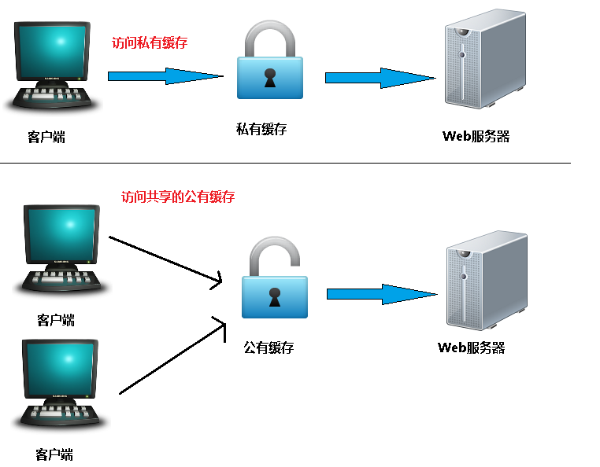

[参考１](https://juejin.im/post/5a6c87c46fb9a01ca560b4d7)

[参考２](https://juejin.im/post/5a1d4e546fb9a0450f21af23)

[参考３](https://juejin.im/post/5b3c87386fb9a04f9a5cb037)

#### 缓存

缓存是一种保存资源副本并在下次请求时直接使用该副本的技术

为什么要缓存

1. 缓解服务器压力(不用每次去请求资源)；
2. 提升性能(打开本地资源速度当然比请求回来再打开要快得多)；
3. 减少带宽消耗；

缓存在宏观上可以分成两类：**私有缓存**和**共享缓存**。共享缓存就是那些能被各级代理缓存的缓存(看图)。私有缓存就是用户专享的，各级代理不能缓存的缓存。

Cache-Control: public 指可以公有缓存， 可以是数千名用户共享的。

Cache-Control: private 指只支持私有缓存， 私有缓存是单个用户专用的。



#### 缓存种类

#### **浏览器缓存**

#####memory cache简介：

> MemoryCache顾名思义，就是将资源缓存到内存中，等待下次访问时不需要重新下载资源，而直接从内存中获取。Webkit早已支持memoryCache。 
> 目前Webkit资源分成两类，一类是主资源，比如HTML页面，或者下载项，一类是派生资源，比如HTML页面中内嵌的图片或者脚本链接，分别对应代码中两个类：MainResourceLoader和SubresourceLoader。虽然Webkit支持memoryCache，但是也只是针对派生资源，它对应的类为CachedResource，用于保存原始数据（比如CSS，JS等），以及解码过的图片数据。

------

#####	DiskCache简介：

> diskCache顾名思义，就是将资源缓存到磁盘中，等待下次访问时不需要重新下载资源，而直接从磁盘中获取，它的直接操作对象为CurlCacheManager。它与memoryCache最大的区别在于，当退出进程时，内存中的数据会被清空，而磁盘的数据不会，所以，当下次再进入该进程时，该进程仍可以从diskCache中获得数据，而memoryCache则不行。 
> diskCache与memoryCache相似之处就是也只能存储一些派生类资源文件。它的存储形式为一个index.dat文件，记录存储数据的url，然后再分别存储该url的response信息和content内容。Response信息最大作用就是用于判断服务器上该url的content内容是否被修改。

####  代理服务器缓存

​	代理服务器缓存原理和浏览器端类似，但规模要大得多，因为是为成千上万的			用户提供缓存机制，大公司和大型的ISP提供商通常会将它们设立在防火墙上或是作为一个独立的设备来运营。(**下文如果没有特殊说明,所有提到的缓存服务器都是指代理服务器。**)

由于缓存服务器不是客户端或是源服务器的一部分，它们存在于网络中，请求路由必须经过它们才会生效，所以实际上你可以去手动设置浏览器的代理，或是通过一个中间服务器来进行转发，这样用户自然就察觉不到代理服务器的存在了。

代理服务器缓存就是一个共享缓存，不只为一个用户服务，经常为大量用户使用，因此在减少相应时间和带宽使用方面很有效：因为同一个缓存可能会被重用多次。

#### 网关缓存

​	也被称为**代理缓存或反向代理缓存**，网关也是一个中间服务器，网关缓存一般是网站管理员自己部署，从让网站拥有更好的性能。

CDNS(网络内容分发商)分布网关缓存到整个（或部分）互联网上，并出售缓存服务给需要的网站，比如国内的七牛云、又拍云都有这种服务。

#### 数据库缓存

​	数据库缓存是指当我们的应用极其复杂，表自然也很繁杂，我们必须进行频繁的进行数据库查询，这样可能导致数据库不堪重负，一个好的办法就是将查询后的数据放到内存中，下一次查询直接从内存中取就好了。

#### 缓存相关 header

我们先罗列一下和缓存相关的请求响应头。

- Pragma (http1.0的东西)

  - 与 Cache-Control: no-cache 效果一致。强制要求缓存服务器在返回缓存的版本之前将请求提交到源头服务器进行验证。

- Expires(http1.0的东西)

  - 响应头，代表该资源的过期时间。

- Cache-Control(http1.1加入的新属性)
  - 请求/响应头，缓存控制字段，精确控制缓存策略。
  - Public/Private 私有缓存/共有缓存
  - no-cache：不建议使用本地缓存，但仍然会缓存到本地
  - no-store：不会在客户端缓存任何数据
  - max-age：比较特殊，是一个混合属性，替代了Expires的过期时间

- If-Modified-Since(http1.0) / Last-Modified(http1.0) 
  - 请求头，资源最近修改时间，由浏览器告诉服务器。
  - 响应头，资源最近修改时间，由服务器告诉浏览器。

- If-None-Match / Etag(http1.1)
  - 请求头，缓存资源标识，由浏览器告诉服务器。
  - 响应头，资源标识，由服务器告诉浏览器。
  - ETag使用inode+mtime（以下有解释）来计算。根据实体内容生成的一段hash字符串（类似于MD5或者SHA1之后的结果），可以标识资源的状态。 当资源发送改变时，ETag也随之发生变化。

  > 名词解释：
  > inode ：包含文件的元信息，包括以下内容
  >
  > - 文件的字节数、文件拥有者的User ID、文件的Group ID
  > - 文件的读、写、执行权限
  > - 文件的时间戳，共有三个：ctime指inode上一次变动的时间，mtime指文件内容上一次变动的时间，atime指文件上一次打开的时间。
  > - 链接数，即有多少文件名指向这个inode、 文件数据block的位置
  >   mtime：指文件内容上一次变动的时间

####缓存规则

> **http缓存属于客户端缓存**
>
> **缓存分为强制缓存和协商缓存**

**强制缓存**

当缓存数据库有要请求的数据时，直接使用缓存数据库中的东西，当没有时，才从服务端拉取数据


Chrome会根据本地内存的使用率来决定缓存存放在哪，如果内存使用率很高，放在磁盘里面，内存的使用率很低会暂时放在内存里面。这就可以比较合理的解释了为什么同一个资源有时是from memory cache有时是from disk cache的问题了。

##### 协商缓存

又称对比缓存，客户端会先从缓存数据库中获取到一个缓存数据的标识，得到标识后请求服务端验证是否失效（新鲜），如果没有失效服务端会返回304，此时客户端直接从缓存中获取所请求的数据，如果标识失效，服务端会返回更新后的数据。


**两类缓存机制可以同时存在，强制缓存的优先级高于协商缓存，当执行强制缓存时，如若缓存命中，则直接使用缓存数据库数据，不在进行缓存协商。**

**强制缓存**

对于强制缓存，服务器响应的header中会用两个字段来表明——Expires和Cache-Control。`Expires`是HTTP/1.0中的定义缓存的字段，它规定了缓存过期的一个绝对时间。Cache-Control:max-age=2592000是HTTP/1.1定义的关于缓存的字段，它规定了缓存过期的一个相对时间。优先级上当然是版本高的优先了，max-age > Expires。

##### Cache-Control

Cache-Control有很多属性，不同的属性代表的意义也不同。

- public，资源允许被中间服务器缓存。
  - 浏览器请求服务器时，如果缓存时间没到，中间服务器直接返回给浏览器内容，而不必请求源服务器。

- private，资源不允许被中间代理服务器缓存。
  - 浏览器请求服务器时，中间服务器都要把浏览器的请求透传给服务器。

- no-cache，浏览器不做缓存检查。
  - 每次访问资源，浏览器都要向服务器询问，如果文件没变化，服务器只告诉浏览器继续使用缓存（304）。

- no-store，浏览器和中间代理服务器都不能缓存资源。
  - 每次访问资源，浏览器都必须请求服务器，并且，服务器不去检查文件是否变化，而是直接返回完整的资源。

- must-revalidate，可以缓存，但是使用之前必须先向源服务器确认。
- proxy-revalidate，要求缓存服务器针对缓存资源向源服务器进行确认。
- s-maxage：缓存服务器对资源缓存的最大时间。

 这就是**强缓存阶段**，当浏览器再次试图访问这个CSS文件，发现有这个文件的缓存，那么就判断根据上一次的响应判断是否过期，如果没过期，使用缓存。加载文件，OVER！✌️

Firefox浏览器表现为一个灰色的200状态码。

Chrome浏览器状态码表现为:

> 200  (from disk cache)或是200 OK (from memory cache)

####   协商缓存

##### Last-Modified：

服务器在响应请求时，会告诉浏览器资源的最后修改时间。

if-Modified-Since:
浏览器再次请求服务器的时候，请求头会包含此字段，后面跟着在缓存中获得的最后修改时间。服务端收到此请求头发现有if-Modified-Since，则与被请求资源的最后修改时间进行对比，如果一致则返回304和响应报文头，浏览器只需要从缓存中获取信息即可。
从字面上看，就是说：从某个时间节点算起，是否文件被修改了

1. 如果真的被修改：那么开始传输响应一个整体，服务器返回：200 OK
2. 如果没有被修改：那么只需传输响应header，服务器返回：304 Not Modified

if-Unmodified-Since:
从字面上看, 就是说: 从某个时间点算起, 是否文件没有被修改

1. 如果没有被修改:则开始`继续'传送文件: 服务器返回: 200 OK
2. 如果文件被修改:则不传输,服务器返回: 412 Precondition failed (预处理错误)

这两个的区别是一个是修改了才下载一个是没修改才下载。
Last-Modified 说好却也不是特别好，因为如果在服务器上，一个资源被修改了，但其实际内容根本没发生改变，会因为Last-Modified时间匹配不上而返回了整个实体给客户端（即使客户端缓存里有个一模一样的资源）。为了解决这个问题，HTTP1.1推出了Etag。

#### Etag

Etag：
服务器响应请求时，通过此字段告诉浏览器当前资源在服务器生成的唯一标识（生成规则由服务器决定）

If-None-Match：
再次请求服务器时，浏览器的请求报文头部会包含此字段，后面的值为在缓存中获取的标识。服务器接收到次报文后发现If-None-Match则与被请求资源的唯一标识进行对比。

1. 不同，说明资源被改动过，则响应整个资源内容，返回状态码200。
2. 相同，说明资源无心修改，则响应header，浏览器直接从缓存中获取数据信息。返回状态码304.

但是实际应用中由于Etag的计算是使用算法来得出的，而算法会占用服务端计算的资源，所有服务端的资源都是宝贵的，所以就很少使用Etag了。

 

### 启发式缓存阶段

```
Age:23146
Cache-Control: public
Date:Tue, 28 Nov 2017 12:26:41 GMT
Last-Modified:Tue, 28 Nov 2017 05:14:02 GMT
Vary:Accept-Encoding
```

发现没？浏览器用来确定缓存过期时间的字段一个都没有！那该怎么办？有人可能会说下次请求直接进入协商缓存阶段，携带`If-Moified-Since`呗，不是的，浏览器还有个**启发式缓存阶段**

**根据响应头中2个时间字段 Date 和 Last-Modified 之间的时间差值，取其值的10%作为缓存时间周期。**

这就是启发式缓存阶段。这个阶段很容让人忽视，但实际上每时每刻都在发挥着作用。所以在今后的开发过程中如果遇到那种`默认缓存`的坑，不要叫嚣，不要生气，浏览器只是在遵循启发式缓存协议而已。

看图了解一下


**看完上面应该对http怎么缓存有一个大概认识了，那接下来我们详细看看缓存相关的首部字段的含义**

#### 1. 通用首部字段

| 字段名称      | 说明                                                |
| ------------- | --------------------------------------------------- |
| Cache-Control | 控制缓存具体的行为                                  |
| Pragma        | HTTP1.0时的遗留字段，当值为"no-cache"时强制验证缓存 |
| Date          | 创建报文的日期时间(启发式缓存阶段会用到这个字段)    |

#### 2. 响应首部字段

| 字段名称 | 说明                                                      |
| -------- | --------------------------------------------------------- |
| ETag     | 服务器生成资源的唯一标识                                  |
| Vary     | 代理服务器缓存的管理信息                                  |
| Age      | 资源在缓存代理中存贮的时长(取决于max-age和s-maxage的大小) |

#### 3. 请求首部字段

| 字段名称            | 说明                                                         |
| ------------------- | ------------------------------------------------------------ |
| If-Match            | 条件请求，携带上一次请求中资源的ETag，服务器根据这个字段判断文件是否有新的修改 |
| If-None-Match       | 和If-Match作用相反，服务器根据这个字段判断文件是否有新的修改 |
| If-Modified-Since   | 比较资源前后两次访问最后的修改时间是否一致                   |
| If-Unmodified-Since | 比较资源前后两次访问最后的修改时间是否一致                   |

#### 4. 实体首部字段

| 字段名称      | 说明                             |
| ------------- | -------------------------------- |
| Expires       | 告知客户端资源缓存失效的绝对时间 |
| Last-Modified | 资源最后一次修改的时间           |

  

 1. Cache-Control

通过cache-control的指令可以控制告诉客户端或是服务器如何处理缓存。这也是11个字段中指令最多的一个，我们先来看看**请求指令**：

| 指令            | 参数               | 说明                              |
| --------------- | ------------------ | --------------------------------- |
| no-cache        | 无                 | 强制源服务器再次验证              |
| no-store        | 无                 | 不缓存请求或是响应的任何内容      |
| max-age=[秒]    | 缓存时长，单位是秒 | 缓存的时长，也是响应的最大的Age值 |
| min-fresh=[秒]  | 必需               | 期望在指定时间内响应仍然有效      |
| no-transform    | 无                 | 代理不可更改媒体类型              |
| only-if-cached  | 无                 | 从缓存获取                        |
| cache-extension | -                  | 新的指令标记(token)               |

**响应指令**：

| 指令             | 参数               | 说明                                           |
| ---------------- | ------------------ | ---------------------------------------------- |
| public           | 无                 | 任意一方都能缓存该资源(客户端、代理服务器等)   |
| private          | 可省略             | 只能特定用户缓存该资源                         |
| no-cache         | 可省略             | 缓存前必须先确认其有效性                       |
| no-store         | 无                 | 不缓存请求或响应的任何内容                     |
| no-transform     | 无                 | 代理不可更改媒体类型                           |
| must-revalidate  | 无                 | 可缓存但必须再向源服务器进确认                 |
| proxy-revalidate | 无                 | 要求中间缓存服务器对缓存的响应有效性再进行确认 |
| max-age=[秒]     | 缓存时长，单位是秒 | 缓存的时长，也是响应的最大的Age值              |
| s-maxage=[秒]    | 必需               | 公共缓存服务器响应的最大Age值                  |
| cache-extension  | -                  | 新指令标记(token                               |

请注意no-cache指令很多人误以为是不缓存，这是不准确的，no-cache的意思是可以缓存，但每次用应该去想服务器验证缓存是否可用。no-store才是不缓存内容。另外部分指令也可以组合使用，比如：

```
Cache-Control: max-age=100, must-revalidate, public
```

上面指令的意思是缓存的有效时间为100秒，之后访问需要向源服务器发送请求验证，此缓存可被代理服务器和客户端缓存。

#### 3. Expires

这又是一个HTTP/1.0的字段，上面也说过了定义的是缓存到期的绝对时间。

同样，我们也可以在html文件里直接使用:

```
<meta http-equiv="expires" content="Thu, 30 Nov 2017 11:17:26 GMT">
复制代码
```

如果设置的是已经过去的时间会怎样呢？YES！！！则刷新页面会重新发送请求。

**Pragma禁用缓存，如果又给Expires定义一个还未到期的时间，那么Pragma字段的优先级会更高。**

Expires有一个很大的弊端，就是它返回的是服务器的时间，但判断的时候用的却是客户端的时间，这就导致Expires很被动，因为用户有可能改变客户端的时间，导致缓存时间判断出错，这也是引入`Cache-Control:max-age`指令的原因之一。

#### 4. Last-Modified

接下来这几个字段都是校验字段，或者说是在协商缓存阶段发挥作用的字段。第一个就是Last-modified，这个字段不光协商缓存起作用，在启发式缓存阶段同样起到至关重要的作用。

在浏览器第一次请求某一个URL时，服务器端的返回状态码会是200，响应的实体内容是客户端请求的资源，同时有一个`Last-Modified`的属性标记此文件在服务器端最后被修改的时间。like this:

```
Last-Modified : Fri , 12 May 2006 18:53:33 GMT
复制代码
```

##### If-Modified-Since

当浏览器第二次请求这个URL的时候，根据HTTP协议规定，浏览器会把第一次`Last-Modified`的值存储在`If-Modified-Since`里面发送给服务端来验证资源有没有修改。like this:

```
If-Modified-Since : Fri , 12 May 2006 18:53:33 GMT
复制代码
```

服务端通过`If-Modified-Since`字段来判断在这两次访问期间资源有没有被修改过，从而决定是否返回完整的资源。如果有修改正常返回资源，状态码200，如果没有修改只返回响应头，状态码304，告知浏览器资源的本地缓存还可用。

**用途：**

- 验证本地缓存是否可用

##### If-Unmodified-Since

这个字段字面意思和`If-Modified-Since`相反，但处理方式并不是相反的。如果文件在两次访问期间没有被修改则返回200和资源，如果文件修改了则返回状态码412(预处理错误)。

**用途：**

- 与含有 `If-Range`消息头的范围请求搭配使用，实现断点续传的功能，即如果资源没修改继续下载，如果资源修改了，续传的意义就没有了。
- POST、PUT请求中，优化并发控制，即当多用户编辑用一份文档的时候，如果服务器的资源已经被修改，那么在对其作出编辑会被拒绝提交。

`Last-Modified`有几个缺点：没法准确的判断资源是否真的修改了，比如某个文件在1秒内频繁更改了多次，根据Last-Modified的时间(单位是秒)是判断不出来的，再比如，某个资源只是修改了，但实际内容并没有发生变化，Last-Modified也无法判断出来，因此在HTTP/1.1中还推出了`ETag`这个字段👇


 5. ETag

服务器可以通过某种自定的算法对资源生成一个唯一的标识(比如md5标识)，然后在浏览器第一次请求某一个URL时把这个标识放到响应头传到客户端。服务器端的返回状态会是200。

```
ETag: abc-123456
复制代码
```

ETag的值有可能包含一个 W/ 前缀，来提示应该采用弱比较算法（这个是画蛇添足，因为 If-None-Match 用且仅用这一算法）。🙄

##### If-None-Match

If-None-Match和If-Modified-Since同时存在的时候If-None-Match优先级更高。

当浏览器第二次请求这个URL的时候，根据HTTP协议规定，浏览器回把第一次ETag的值存储在If-None-Match里面发送给服务端来验证资源有没有修改。like this:

```
If-None-Match: abc-123456
复制代码
```

Get请求中，当且仅当服务器上没有任何资源的ETag属性值与这个首部中列出的相匹配的时候，服务器端会才返回所请求的资源，响应码为**200**。如果没有资源的ETag值相匹配，那么返回**304**状态码。

**POST、PUT等请求改变文件的请求，如果没有资源的ETag值相匹配，那么返回412状态码。**

##### If-Match

在请求方法为 GET) 和 HEAD的情况下，服务器仅在请求的资源满足此首部列出的 `ETag`之一时才会返回资源。而对于 PUT或其他非安全方法来说，只有在满足条件的情况下才可以将资源上传。

**用途：**

- For GET和 HEAD 方法，搭配  Range首部使用，可以用来保证新请求的范围与之前请求的范围是对同一份资源的请求。如果  ETag 无法匹配，那么需要返回 **416**（范围请求无法满足) 响应。
- 对于其他方法来说，尤其是 PUT, `If-Match` 首部可以用来避免更新丢失问题。它可以用来检测用户想要上传的不会覆盖获取原始资源之后做出的更新。如果请求的条件不满足，那么需要返回**412**(预处理错误) 响应。

当然和`Last-Modified`相比，ETag也有自己的缺点，比如由于需要对资源进行生成标识，性能方面就势必有所牺牲。

**关于强校验和弱校验：**

| ETag 1 | ETag 2 | Strong Comparison | Weak Comparison |
| ------ | ------ | ----------------- | --------------- |
| W/"1"  | W/"1"  | no match          | match           |
| W/"1"  | W/"2"  | no match          | no match        |
| W/"1"  | "1"    | no match          | match           |
| "1"    | "1"    | match             | match           |

## 服务端缓存控制

当`Expires`和`Cache-Control:max-age=xxx`同时存在的时候取决于缓存服务器应用的HTTP版本。应用HTTP/1.1版本的服务器会优先处理max-age，忽略Expires，而应用HTTP/1.0版本的缓存服务器则会优先处理Expires而忽略max-age。接下来看下和缓存服务器相关的两个字段。

#### 6. Vary

```
User-Agent
```

```
Vary: User-Agent
```

再比如，源服务器启用了gzip压缩，但用户使用了比较旧的浏览器，不支持压缩，缓存服务器如何返回？就可以这么设定：

```
Vary: Accept-Encoding
```

当然，也可以这么用：

```
Vary: User-Agent, Accept-Encoding
```

这意味着缓存服务器会以`User-Agent`和 `Accept-Encoding`两个请求首部字段来区分缓存版本。根据请求头里的这两个字段来决定返回给客户端什么内容。

#### 7. Age

这个字段说的是资源在缓存服务器存在的时长，前面也说了`Cache-Control: max-age=[秒]`就是Age的最大值。

这个字段存在的意义是什么呢？用来区分请求的资源来自源服务器还是缓存服务器的缓存的。

但得结合另一个字段来进行判断，就是Date，Date是报文创建的时间。

##### Date

如果按F5频繁刷新发现响应里的Date没有改变，就说明命中了缓存服务器的缓存以下面的一个响应为：

```
Accept-Ranges: bytes
Age: 1016859
Cache-Control: max-age=2592000
Content-Length: 14119
Content-Type: image/png
Date: Fri, 01 Dec 2017 12:27:25 GMT
ETag: "5912bfd0-3727"
Expires: Tue, 19 Dec 2017 17:59:46 GMT
Last-Modified: Wed, 10 May 2017 07:22:56 GMT
Ohc-Response-Time: 1 0 0 0 0 0
Server: bfe/1.0.8.13-sslpool-patch
```

如上图来自百度首页某个图片的响应字段。我们可以看到Age=1016859，说明这个资源已经在缓存服务器存在了1016859秒。如果文件被修改或替换，Age会重新由0开始累计。

> Age消息头的值通常接近于0。表示此消息对象刚刚从原始服务器获取不久；其他的值则是表示代理服务器当前的系统时间与此应答消息中的通用消息头 Date的值之差。

上面这个结论归结为一个等式就是：

```
静态资源Age + 静态资源Date = 原服务端Date
```

##  用户操作行为对缓存的影响

| 操作           | 说明                                                         |
| -------------- | ------------------------------------------------------------ |
| 打开新窗口     | 如果指定cache-control的值为private、no-cache、must-revalidate,那么打开新窗口访问时都会重新访问服务器。而如果指定了max-age值,那么在此值内的时间里就不会重新访问服务器,例如：Cache-control: max-age=5 表示当访问此网页后的5秒内不会去再次访问服务器. |
| 在地址栏回车   | 如果值为private或must-revalidate,则只有第一次访问时会访问服务器,以后就不再访问。如果值为no-cache,那么每次都会访问。如果值为max-age,则在过期之前不会重复访问。 |
| 按后退按扭     | 如果值为private、must-revalidate、max-age,则不会重访问,而如果为no-cache,则每次都重复访问. |
| 按刷新按扭     | 无论为何值,都会重复访问.（可能返回状态码：200、304，这个不同浏览器处理是不一样的，FireFox正常，Chrome则会启用缓存(200 from cache)） |
| 按强制刷新按钮 | 当做首次进入重新请求(返回状态码200)                          |

 

##  关于缓存的一些问答

**1. 问题：请求被缓存，导致新代码未生效**

> **解决方案:**

- 服务端响应添加`Cache-Control:no-cache,must-revalidate`指令；
- 修改请求头`If-modified-since:0`或`If-none-match`；
- 修改请求URL，请求URL后加随机数，随机数可以是时间戳，哈希值，比如：http://damonare.cn?a=1234

**2. 问题：服务端缓存导致本地代码未更新**

> **解决方案：**

- 合理设置Cache-Control:s-maxage指令；
- 设置Cache-Control:private指令，防止代理服务器缓存资源；
- CDN缓存可以使用管理员设置的缓存刷新接口进行刷新；

**3. 问题： Cache-Control: max-age=0 和 no-cache有什么不同**

> **回答：**

`max-age=0`和`no-cache`应该是从语气上不同。`max-age=0`是告诉客户端资源的缓存到期**应该**向服务器验证缓存的有效性。而`no-cache`则告诉客户端使用缓存前**必须**向服务器验证缓存的有效性。

 

 

 

 

 

 