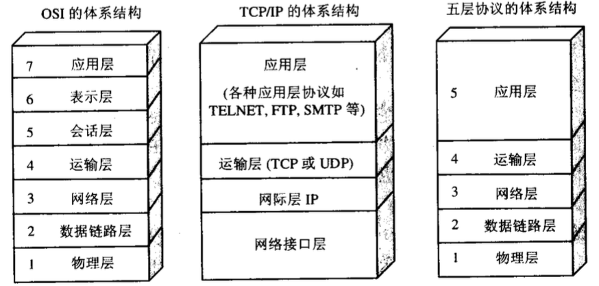
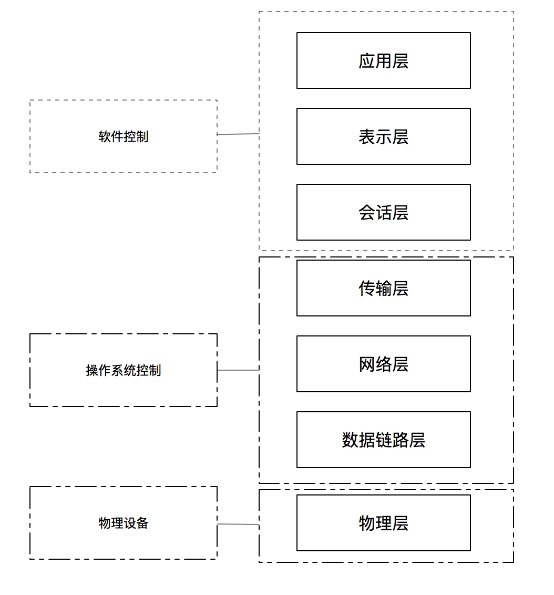

https://laravel-china.org/articles/5807/the-difference-between-seven-layer-model-and-four-layer-model

https://blog.csdn.net/qq_18425655/article/details/52314970

**发展历史**

网络模型不是一开始就有的，在网络刚发展时，网络协议是由各互联网公司自己定义的，比如那时的巨头网络公司 IBM、微软、苹果、思科等等，他们每家公司都有自己的网络协议，各家的协议也是不能互通的，那时候大家觉得这是可以的，但对消费者来说这实际上是技术垄断，因为你买了苹果的设备就不能用微软的设备，因为他们的协议不是一样的，没有统一的标准来规范网络协议，都是这些公司的私有协议。

这样大大的阻碍了互联网的发展，为了解决这个问题，国际标准化组织 1984 提出的模型标准，简称 OSI（Open Systems Interconnection Model），这是一个标准，并非实现。

TCP/IP 协议就是基于此模型设计。

TCP/IP 模型将 OSI 模型由七层简化为四层，传输层和网络层被完整保留，因此网络中最核心的技术就是传输层和网络层技术。

TCP/IP 协议中每层技术举例：

网络访问层：ARP、RARP

互联网层：ICMP、IP

传输层：TCP、UDP

应用层：DNS、FTP、HTTP、SMTP、TELNET、IRC、WHOIS

**分层功能职责**

- 物理层：底层数据传输，如网线；网卡标准。
- 数据链路层：定义数据的基本格式，如何传输，如何标识；如网卡MAC地址。
- 网络层：定义IP编址，定义路由功能；如不同设备的数据转发。
- 传输层：端到端传输数据的基本功能；如 TCP、UDP。
- 会话层：控制应用程序之间会话能力；如不同软件数据分发给不同软件。
- 标识层：数据格式标识，基本压缩加密功能。
- 应用层：各种应用软件，包括 Web 应用。

### 总结

网络七层模型是一个标准，而非实现。

网络四层模型是一个实现的应用模型。

网络四层模型由七层模型简化合并而来。

> 物理层，数据链路层，网络层，传输层，会话层，表示层，应用层，不过普通使用的是tcp/ip四层也就是物理层，网络层，传输层，应用层，物理层：底层数据传输，如网卡标准，网线，物理链路层，定义数据的基本格式，如何传输和如何定义。网络层，定义ip编制，定义路由功能。会话层，控制应用程序之间会话能力，表示层，数据格式的表示，基本压缩加密功能，应用层，各种应用软件