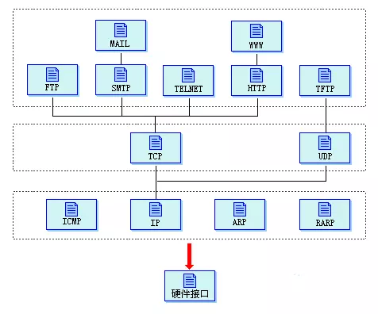
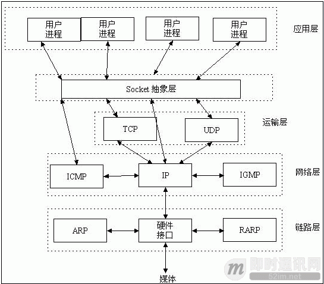

[原文地址1](https://juejin.im/entry/5a337d9df265da4322414094)

## Socket

Socket可以有很多意思，和IT较相关的本意大致是指在端到端的一个连接中，这两个端叫做Socket。对于IT从业者来说，它往往指的是TCP/IP网络环境中的两个连接端，大多数的API提供者（如操作系统，JDK）往往会提供基于这种概念的接口，所以对于开发者来说也往往是在说一种编程概念。同时，操作系统中进程间通信也有Socket的概念，但这个Socket就不是基于网络传输层的协议了。

Socket是应用层与TCP/IP协议族通信的中间软件抽象层，它是一组接口。socket是在应用层和传输层之间的一个抽象层，它把TCP/IP层复杂的操作抽象为几个简单的接口供应用层调用已实现进程在网络中通信。

#### Unix中的Socket

操作系统中也有使用到Socket这个概念用来进行进程间通信，它和通常说的基于TCP/IP的Socket概念十分相似，代表了在操作系统中传输数据的两方，只是它不再基于网络协议，而是操作系统本身的文件系统。

#### 网络中的Socket

通常所说的Socket API，是指操作系统中（也可能不是操作系统）提供的对于传输层（TCP/UDP）抽象的接口。现行的Socket API大致都是遵循了BSD Socket规范（包括Windows）。这里称规范其实不太准确，规范其实是POSIX，但BSD Unix中对于Socket的实现被广为使用，所以成为了实际的规范。如果你要使用HTTP来构建服务，那么就不需要关心Socket，如果你想基于TCP/IP来构建服务，那么Socket可能就是你会接触到的API。

**在TCP/IP网络中HTTP的位置**

从上图中可以看到，HTTP是基于传输层的TCP协议的，而Socket API也是，所以只是从使用上说，可以认为Socket和HTTP类似（但一个是成文的互联网协议，一个是一直沿用的一种编程概念），是对于传输层协议的另一种直接使用，因为按照设计，网络对用户的接口都应该在应用层。

#### Socket名称的由来

和很多其他Internet上的事物一样，Socket这个名称来自于大名鼎鼎的ARPANET（Advanced Research Projects Agency），早期ARPANET中的Socket指的是一个源或者目的地址——大致就是今天我们所说的IP地址和端口号。最早的时候一个Socket指的是一个40位的数字（RFC33中说明了此用法，但在RFC36中并没有明确地说使用40位数字来标识一个地址），其中前32为指向的地址（socket number，大致相当于IP），后8位为发送数据的源（link，大致相当于端口号）。对他们的叫法有很多的版本，这里列举的并不严谨。

#### Socket原本的意思

在上边提到的历史中使用到的Socket，包括TCP文档中使用到的Socket，其实指的是网络传输中的一端，是一个虚拟化的概念。

#### Socket 与 WebSocket 的关系

正如上节所述：Socket 其实并不是一个协议，它工作在 OSI 模型会话层（第5层），是为了方便大家直接使用更底层协议（一般是 [TCP](https://link.juejin.im/?target=http%3A%2F%2Fen.wikipedia.org%2Fwiki%2FTransmission_Control_Protocol) 或 [UDP](https://link.juejin.im/?target=http%3A%2F%2Fen.wikipedia.org%2Fwiki%2FUser_Datagram_Protocol) ）而存在的一个抽象层。

最早的一套 Socket API 是 [Berkeley sockets](https://link.juejin.im/?target=http%3A%2F%2Fen.wikipedia.org%2Fwiki%2FBerkeley_sockets) ，采用 C 语言实现。它是 Socket 的事实标准，POSIX sockets 是基于它构建的，多种编程语言都遵循这套 API，在 JAVA、Python 中都能看到这套 API 的影子。

> Socket是应用层与TCP/IP协议族通信的中间软件抽象层，它是一组接口。在设计模式中，Socket其实就是一个门面模式，它把复杂的TCP/IP协议族隐藏在Socket接口后面，对用户来说，一组简单的接口就是全部，让Socket去组织数据，以符合指定的协议。

主机 A 的应用程序要能和主机 B 的应用程序通信，必须通过 Socket 建立连接，而建立 Socket 连接必须需要底层 TCP/IP 协议来建立 TCP 连接。建立 TCP 连接需要底层 IP 协议来寻址网络中的主机。我们知道网络层使用的 IP 协议可以帮助我们根据 IP 地址来找到目标主机，但是一台主机上可能运行着多个应用程序，如何才能与指定的应用程序通信就要通过 TCP 或 UPD 的地址也就是端口号来指定。这样就可以通过一个 Socket 实例唯一代表一个主机上的一个应用程序的通信链路了

而 WebSocket 则不同，它是一个完整的 [应用层协议](https://link.juejin.im/?target=http%3A%2F%2Fdatatracker.ietf.org%2Fdoc%2Frfc6455%2F)，包含一套[标准的 API](https://link.juejin.im/?target=http%3A%2F%2Fdev.w3.org%2Fhtml5%2Fwebsockets%2F)。

所以，从使用上来说，WebSocket 更易用，而 Socket 更灵活。

