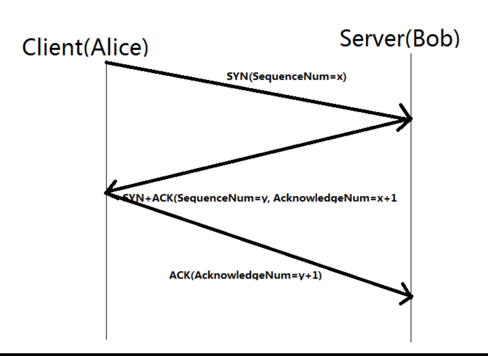

### 三次握手

- 第一次握手: 建立连接。客户端发送连接请求，发送SYN报文，(标志位：syn=1，序号：seq=x）。然后，客户端进入SYN_SEND状态，等待服务器的确认。（TCP规定，SYN报文段（SYN=1的报文段）不能携带数据，但需要消耗掉一个序号。）
- 第二次握手: 服务器收到客户端的SYN报文段。需要对这个SYN报文段进行确认，在确认SYN=1后知道客户端要建立连接，之后发送数据包（发送序号：seq=y，确认序号：ack=x+1，标识位SYN=1，ACK=1）给客户端，此时服务器进入SYN_RECV状态。（这个报文也不能携带数据，但是同样要消耗一个序号。）
- 第三次握手: 客户端收到服务器的数据后，检查ack是否为100+1和ACK是否为1，如果正确，将标识为ACK置为1，确认序号ack=y+1,发送序号seq置为x+1，向服务器发送ACK报文段，这个报文段发送完毕以后，客户端和服务器端都进入ESTABLISHED状态，完成TCP三次握手。（TCP规定，ACK报文段可以携带数据，但是如果不携带数据则不消耗序号。）

#### 为什么需要三次握手

主要防止已经失效的连接请求报文突然又传送到了服务器，从而产生错误。

> 假如只存在两次握手，第一次client发出的第一个连接请求报文段并没有丢失，而是在某个网络结点长时间的滞留了，以致延误到连接释放以后的某个时间才到达server。本来这是一个早已失效的报文段。但server收到此失效的连接请求报文段后，就误认为是client再次发出的一个新的连接请求。于是就向client发出确认报文段，同意建立连接。假设不采用“三次握手”，那么只要server发出确认，新的连接就建立了。由于现在client并没有发出建立连接的请求，因此不会理睬server的确认，也不会向server发送数据。但server却以为新的运输连接已经建立，并一直等待client发来数据。这样，server的很多资源就白白浪费掉了。采用“三次握手”的办法可以防止上述现象发生。例如刚才那种情况，client不会向server的确认发出确认。server由于收不到确认，就知道client并没有要求建立连接。

### 四次挥手

- 第一次挥手：客户端进程发出连接释放报文，并且停止发送数据，数据报文首部包含FIN=1，其序列号为seq=u（等于前面已经传送过来的数据的最后一个字节的序号加1）。此时，客户端进入 FIN_WAIT_1状态。（TCP规定，FIN报文段即使不携带数据，也要消耗一个序号。）
- 第二次挥手：服务器收到了客户端发送的连接释放报文，随后发出确认报文。一个ACK报文段，标志位ACK=1，确认序号ack=u+1，发送序号seq=v，此时服务器进入了CLOSE_WAIT状态，（TCP服务器通知高层的应用进程，客户端向服务器的方向就释放了，这时候处于半关闭状态，即客户端已经没有数据要发送了，但是服务器若发送数据，客户端依然要接受。这个状态还要持续一段时间，也就是整个CLOSE-WAIT状态持续的时间）在客户端收到服务端的确认请求后，此时，客户端进入FIN_WAIT_2状态，等待服务器发送连接释放报文
- 第三次挥手：服务器会观察自己是否还有数据没有发送给客户端，如果有，先把数据发送给客户端，再发送FIN报文；如果没有，那么服务器直接发送FIN报文给客户端（FIN报文包括FIN=1，ack=u+1，seq=w）请求关闭连接，同时服务器进入LAST_ACK状态;
- 第四次挥手：客户端收到服务器发送的FIN报文段，向服务器发送ACK报文段，将seq设置为u+1，将ack设置为w+1，然后客户端进入TIME_WAIT状态;服务器收到客户端的ACK报文段以后，就关闭连接;此时，客户端等待2MSL后依然没有收到回复，则证明Server端已正常关闭，客户端也可以关闭连接了。

#### 为什么需要四次挥手

> TCP协议是一种面向连接的、可靠的、基于字节流的运输层通信协议。TCP是全双工模式，这就意味着，当主机1发出FIN报文段时，只是表示主机1已经没有数据要发送了，主机1告诉主机2，它的数据已经全部发送完毕了；但是，这个时候主机1还是可以接受来自主机2的数据；当主机2返回ACK报文段时，表示它已经知道主机1没有数据发送了，但是主机2还是可以发送数据到主机1的；当主机2也发送了FIN报文段时，这个时候就表示主机2也没有数据要发送了，就会告诉主机1，我也没有数据要发送了，之后彼此就会愉快的中断这次TCP连接。

- FIN_WAIT_1: 这个状态要好好解释一下，其实FIN_WAIT_1和FIN_WAIT_2状态的真正含义都是表示等待对方的FIN报文。而这两种状态的区别是：FIN_WAIT_1状态实际上是当SOCKET在ESTABLISHED状态时，它想主动关闭连接，向对方发送了FIN报文，此时该SOCKET即进入到FIN_WAIT_1状态。而当对方回应ACK报文后，则进入到FIN_WAIT_2状态，当然在实际的正常情况下，无论对方何种情况下，都应该马上回应ACK报文，所以FIN_WAIT_1状态一般是比较难见到的，而FIN_WAIT_2状态还有时常常可以用netstat看到。（主动方）
- FIN_WAIT_2：上面已经详细解释了这种状态，实际上FIN_WAIT_2状态下的SOCKET，表示半连接，也即有一方要求close连接，但另外还告诉对方，我暂时还有点数据需要传送给你(ACK信息)，稍后再关闭连接。（主动方）
- CLOSE_WAIT：这种状态的含义其实是表示在等待关闭。怎么理解呢？当对方close一个SOCKET后发送FIN报文给自己，你系统毫无疑问地会回应一个ACK报文给对方，此时则进入到CLOSE_WAIT状态。接下来呢，实际上你真正需要考虑的事情是察看你是否还有数据发送给对方，如果没有的话，那么你也就可以 close这个SOCKET，发送FIN报文给对方，也即关闭连接。所以你在CLOSE_WAIT状态下，需要完成的事情是等待你去关闭连接。（被动方）
- LAST_ACK: 这个状态还是比较容易好理解的，它是被动关闭一方在发送FIN报文后，最后等待对方的ACK报文。当收到ACK报文后，也即可以进入到CLOSED可用状态了。（被动方）
- TIME_WAIT: 表示收到了对方的FIN报文，并发送出了ACK报文，就等2MSL后即可回到CLOSED可用状态了。如果FINWAIT1状态下，收到了对方同时带FIN标志和ACK标志的报文时，可以直接进入到TIME_WAIT状态，而无须经过FIN_WAIT_2状态。（主动方）
- CLOSED: 表示连接中断。

#### 为什么TIME_WAIT状态需要经过2MSL(最大报文段生存时间)才能返回到CLOSE状态？

1、为了保证客户端发送的最后一个ACK报文段能够到达服务器。因为这个ACK有可能丢失，从而导致处在LAST-ACK状态的服务器收不到对FIN-ACK的确认报文。服务器会超时重传这个FIN-ACK，接着客户端再重传一次确认，重新启动时间等待计时器。最后客户端和服务器都能正常的关闭。假设客户端不等待2MSL，而是在发送完ACK之后直接释放关闭，一但这个ACK丢失的话，服务器就无法正常的进入关闭连接状态。

2、他还可以防止已失效的报文段。客户端在发送最后一个ACK之后，再经过经过2MSL，就可以使本链接持续时间内所产生的所有报文段都从网络中消失。从保证在关闭连接后不会有还在网络中滞留的报文段去骚扰服务器。

#### 如果已经建立了连接，但是客户端突然出现故障了怎么办？

TCP还设有一个保活计时器，显然，客户端如果出现故障，服务器不能一直等下去，白白浪费资源。服务器每收到一次客户端的请求后都会重新复位这个计时器，时间通常是设置为2小时，若两小时还没有收到客户端的任何数据，服务器就会发送一个探测报文段，以后每隔75秒发送一次。若一连发送10个探测报文仍然没反应，服务器就认为客户端出了故障，接着就关闭连接。

## SYN攻击

- 什么是 SYN 攻击（SYN Flood）？

  在三次握手过程中，服务器发送 SYN-ACK 之后，收到客户端的 ACK 之前的 TCP 连接称为半连接(half-open connect)。此时服务器处于 SYN_RCVD 状态。当收到 ACK 后，服务器才能转入 ESTABLISHED 状态.

  SYN 攻击指的是，攻击客户端在短时间内伪造大量不存在的IP地址，向服务器不断地发送SYN包，服务器回复确认包，并等待客户的确认。由于源地址是不存在的，服务器需要不断的重发直至超时，这些伪造的SYN包将长时间占用未连接队列，正常的SYN请求被丢弃，导致目标系统运行缓慢，严重者会引起网络堵塞甚至系统瘫痪。

  SYN 攻击是一种典型的 DoS/DDoS 攻击。

- 如何检测 SYN 攻击？

  检测 SYN 攻击非常的方便，当你在服务器上看到大量的半连接状态时，特别是源IP地址是随机的，基本上可以断定这是一次SYN攻击。在 Linux/Unix 上可以使用系统自带的 netstats 命令来检测 SYN 攻击。

- 如何防御 SYN 攻击？

  SYN攻击不能完全被阻止，除非将TCP协议重新设计。我们所做的是尽可能的减轻SYN攻击的危害，常见的防御 SYN 攻击的方法有如下几种：

  - 缩短超时（SYN Timeout）时间
  - 增加最大半连接数
  - 过滤网关防护
  - SYN cookies技术