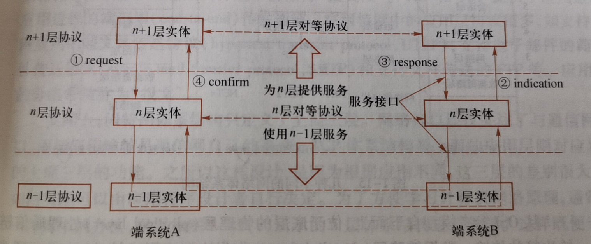
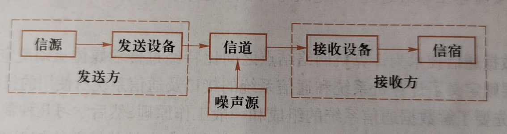

### 计算机网络

由通信信道连接的主机和网络设备的集合，以方便用户共享资源和相互通信

#### 结构

两个基本构件：节点和链路

#### 用途

- 共享信息
- 协同计算
- 方便通信
- 共享硬件

###交换网传递数据

#### 电路交换

主要用于电话网，在发送方和接收方在通信之前，该网络必须在发送方和接收方之间通过多台交换机建立一条连接，并且在通信过程中必须维护连接状态，并且为其预留了恒定的传输带宽，**该链接称为电路**。

#### 分组交换

采用**分组转发**，不预留带宽，可能会拥塞，采取态度**尽力而为**

### 网络协议

为进行网络中的数据交换而制定的规则，标准或规约

#### 组成

- **语法**：数据与控制信息的结构或约束
- **语义**：语法定义结构中的具体含义， 表示发出何种控制信息，完成何种动作以及作出何种响应等
- **定时**：事件实现顺序的详细说明

### 分层的网络体系结构

**网络体系结构**：计算机网络的各层及相应协议的集合

#### 优点

一个分层的体系结构允许通过定义良好的接口将大而复杂的系统划分为不同的层次

分而治之

每一层只关注本层，且可以独立地实现相关功能

层之间的关系比较稳定

### 水平协议+垂直的服务

### 时延

**单向时延**：从网络的一端传到另一端所需要的时间

**往返时延**：从网络的一端传到另一端并返回需要的时间

#### 处理时延

检查分组首部，决定将该分组导向何处及处理差错等所需要的时间

高速路由器的处理时延通常是微妙或者更低的数量级

#### 传输时延

又称为存储转发时延

将所有分组的比特发向链路所需要的时间

#### 传播时延

取决于传输分组比特的物理媒体（如光纤，双绞铜线）

### 通信系统一般模型

**信源**：将各种信息转化成原始电信号。根据信息类型的不同，可分为模拟信源和数字信源。模拟信源输出连续的模拟信号（如音频信号，视频信号），数字信源输出离散的数字信号（如计算机数字信号）。模拟信号经数字化处理后可转为数字信号。

**发送设备**：生成适合在信道中传输的信号，使发送信号特性与信道特性相匹配，能够抗信道干扰，具有足够的功率以满足远距离传输的需要。发送设备通常具有能够同时处理多路信号传输的多路复用功能

**信道**：物理传输媒体（也称为传输介质），用以将来自信源的信号传送到信宿

**接收设备**：与发送设备功能相对应，能从受到减损的接收信号中正确恢复出原始电信号，对于多路复用功能，接收设备还具有去多路复用功能

**信宿**：传输信息的目的地，能够将电信号还原为相应的信息

#### 通信方式

**单工**：单向传输报文

**半双工**：收发双方都能收发报文，但是不能同时收发报文

**全双工**：收发双方可以同时发送和接收报文

### 线序

#### 直通线线序

标准568B：白橙，橙，白绿，蓝，白蓝，绿，白棕，棕

#### 交叉线线序

标准568A：白绿，绿，白橙，蓝，白蓝，橙，白棕，棕

### 复用

####多路复用

在一条物理链路上同时传输多路信息，以扩大信道传输容量

####频分复用 （FDM）

将传输线路的可用频带分割成若干条较窄的子频带，每一子频带传输一路信号。

#### 时分复用（TDM）

将一条物理线路的传输时间划分为若干时间片，各个节点按一定次序轮流使用这些时间片。

#### 波分复用（WDM）

对光信号进行多路复用和多路分离，将不同的波长多路复用到一根光纤上

#### 码分复用（CDM）

又称码分多址，是另一种共享信道的方法。使每一个用户可以在相同时间内使用同样的频带进行通信

为每个节点分配一个唯一的正交码作为该用户的地址码，在发送节点，发送的码元使用该正交码进行编码，使信号的带宽得到了极大的扩展，接收节点，使用相同的正交码进行正交解码。

### 交换技术

#### 电路交换

1. 连接建立（申请通信资源）
2. 数据传输（占用通信资源）
3. 连接释放（归还通信资源）

##### 优点

- 独占资源，通信质量有保障
- 传输时延小，没有拥塞现象

##### 缺点

- 通信前建立物理信道的时间长，工作过程复杂
- 有时资源利用率低

#### 分组交换

将长报文划分为长度大致相同的较短数据块，并且在交换节点中不存储这些短报文

主要有路由器和链路层交换机，均采用存储转发机制

### 物理层

定义了一些与传输媒体接口有关的特性

- **机械特性**：定义了接口所用接线器的形状和尺寸，引线数目以及排列，固定和锁定装置等，
- **电气特性**：定义了在接口电缆的各条线上出现的的电压的范围
- **功能特性**：定义了某条线上出现的某一电平的电压表示何种特性
- **规程特性**：定义了对于不同功能的各种可能事件的出现顺序

### 链路层

链路层交换的数据单元称为帧，每个链路层帧封装了网络层的一个数据报，封装过程称为成帧

链路层协议定义了在链路两端的节点之间交互的帧格式，以及当发送和接收帧时这些节点所采取的操作

发送帧前：成帧操作，接收帧时：差错检测，可靠传输，流量控制，随机接入

#### 链路层协议

以太网，Wi-Fi（wireless fidelity），点到点协议，异步传送模式

#### 点到点链路

由链路一端的单个发送节点和链路另一端的单个接收节点组成

包括**PPP**和**高级数据链路控制**协议

#### 广播链路

能够让多个发送节点和接收节点都连接到单一的，共享的广播信道上

包括**以太网**和**无线局域网**

#### 链路层环境的几个重要特点

1. 数据报在网络端到端路径的不同单端链路上可能由不同的链路层协议来承载
2. 链路层提协议提供的服务可能不同
3. 链路层面向通信链路，帧通信的环境通常较为简单1

